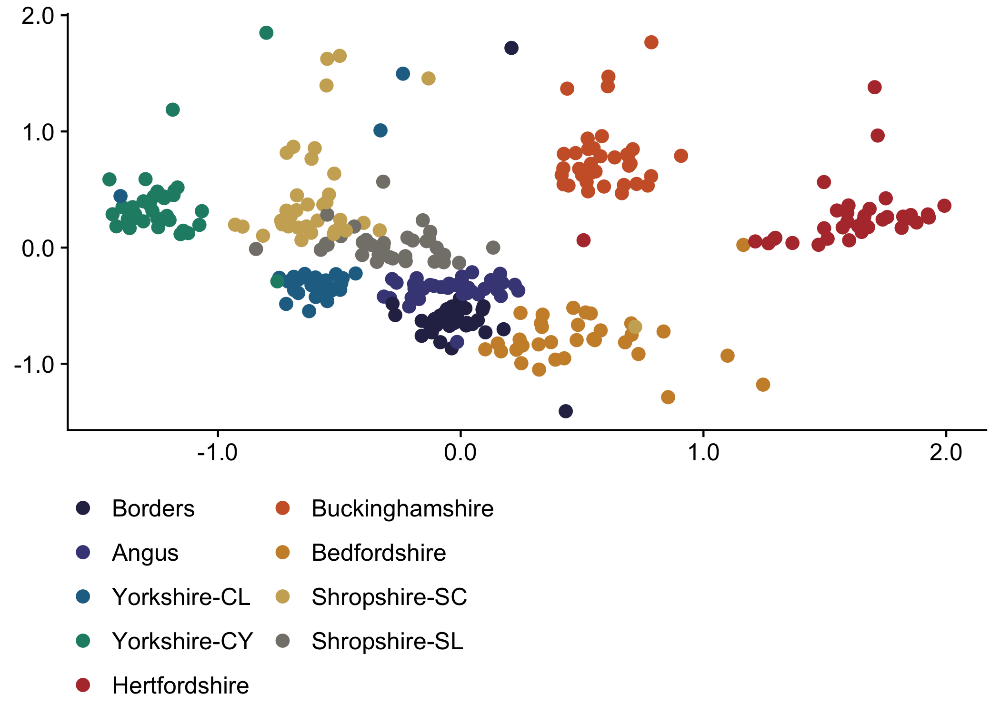
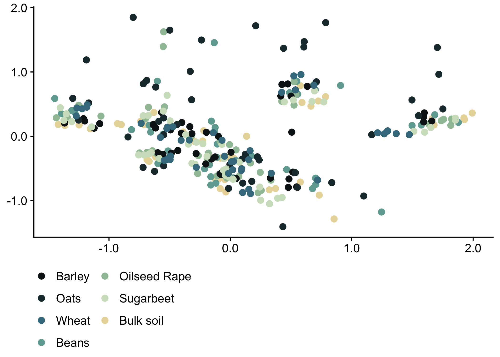
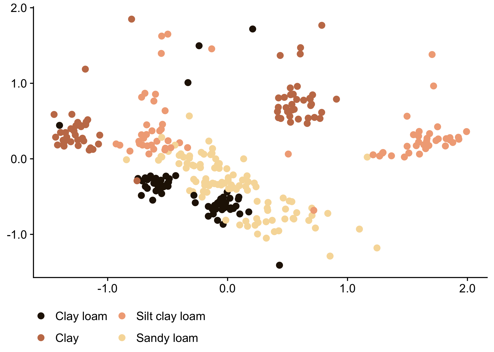
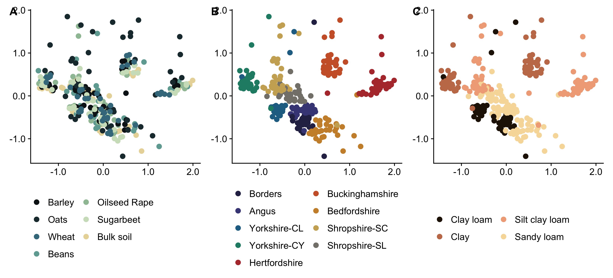

AgMicrobiome 16S metabarcoding
================
2026-02-02

# Importing data

first we import the normalized data from [Payton’s Github
page](https://github.com/paytonyau/agmicrobiomebase/tree/main/publications-scripts/How-to-paper/case_00_02_RData)

``` r
load("../16S_metabarcoding/norm.RData")
library(phyloseq)
physeq.norm
```

    ## phyloseq-class experiment-level object
    ## otu_table()   OTU Table:         [ 266974 taxa and 308 samples ]
    ## sample_data() Sample Data:       [ 308 samples by 17 sample variables ]
    ## tax_table()   Taxonomy Table:    [ 266974 taxa by 7 taxonomic ranks ]

``` r
tree <- ape::read.tree("../16S_metabarcoding/tree.nwk")

physeq.norm = merge_phyloseq(physeq.norm, tree)
physeq.norm
```

    ## phyloseq-class experiment-level object
    ## otu_table()   OTU Table:         [ 266974 taxa and 308 samples ]
    ## sample_data() Sample Data:       [ 308 samples by 17 sample variables ]
    ## tax_table()   Taxonomy Table:    [ 266974 taxa by 7 taxonomic ranks ]
    ## phy_tree()    Phylogenetic Tree: [ 266974 tips and 265841 internal nodes ]

``` r
library(phyloseq)
current_sample_names <- sample_names(physeq.norm)

# Replace 'WH' with 'SW'
new_sample_names <- gsub("WH", "SW", current_sample_names)
new_sample_names <- gsub(".RE", "", new_sample_names)
new_sample_names <- gsub(".FB.", ".BE.", new_sample_names)
new_sample_names <- gsub("1", "01", new_sample_names)
new_sample_names <- gsub("2", "02", new_sample_names)
new_sample_names <- gsub("3", "03", new_sample_names)
new_sample_names <- gsub("4", "04", new_sample_names)
new_sample_names <- gsub("5", "05", new_sample_names)
# Update the sample names in the phyloseq object
sample_names(physeq.norm) <- new_sample_names

# add more metadata


old_sample_dta <- as.data.frame(sample_data(physeq.norm))
old_sample_dta$id <- rownames(old_sample_dta)

AgMicrobiome_RR <- readxl::read_excel("../R_functional_tool/AgMicrobiome-RR.xlsx", sheet = "Soils") # Data from the source soils

AgMicrobiome_RR$`Soil Id` <- gsub("-", ".", AgMicrobiome_RR$`Soil Id`)
colnames(AgMicrobiome_RR)[colnames(AgMicrobiome_RR) == 'Soil Id'] <- 'Soil.Location'

sample_metadata_iso <- merge(as.data.frame(as.matrix(old_sample_dta)), AgMicrobiome_RR, by = "Soil.Location", all.x = TRUE) 

sample_metadata_iso <- sample_data(sample_metadata_iso)
sample_names(sample_metadata_iso) <- sample_metadata_iso$id

setdiff(sample_names(physeq.norm), sample_names(sample_metadata_iso))
```

    ## character(0)

``` r
sample_data(physeq.norm) <- sample_metadata_iso
```

# Aesthetic defaults

We will set a labels, colors, and shapes to represent the different
treatments on the plots. This consistency will help with the readability
of the plots.

``` r
# Aestetic parameters

colorvec <- c("AN" = "#005F73",
              "BE"  = "#0A9396",
              "BO" = "#94D2BD",
              "BU" = "#E9D8A6",
              "HE" = "#EE9B00",
              "SH" = "#CA6702",
              "YO" = "#BB3E03",
              "CL" = "#251605",
              "CY" = "#c57b57",
              "SC" = "#f1ab86",
              "SL" = "#f7dba7",
              "Barley" = "#0e181b", 
              "Oats" = "#1f363d", 
              "Wheat" = "#40798c", 
              "Beans" = "#70a9a1", 
              "OilseedRape" = "#9ec1a3", 
              "OSR" = "#9ec1a3", 
              "Sugarbeet" = "#cfe0c3", 
              "Bulksoil" = "#E9D8A6",
              "Bulk" = "#E9D8A6",
              "CL" = "#251605",
              "CY" = "#c57b57",
              "SC" = "#f1ab86",
              "SL" = "#f7dba7",
              "Clay loam" = "#251605",
              "Clay" = "#c57b57",
              "Silty clay loam" = "#f1ab86",
              "Sandy loam" = "#f7dba7",
              "CL.BO" = "#2c2c54",
              "SL.AN" = "#474787",
              "CL.YO" = "#227093",
              "CY.YO" = "#218c74",
              "SC.HE" = "#b33939",
              "CY.BU" = "#cd6133",
              "SL.BE" = "#cc8e35",
              "SC.SH" = "#ccae62",
              "SL.SH" = "#84817a"
              )

shapesvec <- c("Barley" = 3, "Beans" = 15, 
               "Bulksoil" = 16, "Oats" = 17, 
               "OilseedRape" = 18, "Sugarbeet" = 25, 
               "Wheat" = 0,
               "AN" = 3, "BE" = 15, 
               "BO" = 16, "BU" = 17, 
               "HE" = 18, "SH" = 25, 
               "YO" = 0)

labelsvec <- c("AN" = "Angus",
              "BE"  = "Bedfordshire",
              "BO" = "Borders",
              "BU" = "Buckinghamshire",
              "HE" = "Hertfordshire",
              "SH" = "Shropshire",
              "YO" = "Yorkshire",
              "Barley" = "Barley",
              "Beans" = "Beans", 
              "Bulksoil" = "Bulk soil",
              "Bulk" = "Bulk soil",
              "Oats" = "Oats", 
              "OilseedRape" = "Oilseed Rape", 
              "OSR" = "Oilseed Rape",
              "Sugarbeet" = "Sugarbeet", 
              "Wheat" = "Wheat",
              "CL" = "Clay loam",
              "CY" = "Clay",
              "SC" = "Silt clay loam",
              "SL" = "Sandy loam",
              "Clay loam" = "Clay loam",
              "Clay" = "Clay",
              "Silty clay loam" = "Silt clay loam",
              "Sandy loam" = "Sandy loam",
              "CL.BO" = "Borders",
              "CL.YO" = "Yorkshire-CL",
              "CY.BU" = "Buckinghamshire",
              "CY.YO" = "Yorkshire-CY",
              "SC.HE" = "Hertfordshire",
              "SC.SH" = "Shropshire-SC",
              "SL.AN" = "Angus",
              "SL.BE" = "Bedfordshire",
              "SL.SH" = "Shropshire-SL"
              )

crop_order = c("Barley", "Oats", "Wheat", "Beans", "OilseedRape", "Sugarbeet", "Bulksoil")

local_order = c("CL.BO", "SL.AN", "CL.YO", "CY.YO", "SC.HE", "CY.BU", "SL.BE", "SC.SH", "SL.SH")
```

Here I will adjust the ASVs names to something that is understandable by
humans:

``` r
# Extract the OTU table, taxonomy table, and sample data
otu_table_matrix <- as(otu_table(physeq.norm), "matrix")
tax_table_matrix <- as(tax_table(physeq.norm), "matrix")
sample_data_df <- as(sample_data(physeq.norm), "data.frame")

# Get the original OTU IDs
original_otus <- row.names(otu_table_matrix)

# Generate new ASV IDs
num_otus <- length(original_otus)
new_asv_ids <- sprintf("ASV_%06d", seq(1, num_otus))

# Create a named vector to map original OTU IDs to new ASV IDs
otu_to_asv <- setNames(new_asv_ids, original_otus)

# Rename the OTUs in the OTU table
rownames(otu_table_matrix) <- new_asv_ids

# Rename the OTUs in the taxonomy table
rownames(tax_table_matrix) <- new_asv_ids

#Rename OTUs on tree
tree2 <- phy_tree(physeq.norm)
current_tips <- tree2$tip.label
tree2$tip.label <- unname(otu_to_asv[current_tips])


# Create new OTU table and taxonomy table objects
new_otu_table <- otu_table(otu_table_matrix, taxa_are_rows = TRUE)
new_tax_table <- tax_table(tax_table_matrix)

# Create a new phyloseq object
new_physeq <- phyloseq(new_otu_table, new_tax_table, sample_data(sample_data_df))
new_physeq <- merge_phyloseq(new_physeq, tree2)
# Print the new phyloseq object to verify the changes
physeq.norm <- new_physeq

# remove ASVs that are not present in more than 50% of the samples

filter_by_presence<-function(physeq,sampling_group,threshold){
  
  if(class(physeq)=="phyloseq"){
    
    if(!taxa_are_rows(physeq)){
      
      phyloseq::otu_table(physeq)<-t(phyloseq::otu_table(physeq))
      
    }
    
    sampling_group<-sample_data(physeq)[[sampling_group]]    
    
  }
  
  groups<-as.character(unique(sampling_group))
  
  cols_per_group<-sapply(groups,function(x) which(sampling_group==x),simplify=FALSE)
  
  ncols_per_group<-lengths(cols_per_group)
  
  # x is the row of OTU, y is the farm id
  
  if(class(physeq)=="phyloseq"){
    
    matrix<-t(apply(otu_table(physeq),1,function(x) sapply(cols_per_group,function(y) 100-(sum(x[y]==0)/length(y)*100 ))))
    
  } else{
    
    matrix<-t(apply(physeq,1,function(x) sapply(cols_per_group,function(y) 100-(sum(x[y]==0)/length(y)*100 ))))
    
  }
  
  n_groups_over_threshold       <- apply(matrix,1,function(x) length(which(x>threshold)))
  
  keep<-names(which(n_groups_over_threshold!=0))
  
  if(class(physeq)=="phyloseq"){
    
    physeq<-prune_taxa(keep,physeq)
    
  } else {
    
    physeq<-physeq[which(n_groups_over_threshold!=0),]
    
  }
  
  return(physeq)
  
}

physeq.norm <- filter_by_presence(physeq.norm, "Group", 50)
```

Then, we will create a rarefied phyloseq object to use in the analysis
that are affected by uneven sampling such as diversity analysis.

``` r
set.seed(2024)
physeq.norm.raref <- rarefy_even_depth(physeq.norm)
```

    ## You set `rngseed` to FALSE. Make sure you've set & recorded
    ##  the random seed of your session for reproducibility.
    ## See `?set.seed`

    ## ...

    ## 83OTUs were removed because they are no longer 
    ## present in any sample after random subsampling

    ## ...

# Alpha-diversity measurements

Here we will evaluate the differences in alpha diversity indexes of the
samples. We will calculate Sobs, Pielou’s Evenness, and Shannon’s H’.

``` r
# Calculate the Sobs, Pielou's Evenness, and Shannon's H'
library(picante)
```

    ## Loading required package: ape

    ## Loading required package: vegan

    ## Loading required package: permute

    ## Loading required package: nlme

``` r
library(vegan)


community_matrix <- as(t(otu_table(physeq.norm.raref)), "matrix")

# Calculate Observed Species (Sobs)
Sobs <- specnumber(community_matrix)

# Calculate Shannon Diversity Index
shannon_index <- vegan::diversity(community_matrix, index = "shannon")

# Calculate Pielou's Evenness
pielou_evenness <- shannon_index / log(Sobs)


# Create a data frame with the results
diversity_table <- data.frame(
  Sample = rownames(community_matrix),
  Sobs = Sobs,
  Shannon = shannon_index,
  Pielou = pielou_evenness
)

# Print the diversity table
print(diversity_table)
```

    ##                  Sample Sobs  Shannon    Pielou
    ## CO.CL.BO.01 CO.CL.BO.01  680 6.101121 0.9354545
    ## CO.CL.BO.02 CO.CL.BO.02  738 6.168157 0.9340112
    ## CO.CL.BO.03 CO.CL.BO.03  519 5.790952 0.9262702
    ## CO.CL.BO.04 CO.CL.BO.04 1022 6.498367 0.9377807
    ## CO.CL.BO.05 CO.CL.BO.05 1150 6.605761 0.9373175
    ## CO.CL.YO.01 CO.CL.YO.01  654 5.756766 0.8879639
    ## CO.CL.YO.02 CO.CL.YO.02  903 6.332235 0.9304281
    ## CO.CL.YO.03 CO.CL.YO.03  893 6.296536 0.9266989
    ## CO.CL.YO.04 CO.CL.YO.04  875 6.301333 0.9301926
    ## CO.CL.YO.05 CO.CL.YO.05 1140 6.571782 0.9336531
    ## CO.CY.BU.01 CO.CY.BU.01  627 5.833169 0.9056385
    ## CO.CY.BU.02 CO.CY.BU.02  520 5.654295 0.9041334
    ## CO.CY.BU.03 CO.CY.BU.03  718 5.970477 0.9078544
    ## CO.CY.BU.04 CO.CY.BU.04  755 5.972389 0.9012589
    ## CO.CY.BU.05 CO.CY.BU.05  846 6.074084 0.9011300
    ## CO.CY.YO.01 CO.CY.YO.01  922 6.385808 0.9354378
    ## CO.CY.YO.02 CO.CY.YO.02  920 6.324544 0.9267582
    ## CO.CY.YO.03 CO.CY.YO.03  709 6.074165 0.9253959
    ## CO.CY.YO.04 CO.CY.YO.04  882 6.335467 0.9341327
    ## CO.CY.YO.05 CO.CY.YO.05  827 6.256672 0.9313566
    ## CO.SC.HE.01 CO.SC.HE.01  610 5.678312 0.8853744
    ## CO.SC.HE.02 CO.SC.HE.02  567 5.641928 0.8898436
    ## CO.SC.HE.03 CO.SC.HE.03  638 5.785000 0.8957412
    ## CO.SC.HE.04 CO.SC.HE.04  565 5.569601 0.8789260
    ## CO.SC.HE.05 CO.SC.HE.05  520 5.527887 0.8839205
    ## CO.SC.SH.01 CO.SC.SH.01  708 6.010550 0.9159012
    ## CO.SC.SH.02 CO.SC.SH.02  591 5.752458 0.9013826
    ## CO.SC.SH.03 CO.SC.SH.03  721 5.865080 0.8912630
    ## CO.SC.SH.04 CO.SC.SH.04  743 5.978096 0.9043067
    ## CO.SC.SH.05 CO.SC.SH.05  679 5.940513 0.9110348
    ## CO.SL.AN.01 CO.SL.AN.01  773 6.146902 0.9243073
    ## CO.SL.AN.02 CO.SL.AN.02  769 6.135342 0.9232894
    ## CO.SL.AN.03 CO.SL.AN.03  799 6.193143 0.9266510
    ## CO.SL.AN.04 CO.SL.AN.04  707 6.046653 0.9216011
    ## CO.SL.AN.05 CO.SL.AN.05  722 6.050338 0.9192214
    ## CO.SL.BE.01 CO.SL.BE.01  687 6.086104 0.9316890
    ## CO.SL.BE.02 CO.SL.BE.02  700 6.131492 0.9359513
    ## CO.SL.BE.03 CO.SL.BE.03  654 5.977565 0.9220215
    ## CO.SL.BE.04 CO.SL.BE.04  690 6.056811 0.9265866
    ## CO.SL.BE.05 CO.SL.BE.05  300 5.240419 0.9187620
    ## CO.SL.SH.01 CO.SL.SH.01  719 6.022284 0.9155383
    ## CO.SL.SH.02 CO.SL.SH.02  876 6.223119 0.9184919
    ## CO.SL.SH.03 CO.SL.SH.03  557 5.812221 0.9192821
    ## CO.SL.SH.04 CO.SL.SH.04  773 6.073654 0.9132931
    ## CO.SL.SH.05 CO.SL.SH.05  474 5.657569 0.9182566
    ## FB.CL.BO.01 FB.CL.BO.01  839 6.277515 0.9324597
    ## FB.CL.BO.02 FB.CL.BO.02  996 6.492709 0.9404616
    ## FB.CL.BO.03 FB.CL.BO.03 1073 6.538270 0.9369547
    ## FB.CL.BO.04 FB.CL.BO.04 1183 6.667464 0.9422900
    ## FB.CL.BO.05 FB.CL.BO.05  745 6.204150 0.9381203
    ## FB.CL.YO.01 FB.CL.YO.01 1020 6.443756 0.9301627
    ## FB.CL.YO.02 FB.CL.YO.02 1079 6.540501 0.9365261
    ## FB.CL.YO.03 FB.CL.YO.03  899 6.349965 0.9336423
    ## FB.CL.YO.04 FB.CL.YO.04  874 6.325906 0.9339776
    ## FB.CL.YO.05 FB.CL.YO.05  690 6.104990 0.9339571
    ## FB.CY.BU.01 FB.CY.BU.01  646 5.807189 0.8974454
    ## FB.CY.BU.02 FB.CY.BU.02  619 5.857188 0.9111842
    ## FB.CY.BU.03 FB.CY.BU.03  700 5.884658 0.8982729
    ## FB.CY.BU.04 FB.CY.BU.04  691 5.892270 0.9012150
    ## FB.CY.BU.05 FB.CY.BU.05  574 5.683107 0.8946071
    ## FB.CY.YO.01 FB.CY.YO.01  846 6.314755 0.9368351
    ## FB.CY.YO.02 FB.CY.YO.02  820 6.219171 0.9269472
    ## FB.CY.YO.03 FB.CY.YO.03  877 6.331624 0.9343493
    ## FB.CY.YO.04 FB.CY.YO.04  664 6.070216 0.9341262
    ## FB.SC.HE.01 FB.SC.HE.01  741 5.905221 0.8936471
    ## FB.SC.HE.02 FB.SC.HE.02  517 5.599148 0.8961444
    ## FB.SC.HE.03 FB.SC.HE.03  720 5.927445 0.9009300
    ## FB.SC.HE.04 FB.SC.HE.04  776 6.015963 0.9040915
    ## FB.SC.HE.05 FB.SC.HE.05  721 5.899774 0.8965351
    ## FB.SC.SH.01 FB.SC.SH.01 1072 6.478176 0.9284671
    ## FB.SC.SH.02 FB.SC.SH.02 1136 6.535806 0.9290059
    ## FB.SC.SH.03 FB.SC.SH.03  452 5.581865 0.9130120
    ## FB.SC.SH.04 FB.SC.SH.04  941 6.285685 0.9180280
    ## FB.SC.SH.05 FB.SC.SH.05  348 5.219317 0.8918551
    ## FB.SL.AN.01 FB.SL.AN.01  746 6.078094 0.9188732
    ## FB.SL.AN.02 FB.SL.AN.02  914 6.351785 0.9316432
    ## FB.SL.AN.03 FB.SL.AN.03  605 5.881005 0.9181569
    ## FB.SL.AN.04 FB.SL.AN.04 1146 6.556645 0.9308085
    ## FB.SL.AN.05 FB.SL.AN.05  952 6.409160 0.9344753
    ## FB.SL.BE.01 FB.SL.BE.01  673 6.074068 0.9327865
    ## FB.SL.BE.02 FB.SL.BE.02  711 6.107701 0.9301059
    ## FB.SL.BE.03 FB.SL.BE.03  722 6.103047 0.9272293
    ## FB.SL.BE.04 FB.SL.BE.04  323 5.199616 0.8999531
    ## FB.SL.BE.05 FB.SL.BE.05  548 5.859521 0.9291572
    ## FB.SL.SH.01 FB.SL.SH.01  613 5.914098 0.9214338
    ## FB.SL.SH.02 FB.SL.SH.02  866 6.300787 0.9315338
    ## FB.SL.SH.03 FB.SL.SH.03  575 5.895020 0.9277112
    ## FB.SL.SH.04 FB.SL.SH.04  958 6.336883 0.9230916
    ## FB.SL.SH.05 FB.SL.SH.05  548 5.781795 0.9168320
    ## OR.CL.BO.01 OR.CL.BO.01  808 6.196590 0.9256155
    ## OR.CL.BO.02 OR.CL.BO.02  806 6.234892 0.9316817
    ## OR.CL.BO.03 OR.CL.BO.03  904 6.378447 0.9370658
    ## OR.CL.BO.04 OR.CL.BO.04  797 6.233274 0.9330055
    ## OR.CL.BO.05 OR.CL.BO.05  975 6.421656 0.9330497
    ## OR.CL.YO.01 OR.CL.YO.01  985 6.482480 0.9404929
    ## OR.CL.YO.02 OR.CL.YO.02 1001 6.450356 0.9336495
    ## OR.CL.YO.03 OR.CL.YO.03 1066 6.499304 0.9322451
    ## OR.CL.YO.04 OR.CL.YO.04  907 6.386958 0.9378597
    ## OR.CY.BU.01 OR.CY.BU.01  684 6.003578 0.9196717
    ## OR.CY.BU.02 OR.CY.BU.02  829 6.097663 0.9073607
    ## OR.CY.BU.03 OR.CY.BU.03  748 6.017318 0.9093171
    ## OR.CY.BU.04 OR.CY.BU.04  806 6.032479 0.9014351
    ## OR.CY.BU.05 OR.CY.BU.05  798 6.102121 0.9132030
    ## OR.CY.YO.01 OR.CY.YO.01  743 6.192328 0.9367135
    ## OR.CY.YO.02 OR.CY.YO.02  805 6.225285 0.9304187
    ## OR.CY.YO.03 OR.CY.YO.03  715 6.130950 0.9328495
    ## OR.CY.YO.04 OR.CY.YO.04  951 6.421978 0.9364877
    ## OR.CY.YO.05 OR.CY.YO.05  978 6.486619 0.9420681
    ## OR.SC.HE.01 OR.SC.HE.01  645 5.740104 0.8872905
    ## OR.SC.HE.02 OR.SC.HE.02  715 5.906604 0.8987142
    ## OR.SC.HE.03 OR.SC.HE.03  679 5.849289 0.8970448
    ## OR.SC.HE.04 OR.SC.HE.04  621 5.729688 0.8909024
    ## OR.SC.HE.05 OR.SC.HE.05  590 5.759158 0.9026720
    ## OR.SC.SH.01 OR.SC.SH.01  810 6.063817 0.9054481
    ## OR.SC.SH.02 OR.SC.SH.02  649 5.938012 0.9170062
    ## OR.SC.SH.03 OR.SC.SH.03  585 5.830880 0.9151343
    ## OR.SC.SH.04 OR.SC.SH.04  328 5.054279 0.8724783
    ## OR.SC.SH.05 OR.SC.SH.05  322 5.220376 0.9040314
    ## OR.SL.AN.01 OR.SL.AN.01  580 5.854730 0.9201170
    ## OR.SL.AN.02 OR.SL.AN.02  622 5.908493 0.9184748
    ## OR.SL.AN.03 OR.SL.AN.03  728 6.064470 0.9202113
    ## OR.SL.AN.04 OR.SL.AN.04  811 6.216058 0.9280097
    ## OR.SL.AN.05 OR.SL.AN.05 1016 6.465737 0.9338654
    ## OR.SL.BE.01 OR.SL.BE.01  770 6.191203 0.9315136
    ## OR.SL.BE.02 OR.SL.BE.02  795 6.250171 0.9358867
    ## OR.SL.BE.03 OR.SL.BE.03  777 6.239093 0.9374426
    ## OR.SL.BE.04 OR.SL.BE.04  661 6.066699 0.9342361
    ## OR.SL.SH.03 OR.SL.SH.03  880 6.249809 0.9218113
    ## OR.SL.SH.04 OR.SL.SH.04  852 6.226426 0.9227634
    ## OR.SL.SH.05 OR.SL.SH.05  740 6.134198 0.9284883
    ## SB.CL.BO.01 SB.CL.BO.01  969 6.445653 0.9373772
    ## SB.CL.BO.02 SB.CL.BO.02  820 6.266173 0.9339527
    ## SB.CL.BO.03 SB.CL.BO.03  890 6.329616 0.9320290
    ## SB.CL.BO.04 SB.CL.BO.04  712 6.099225 0.9286165
    ## SB.CL.BO.05 SB.CL.BO.05 1038 6.501409 0.9361211
    ## SB.CL.YO.01 SB.CL.YO.01  988 6.451684 0.9356121
    ## SB.CL.YO.02 SB.CL.YO.02  726 6.113650 0.9280613
    ## SB.CL.YO.03 SB.CL.YO.03 1006 6.446590 0.9324320
    ## SB.CL.YO.04 SB.CL.YO.04  933 6.396143 0.9353266
    ## SB.CY.BU.01 SB.CY.BU.01  949 6.330037 0.9233639
    ## SB.CY.BU.02 SB.CY.BU.02  912 6.223900 0.9131792
    ## SB.CY.BU.03 SB.CY.BU.03  910 6.270138 0.9202596
    ## SB.CY.BU.04 SB.CY.BU.04  849 6.192160 0.9181651
    ## SB.CY.BU.05 SB.CY.BU.05  853 6.138932 0.9096385
    ## SB.CY.YO.01 SB.CY.YO.01 1060 6.562035 0.9420057
    ## SB.CY.YO.02 SB.CY.YO.02 1039 6.562245 0.9447498
    ## SB.CY.YO.03 SB.CY.YO.03 1034 6.514636 0.9385473
    ## SB.CY.YO.04 SB.CY.YO.04  951 6.445213 0.9398761
    ## SB.CY.YO.05 SB.CY.YO.05  905 6.364745 0.9349010
    ## SB.SC.HE.01 SB.SC.HE.01  552 5.661286 0.8966885
    ## SB.SC.HE.02 SB.SC.HE.02  470 5.499084 0.8937629
    ## SB.SC.HE.03 SB.SC.HE.03  949 6.226283 0.9082292
    ## SB.SC.HE.04 SB.SC.HE.04  658 5.792122 0.8925781
    ## SB.SC.HE.05 SB.SC.HE.05  646 5.798346 0.8960787
    ## SB.SC.SH.01 SB.SC.SH.01  858 6.081144 0.9002962
    ## SB.SC.SH.02 SB.SC.SH.02  967 6.321108 0.9195411
    ## SB.SC.SH.03 SB.SC.SH.03  848 6.203424 0.9199961
    ## SB.SC.SH.04 SB.SC.SH.04  635 5.841290 0.9051177
    ## SB.SC.SH.05 SB.SC.SH.05  865 6.249920 0.9241712
    ## SB.SL.AN.01 SB.SL.AN.01  675 6.006067 0.9219236
    ## SB.SL.AN.02 SB.SL.AN.02 1132 6.582370 0.9360939
    ## SB.SL.AN.03 SB.SL.AN.03  995 6.420502 0.9301378
    ## SB.SL.AN.04 SB.SL.AN.04 1070 6.508223 0.9330232
    ## SB.SL.AN.05 SB.SL.AN.05  992 6.419231 0.9303606
    ## SB.SL.BE.01 SB.SL.BE.01  903 6.350725 0.9331449
    ## SB.SL.BE.02 SB.SL.BE.02  859 6.298148 0.9322622
    ## SB.SL.BE.03 SB.SL.BE.03  635 5.973801 0.9256504
    ## SB.SL.BE.04 SB.SL.BE.04  599 5.900763 0.9226774
    ## SB.SL.BE.05 SB.SL.BE.05  683 6.031816 0.9242045
    ## SB.SL.SH.01 SB.SL.SH.01  645 5.960078 0.9212935
    ## SB.SL.SH.02 SB.SL.SH.02  743 6.125807 0.9266509
    ## SB.SL.SH.03 SB.SL.SH.03  825 6.229823 0.9276943
    ## SB.SL.SH.04 SB.SL.SH.04  698 6.040520 0.9224675
    ## SB.SL.SH.05 SB.SL.SH.05  658 6.009015 0.9260018
    ## SO.CL.BO.01 SO.CL.BO.01  570 5.903599 0.9303400
    ## SO.CL.BO.02 SO.CL.BO.02  530 5.798217 0.9243314
    ## SO.CL.BO.03 SO.CL.BO.03  333 5.271409 0.9075895
    ## SO.CL.BO.04 SO.CL.BO.04  262 4.866517 0.8739612
    ## SO.CL.BO.05 SO.CL.BO.05  717 6.104065 0.9283641
    ## SO.CL.YO.01 SO.CL.YO.01  572 5.874423 0.9252315
    ## SO.CL.YO.02 SO.CL.YO.02  312 5.092870 0.8867956
    ## SO.CL.YO.03 SO.CL.YO.03  375 5.415934 0.9137846
    ## SO.CL.YO.04 SO.CL.YO.04  517 5.801164 0.9284769
    ## SO.CL.YO.05 SO.CL.YO.05  596 5.919177 0.9262838
    ## SO.CY.BU.01 SO.CY.BU.01  381 5.355506 0.9011756
    ## SO.CY.BU.02 SO.CY.BU.02  425 5.508445 0.9101725
    ## SO.CY.BU.03 SO.CY.BU.03  256 4.775168 0.8611390
    ## SO.CY.BU.04 SO.CY.BU.04  573 5.821427 0.9166322
    ## SO.CY.BU.05 SO.CY.BU.05  370 5.305947 0.8972595
    ## SO.CY.YO.01 SO.CY.YO.01  423 5.567836 0.9207033
    ## SO.CY.YO.02 SO.CY.YO.02  633 6.005063 0.9309496
    ## SO.CY.YO.03 SO.CY.YO.03  288 4.972227 0.8780261
    ## SO.CY.YO.04 SO.CY.YO.04  925 6.423273 0.9404783
    ## SO.CY.YO.05 SO.CY.YO.05  627 6.009067 0.9329478
    ## SO.SC.HE.01 SO.SC.HE.01  222 4.520995 0.8368064
    ## SO.SC.HE.02 SO.SC.HE.02  453 5.485561 0.8969355
    ## SO.SC.HE.03 SO.SC.HE.03  295 4.946406 0.8697781
    ## SO.SC.HE.04 SO.SC.HE.04  462 5.463689 0.8904949
    ## SO.SC.HE.05 SO.SC.HE.05  355 5.181393 0.8823721
    ## SO.SC.SH.01 SO.SC.SH.01  285 5.021720 0.8884086
    ## SO.SC.SH.02 SO.SC.SH.02  459 5.594972 0.9128612
    ## SO.SC.SH.03 SO.SC.SH.03  479 5.680508 0.9204122
    ## SO.SC.SH.04 SO.SC.SH.04  774 6.091752 0.9158364
    ## SO.SC.SH.05 SO.SC.SH.05  424 5.554399 0.9181229
    ## SO.SL.AN.01 SO.SL.AN.01  680 5.974136 0.9159845
    ## SO.SL.AN.02 SO.SL.AN.02  517 5.731799 0.9173752
    ## SO.SL.AN.03 SO.SL.AN.03  524 5.760121 0.9199280
    ## SO.SL.AN.04 SO.SL.AN.04  568 5.833961 0.9198753
    ## SO.SL.AN.05 SO.SL.AN.05  595 5.853912 0.9163115
    ## SO.SL.BE.01 SO.SL.BE.01  428 5.573147 0.9197943
    ## SO.SL.BE.02 SO.SL.BE.02  722 6.127366 0.9309241
    ## SO.SL.BE.03 SO.SL.BE.03  553 5.830171 0.9231734
    ## SO.SL.BE.04 SO.SL.BE.04  616 5.945128 0.9255643
    ## SO.SL.BE.05 SO.SL.BE.05  658 5.846886 0.9010173
    ## SO.SL.SH.01 SO.SL.SH.01  621 5.966311 0.9276945
    ## SO.SL.SH.02 SO.SL.SH.02  853 6.252889 0.9265242
    ## SO.SL.SH.03 SO.SL.SH.03  465 5.612398 0.9137682
    ## SO.SL.SH.04 SO.SL.SH.04  696 6.070377 0.9274335
    ## SO.SL.SH.05 SO.SL.SH.05  988 6.412279 0.9298976
    ## SU.CL.BO.01 SU.CL.BO.01  686 6.069413 0.9293411
    ## SU.CL.BO.02 SU.CL.BO.02  698 6.070862 0.9271012
    ## SU.CL.BO.03 SU.CL.BO.03  662 6.008171 0.9250078
    ## SU.CL.BO.04 SU.CL.BO.04  891 6.294808 0.9267505
    ## SU.CL.BO.05 SU.CL.BO.05  844 6.229984 0.9245834
    ## SU.CL.YO.01 SU.CL.YO.01  506 5.754857 0.9242468
    ## SU.CL.YO.02 SU.CL.YO.02 1277 6.732531 0.9413140
    ## SU.CL.YO.03 SU.CL.YO.03 1029 6.446361 0.9293602
    ## SU.CL.YO.04 SU.CL.YO.04  962 6.449995 0.9389986
    ## SU.CL.YO.05 SU.CL.YO.05  735 6.131344 0.9290098
    ## SU.CY.BU.01 SU.CY.BU.01  843 6.166615 0.9153400
    ## SU.CY.BU.02 SU.CY.BU.02  897 6.215152 0.9141199
    ## SU.CY.BU.03 SU.CY.BU.03  584 5.683012 0.8921664
    ## SU.CY.BU.04 SU.CY.BU.04  883 6.169676 0.9095357
    ## SU.CY.BU.05 SU.CY.BU.05  558 5.709352 0.9027559
    ## SU.CY.YO.01 SU.CY.YO.01  723 6.083097 0.9240041
    ## SU.CY.YO.02 SU.CY.YO.02  766 6.082221 0.9158341
    ## SU.CY.YO.03 SU.CY.YO.03  918 6.364314 0.9328833
    ## SU.CY.YO.04 SU.CY.YO.04  842 6.254463 0.9285432
    ## SU.CY.YO.05 SU.CY.YO.05  562 5.763346 0.9102652
    ## SU.SC.HE.01 SU.SC.HE.01 1052 6.215411 0.8932180
    ## SU.SC.HE.02 SU.SC.HE.02 1015 6.159965 0.8898284
    ## SU.SC.HE.03 SU.SC.HE.03  946 6.084096 0.8878985
    ## SU.SC.HE.04 SU.SC.HE.04  981 6.262072 0.9090522
    ## SU.SC.HE.05 SU.SC.HE.05  885 6.033006 0.8890912
    ## SU.SC.SH.01 SU.SC.SH.01  617 5.872502 0.9140267
    ## SU.SC.SH.02 SU.SC.SH.02  429 5.446247 0.8985047
    ## SU.SC.SH.03 SU.SC.SH.03  636 5.921311 0.9172934
    ## SU.SC.SH.04 SU.SC.SH.04  728 6.011633 0.9121940
    ## SU.SC.SH.05 SU.SC.SH.05  624 5.821956 0.9045711
    ## SU.SL.AN.01 SU.SL.AN.01  788 6.097297 0.9142062
    ## SU.SL.AN.02 SU.SL.AN.02  709 5.956328 0.9074434
    ## SU.SL.AN.03 SU.SL.AN.03  825 6.202384 0.9236083
    ## SU.SL.AN.04 SU.SL.AN.04  961 6.440855 0.9378101
    ## SU.SL.AN.05 SU.SL.AN.05  970 6.414012 0.9326357
    ## SU.SL.BE.01 SU.SL.BE.01  767 6.137715 0.9240086
    ## SU.SL.BE.02 SU.SL.BE.02  595 5.937198 0.9293482
    ## SU.SL.BE.03 SU.SL.BE.03  510 5.766411 0.9249329
    ## SU.SL.BE.04 SU.SL.BE.04  540 5.730824 0.9108736
    ## SU.SL.BE.05 SU.SL.BE.05  576 5.858005 0.9216340
    ## SU.SL.SH.01 SU.SL.SH.01  780 6.118612 0.9188079
    ## SU.SL.SH.02 SU.SL.SH.02  969 6.381999 0.9281201
    ## SU.SL.SH.03 SU.SL.SH.03 1024 6.362461 0.9179092
    ## SU.SL.SH.04 SU.SL.SH.04  995 6.390411 0.9257785
    ## SU.SL.SH.05 SU.SL.SH.05  901 6.326369 0.9298691
    ## SW.CL.BO.01 SW.CL.BO.01  974 6.451315 0.9374989
    ## SW.CL.BO.02 SW.CL.BO.02  802 6.176022 0.9235714
    ## SW.CL.BO.03 SW.CL.BO.03  819 6.238176 0.9299490
    ## SW.CL.BO.04 SW.CL.BO.04  824 6.200767 0.9235344
    ## SW.CL.BO.05 SW.CL.BO.05  807 6.218921 0.9291230
    ## SW.CL.YO.01 SW.CL.YO.01  956 6.426632 0.9364504
    ## SW.CL.YO.02 SW.CL.YO.02  929 6.390227 0.9350490
    ## SW.CL.YO.03 SW.CL.YO.03  855 6.254398 0.9264262
    ## SW.CL.YO.04 SW.CL.YO.04  858 6.292755 0.9316246
    ## SW.CL.YO.05 SW.CL.YO.05  810 6.237511 0.9313841
    ## SW.CY.BU.01 SW.CY.BU.01  707 6.040961 0.9207335
    ## SW.CY.BU.02 SW.CY.BU.02  937 6.235538 0.9112708
    ## SW.CY.BU.03 SW.CY.BU.03  990 6.355781 0.9214342
    ## SW.CY.BU.04 SW.CY.BU.04  910 6.119194 0.8981057
    ## SW.CY.BU.05 SW.CY.BU.05  968 6.330770 0.9208082
    ## SW.CY.YO.01 SW.CY.YO.01  712 6.141844 0.9351053
    ## SW.CY.YO.02 SW.CY.YO.02  759 6.187330 0.9329506
    ## SW.CY.YO.03 SW.CY.YO.03  728 6.158487 0.9344774
    ## SW.CY.YO.04 SW.CY.YO.04  817 6.230007 0.9290698
    ## SW.CY.YO.05 SW.CY.YO.05  790 6.228949 0.9335909
    ## SW.SC.HE.01 SW.SC.HE.01  876 6.116722 0.9027884
    ## SW.SC.HE.02 SW.SC.HE.02  864 6.052406 0.8951181
    ## SW.SC.HE.03 SW.SC.HE.03  757 5.951314 0.8977203
    ## SW.SC.HE.04 SW.SC.HE.04  626 5.816345 0.9032503
    ## SW.SC.HE.05 SW.SC.HE.05  592 5.685177 0.8906040
    ## SW.SC.SH.01 SW.SC.SH.01  927 6.182445 0.9049307
    ## SW.SC.SH.02 SW.SC.SH.02  778 6.066504 0.9113344
    ## SW.SC.SH.03 SW.SC.SH.03 1058 6.422090 0.9221661
    ## SW.SC.SH.04 SW.SC.SH.04  612 5.943683 0.9262788
    ## SW.SC.SH.05 SW.SC.SH.05  841 6.191478 0.9193547
    ## SW.SL.AN.01 SW.SL.AN.01  946 6.345051 0.9259817
    ## SW.SL.AN.02 SW.SL.AN.02  930 6.327139 0.9256721
    ## SW.SL.AN.03 SW.SL.AN.03  935 6.291709 0.9197670
    ## SW.SL.AN.04 SW.SL.AN.04  695 5.966868 0.9118198
    ## SW.SL.AN.05 SW.SL.AN.05  984 6.342081 0.9202591
    ## SW.SL.BE.01 SW.SL.BE.01  859 6.314826 0.9347309
    ## SW.SL.BE.02 SW.SL.BE.02  861 6.311738 0.9339523
    ## SW.SL.BE.03 SW.SL.BE.03  882 6.359915 0.9377373
    ## SW.SL.BE.04 SW.SL.BE.04  943 6.428285 0.9385637
    ## SW.SL.SH.01 SW.SL.SH.01  846 6.198159 0.9195374
    ## SW.SL.SH.02 SW.SL.SH.02  664 5.964613 0.9178753
    ## SW.SL.SH.03 SW.SL.SH.03 1028 6.436963 0.9281355
    ## SW.SL.SH.04 SW.SL.SH.04  896 6.286459 0.9247594
    ## SW.SL.SH.05 SW.SL.SH.05 1060 6.518456 0.9357499

Below we will plot and compare the diversity indexes by location, crop
and soil type. first will test the normality of the data using
Shapiro-Wilk

``` r
shapiro_test_shannon <- shapiro.test(diversity_table$Shannon)
print(shapiro_test_shannon)
```

    ## 
    ##  Shapiro-Wilk normality test
    ## 
    ## data:  diversity_table$Shannon
    ## W = 0.92991, p-value = 7.32e-11

``` r
shapiro_test_Pielou <- shapiro.test(diversity_table$Pielou)
print(shapiro_test_Pielou)
```

    ## 
    ##  Shapiro-Wilk normality test
    ## 
    ## data:  diversity_table$Pielou
    ## W = 0.91062, p-value = 1.47e-12

``` r
shapiro_test_sobs <- shapiro.test(diversity_table$Sobs)
print(shapiro_test_sobs)
```

    ## 
    ##  Shapiro-Wilk normality test
    ## 
    ## data:  diversity_table$Sobs
    ## W = 0.98889, p-value = 0.01878

Normality was rejected, so, we will test differences using
Kuskal-Wallis.

First we prepare the data.

``` r
library(tibble)
library(dplyr)
```

    ## 
    ## Attaching package: 'dplyr'

    ## The following object is masked from 'package:nlme':
    ## 
    ##     collapse

    ## The following object is masked from 'package:ape':
    ## 
    ##     where

    ## The following objects are masked from 'package:stats':
    ## 
    ##     filter, lag

    ## The following objects are masked from 'package:base':
    ## 
    ##     intersect, setdiff, setequal, union

``` r
# Extract the sample data
sample_data_df <- data.frame(sample_data(physeq.norm.raref))
sample_data_df <- sample_data_df %>% rownames_to_column("Sample")

# Merge the diversity index with the sample data based on sample names

merged_sample_data_unc <- merge(sample_data_df, diversity_table, by = "Sample")
```

Below we will plot and compare the diversity indexes by location, crop
and soil type. first will test the normality of the data using
Shapiro-Wilk

``` r
#Shannon
shapiro_test_shannon_crop <- by(merged_sample_data_unc$Shannon, merged_sample_data_unc$Type, shapiro.test) #shapiro.test(diversity_table$Shannon)
print(shapiro_test_shannon_crop)
```

    ## merged_sample_data_unc$Type: Barley
    ## 
    ##  Shapiro-Wilk normality test
    ## 
    ## data:  dd[x, ]
    ## W = 0.95544, p-value = 0.08783
    ## 
    ## ------------------------------------------------------------ 
    ## merged_sample_data_unc$Type: Beans
    ## 
    ##  Shapiro-Wilk normality test
    ## 
    ## data:  dd[x, ]
    ## W = 0.95153, p-value = 0.06276
    ## 
    ## ------------------------------------------------------------ 
    ## merged_sample_data_unc$Type: Bulksoil
    ## 
    ##  Shapiro-Wilk normality test
    ## 
    ## data:  dd[x, ]
    ## W = 0.98613, p-value = 0.8599
    ## 
    ## ------------------------------------------------------------ 
    ## merged_sample_data_unc$Type: Oats
    ## 
    ##  Shapiro-Wilk normality test
    ## 
    ## data:  dd[x, ]
    ## W = 0.96344, p-value = 0.1651
    ## 
    ## ------------------------------------------------------------ 
    ## merged_sample_data_unc$Type: OilseedRape
    ## 
    ##  Shapiro-Wilk normality test
    ## 
    ## data:  dd[x, ]
    ## W = 0.88743, p-value = 0.0007204
    ## 
    ## ------------------------------------------------------------ 
    ## merged_sample_data_unc$Type: Sugarbeet
    ## 
    ##  Shapiro-Wilk normality test
    ## 
    ## data:  dd[x, ]
    ## W = 0.98471, p-value = 0.8087
    ## 
    ## ------------------------------------------------------------ 
    ## merged_sample_data_unc$Type: Wheat
    ## 
    ##  Shapiro-Wilk normality test
    ## 
    ## data:  dd[x, ]
    ## W = 0.95168, p-value = 0.06356

``` r
shapiro_test_shannon_location <- by(merged_sample_data_unc$Shannon, merged_sample_data_unc$Soil.Type, shapiro.test) #shapiro.test(diversity_table$Shannon)
print(shapiro_test_shannon_location)
```

    ## merged_sample_data_unc$Soil.Type: CO.CL
    ## 
    ##  Shapiro-Wilk normality test
    ## 
    ## data:  dd[x, ]
    ## W = 0.91843, p-value = 0.344
    ## 
    ## ------------------------------------------------------------ 
    ## merged_sample_data_unc$Soil.Type: CO.CY
    ## 
    ##  Shapiro-Wilk normality test
    ## 
    ## data:  dd[x, ]
    ## W = 0.93999, p-value = 0.5529
    ## 
    ## ------------------------------------------------------------ 
    ## merged_sample_data_unc$Soil.Type: CO.SC
    ## 
    ##  Shapiro-Wilk normality test
    ## 
    ## data:  dd[x, ]
    ## W = 0.94822, p-value = 0.6475
    ## 
    ## ------------------------------------------------------------ 
    ## merged_sample_data_unc$Soil.Type: CO.SL
    ## 
    ##  Shapiro-Wilk normality test
    ## 
    ## data:  dd[x, ]
    ## W = 0.74389, p-value = 0.0007634
    ## 
    ## ------------------------------------------------------------ 
    ## merged_sample_data_unc$Soil.Type: FB.CL
    ## 
    ##  Shapiro-Wilk normality test
    ## 
    ## data:  dd[x, ]
    ## W = 0.98021, p-value = 0.9663
    ## 
    ## ------------------------------------------------------------ 
    ## merged_sample_data_unc$Soil.Type: FB.CY
    ## 
    ##  Shapiro-Wilk normality test
    ## 
    ## data:  dd[x, ]
    ## W = 0.90922, p-value = 0.3104
    ## 
    ## ------------------------------------------------------------ 
    ## merged_sample_data_unc$Soil.Type: FB.SC
    ## 
    ##  Shapiro-Wilk normality test
    ## 
    ## data:  dd[x, ]
    ## W = 0.95679, p-value = 0.7487
    ## 
    ## ------------------------------------------------------------ 
    ## merged_sample_data_unc$Soil.Type: FB.SL
    ## 
    ##  Shapiro-Wilk normality test
    ## 
    ## data:  dd[x, ]
    ## W = 0.92163, p-value = 0.204
    ## 
    ## ------------------------------------------------------------ 
    ## merged_sample_data_unc$Soil.Type: OR.CL
    ## 
    ##  Shapiro-Wilk normality test
    ## 
    ## data:  dd[x, ]
    ## W = 0.88531, p-value = 0.1784
    ## 
    ## ------------------------------------------------------------ 
    ## merged_sample_data_unc$Soil.Type: OR.CY
    ## 
    ##  Shapiro-Wilk normality test
    ## 
    ## data:  dd[x, ]
    ## W = 0.86747, p-value = 0.09339
    ## 
    ## ------------------------------------------------------------ 
    ## merged_sample_data_unc$Soil.Type: OR.SC
    ## 
    ##  Shapiro-Wilk normality test
    ## 
    ## data:  dd[x, ]
    ## W = 0.81883, p-value = 0.02453
    ## 
    ## ------------------------------------------------------------ 
    ## merged_sample_data_unc$Soil.Type: OR.SL
    ## 
    ##  Shapiro-Wilk normality test
    ## 
    ## data:  dd[x, ]
    ## W = 0.93277, p-value = 0.4104
    ## 
    ## ------------------------------------------------------------ 
    ## merged_sample_data_unc$Soil.Type: SB.CL
    ## 
    ##  Shapiro-Wilk normality test
    ## 
    ## data:  dd[x, ]
    ## W = 0.86375, p-value = 0.1053
    ## 
    ## ------------------------------------------------------------ 
    ## merged_sample_data_unc$Soil.Type: SB.CY
    ## 
    ##  Shapiro-Wilk normality test
    ## 
    ## data:  dd[x, ]
    ## W = 0.93019, p-value = 0.4497
    ## 
    ## ------------------------------------------------------------ 
    ## merged_sample_data_unc$Soil.Type: SB.SC
    ## 
    ##  Shapiro-Wilk normality test
    ## 
    ## data:  dd[x, ]
    ## W = 0.91734, p-value = 0.3353
    ## 
    ## ------------------------------------------------------------ 
    ## merged_sample_data_unc$Soil.Type: SB.SL
    ## 
    ##  Shapiro-Wilk normality test
    ## 
    ## data:  dd[x, ]
    ## W = 0.9108, p-value = 0.1393
    ## 
    ## ------------------------------------------------------------ 
    ## merged_sample_data_unc$Soil.Type: SO.CL
    ## 
    ##  Shapiro-Wilk normality test
    ## 
    ## data:  dd[x, ]
    ## W = 0.89461, p-value = 0.191
    ## 
    ## ------------------------------------------------------------ 
    ## merged_sample_data_unc$Soil.Type: SO.CY
    ## 
    ##  Shapiro-Wilk normality test
    ## 
    ## data:  dd[x, ]
    ## W = 0.98093, p-value = 0.9699
    ## 
    ## ------------------------------------------------------------ 
    ## merged_sample_data_unc$Soil.Type: SO.SC
    ## 
    ##  Shapiro-Wilk normality test
    ## 
    ## data:  dd[x, ]
    ## W = 0.96808, p-value = 0.8725
    ## 
    ## ------------------------------------------------------------ 
    ## merged_sample_data_unc$Soil.Type: SO.SL
    ## 
    ##  Shapiro-Wilk normality test
    ## 
    ## data:  dd[x, ]
    ## W = 0.96392, p-value = 0.76
    ## 
    ## ------------------------------------------------------------ 
    ## merged_sample_data_unc$Soil.Type: SU.CL
    ## 
    ##  Shapiro-Wilk normality test
    ## 
    ## data:  dd[x, ]
    ## W = 0.97587, p-value = 0.9393
    ## 
    ## ------------------------------------------------------------ 
    ## merged_sample_data_unc$Soil.Type: SU.CY
    ## 
    ##  Shapiro-Wilk normality test
    ## 
    ## data:  dd[x, ]
    ## W = 0.87401, p-value = 0.1113
    ## 
    ## ------------------------------------------------------------ 
    ## merged_sample_data_unc$Soil.Type: SU.SC
    ## 
    ##  Shapiro-Wilk normality test
    ## 
    ## data:  dd[x, ]
    ## W = 0.91224, p-value = 0.2967
    ## 
    ## ------------------------------------------------------------ 
    ## merged_sample_data_unc$Soil.Type: SU.SL
    ## 
    ##  Shapiro-Wilk normality test
    ## 
    ## data:  dd[x, ]
    ## W = 0.91283, p-value = 0.1496
    ## 
    ## ------------------------------------------------------------ 
    ## merged_sample_data_unc$Soil.Type: WH.CL
    ## 
    ##  Shapiro-Wilk normality test
    ## 
    ## data:  dd[x, ]
    ## W = 0.87368, p-value = 0.1103
    ## 
    ## ------------------------------------------------------------ 
    ## merged_sample_data_unc$Soil.Type: WH.CY
    ## 
    ##  Shapiro-Wilk normality test
    ## 
    ## data:  dd[x, ]
    ## W = 0.96862, p-value = 0.8778
    ## 
    ## ------------------------------------------------------------ 
    ## merged_sample_data_unc$Soil.Type: WH.SC
    ## 
    ##  Shapiro-Wilk normality test
    ## 
    ## data:  dd[x, ]
    ## W = 0.98268, p-value = 0.9779
    ## 
    ## ------------------------------------------------------------ 
    ## merged_sample_data_unc$Soil.Type: WH.SL
    ## 
    ##  Shapiro-Wilk normality test
    ## 
    ## data:  dd[x, ]
    ## W = 0.85131, p-value = 0.02314

``` r
shapiro_test_shannon_soil <- by(merged_sample_data_unc$Shannon, merged_sample_data_unc$Soil, shapiro.test) #shapiro.test(diversity_table$Shannon)
print(shapiro_test_shannon_soil)
```

    ## merged_sample_data_unc$Soil: CL
    ## 
    ##  Shapiro-Wilk normality test
    ## 
    ## data:  dd[x, ]
    ## W = 0.85073, p-value = 9.483e-07
    ## 
    ## ------------------------------------------------------------ 
    ## merged_sample_data_unc$Soil: CY
    ## 
    ##  Shapiro-Wilk normality test
    ## 
    ## data:  dd[x, ]
    ## W = 0.88635, p-value = 1.326e-05
    ## 
    ## ------------------------------------------------------------ 
    ## merged_sample_data_unc$Soil: SC
    ## 
    ##  Shapiro-Wilk normality test
    ## 
    ## data:  dd[x, ]
    ## W = 0.95363, p-value = 0.01128
    ## 
    ## ------------------------------------------------------------ 
    ## merged_sample_data_unc$Soil: SL
    ## 
    ##  Shapiro-Wilk normality test
    ## 
    ## data:  dd[x, ]
    ## W = 0.96175, p-value = 0.005071

``` r
#Sobs
shapiro_test_sobs_crop <- by(merged_sample_data_unc$Sobs, merged_sample_data_unc$Type, shapiro.test) #shapiro.test(diversity_table$Sobs)
print(shapiro_test_sobs_crop)
```

    ## merged_sample_data_unc$Type: Barley
    ## 
    ##  Shapiro-Wilk normality test
    ## 
    ## data:  dd[x, ]
    ## W = 0.9576, p-value = 0.1058
    ## 
    ## ------------------------------------------------------------ 
    ## merged_sample_data_unc$Type: Beans
    ## 
    ##  Shapiro-Wilk normality test
    ## 
    ## data:  dd[x, ]
    ## W = 0.98249, p-value = 0.7334
    ## 
    ## ------------------------------------------------------------ 
    ## merged_sample_data_unc$Type: Bulksoil
    ## 
    ##  Shapiro-Wilk normality test
    ## 
    ## data:  dd[x, ]
    ## W = 0.97163, p-value = 0.3313
    ## 
    ## ------------------------------------------------------------ 
    ## merged_sample_data_unc$Type: Oats
    ## 
    ##  Shapiro-Wilk normality test
    ## 
    ## data:  dd[x, ]
    ## W = 0.97096, p-value = 0.3137
    ## 
    ## ------------------------------------------------------------ 
    ## merged_sample_data_unc$Type: OilseedRape
    ## 
    ##  Shapiro-Wilk normality test
    ## 
    ## data:  dd[x, ]
    ## W = 0.94933, p-value = 0.0663
    ## 
    ## ------------------------------------------------------------ 
    ## merged_sample_data_unc$Type: Sugarbeet
    ## 
    ##  Shapiro-Wilk normality test
    ## 
    ## data:  dd[x, ]
    ## W = 0.97531, p-value = 0.4437
    ## 
    ## ------------------------------------------------------------ 
    ## merged_sample_data_unc$Type: Wheat
    ## 
    ##  Shapiro-Wilk normality test
    ## 
    ## data:  dd[x, ]
    ## W = 0.97647, p-value = 0.4991

``` r
shapiro_test_sobs_location <- by(merged_sample_data_unc$Sobs, merged_sample_data_unc$Soil.Type, shapiro.test) #shapiro.test(diversity_table$Sobs)
print(shapiro_test_sobs_location)
```

    ## merged_sample_data_unc$Soil.Type: CO.CL
    ## 
    ##  Shapiro-Wilk normality test
    ## 
    ## data:  dd[x, ]
    ## W = 0.95436, p-value = 0.7201
    ## 
    ## ------------------------------------------------------------ 
    ## merged_sample_data_unc$Soil.Type: CO.CY
    ## 
    ##  Shapiro-Wilk normality test
    ## 
    ## data:  dd[x, ]
    ## W = 0.93466, p-value = 0.4952
    ## 
    ## ------------------------------------------------------------ 
    ## merged_sample_data_unc$Soil.Type: CO.SC
    ## 
    ##  Shapiro-Wilk normality test
    ## 
    ## data:  dd[x, ]
    ## W = 0.94935, p-value = 0.6608
    ## 
    ## ------------------------------------------------------------ 
    ## merged_sample_data_unc$Soil.Type: CO.SL
    ## 
    ##  Shapiro-Wilk normality test
    ## 
    ## data:  dd[x, ]
    ## W = 0.85995, p-value = 0.02409
    ## 
    ## ------------------------------------------------------------ 
    ## merged_sample_data_unc$Soil.Type: FB.CL
    ## 
    ##  Shapiro-Wilk normality test
    ## 
    ## data:  dd[x, ]
    ## W = 0.97113, p-value = 0.9011
    ## 
    ## ------------------------------------------------------------ 
    ## merged_sample_data_unc$Soil.Type: FB.CY
    ## 
    ##  Shapiro-Wilk normality test
    ## 
    ## data:  dd[x, ]
    ## W = 0.91648, p-value = 0.3639
    ## 
    ## ------------------------------------------------------------ 
    ## merged_sample_data_unc$Soil.Type: FB.SC
    ## 
    ##  Shapiro-Wilk normality test
    ## 
    ## data:  dd[x, ]
    ## W = 0.95579, p-value = 0.737
    ## 
    ## ------------------------------------------------------------ 
    ## merged_sample_data_unc$Soil.Type: FB.SL
    ## 
    ##  Shapiro-Wilk normality test
    ## 
    ## data:  dd[x, ]
    ## W = 0.97049, p-value = 0.8653
    ## 
    ## ------------------------------------------------------------ 
    ## merged_sample_data_unc$Soil.Type: OR.CL
    ## 
    ##  Shapiro-Wilk normality test
    ## 
    ## data:  dd[x, ]
    ## W = 0.91161, p-value = 0.3273
    ## 
    ## ------------------------------------------------------------ 
    ## merged_sample_data_unc$Soil.Type: OR.CY
    ## 
    ##  Shapiro-Wilk normality test
    ## 
    ## data:  dd[x, ]
    ## W = 0.90653, p-value = 0.258
    ## 
    ## ------------------------------------------------------------ 
    ## merged_sample_data_unc$Soil.Type: OR.SC
    ## 
    ##  Shapiro-Wilk normality test
    ## 
    ## data:  dd[x, ]
    ## W = 0.86377, p-value = 0.08453
    ## 
    ## ------------------------------------------------------------ 
    ## merged_sample_data_unc$Soil.Type: OR.SL
    ## 
    ##  Shapiro-Wilk normality test
    ## 
    ## data:  dd[x, ]
    ## W = 0.97486, p-value = 0.9545
    ## 
    ## ------------------------------------------------------------ 
    ## merged_sample_data_unc$Soil.Type: SB.CL
    ## 
    ##  Shapiro-Wilk normality test
    ## 
    ## data:  dd[x, ]
    ## W = 0.90255, p-value = 0.2672
    ## 
    ## ------------------------------------------------------------ 
    ## merged_sample_data_unc$Soil.Type: SB.CY
    ## 
    ##  Shapiro-Wilk normality test
    ## 
    ## data:  dd[x, ]
    ## W = 0.90739, p-value = 0.2635
    ## 
    ## ------------------------------------------------------------ 
    ## merged_sample_data_unc$Soil.Type: SB.SC
    ## 
    ##  Shapiro-Wilk normality test
    ## 
    ## data:  dd[x, ]
    ## W = 0.91759, p-value = 0.3373
    ## 
    ## ------------------------------------------------------------ 
    ## merged_sample_data_unc$Soil.Type: SB.SL
    ## 
    ##  Shapiro-Wilk normality test
    ## 
    ## data:  dd[x, ]
    ## W = 0.90163, p-value = 0.1008
    ## 
    ## ------------------------------------------------------------ 
    ## merged_sample_data_unc$Soil.Type: SO.CL
    ## 
    ##  Shapiro-Wilk normality test
    ## 
    ## data:  dd[x, ]
    ## W = 0.93259, p-value = 0.4739
    ## 
    ## ------------------------------------------------------------ 
    ## merged_sample_data_unc$Soil.Type: SO.CY
    ## 
    ##  Shapiro-Wilk normality test
    ## 
    ## data:  dd[x, ]
    ## W = 0.90694, p-value = 0.2606
    ## 
    ## ------------------------------------------------------------ 
    ## merged_sample_data_unc$Soil.Type: SO.SC
    ## 
    ##  Shapiro-Wilk normality test
    ## 
    ## data:  dd[x, ]
    ## W = 0.87953, p-value = 0.1289
    ## 
    ## ------------------------------------------------------------ 
    ## merged_sample_data_unc$Soil.Type: SO.SL
    ## 
    ##  Shapiro-Wilk normality test
    ## 
    ## data:  dd[x, ]
    ## W = 0.93228, p-value = 0.2951
    ## 
    ## ------------------------------------------------------------ 
    ## merged_sample_data_unc$Soil.Type: SU.CL
    ## 
    ##  Shapiro-Wilk normality test
    ## 
    ## data:  dd[x, ]
    ## W = 0.95864, p-value = 0.7703
    ## 
    ## ------------------------------------------------------------ 
    ## merged_sample_data_unc$Soil.Type: SU.CY
    ## 
    ##  Shapiro-Wilk normality test
    ## 
    ## data:  dd[x, ]
    ## W = 0.85978, p-value = 0.07586
    ## 
    ## ------------------------------------------------------------ 
    ## merged_sample_data_unc$Soil.Type: SU.SC
    ## 
    ##  Shapiro-Wilk normality test
    ## 
    ## data:  dd[x, ]
    ## W = 0.91769, p-value = 0.3381
    ## 
    ## ------------------------------------------------------------ 
    ## merged_sample_data_unc$Soil.Type: SU.SL
    ## 
    ##  Shapiro-Wilk normality test
    ## 
    ## data:  dd[x, ]
    ## W = 0.91542, p-value = 0.164
    ## 
    ## ------------------------------------------------------------ 
    ## merged_sample_data_unc$Soil.Type: WH.CL
    ## 
    ##  Shapiro-Wilk normality test
    ## 
    ## data:  dd[x, ]
    ## W = 0.83363, p-value = 0.037
    ## 
    ## ------------------------------------------------------------ 
    ## merged_sample_data_unc$Soil.Type: WH.CY
    ## 
    ##  Shapiro-Wilk normality test
    ## 
    ## data:  dd[x, ]
    ## W = 0.88957, p-value = 0.1677
    ## 
    ## ------------------------------------------------------------ 
    ## merged_sample_data_unc$Soil.Type: WH.SC
    ## 
    ##  Shapiro-Wilk normality test
    ## 
    ## data:  dd[x, ]
    ## W = 0.94543, p-value = 0.6148
    ## 
    ## ------------------------------------------------------------ 
    ## merged_sample_data_unc$Soil.Type: WH.SL
    ## 
    ##  Shapiro-Wilk normality test
    ## 
    ## data:  dd[x, ]
    ## W = 0.92242, p-value = 0.2382

``` r
shapiro_test_sobs_soil <- by(merged_sample_data_unc$Sobs, merged_sample_data_unc$Soil, shapiro.test) #shapiro.test(diversity_table$Sobs)
print(shapiro_test_sobs_soil)
```

    ## merged_sample_data_unc$Soil: CL
    ## 
    ##  Shapiro-Wilk normality test
    ## 
    ## data:  dd[x, ]
    ## W = 0.96916, p-value = 0.09004
    ## 
    ## ------------------------------------------------------------ 
    ## merged_sample_data_unc$Soil: CY
    ## 
    ##  Shapiro-Wilk normality test
    ## 
    ## data:  dd[x, ]
    ## W = 0.94821, p-value = 0.006323
    ## 
    ## ------------------------------------------------------------ 
    ## merged_sample_data_unc$Soil: SC
    ## 
    ##  Shapiro-Wilk normality test
    ## 
    ## data:  dd[x, ]
    ## W = 0.98696, p-value = 0.6836
    ## 
    ## ------------------------------------------------------------ 
    ## merged_sample_data_unc$Soil: SL
    ## 
    ##  Shapiro-Wilk normality test
    ## 
    ## data:  dd[x, ]
    ## W = 0.98952, p-value = 0.6189

``` r
#Pielou
shapiro_test_Pielou_crop <- by(merged_sample_data_unc$Pielou, merged_sample_data_unc$Type, shapiro.test) #shapiro.test(diversity_table$Pielou)
print(shapiro_test_Pielou_crop)
```

    ## merged_sample_data_unc$Type: Barley
    ## 
    ##  Shapiro-Wilk normality test
    ## 
    ## data:  dd[x, ]
    ## W = 0.91305, p-value = 0.002812
    ## 
    ## ------------------------------------------------------------ 
    ## merged_sample_data_unc$Type: Beans
    ## 
    ##  Shapiro-Wilk normality test
    ## 
    ## data:  dd[x, ]
    ## W = 0.87271, p-value = 0.0001746
    ## 
    ## ------------------------------------------------------------ 
    ## merged_sample_data_unc$Type: Bulksoil
    ## 
    ##  Shapiro-Wilk normality test
    ## 
    ## data:  dd[x, ]
    ## W = 0.92262, p-value = 0.00519
    ## 
    ## ------------------------------------------------------------ 
    ## merged_sample_data_unc$Type: Oats
    ## 
    ##  Shapiro-Wilk normality test
    ## 
    ## data:  dd[x, ]
    ## W = 0.86257, p-value = 7.838e-05
    ## 
    ## ------------------------------------------------------------ 
    ## merged_sample_data_unc$Type: OilseedRape
    ## 
    ##  Shapiro-Wilk normality test
    ## 
    ## data:  dd[x, ]
    ## W = 0.90579, p-value = 0.002468
    ## 
    ## ------------------------------------------------------------ 
    ## merged_sample_data_unc$Type: Sugarbeet
    ## 
    ##  Shapiro-Wilk normality test
    ## 
    ## data:  dd[x, ]
    ## W = 0.94228, p-value = 0.0261
    ## 
    ## ------------------------------------------------------------ 
    ## merged_sample_data_unc$Type: Wheat
    ## 
    ##  Shapiro-Wilk normality test
    ## 
    ## data:  dd[x, ]
    ## W = 0.90728, p-value = 0.001836

``` r
shapiro_test_Pielou_location <- by(merged_sample_data_unc$Pielou, merged_sample_data_unc$Soil.Type, shapiro.test) #shapiro.test(diversity_table$Pielou)
print(shapiro_test_Pielou_location)
```

    ## merged_sample_data_unc$Soil.Type: CO.CL
    ## 
    ##  Shapiro-Wilk normality test
    ## 
    ## data:  dd[x, ]
    ## W = 0.62533, p-value = 0.000111
    ## 
    ## ------------------------------------------------------------ 
    ## merged_sample_data_unc$Soil.Type: CO.CY
    ## 
    ##  Shapiro-Wilk normality test
    ## 
    ## data:  dd[x, ]
    ## W = 0.83435, p-value = 0.03775
    ## 
    ## ------------------------------------------------------------ 
    ## merged_sample_data_unc$Soil.Type: CO.SC
    ## 
    ##  Shapiro-Wilk normality test
    ## 
    ## data:  dd[x, ]
    ## W = 0.96276, p-value = 0.8168
    ## 
    ## ------------------------------------------------------------ 
    ## merged_sample_data_unc$Soil.Type: CO.SL
    ## 
    ##  Shapiro-Wilk normality test
    ## 
    ## data:  dd[x, ]
    ## W = 0.94342, p-value = 0.4273
    ## 
    ## ------------------------------------------------------------ 
    ## merged_sample_data_unc$Soil.Type: FB.CL
    ## 
    ##  Shapiro-Wilk normality test
    ## 
    ## data:  dd[x, ]
    ## W = 0.96864, p-value = 0.878
    ## 
    ## ------------------------------------------------------------ 
    ## merged_sample_data_unc$Soil.Type: FB.CY
    ## 
    ##  Shapiro-Wilk normality test
    ## 
    ## data:  dd[x, ]
    ## W = 0.83753, p-value = 0.05421
    ## 
    ## ------------------------------------------------------------ 
    ## merged_sample_data_unc$Soil.Type: FB.SC
    ## 
    ##  Shapiro-Wilk normality test
    ## 
    ## data:  dd[x, ]
    ## W = 0.87998, p-value = 0.1304
    ## 
    ## ------------------------------------------------------------ 
    ## merged_sample_data_unc$Soil.Type: FB.SL
    ## 
    ##  Shapiro-Wilk normality test
    ## 
    ## data:  dd[x, ]
    ## W = 0.84413, p-value = 0.01436
    ## 
    ## ------------------------------------------------------------ 
    ## merged_sample_data_unc$Soil.Type: OR.CL
    ## 
    ##  Shapiro-Wilk normality test
    ## 
    ## data:  dd[x, ]
    ## W = 0.94348, p-value = 0.619
    ## 
    ## ------------------------------------------------------------ 
    ## merged_sample_data_unc$Soil.Type: OR.CY
    ## 
    ##  Shapiro-Wilk normality test
    ## 
    ## data:  dd[x, ]
    ## W = 0.91743, p-value = 0.336
    ## 
    ## ------------------------------------------------------------ 
    ## merged_sample_data_unc$Soil.Type: OR.SC
    ## 
    ##  Shapiro-Wilk normality test
    ## 
    ## data:  dd[x, ]
    ## W = 0.95792, p-value = 0.7619
    ## 
    ## ------------------------------------------------------------ 
    ## merged_sample_data_unc$Soil.Type: OR.SL
    ## 
    ##  Shapiro-Wilk normality test
    ## 
    ## data:  dd[x, ]
    ## W = 0.90947, p-value = 0.21
    ## 
    ## ------------------------------------------------------------ 
    ## merged_sample_data_unc$Soil.Type: SB.CL
    ## 
    ##  Shapiro-Wilk normality test
    ## 
    ## data:  dd[x, ]
    ## W = 0.91945, p-value = 0.3877
    ## 
    ## ------------------------------------------------------------ 
    ## merged_sample_data_unc$Soil.Type: SB.CY
    ## 
    ##  Shapiro-Wilk normality test
    ## 
    ## data:  dd[x, ]
    ## W = 0.90645, p-value = 0.2575
    ## 
    ## ------------------------------------------------------------ 
    ## merged_sample_data_unc$Soil.Type: SB.SC
    ## 
    ##  Shapiro-Wilk normality test
    ## 
    ## data:  dd[x, ]
    ## W = 0.88404, p-value = 0.1451
    ## 
    ## ------------------------------------------------------------ 
    ## merged_sample_data_unc$Soil.Type: SB.SL
    ## 
    ##  Shapiro-Wilk normality test
    ## 
    ## data:  dd[x, ]
    ## W = 0.94129, p-value = 0.3989
    ## 
    ## ------------------------------------------------------------ 
    ## merged_sample_data_unc$Soil.Type: SO.CL
    ## 
    ##  Shapiro-Wilk normality test
    ## 
    ## data:  dd[x, ]
    ## W = 0.78659, p-value = 0.00996
    ## 
    ## ------------------------------------------------------------ 
    ## merged_sample_data_unc$Soil.Type: SO.CY
    ## 
    ##  Shapiro-Wilk normality test
    ## 
    ## data:  dd[x, ]
    ## W = 0.94819, p-value = 0.6471
    ## 
    ## ------------------------------------------------------------ 
    ## merged_sample_data_unc$Soil.Type: SO.SC
    ## 
    ##  Shapiro-Wilk normality test
    ## 
    ## data:  dd[x, ]
    ## W = 0.89759, p-value = 0.2061
    ## 
    ## ------------------------------------------------------------ 
    ## merged_sample_data_unc$Soil.Type: SO.SL
    ## 
    ##  Shapiro-Wilk normality test
    ## 
    ## data:  dd[x, ]
    ## W = 0.91387, p-value = 0.1553
    ## 
    ## ------------------------------------------------------------ 
    ## merged_sample_data_unc$Soil.Type: SU.CL
    ## 
    ##  Shapiro-Wilk normality test
    ## 
    ## data:  dd[x, ]
    ## W = 0.79794, p-value = 0.01369
    ## 
    ## ------------------------------------------------------------ 
    ## merged_sample_data_unc$Soil.Type: SU.CY
    ## 
    ##  Shapiro-Wilk normality test
    ## 
    ## data:  dd[x, ]
    ## W = 0.97359, p-value = 0.922
    ## 
    ## ------------------------------------------------------------ 
    ## merged_sample_data_unc$Soil.Type: SU.SC
    ## 
    ##  Shapiro-Wilk normality test
    ## 
    ## data:  dd[x, ]
    ## W = 0.90107, p-value = 0.2251
    ## 
    ## ------------------------------------------------------------ 
    ## merged_sample_data_unc$Soil.Type: SU.SL
    ## 
    ##  Shapiro-Wilk normality test
    ## 
    ## data:  dd[x, ]
    ## W = 0.98367, p-value = 0.9885
    ## 
    ## ------------------------------------------------------------ 
    ## merged_sample_data_unc$Soil.Type: WH.CL
    ## 
    ##  Shapiro-Wilk normality test
    ## 
    ## data:  dd[x, ]
    ## W = 0.94019, p-value = 0.5551
    ## 
    ## ------------------------------------------------------------ 
    ## merged_sample_data_unc$Soil.Type: WH.CY
    ## 
    ##  Shapiro-Wilk normality test
    ## 
    ## data:  dd[x, ]
    ## W = 0.86533, p-value = 0.08816
    ## 
    ## ------------------------------------------------------------ 
    ## merged_sample_data_unc$Soil.Type: WH.SC
    ## 
    ##  Shapiro-Wilk normality test
    ## 
    ## data:  dd[x, ]
    ## W = 0.94579, p-value = 0.619
    ## 
    ## ------------------------------------------------------------ 
    ## merged_sample_data_unc$Soil.Type: WH.SL
    ## 
    ##  Shapiro-Wilk normality test
    ## 
    ## data:  dd[x, ]
    ## W = 0.94236, p-value = 0.4493

``` r
shapiro_test_Pielou_soil <- by(merged_sample_data_unc$Pielou, merged_sample_data_unc$Soil, shapiro.test) #shapiro.test(diversity_table$Pielou)
print(shapiro_test_Pielou_soil)
```

    ## merged_sample_data_unc$Soil: CL
    ## 
    ##  Shapiro-Wilk normality test
    ## 
    ## data:  dd[x, ]
    ## W = 0.67388, p-value = 5.209e-11
    ## 
    ## ------------------------------------------------------------ 
    ## merged_sample_data_unc$Soil: CY
    ## 
    ##  Shapiro-Wilk normality test
    ## 
    ## data:  dd[x, ]
    ## W = 0.94298, p-value = 0.003438
    ## 
    ## ------------------------------------------------------------ 
    ## merged_sample_data_unc$Soil: SC
    ## 
    ##  Shapiro-Wilk normality test
    ## 
    ## data:  dd[x, ]
    ## W = 0.93918, p-value = 0.002049
    ## 
    ## ------------------------------------------------------------ 
    ## merged_sample_data_unc$Soil: SL
    ## 
    ##  Shapiro-Wilk normality test
    ## 
    ## data:  dd[x, ]
    ## W = 0.97157, p-value = 0.02793

Normality was rejected, so, we will test differences using
Kruskal-Wallis. \## Shannon H’ Then let’s start looking at the Shannon
results.

``` r
# Here I deficne a fuction to get letters from pairwise test 
# Define the function
generate_significant_letters <- function(p_values_matrix) {
  
  # Load necessary library for generating letters
  library(multcompView)
  
  # Get the location names
  
  location_names <- rownames(p_values_matrix)
  
  # Add a first row with NAs and the name of the first column
  first_row <- c(NA, rep(NA, ncol(p_values_matrix)))
  #rownames(p_values_matrix)[1] <- colnames(p_values_matrix)[1]
  p_values_matrix <- rbind(first_row, p_values_matrix)
  rownames(p_values_matrix)[1] <- colnames(p_values_matrix)[1]
  # Add a last column with NAs and the name of the last row
  p_values_matrix <- cbind(p_values_matrix, NA)
  colnames(p_values_matrix)[ncol(p_values_matrix)] <- rownames(p_values_matrix)[nrow(p_values_matrix)]
  
  # Fill the diagonal with 1s to avoid issues with self-comparisons
  #diag(p_values_matrix) <- 1
  
  # Generate letters for the significant differences
  significant_letters <- multcompLetters(p_values_matrix)$Letters
  
  # Return the significant letters
  return(significant_letters)
}
```

### Location:

``` r
#Location

# Perform the Kruskal-Wallis test
kruskal_test <- kruskal.test(Shannon ~ Soil.Location, data = merged_sample_data_unc)

# Print the result of the Kruskal-Wallis test
print(kruskal_test)
```

    ## 
    ##  Kruskal-Wallis rank sum test
    ## 
    ## data:  Shannon by Soil.Location
    ## Kruskal-Wallis chi-squared = 73.181, df = 8, p-value = 1.14e-12

``` r
# Extract the p-value
p_value <- kruskal_test$p.value

# Format the p-value for display
p_value_text <- paste0("p = ", formatC(p_value, format = "e", digits = 2))

# Perform pairwise comparisons using Wilcox on rank-sum test
pairwise_comparisons <- pairwise.wilcox.test(merged_sample_data_unc$Shannon, merged_sample_data_unc$Soil.Location, p.adjust.method = "BH")

# Print the pairwise comparison results
print(pairwise_comparisons)
```

    ## 
    ##  Pairwise comparisons using Wilcoxon rank sum exact test 
    ## 
    ## data:  merged_sample_data_unc$Shannon and merged_sample_data_unc$Soil.Location 
    ## 
    ##       CL.BO   CL.YO   CY.BU   CY.YO   SC.HE   SC.SH   SL.AN   SL.BE  
    ## CL.YO 0.29456 -       -       -       -       -       -       -      
    ## CY.BU 0.00072 0.00018 -       -       -       -       -       -      
    ## CY.YO 0.96671 0.28282 0.00024 -       -       -       -       -      
    ## SC.HE 5.8e-07 6.7e-07 0.02072 2.9e-07 -       -       -       -      
    ## SC.SH 0.00056 0.00029 0.55122 0.00024 0.11900 -       -       -      
    ## SL.AN 0.34750 0.17821 0.00871 0.32437 1.5e-06 0.00428 -       -      
    ## SL.BE 0.00724 0.00130 0.43591 0.00224 0.00130 0.21712 0.06728 -      
    ## SL.SH 0.21910 0.02908 0.02255 0.13933 5.8e-06 0.00871 0.58263 0.13933
    ## 
    ## P value adjustment method: BH

``` r
p_values_matrix <- pairwise_comparisons$p.value

# Generate letters for significant differences using the custom function
significant_letters <- generate_significant_letters(p_values_matrix)
```

    ## Warning in rbind(first_row, p_values_matrix): number of columns of result is
    ## not a multiple of vector length (arg 1)

``` r
# Create a data frame for the letters to use in plotting
letters_df <- data.frame(Soil.Location = names(significant_letters), Letters = significant_letters)

# Create a boxplot with letters
library(ggplot2)
sha_loc_plot <- ggplot(merged_sample_data_unc, aes(x = Soil.Location, y = Shannon, fill = Soil.Location)) +
                        geom_boxplot() +
                        labs(x = "Location", y = "Shannon's H'") +
                        geom_jitter(show.legend = FALSE, width = 0.2, alpha = 0.3) + 
                        theme_classic() +
                        theme(axis.text.x = element_text(angle = 45, hjust = 1)) +
                        geom_text(data = letters_df, aes(x = Soil.Location, y = max(merged_sample_data_unc$Shannon) + 0.2, 
                                                         label = Letters), 
                                  vjust = -0.5, color = "darkgray", size = 4) +
                        scale_fill_manual(values = colorvec, name = NULL) +
                        scale_x_discrete(labels = labelsvec, limits = local_order) +
                        theme(legend.position = "none")+
                        annotate("text", x = 4, y = max(merged_sample_data_unc$Shannon) * 1.2, label = p_value_text, size = 4) +
                        coord_cartesian(ylim = c(4, max(merged_sample_data_unc$Shannon) * 1.25))


sha_loc_plot
```

<!-- -->

### Crop:

``` r
#Crop

# Perform the Kruskal-Wallis test
kruskal_test <- kruskal.test(Shannon ~ Type, data = merged_sample_data_unc)

# Print the result of the Kruskal-Wallis test
print(kruskal_test)
```

    ## 
    ##  Kruskal-Wallis rank sum test
    ## 
    ## data:  Shannon by Type
    ## Kruskal-Wallis chi-squared = 65.737, df = 6, p-value = 3.05e-12

``` r
# Extract the p-value
p_value <- kruskal_test$p.value

# Format the p-value for display
p_value_text <- paste0("p = ", formatC(p_value, format = "e", digits = 2))

# Perform pairwise comparisons using Wilcox on rank-sum test
pairwise_comparisons <- pairwise.wilcox.test(merged_sample_data_unc$Shannon, merged_sample_data_unc$Type, p.adjust.method = "BH")

# Print the pairwise comparison results
print(pairwise_comparisons)
```

    ## 
    ##  Pairwise comparisons using Wilcoxon rank sum exact test 
    ## 
    ## data:  merged_sample_data_unc$Shannon and merged_sample_data_unc$Type 
    ## 
    ##             Barley  Beans   Bulksoil Oats    OilseedRape Sugarbeet
    ## Beans       0.17949 -       -        -       -           -        
    ## Bulksoil    0.00326 0.21979 -        -       -           -        
    ## Oats        3.4e-10 1.6e-06 4.1e-05  -       -           -        
    ## OilseedRape 0.14694 0.93377 0.17765  4.5e-07 -           -        
    ## Sugarbeet   0.06735 0.87013 0.18994  2.5e-07 0.83002     -        
    ## Wheat       0.85604 0.17949 0.00065  8.4e-12 0.11961     0.04860  
    ## 
    ## P value adjustment method: BH

``` r
p_values_matrix <- pairwise_comparisons$p.value

# Generate letters for significant differences using the custom function
significant_letters <- generate_significant_letters(p_values_matrix)
```

    ## Warning in rbind(first_row, p_values_matrix): number of columns of result is
    ## not a multiple of vector length (arg 1)

``` r
# Create a data frame for the letters to use in plotting
letters_df <- data.frame(Type = names(significant_letters), Letters = significant_letters)

# Create a boxplot with letters
sha_crop_plot <- ggplot(merged_sample_data_unc, aes(x = Type, y = Shannon, fill = Type)) +
                        geom_boxplot() +
                        labs(x = "Crop", y = "Shannon's H'") +
                        geom_jitter(show.legend = FALSE, width = 0.2, alpha = 0.3) + 
                        theme_classic() +
                        theme(axis.text.x = element_text(angle = 45, hjust = 1)) +
                        geom_text(data = letters_df, aes(x = Type, y = max(merged_sample_data_unc$Shannon) + 0.2, 
                                                         label = Letters), 
                                  vjust = -0.5, color = "darkgray", size = 4) +
                        scale_fill_manual(values = colorvec, name = NULL) +
                        scale_x_discrete(labels = labelsvec, limits = crop_order) +
                        theme(legend.position = "none")+
                        annotate("text", x = 4, y = max(merged_sample_data_unc$Shannon) * 1.2, label = p_value_text, size = 4) +
                        coord_cartesian(ylim = c(4, max(merged_sample_data_unc$Shannon) * 1.25))
  
  


sha_crop_plot
```

<!-- -->

### Soil type:

``` r
#Soil type

# Perform the Kruskal-Wallis test
kruskal_test <- kruskal.test(Shannon ~ Soil, data = merged_sample_data_unc)

# Print the result of the Kruskal-Wallis test
print(kruskal_test)
```

    ## 
    ##  Kruskal-Wallis rank sum test
    ## 
    ## data:  Shannon by Soil
    ## Kruskal-Wallis chi-squared = 52.234, df = 3, p-value = 2.671e-11

``` r
# Extract the p-value
p_value <- kruskal_test$p.value

# Format the p-value for display
p_value_text <- paste0("p = ", formatC(p_value, format = "e", digits = 2))

# Perform pairwise comparisons using Wilcox on rank-sum test
pairwise_comparisons <- pairwise.wilcox.test(merged_sample_data_unc$Shannon, merged_sample_data_unc$Soil, p.adjust.method = "BH")

# Print the pairwise comparison results
print(pairwise_comparisons)
```

    ## 
    ##  Pairwise comparisons using Wilcoxon rank sum test with continuity correction 
    ## 
    ## data:  merged_sample_data_unc$Shannon and merged_sample_data_unc$Soil 
    ## 
    ##    CL      CY      SC     
    ## CY 0.0020  -       -      
    ## SC 1.5e-09 2.2e-05 -      
    ## SL 0.0017  0.9317  3.3e-07
    ## 
    ## P value adjustment method: BH

``` r
p_values_matrix <- pairwise_comparisons$p.value

# Generate letters for significant differences using the custom function
significant_letters <- generate_significant_letters(p_values_matrix)
```

    ## Warning in rbind(first_row, p_values_matrix): number of columns of result is
    ## not a multiple of vector length (arg 1)

``` r
# Create a data frame for the letters to use in plotting
letters_df <- data.frame(Soil = names(significant_letters), Letters = significant_letters)

# Create a boxplot with letters
sha_Soil_plot <- ggplot(merged_sample_data_unc, aes(x = Soil, y = Shannon, fill = Soil)) +
                        geom_boxplot() +
                        labs(x = "Soil type", y = "Shannon's H'") +
                        geom_jitter(show.legend = FALSE, width = 0.2, alpha = 0.3) + 
                        theme_classic() +
                        theme(axis.text.x = element_text(angle = 45, hjust = 1)) +
                        geom_text(data = letters_df, aes(x = Soil, y = max(merged_sample_data_unc$Shannon) + 0.2, 
                                                         label = Letters), 
                                  vjust = -0.5, color = "darkgray", size = 4) +
                        scale_fill_manual(values = colorvec, name = NULL) +
                        scale_x_discrete(labels = labelsvec) +
                        theme(legend.position = "none")+
                        annotate("text", x = 2.5, y = max(merged_sample_data_unc$Shannon) * 1.2, label = p_value_text, size = 4) +
                        coord_cartesian(ylim = c(4, max(merged_sample_data_unc$Shannon) * 1.25))


sha_Soil_plot
```

<!-- -->

## Sobs

Now we will do the same with Sobs

\###Location:

``` r
#Location

# Perform the Kruskal-Wallis test
kruskal_test <- kruskal.test(Sobs ~ Soil.Location, data = merged_sample_data_unc)

# Print the result of the Kruskal-Wallis test
print(kruskal_test)
```

    ## 
    ##  Kruskal-Wallis rank sum test
    ## 
    ## data:  Sobs by Soil.Location
    ## Kruskal-Wallis chi-squared = 33.969, df = 8, p-value = 4.116e-05

``` r
# Extract the p-value
p_value <- kruskal_test$p.value

# Format the p-value for display
p_value_text <- paste0("p = ", formatC(p_value, format = "e", digits = 2))

# Perform pairwise comparisons using Wilcox on rank-sum test
pairwise_comparisons <- pairwise.wilcox.test(merged_sample_data_unc$Sobs, merged_sample_data_unc$Soil.Location, p.adjust.method = "BH")
```

    ## Warning in wilcox.test.default(xi, xj, paired = paired, ...): cannot compute
    ## exact p-value with ties
    ## Warning in wilcox.test.default(xi, xj, paired = paired, ...): cannot compute
    ## exact p-value with ties
    ## Warning in wilcox.test.default(xi, xj, paired = paired, ...): cannot compute
    ## exact p-value with ties
    ## Warning in wilcox.test.default(xi, xj, paired = paired, ...): cannot compute
    ## exact p-value with ties
    ## Warning in wilcox.test.default(xi, xj, paired = paired, ...): cannot compute
    ## exact p-value with ties
    ## Warning in wilcox.test.default(xi, xj, paired = paired, ...): cannot compute
    ## exact p-value with ties
    ## Warning in wilcox.test.default(xi, xj, paired = paired, ...): cannot compute
    ## exact p-value with ties
    ## Warning in wilcox.test.default(xi, xj, paired = paired, ...): cannot compute
    ## exact p-value with ties
    ## Warning in wilcox.test.default(xi, xj, paired = paired, ...): cannot compute
    ## exact p-value with ties
    ## Warning in wilcox.test.default(xi, xj, paired = paired, ...): cannot compute
    ## exact p-value with ties
    ## Warning in wilcox.test.default(xi, xj, paired = paired, ...): cannot compute
    ## exact p-value with ties
    ## Warning in wilcox.test.default(xi, xj, paired = paired, ...): cannot compute
    ## exact p-value with ties
    ## Warning in wilcox.test.default(xi, xj, paired = paired, ...): cannot compute
    ## exact p-value with ties
    ## Warning in wilcox.test.default(xi, xj, paired = paired, ...): cannot compute
    ## exact p-value with ties
    ## Warning in wilcox.test.default(xi, xj, paired = paired, ...): cannot compute
    ## exact p-value with ties
    ## Warning in wilcox.test.default(xi, xj, paired = paired, ...): cannot compute
    ## exact p-value with ties
    ## Warning in wilcox.test.default(xi, xj, paired = paired, ...): cannot compute
    ## exact p-value with ties
    ## Warning in wilcox.test.default(xi, xj, paired = paired, ...): cannot compute
    ## exact p-value with ties
    ## Warning in wilcox.test.default(xi, xj, paired = paired, ...): cannot compute
    ## exact p-value with ties
    ## Warning in wilcox.test.default(xi, xj, paired = paired, ...): cannot compute
    ## exact p-value with ties
    ## Warning in wilcox.test.default(xi, xj, paired = paired, ...): cannot compute
    ## exact p-value with ties
    ## Warning in wilcox.test.default(xi, xj, paired = paired, ...): cannot compute
    ## exact p-value with ties
    ## Warning in wilcox.test.default(xi, xj, paired = paired, ...): cannot compute
    ## exact p-value with ties
    ## Warning in wilcox.test.default(xi, xj, paired = paired, ...): cannot compute
    ## exact p-value with ties
    ## Warning in wilcox.test.default(xi, xj, paired = paired, ...): cannot compute
    ## exact p-value with ties
    ## Warning in wilcox.test.default(xi, xj, paired = paired, ...): cannot compute
    ## exact p-value with ties
    ## Warning in wilcox.test.default(xi, xj, paired = paired, ...): cannot compute
    ## exact p-value with ties
    ## Warning in wilcox.test.default(xi, xj, paired = paired, ...): cannot compute
    ## exact p-value with ties
    ## Warning in wilcox.test.default(xi, xj, paired = paired, ...): cannot compute
    ## exact p-value with ties
    ## Warning in wilcox.test.default(xi, xj, paired = paired, ...): cannot compute
    ## exact p-value with ties
    ## Warning in wilcox.test.default(xi, xj, paired = paired, ...): cannot compute
    ## exact p-value with ties
    ## Warning in wilcox.test.default(xi, xj, paired = paired, ...): cannot compute
    ## exact p-value with ties
    ## Warning in wilcox.test.default(xi, xj, paired = paired, ...): cannot compute
    ## exact p-value with ties

``` r
# Print the pairwise comparison results
print(pairwise_comparisons)
```

    ## 
    ##  Pairwise comparisons using Wilcoxon rank sum exact test 
    ## 
    ## data:  merged_sample_data_unc$Sobs and merged_sample_data_unc$Soil.Location 
    ## 
    ##       CL.BO  CL.YO  CY.BU  CY.YO  SC.HE  SC.SH  SL.AN  SL.BE 
    ## CL.YO 0.3251 -      -      -      -      -      -      -     
    ## CY.BU 0.2559 0.0259 -      -      -      -      -      -     
    ## CY.YO 1.0000 0.2559 0.1738 -      -      -      -      -     
    ## SC.HE 0.0106 0.0099 0.2737 0.0106 -      -      -      -     
    ## SC.SH 0.0498 0.0106 0.5303 0.0498 0.8151 -      -      -     
    ## SL.AN 0.8933 0.4817 0.1738 1.0000 0.0106 0.0504 -      -     
    ## SL.BE 0.0106 0.0095 0.2559 0.0099 0.7804 0.9297 0.0106 -     
    ## SL.SH 0.7173 0.1738 0.4035 0.6981 0.0461 0.1199 0.7054 0.0461
    ## 
    ## P value adjustment method: BH

``` r
p_values_matrix <- pairwise_comparisons$p.value

# Generate letters for significant differences using the custom function
significant_letters <- generate_significant_letters(p_values_matrix)
```

    ## Warning in rbind(first_row, p_values_matrix): number of columns of result is
    ## not a multiple of vector length (arg 1)

``` r
# Create a data frame for the letters to use in plotting
letters_df <- data.frame(Soil.Location = names(significant_letters), Letters = significant_letters)

# Create a boxplot with letters
sobs_loc_plot <- ggplot(merged_sample_data_unc, aes(x = Soil.Location, y = Sobs, fill = Soil.Location)) +
                        geom_boxplot() +
                        labs(x = "Location", y = "Sobs") +
                        geom_jitter(show.legend = FALSE, width = 0.2, alpha = 0.3) + 
                        theme_classic() +
                        theme(axis.text.x = element_text(angle = 45, hjust = 1)) +
                        geom_text(data = letters_df, aes(x = Soil.Location, y = max(merged_sample_data_unc$Sobs) + 0.5, 
                                                         label = Letters), 
                                  vjust = -0.5, color = "darkgray", size = 4) +
                        scale_fill_manual(values = colorvec, name = NULL) +
                        scale_x_discrete(labels = labelsvec, limits = local_order) +
                        theme(legend.position = "none")+
                        annotate("text", x = 5, y = max(merged_sample_data_unc$Sobs) * 1.2, label = p_value_text, size = 4) +
                        coord_cartesian(ylim = c(4, max(merged_sample_data_unc$Sobs) * 1.25))


sobs_loc_plot
```

<!-- -->

### Crop:

``` r
#Location

# Perform the Kruskal-Wallis test
kruskal_test <- kruskal.test(Sobs ~ Type, data = merged_sample_data_unc)

# Print the result of the Kruskal-Wallis test
print(kruskal_test)
```

    ## 
    ##  Kruskal-Wallis rank sum test
    ## 
    ## data:  Sobs by Type
    ## Kruskal-Wallis chi-squared = 77.055, df = 6, p-value = 1.448e-14

``` r
# Extract the p-value
p_value <- kruskal_test$p.value

# Format the p-value for display
p_value_text <- paste0("p = ", formatC(p_value, format = "e", digits = 2))

# Perform pairwise comparisons using Wilcox on rank-sum test
pairwise_comparisons <- pairwise.wilcox.test(merged_sample_data_unc$Sobs, merged_sample_data_unc$Type, p.adjust.method = "BH")
```

    ## Warning in wilcox.test.default(xi, xj, paired = paired, ...): cannot compute
    ## exact p-value with ties
    ## Warning in wilcox.test.default(xi, xj, paired = paired, ...): cannot compute
    ## exact p-value with ties
    ## Warning in wilcox.test.default(xi, xj, paired = paired, ...): cannot compute
    ## exact p-value with ties
    ## Warning in wilcox.test.default(xi, xj, paired = paired, ...): cannot compute
    ## exact p-value with ties
    ## Warning in wilcox.test.default(xi, xj, paired = paired, ...): cannot compute
    ## exact p-value with ties
    ## Warning in wilcox.test.default(xi, xj, paired = paired, ...): cannot compute
    ## exact p-value with ties
    ## Warning in wilcox.test.default(xi, xj, paired = paired, ...): cannot compute
    ## exact p-value with ties
    ## Warning in wilcox.test.default(xi, xj, paired = paired, ...): cannot compute
    ## exact p-value with ties
    ## Warning in wilcox.test.default(xi, xj, paired = paired, ...): cannot compute
    ## exact p-value with ties
    ## Warning in wilcox.test.default(xi, xj, paired = paired, ...): cannot compute
    ## exact p-value with ties
    ## Warning in wilcox.test.default(xi, xj, paired = paired, ...): cannot compute
    ## exact p-value with ties
    ## Warning in wilcox.test.default(xi, xj, paired = paired, ...): cannot compute
    ## exact p-value with ties
    ## Warning in wilcox.test.default(xi, xj, paired = paired, ...): cannot compute
    ## exact p-value with ties
    ## Warning in wilcox.test.default(xi, xj, paired = paired, ...): cannot compute
    ## exact p-value with ties
    ## Warning in wilcox.test.default(xi, xj, paired = paired, ...): cannot compute
    ## exact p-value with ties
    ## Warning in wilcox.test.default(xi, xj, paired = paired, ...): cannot compute
    ## exact p-value with ties
    ## Warning in wilcox.test.default(xi, xj, paired = paired, ...): cannot compute
    ## exact p-value with ties
    ## Warning in wilcox.test.default(xi, xj, paired = paired, ...): cannot compute
    ## exact p-value with ties
    ## Warning in wilcox.test.default(xi, xj, paired = paired, ...): cannot compute
    ## exact p-value with ties
    ## Warning in wilcox.test.default(xi, xj, paired = paired, ...): cannot compute
    ## exact p-value with ties
    ## Warning in wilcox.test.default(xi, xj, paired = paired, ...): cannot compute
    ## exact p-value with ties

``` r
# Print the pairwise comparison results
print(pairwise_comparisons)
```

    ## 
    ##  Pairwise comparisons using Wilcoxon rank sum test with continuity correction 
    ## 
    ## data:  merged_sample_data_unc$Sobs and merged_sample_data_unc$Type 
    ## 
    ##             Barley  Beans   Bulksoil Oats    OilseedRape Sugarbeet
    ## Beans       0.18792 -       -        -       -           -        
    ## Bulksoil    0.00571 0.33980 -        -       -           -        
    ## Oats        3.8e-10 3.7e-07 8.6e-07  -       -           -        
    ## OilseedRape 0.07629 0.94041 0.18792  6.2e-08 -           -        
    ## Sugarbeet   0.19060 0.76707 0.15376  4.9e-08 0.76707     -        
    ## Wheat       0.87647 0.09063 0.00019  5.5e-11 0.02127     0.18792  
    ## 
    ## P value adjustment method: BH

``` r
p_values_matrix <- pairwise_comparisons$p.value

# Generate letters for significant differences using the custom function
significant_letters <- generate_significant_letters(p_values_matrix)
```

    ## Warning in rbind(first_row, p_values_matrix): number of columns of result is
    ## not a multiple of vector length (arg 1)

``` r
# Create a data frame for the letters to use in plotting
letters_df <- data.frame(Type = names(significant_letters), Letters = significant_letters)

# Create a boxplot with letters
sobs_crop_plot <- ggplot(merged_sample_data_unc, aes(x = Type, y = Sobs, fill = Type)) +
                        geom_boxplot() +
                        labs(x = "Crop", y = "Sobs") +
                        geom_jitter(show.legend = FALSE, width = 0.2, alpha = 0.3) + 
                        theme_classic() +
                        theme(axis.text.x = element_text(angle = 45, hjust = 1)) +
                        geom_text(data = letters_df, aes(x = Type, y = max(merged_sample_data_unc$Sobs) + 0.5, 
                                                         label = Letters), 
                                  vjust = -0.5, color = "darkgray", size = 4) +
                        scale_fill_manual(values = colorvec, name = NULL) +
                        scale_x_discrete(labels = labelsvec, limits = crop_order) +
                        theme(legend.position = "none")+
                        annotate("text", x = 4, y = max(merged_sample_data_unc$Sobs) * 1.2, label = p_value_text, size = 4) +
                        coord_cartesian(ylim = c(4, max(merged_sample_data_unc$Sobs) * 1.25))
  
  


sobs_crop_plot
```

<!-- -->

### Soil type:

``` r
#Soil type

# Perform the Kruskal-Wallis test
kruskal_test <- kruskal.test(Sobs ~ Soil, data = merged_sample_data_unc)

# Print the result of the Kruskal-Wallis test
print(kruskal_test)
```

    ## 
    ##  Kruskal-Wallis rank sum test
    ## 
    ## data:  Sobs by Soil
    ## Kruskal-Wallis chi-squared = 20.366, df = 3, p-value = 0.0001425

``` r
# Extract the p-value
p_value <- kruskal_test$p.value

# Format the p-value for display
p_value_text <- paste0("p = ", formatC(p_value, format = "e", digits = 2))

# Perform pairwise comparisons using Wilcox on rank-sum test
pairwise_comparisons <- pairwise.wilcox.test(merged_sample_data_unc$Sobs, merged_sample_data_unc$Soil, p.adjust.method = "BH")

# Print the pairwise comparison results
print(pairwise_comparisons)
```

    ## 
    ##  Pairwise comparisons using Wilcoxon rank sum test with continuity correction 
    ## 
    ## data:  merged_sample_data_unc$Sobs and merged_sample_data_unc$Soil 
    ## 
    ##    CL      CY      SC     
    ## CY 0.05837 -       -      
    ## SC 0.00022 0.01379 -      
    ## SL 0.01379 0.53292 0.01379
    ## 
    ## P value adjustment method: BH

``` r
p_values_matrix <- pairwise_comparisons$p.value

# Generate letters for significant differences using the custom function
significant_letters <- generate_significant_letters(p_values_matrix)
```

    ## Warning in rbind(first_row, p_values_matrix): number of columns of result is
    ## not a multiple of vector length (arg 1)

``` r
# Create a data frame for the letters to use in plotting
letters_df <- data.frame(Soil = names(significant_letters), Letters = significant_letters)

# Create a boxplot with letters
sobs_Soil_plot <- ggplot(merged_sample_data_unc, aes(x = Soil, y = Sobs, fill = Soil)) +
                        geom_boxplot() +
                        labs(x = "Soil type", y = "Sobs") +
                        geom_jitter(show.legend = FALSE, width = 0.2, alpha = 0.3) + 
                        theme_classic() +
                        theme(axis.text.x = element_text(angle = 45, hjust = 1)) +
                        geom_text(data = letters_df, aes(x = Soil, y = max(merged_sample_data_unc$Sobs) + 0.5, 
                                                         label = Letters), 
                                  vjust = -0.5, color = "darkgray", size = 4) +
                        scale_fill_manual(values = colorvec, name = NULL) +
                        scale_x_discrete(labels = labelsvec) +
                        theme(legend.position = "none")+
                        annotate("text", x = 2.5, y = max(merged_sample_data_unc$Sobs) * 1.2, label = p_value_text, size = 4) +
                        coord_cartesian(ylim = c(4, max(merged_sample_data_unc$Sobs) * 1.25))


sobs_Soil_plot
```

<!-- -->

## Pielou

Now we will do the same with Pielou

### Location:

``` r
#Location

# Perform the Kruskal-Wallis test
kruskal_test <- kruskal.test(Pielou ~ Soil.Location, data = merged_sample_data_unc)

# Print the result of the Kruskal-Wallis test
print(kruskal_test)
```

    ## 
    ##  Kruskal-Wallis rank sum test
    ## 
    ## data:  Pielou by Soil.Location
    ## Kruskal-Wallis chi-squared = 185.42, df = 8, p-value < 2.2e-16

``` r
# Extract the p-value
p_value <- kruskal_test$p.value

# Format the p-value for display
p_value_text <- paste0("p = ", formatC(p_value, format = "e", digits = 2))

# Perform pairwise comparisons using Wilcox on rank-sum test
pairwise_comparisons <- pairwise.wilcox.test(merged_sample_data_unc$Pielou, merged_sample_data_unc$Soil.Location, p.adjust.method = "BH")

# Print the pairwise comparison results
print(pairwise_comparisons)
```

    ## 
    ##  Pairwise comparisons using Wilcoxon rank sum exact test 
    ## 
    ## data:  merged_sample_data_unc$Pielou and merged_sample_data_unc$Soil.Location 
    ## 
    ##       CL.BO   CL.YO   CY.BU   CY.YO   SC.HE   SC.SH   SL.AN   SL.BE  
    ## CL.YO 0.94170 -       -       -       -       -       -       -      
    ## CY.BU 2.3e-13 2.3e-11 -       -       -       -       -       -      
    ## CY.YO 0.43049 0.35685 1.1e-12 -       -       -       -       -      
    ## SC.HE 1.3e-14 1.1e-12 9.1e-09 1.4e-14 -       -       -       -      
    ## SC.SH 1.9e-11 2.7e-10 0.17179 3.9e-11 2.9e-09 -       -       -      
    ## SL.AN 0.00016 0.00033 6.7e-10 4.2e-05 < 2e-16 6.4e-07 -       -      
    ## SL.BE 0.09969 0.09969 4.9e-11 0.02235 3.2e-16 9.1e-09 0.03401 -      
    ## SL.SH 1.0e-05 8.6e-06 5.9e-11 3.0e-06 < 2e-16 5.1e-07 0.89906 0.01103
    ## 
    ## P value adjustment method: BH

``` r
p_values_matrix <- pairwise_comparisons$p.value

# Generate letters for significant differences using the custom function
significant_letters <- generate_significant_letters(p_values_matrix)
```

    ## Warning in rbind(first_row, p_values_matrix): number of columns of result is
    ## not a multiple of vector length (arg 1)

``` r
# Create a data frame for the letters to use in plotting
letters_df <- data.frame(Soil.Location = names(significant_letters), Letters = significant_letters)

# Create a boxplot with letters
Pielou_loc_plot <- ggplot(merged_sample_data_unc, aes(x = Soil.Location, y = Pielou, fill = Soil.Location)) +
                        geom_boxplot() +
                        labs(x = "Location", y = "Pielou") +
                        geom_jitter(show.legend = FALSE, width = 0.2, alpha = 0.3) + 
                        theme_classic() +
                        theme(axis.text.x = element_text(angle = 45, hjust = 1)) +
                        geom_text(data = letters_df, aes(x = Soil.Location, y = max(merged_sample_data_unc$Pielou) + 0.01, 
                                                         label = Letters), 
                                  vjust = -0.5, color = "darkgray", size = 4) +
                        scale_fill_manual(values = colorvec, name = NULL) +
                        scale_x_discrete(labels = labelsvec, limits = local_order) +
                        theme(legend.position = "none")+
                        annotate("text", x = 5, y = max(merged_sample_data_unc$Pielou) + 0.035, label = p_value_text, size = 4) +
                        coord_cartesian(ylim = c(0.8, max(merged_sample_data_unc$Pielou) + 0.04))


Pielou_loc_plot
```

<!-- -->

### Crop:

``` r
#Location

# Perform the Kruskal-Wallis test
kruskal_test <- kruskal.test(Pielou ~ Type, data = merged_sample_data_unc)

# Print the result of the Kruskal-Wallis test
print(kruskal_test)
```

    ## 
    ##  Kruskal-Wallis rank sum test
    ## 
    ## data:  Pielou by Type
    ## Kruskal-Wallis chi-squared = 19.004, df = 6, p-value = 0.004156

``` r
# Extract the p-value
p_value <- kruskal_test$p.value

# Format the p-value for display
p_value_text <- paste0("p = ", formatC(p_value, format = "e", digits = 2))

# Perform pairwise comparisons using Wilcox on rank-sum test
pairwise_comparisons <- pairwise.wilcox.test(merged_sample_data_unc$Pielou, merged_sample_data_unc$Type, p.adjust.method = "BH")

# Print the pairwise comparison results
print(pairwise_comparisons)
```

    ## 
    ##  Pairwise comparisons using Wilcoxon rank sum exact test 
    ## 
    ## data:  merged_sample_data_unc$Pielou and merged_sample_data_unc$Type 
    ## 
    ##             Barley Beans Bulksoil Oats  OilseedRape Sugarbeet
    ## Beans       0.789  -     -        -     -           -        
    ## Bulksoil    0.099  0.261 -        -     -           -        
    ## Oats        0.010  0.025 0.328    -     -           -        
    ## OilseedRape 0.775  1.000 0.261    0.038 -           -        
    ## Sugarbeet   0.093  0.209 1.000    0.365 0.261       -        
    ## Wheat       0.720  1.000 0.226    0.025 1.000       0.209    
    ## 
    ## P value adjustment method: BH

``` r
p_values_matrix <- pairwise_comparisons$p.value

# Generate letters for significant differences using the custom function
significant_letters <- generate_significant_letters(p_values_matrix)
```

    ## Warning in rbind(first_row, p_values_matrix): number of columns of result is
    ## not a multiple of vector length (arg 1)

``` r
# Create a data frame for the letters to use in plotting
letters_df <- data.frame(Type = names(significant_letters), Letters = significant_letters)

# Create a boxplot with letters
Pielou_crop_plot <- ggplot(merged_sample_data_unc, aes(x = Type, y = Pielou, fill = Type)) +
                        geom_boxplot() +
                        labs(x = "Crop", y = "Pielou") +
                        geom_jitter(show.legend = FALSE, width = 0.2, alpha = 0.3) + 
                        theme_classic() +
                        theme(axis.text.x = element_text(angle = 45, hjust = 1)) +
                        geom_text(data = letters_df, aes(x = Type, y = max(merged_sample_data_unc$Pielou) + 0.01, 
                                                         label = Letters), 
                                  vjust = -0.5, color = "darkgray", size = 4) +
                        scale_fill_manual(values = colorvec, name = NULL) +
                        scale_x_discrete(labels = labelsvec, limits = crop_order) +
                        theme(legend.position = "none")+
                        annotate("text", x = 4, y = max(merged_sample_data_unc$Pielou) + 0.035, label = p_value_text, size = 4) +
                        coord_cartesian(ylim = c(0.8, max(merged_sample_data_unc$Pielou) + 0.04))
  
  


Pielou_crop_plot
```

<!-- -->

### Soil type:

``` r
#Soil type

# Perform the Kruskal-Wallis test
kruskal_test <- kruskal.test(Pielou ~ Soil, data = merged_sample_data_unc)

# Print the result of the Kruskal-Wallis test
print(kruskal_test)
```

    ## 
    ##  Kruskal-Wallis rank sum test
    ## 
    ## data:  Pielou by Soil
    ## Kruskal-Wallis chi-squared = 120.67, df = 3, p-value < 2.2e-16

``` r
# Extract the p-value
p_value <- kruskal_test$p.value

# Format the p-value for display
p_value_text <- paste0("p = ", formatC(p_value, format = "e", digits = 2))

# Perform pairwise comparisons using Wilcox on rank-sum test
pairwise_comparisons <- pairwise.wilcox.test(merged_sample_data_unc$Pielou, merged_sample_data_unc$Soil, p.adjust.method = "BH")

# Print the pairwise comparison results
print(pairwise_comparisons)
```

    ## 
    ##  Pairwise comparisons using Wilcoxon rank sum test with continuity correction 
    ## 
    ## data:  merged_sample_data_unc$Pielou and merged_sample_data_unc$Soil 
    ## 
    ##    CL      CY      SC     
    ## CY 0.00011 -       -      
    ## SC < 2e-16 5.8e-09 -      
    ## SL 5.9e-07 0.06431 < 2e-16
    ## 
    ## P value adjustment method: BH

``` r
p_values_matrix <- pairwise_comparisons$p.value

# Generate letters for significant differences using the custom function
significant_letters <- generate_significant_letters(p_values_matrix)
```

    ## Warning in rbind(first_row, p_values_matrix): number of columns of result is
    ## not a multiple of vector length (arg 1)

``` r
# Create a data frame for the letters to use in plotting
letters_df <- data.frame(Soil = names(significant_letters), Letters = significant_letters)

# Create a boxplot with letters
Pielou_Soil_plot <- ggplot(merged_sample_data_unc, aes(x = Soil, y = Pielou, fill = Soil)) +
                        geom_boxplot() +
                        labs(x = "Soil type", y = "Pielou") +
                        geom_jitter(show.legend = FALSE, width = 0.2, alpha = 0.3) + 
                        theme_classic() +
                        theme(axis.text.x = element_text(angle = 45, hjust = 1)) +
                        geom_text(data = letters_df, aes(x = Soil, y = max(merged_sample_data_unc$Pielou) + 0.01, 
                                                         label = Letters), 
                                  vjust = -0.5, color = "darkgray", size = 4) +
                        scale_fill_manual(values = colorvec, name = NULL) +
                        scale_x_discrete(labels = labelsvec) +
                        theme(legend.position = "none")+
                        annotate("text", x = 2.5, y = max(merged_sample_data_unc$Pielou) + 0.035, label = p_value_text, size = 4) +
                        coord_cartesian(ylim = c(0.8, max(merged_sample_data_unc$Pielou) + 0.04))


Pielou_Soil_plot
```

<!-- -->

## Join plots

``` r
library(patchwork)
combined_plot <- (sha_crop_plot + sha_loc_plot +  sha_Soil_plot) / (sobs_crop_plot + sobs_loc_plot +  sobs_Soil_plot) / (Pielou_crop_plot + Pielou_loc_plot + Pielou_Soil_plot)

# Add labels to the combined plot
combined_plot <- combined_plot + plot_annotation(tag_levels = 'A')
combined_plot
```


``` r
alpha_combined_plot_uncult <- (sha_crop_plot + sha_loc_plot +  sha_Soil_plot)
```

# Taxonomic evaluation of the samples

Let’s make plots using with the taxonomic assignment of the ASVs. The
goal of the plots is to show the differences due to location, soil type,
and crop.

``` r
classGlommed = tax_glom(physeq.norm.raref, "Class")
phylGlommed = tax_glom(physeq.norm.raref, "Phylum")

plot_bar(phylGlommed, fill ="Phylum") + 
  cowplot::theme_cowplot()+
  #scale_fill_manual(values = tax_color)+ 
  ylab('Normalized and Rarefied Abundance')+
  theme(axis.text.x=element_text(angle = 90, hjust = 1, vjust = 0.5))
```

    ## Warning: `aes_string()` was deprecated in ggplot2 3.0.0.
    ## ℹ Please use tidy evaluation idioms with `aes()`.
    ## ℹ See also `vignette("ggplot2-in-packages")` for more information.
    ## ℹ The deprecated feature was likely used in the phyloseq package.
    ##   Please report the issue at <https://github.com/joey711/phyloseq/issues>.
    ## This warning is displayed once every 8 hours.
    ## Call `lifecycle::last_lifecycle_warnings()` to see where this warning was
    ## generated.

<!-- -->

``` r
top20class.phy  <- prune_taxa(names(sort(taxa_sums(classGlommed), decreasing = TRUE))[1:20], classGlommed)
library(RColorBrewer)
tax_color <- colorRampPalette(c("#001219", "#005f73", "#0a9396", "#94d2bd", "#e9d8a6", "#ee9b00", "#ca6702", "#bb3e03", "#ae2012", "#9b2226"))(21)

plot_bar(top20class.phy, fill ="Class") + 
  cowplot::theme_cowplot()+
  scale_fill_manual(values = tax_color)+ 
  ylab('Relative Abundance')+
  theme(axis.text.x=element_text(angle = 90, hjust = 1, vjust = 0.5))
```

<!-- -->

Now we will get the overall abundance of all samples from different
locations, crops and soil types.

## Location

``` r
# Location

classGlommed.locat <- merge_samples(classGlommed, "Soil.Location")
```

    ## Warning in asMethod(object): NAs introduced by coercion
    ## Warning in asMethod(object): NAs introduced by coercion
    ## Warning in asMethod(object): NAs introduced by coercion
    ## Warning in asMethod(object): NAs introduced by coercion
    ## Warning in asMethod(object): NAs introduced by coercion
    ## Warning in asMethod(object): NAs introduced by coercion
    ## Warning in asMethod(object): NAs introduced by coercion
    ## Warning in asMethod(object): NAs introduced by coercion
    ## Warning in asMethod(object): NAs introduced by coercion
    ## Warning in asMethod(object): NAs introduced by coercion
    ## Warning in asMethod(object): NAs introduced by coercion
    ## Warning in asMethod(object): NAs introduced by coercion
    ## Warning in asMethod(object): NAs introduced by coercion
    ## Warning in asMethod(object): NAs introduced by coercion
    ## Warning in asMethod(object): NAs introduced by coercion
    ## Warning in asMethod(object): NAs introduced by coercion
    ## Warning in asMethod(object): NAs introduced by coercion
    ## Warning in asMethod(object): NAs introduced by coercion
    ## Warning in asMethod(object): NAs introduced by coercion
    ## Warning in asMethod(object): NAs introduced by coercion
    ## Warning in asMethod(object): NAs introduced by coercion
    ## Warning in asMethod(object): NAs introduced by coercion
    ## Warning in asMethod(object): NAs introduced by coercion
    ## Warning in asMethod(object): NAs introduced by coercion
    ## Warning in asMethod(object): NAs introduced by coercion
    ## Warning in asMethod(object): NAs introduced by coercion
    ## Warning in asMethod(object): NAs introduced by coercion

``` r
classGlommed.locat <- transform_sample_counts(classGlommed.locat, function(x) x / sum(x)) # convert to relative abundances


top10class.classGlommed.locat  <- prune_taxa(names(sort(taxa_sums(classGlommed.locat), decreasing = TRUE))[1:20], classGlommed.locat)


tax_plot_locat <- plot_bar(top10class.classGlommed.locat, fill ="Class") + 
                            cowplot::theme_cowplot()+
                            scale_fill_manual(values = tax_color)+ 
                            ylab('Relative Abundance')+
                            theme(axis.text.x=element_text(angle = 90, hjust = 1, vjust = 0.5)) +
                            scale_x_discrete(labels = labelsvec, limits = local_order) #, limits = crop_order) +

tax_plot_locat
```

<!-- -->

## Crop

``` r
# Location

classGlommed.crop <- merge_samples(classGlommed, "Type")
```

    ## Warning in asMethod(object): NAs introduced by coercion
    ## Warning in asMethod(object): NAs introduced by coercion
    ## Warning in asMethod(object): NAs introduced by coercion
    ## Warning in asMethod(object): NAs introduced by coercion
    ## Warning in asMethod(object): NAs introduced by coercion
    ## Warning in asMethod(object): NAs introduced by coercion
    ## Warning in asMethod(object): NAs introduced by coercion
    ## Warning in asMethod(object): NAs introduced by coercion
    ## Warning in asMethod(object): NAs introduced by coercion
    ## Warning in asMethod(object): NAs introduced by coercion
    ## Warning in asMethod(object): NAs introduced by coercion
    ## Warning in asMethod(object): NAs introduced by coercion
    ## Warning in asMethod(object): NAs introduced by coercion
    ## Warning in asMethod(object): NAs introduced by coercion
    ## Warning in asMethod(object): NAs introduced by coercion
    ## Warning in asMethod(object): NAs introduced by coercion
    ## Warning in asMethod(object): NAs introduced by coercion
    ## Warning in asMethod(object): NAs introduced by coercion
    ## Warning in asMethod(object): NAs introduced by coercion
    ## Warning in asMethod(object): NAs introduced by coercion
    ## Warning in asMethod(object): NAs introduced by coercion
    ## Warning in asMethod(object): NAs introduced by coercion
    ## Warning in asMethod(object): NAs introduced by coercion
    ## Warning in asMethod(object): NAs introduced by coercion
    ## Warning in asMethod(object): NAs introduced by coercion
    ## Warning in asMethod(object): NAs introduced by coercion
    ## Warning in asMethod(object): NAs introduced by coercion

``` r
classGlommed.crop <- transform_sample_counts(classGlommed.crop, function(x) x / sum(x)) # convert to relative abundances


top10class.classGlommed.crop  <- prune_taxa(names(sort(taxa_sums(classGlommed.crop), decreasing = TRUE))[1:20], classGlommed.crop)


tax_plot_crop <- plot_bar(top10class.classGlommed.crop, fill ="Class") + 
                            cowplot::theme_cowplot()+
                            scale_fill_manual(values = tax_color)+ 
                            ylab('Relative Abundance')+
                            theme(axis.text.x=element_text(angle = 90, hjust = 1, vjust = 0.5)) +
                            scale_x_discrete(labels = labelsvec, limits = crop_order) 

tax_plot_crop
```

<!-- -->

## Soil type

``` r
# Location

classGlommed.soil <- merge_samples(classGlommed, "Soil")
```

    ## Warning in asMethod(object): NAs introduced by coercion
    ## Warning in asMethod(object): NAs introduced by coercion
    ## Warning in asMethod(object): NAs introduced by coercion
    ## Warning in asMethod(object): NAs introduced by coercion
    ## Warning in asMethod(object): NAs introduced by coercion
    ## Warning in asMethod(object): NAs introduced by coercion
    ## Warning in asMethod(object): NAs introduced by coercion
    ## Warning in asMethod(object): NAs introduced by coercion
    ## Warning in asMethod(object): NAs introduced by coercion
    ## Warning in asMethod(object): NAs introduced by coercion
    ## Warning in asMethod(object): NAs introduced by coercion
    ## Warning in asMethod(object): NAs introduced by coercion
    ## Warning in asMethod(object): NAs introduced by coercion
    ## Warning in asMethod(object): NAs introduced by coercion
    ## Warning in asMethod(object): NAs introduced by coercion
    ## Warning in asMethod(object): NAs introduced by coercion
    ## Warning in asMethod(object): NAs introduced by coercion
    ## Warning in asMethod(object): NAs introduced by coercion
    ## Warning in asMethod(object): NAs introduced by coercion
    ## Warning in asMethod(object): NAs introduced by coercion
    ## Warning in asMethod(object): NAs introduced by coercion
    ## Warning in asMethod(object): NAs introduced by coercion
    ## Warning in asMethod(object): NAs introduced by coercion
    ## Warning in asMethod(object): NAs introduced by coercion
    ## Warning in asMethod(object): NAs introduced by coercion
    ## Warning in asMethod(object): NAs introduced by coercion
    ## Warning in asMethod(object): NAs introduced by coercion

``` r
classGlommed.soil <- transform_sample_counts(classGlommed.soil, function(x) x / sum(x)) # convert to relative abundances


top10class.classGlommed.soil  <- prune_taxa(names(sort(taxa_sums(classGlommed.soil), decreasing = TRUE))[1:20], classGlommed.soil)


tax_plot_soil <- plot_bar(top10class.classGlommed.soil, fill ="Class") + 
                            cowplot::theme_cowplot()+
                            scale_fill_manual(values = tax_color)+ 
                            ylab('Relative Abundance') + 
                            theme(axis.text.x=element_text(angle = 90, hjust = 1, vjust = 0.5)) +
                            scale_x_discrete(labels = labelsvec) #, limits = crop_order) 

tax_plot_soil
```

<!-- -->

Because the top 20 classes are not the same between comparisons and to
keep the colors consistent we will create a single color vector
associated with plots

``` r
# Load the necessary library
library(phyloseq)

# Extract the taxonomy table
taxonomy1 <- tax_table(top10class.classGlommed.soil)
taxonomy2 <- tax_table(top10class.classGlommed.locat)
taxonomy3 <- tax_table(top10class.classGlommed.crop)

# Extract unique classes
# Assuming "Class" is the taxonomic rank of interest
classes1 <- unique(taxonomy1[, "Class"])
classes2 <- unique(taxonomy2[, "Class"])
classes3 <- unique(taxonomy3[, "Class"])

# Convert to character vectors
classes1 <- as.character(classes1)
classes2 <- as.character(classes2)
classes3 <- as.character(classes3)

# Combine the class lists and identify non-redundant classes
combined_classes <- unique(c(classes1, classes2, classes3))

# Sort the combined classes alphabetically
combined_classes <- sort(combined_classes)

# Print the non-redundant classes
combined_classes
```

    ##  [1] "Acidimicrobiia"      "Acidobacteriae"      "Actinobacteria"     
    ##  [4] "Alphaproteobacteria" "Bacilli"             "Bacteroidia"        
    ##  [7] "Blastocatellia"      "Chloroflexia"        "Clostridia"         
    ## [10] "Gammaproteobacteria" "Gemmatimonadetes"    "KD4-96"             
    ## [13] "MB-A2-108"           "Nitrospiria"         "Phycisphaerae"      
    ## [16] "Planctomycetes"      "Polyangia"           "Thermoleophilia"    
    ## [19] "Verrucomicrobiae"    "Vicinamibacteria"

``` r
# Crete a palette with the number of colors needed. Based on [this palette] (https://coolors.co/palette/001219-005f73-0a9396-94d2bd-e9d8a6-ee9b00-ca6702-bb3e03-ae2012-9b2226)

library(RColorBrewer)
colors_new <- colorRampPalette(c("#001219", "#005f73", "#0a9396", "#94d2bd", "#e9d8a6", "#ee9b00", "#ca6702", "#bb3e03", "#ae2012", "#9b2226"))(21)

# Create the named vector
tax_color <- setNames(colors_new, combined_classes)

# save this files to use in the comparisons with other dataset
save(physeq.norm.raref, otu_to_asv, tax_color, file = "../Comparisons/metabarcode.RData")

# Print the resulting named vector
print(tax_color)
```

    ##      Acidimicrobiia      Acidobacteriae      Actinobacteria Alphaproteobacteria 
    ##           "#001219"           "#003441"           "#00576A"           "#03717F" 
    ##             Bacilli         Bacteroidia      Blastocatellia        Chloroflexia 
    ##           "#08888F"           "#2CA29F"           "#6ABFB1"           "#A0D2B9" 
    ##          Clostridia Gammaproteobacteria    Gemmatimonadetes              KD4-96 
    ##           "#C7D5AF"           "#E9D49D"           "#EBB953"           "#ED9E08" 
    ##           MB-A2-108         Nitrospiria       Phycisphaerae      Planctomycetes 
    ##           "#DF8600"           "#CF6E01"           "#C55A02"           "#BE4802" 
    ##           Polyangia     Thermoleophilia    Verrucomicrobiae    Vicinamibacteria 
    ##           "#B83706"           "#B22A0C"           "#AC2014"           "#A3211D" 
    ##                <NA> 
    ##           "#9B2226"

``` r
# Now we reprint the plots
tax_plot_soil <- plot_bar(top10class.classGlommed.soil, fill ="Class") + 
                            cowplot::theme_cowplot()+
                            scale_fill_manual(values = tax_color)+ 
                            ylab('Relative Abundance') + 
                            theme(axis.text.x=element_text(angle = 90, hjust = 1, vjust = 0.5)) +
                            scale_x_discrete(labels = labelsvec) #, limits = crop_order) 
tax_plot_crop <- plot_bar(top10class.classGlommed.crop, fill ="Class") + 
                            cowplot::theme_cowplot()+
                            scale_fill_manual(values = tax_color)+ 
                            ylab('Relative Abundance')+
                            theme(axis.text.x=element_text(angle = 90, hjust = 1, vjust = 0.5)) +
                            scale_x_discrete(labels = labelsvec, limits = crop_order) 
tax_plot_locat <- plot_bar(top10class.classGlommed.locat, fill ="Class") + 
                            cowplot::theme_cowplot()+
                            scale_fill_manual(values = tax_color)+ 
                            ylab('Relative Abundance')+
                            theme(axis.text.x=element_text(angle = 90, hjust = 1, vjust = 0.5)) +
                            scale_x_discrete(labels = labelsvec, limits = local_order) #, limits = crop_order) +
```

``` r
library(patchwork)
taxa_plot_comb <- (tax_plot_crop + tax_plot_locat + tax_plot_soil) + plot_annotation(tag_levels = 'A') + 
  plot_layout(nrow = 1, guides = "collect") &
  theme(legend.position = "bottom", legend.box="vertical", 
        legend.margin=margin(),
        plot.margin = unit(c(2,2,2,2), "mm"),
        text = element_text(size = 10),   # Set global text size (for all text elements)
      legend.text = element_text(size = 8),  # Adjust legend text size
      axis.title = element_text(size = 9),   # Adjust axis title text size
      axis.text = element_text(size = 8))

taxa_plot_comb
```


``` r
taxa_plot_comb_uncult <- (tax_plot_crop + tax_plot_locat + tax_plot_soil) & theme(legend.position = "none")
```

``` r
library(tidyverse)
```

    ## ── Attaching core tidyverse packages ──────────────────────── tidyverse 2.0.0 ──
    ## ✔ forcats   1.0.1     ✔ readr     2.1.5
    ## ✔ lubridate 1.9.4     ✔ stringr   1.5.2
    ## ✔ purrr     1.1.0     ✔ tidyr     1.3.1
    ## ── Conflicts ────────────────────────────────────────── tidyverse_conflicts() ──
    ## ✖ dplyr::collapse() masks nlme::collapse()
    ## ✖ dplyr::filter()   masks stats::filter()
    ## ✖ dplyr::lag()      masks stats::lag()
    ## ✖ dplyr::where()    masks ape::where()
    ## ℹ Use the conflicted package (<http://conflicted.r-lib.org/>) to force all conflicts to become errors

``` r
library(multcompView)
library(dplyr)

# Taxa aggregation and data formatting
ps_class <- tax_glom(physeq.norm.raref, "Class")
ps_class_rel <- transform_sample_counts(ps_class, function(x) x / sum(x))
df <- psmelt(ps_class_rel)

# Filter to top 20 classes
top_classes <- df %>%
  group_by(Class) %>%
  summarise(mean_abund = mean(Abundance, na.rm = TRUE)) %>%
  slice_max(order_by = mean_abund, n = 20) %>%
  pull(Class)

df_top <- df %>%
  filter(Class %in% top_classes)

# Function to return formatted string: "mean ± sd^group"
format_cell <- function(mean, sd, letter) {
  sprintf("%.3f ± %.3f⁽%s⁾", mean, sd, letter)
}

## Crop

run_anova_tukey_wide <- function(df, class_name, factor_var = "Type", labelsvec = NULL) {
  df_sub <- df %>% filter(Class == class_name)
  
  # Ensure factor
  df_sub[[factor_var]] <- factor(df_sub[[factor_var]])
  
  model <- aov(as.formula(paste("Abundance ~", factor_var)), data = df_sub)
  tukey <- TukeyHSD(model, factor_var)
  letters <- multcompLetters(tukey[[factor_var]][,"p adj"])$Letters
  
  summary_df <- df_sub %>%
    group_by(.data[[factor_var]]) %>%
    summarise(
      mean = mean(Abundance),
      sd = sd(Abundance),
      .groups = "drop"
    ) %>%
    mutate(
      Class = class_name,
      group = letters[as.character(.data[[factor_var]])],
      Label = if (!is.null(labelsvec)) labelsvec[as.character(.data[[factor_var]])] else as.character(.data[[factor_var]]),
      cell = format_cell(mean, sd, group)
    ) %>%
    dplyr::select(Class, Label, cell)
  
  return(summary_df)
}

# Run for all classes and pivot
anova_wide <- map_dfr(top_classes, ~run_anova_tukey_wide(df_top, .x, factor_var = "Type", labelsvec = labelsvec)) %>%
  pivot_wider(names_from = Label, values_from = cell)

# Clean up
anova_wide <- anova_wide %>%
  arrange(Class)

# Display
knitr::kable(
  anova_wide,
  caption = "Mean ± SD (with Tukey group letters) of Class abundance per Crop",
  align = "l"
) 
```

| Class | Barley | Beans | Bulk soil | Oats | Oilseed Rape | Sugarbeet | Wheat |
|:---|:---|:---|:---|:---|:---|:---|:---|
| Acidimicrobiia | 0.035 ± 0.010⁽b⁾ | 0.027 ± 0.009⁽a⁾ | 0.035 ± 0.014⁽b⁾ | 0.028 ± 0.013⁽ab⁾ | 0.032 ± 0.012⁽ab⁾ | 0.034 ± 0.011⁽ab⁾ | 0.032 ± 0.009⁽ab⁾ |
| Acidobacteriae | 0.035 ± 0.020⁽a⁾ | 0.041 ± 0.027⁽a⁾ | 0.043 ± 0.029⁽a⁾ | 0.038 ± 0.028⁽a⁾ | 0.039 ± 0.029⁽a⁾ | 0.044 ± 0.033⁽a⁾ | 0.042 ± 0.024⁽a⁾ |
| Actinobacteria | 0.138 ± 0.025⁽c⁾ | 0.101 ± 0.016⁽a⁾ | 0.130 ± 0.026⁽bc⁾ | 0.113 ± 0.022⁽ad⁾ | 0.122 ± 0.026⁽bd⁾ | 0.114 ± 0.028⁽ad⁾ | 0.107 ± 0.013⁽a⁾ |
| Alphaproteobacteria | 0.149 ± 0.018⁽c⁾ | 0.131 ± 0.019⁽a⁾ | 0.171 ± 0.030⁽b⁾ | 0.141 ± 0.023⁽ac⁾ | 0.143 ± 0.020⁽ac⁾ | 0.166 ± 0.023⁽bd⁾ | 0.153 ± 0.023⁽cd⁾ |
| Bacilli | 0.086 ± 0.051⁽a⁾ | 0.099 ± 0.051⁽a⁾ | 0.106 ± 0.065⁽a⁾ | 0.099 ± 0.058⁽a⁾ | 0.090 ± 0.046⁽a⁾ | 0.101 ± 0.049⁽a⁾ | 0.095 ± 0.039⁽a⁾ |
| Bacteroidia | 0.018 ± 0.012⁽a⁾ | 0.019 ± 0.011⁽a⁾ | 0.015 ± 0.008⁽a⁾ | 0.019 ± 0.015⁽a⁾ | 0.018 ± 0.011⁽a⁾ | 0.017 ± 0.009⁽a⁾ | 0.022 ± 0.014⁽a⁾ |
| Blastocatellia | 0.014 ± 0.010⁽a⁾ | 0.013 ± 0.009⁽a⁾ | 0.013 ± 0.010⁽a⁾ | 0.015 ± 0.011⁽a⁾ | 0.014 ± 0.011⁽a⁾ | 0.012 ± 0.008⁽a⁾ | 0.012 ± 0.008⁽a⁾ |
| Chloroflexia | 0.014 ± 0.006⁽c⁾ | 0.010 ± 0.006⁽ab⁾ | 0.012 ± 0.006⁽ac⁾ | 0.008 ± 0.004⁽b⁾ | 0.013 ± 0.006⁽ac⁾ | 0.012 ± 0.006⁽ac⁾ | 0.014 ± 0.006⁽c⁾ |
| Clostridia | 0.015 ± 0.006⁽ab⁾ | 0.018 ± 0.008⁽ab⁾ | 0.020 ± 0.009⁽a⁾ | 0.014 ± 0.007⁽b⁾ | 0.015 ± 0.009⁽ab⁾ | 0.019 ± 0.011⁽ab⁾ | 0.019 ± 0.009⁽ab⁾ |
| Gammaproteobacteria | 0.057 ± 0.011⁽a⁾ | 0.061 ± 0.013⁽a⁾ | 0.056 ± 0.012⁽a⁾ | 0.056 ± 0.014⁽a⁾ | 0.054 ± 0.009⁽a⁾ | 0.059 ± 0.012⁽a⁾ | 0.058 ± 0.012⁽a⁾ |
| Gemmatimonadetes | 0.020 ± 0.007⁽ab⁾ | 0.020 ± 0.006⁽ab⁾ | 0.024 ± 0.008⁽a⁾ | 0.017 ± 0.008⁽b⁾ | 0.021 ± 0.008⁽ab⁾ | 0.018 ± 0.005⁽b⁾ | 0.019 ± 0.006⁽b⁾ |
| KD4-96 | 0.028 ± 0.010⁽a⁾ | 0.024 ± 0.009⁽a⁾ | 0.023 ± 0.009⁽a⁾ | 0.028 ± 0.011⁽a⁾ | 0.024 ± 0.010⁽a⁾ | 0.024 ± 0.008⁽a⁾ | 0.023 ± 0.007⁽a⁾ |
| MB-A2-108 | 0.013 ± 0.007⁽a⁾ | 0.013 ± 0.007⁽a⁾ | 0.014 ± 0.008⁽a⁾ | 0.014 ± 0.008⁽a⁾ | 0.014 ± 0.007⁽a⁾ | 0.014 ± 0.008⁽a⁾ | 0.012 ± 0.006⁽a⁾ |
| Nitrospiria | 0.007 ± 0.003⁽ab⁾ | 0.008 ± 0.003⁽ab⁾ | 0.008 ± 0.004⁽ab⁾ | 0.006 ± 0.003⁽a⁾ | 0.007 ± 0.003⁽ab⁾ | 0.008 ± 0.004⁽ab⁾ | 0.009 ± 0.004⁽b⁾ |
| Phycisphaerae | 0.012 ± 0.005⁽c⁾ | 0.009 ± 0.005⁽abc⁾ | 0.008 ± 0.004⁽ab⁾ | 0.008 ± 0.005⁽b⁾ | 0.011 ± 0.004⁽ac⁾ | 0.009 ± 0.004⁽abc⁾ | 0.011 ± 0.004⁽c⁾ |
| Planctomycetes | 0.025 ± 0.007⁽abc⁾ | 0.024 ± 0.007⁽abc⁾ | 0.022 ± 0.007⁽ab⁾ | 0.021 ± 0.008⁽b⁾ | 0.027 ± 0.008⁽c⁾ | 0.026 ± 0.006⁽ac⁾ | 0.026 ± 0.008⁽ac⁾ |
| Polyangia | 0.014 ± 0.006⁽ab⁾ | 0.014 ± 0.005⁽ab⁾ | 0.012 ± 0.007⁽a⁾ | 0.015 ± 0.007⁽ab⁾ | 0.012 ± 0.006⁽a⁾ | 0.012 ± 0.005⁽a⁾ | 0.017 ± 0.008⁽b⁾ |
| Thermoleophilia | 0.084 ± 0.014⁽a⁾ | 0.086 ± 0.019⁽ab⁾ | 0.084 ± 0.018⁽a⁾ | 0.096 ± 0.018⁽b⁾ | 0.081 ± 0.014⁽ac⁾ | 0.077 ± 0.017⁽ac⁾ | 0.072 ± 0.016⁽c⁾ |
| Verrucomicrobiae | 0.098 ± 0.026⁽cd⁾ | 0.121 ± 0.028⁽a⁾ | 0.065 ± 0.025⁽b⁾ | 0.115 ± 0.026⁽ac⁾ | 0.110 ± 0.029⁽acd⁾ | 0.095 ± 0.037⁽d⁾ | 0.111 ± 0.023⁽acd⁾ |
| Vicinamibacteria | 0.079 ± 0.031⁽a⁾ | 0.092 ± 0.040⁽a⁾ | 0.071 ± 0.033⁽a⁾ | 0.087 ± 0.037⁽a⁾ | 0.085 ± 0.039⁽a⁾ | 0.078 ± 0.031⁽a⁾ | 0.076 ± 0.027⁽a⁾ |

Mean ± SD (with Tukey group letters) of Class abundance per Crop

``` r
## Soil 
run_anova_tukey_wide <- function(df, class_name, factor_var = "Soil", labelsvec = NULL) {
  df_sub <- df %>% filter(Class == class_name)
  
  # Ensure factor
  df_sub[[factor_var]] <- factor(df_sub[[factor_var]])
  
  model <- aov(as.formula(paste("Abundance ~", factor_var)), data = df_sub)
  tukey <- TukeyHSD(model, factor_var)
  letters <- multcompLetters(tukey[[factor_var]][,"p adj"])$Letters
  
  summary_df <- df_sub %>%
    group_by(.data[[factor_var]]) %>%
    summarise(
      mean = mean(Abundance),
      sd = sd(Abundance),
      .groups = "drop"
    ) %>%
    mutate(
      Class = class_name,
      group = letters[as.character(.data[[factor_var]])],
      Label = if (!is.null(labelsvec)) labelsvec[as.character(.data[[factor_var]])] else as.character(.data[[factor_var]]),
      cell = format_cell(mean, sd, group)
    ) %>%
    dplyr::select(Class, Label, cell)
  
  return(summary_df)
}

# Run for all classes and pivot
anova_wide <- map_dfr(top_classes, ~run_anova_tukey_wide(df_top, .x, factor_var = "Soil", labelsvec = labelsvec)) %>%
  pivot_wider(names_from = Label, values_from = cell)

# Clean up
anova_wide <- anova_wide %>%
  arrange(Class)

# Display
knitr::kable(
  anova_wide,
  caption = "Mean ± SD (with Tukey group letters) of Class abundance per Soil type",
  align = "l"
)
```

| Class | Clay loam | Clay | Silt clay loam | Sandy loam |
|:---|:---|:---|:---|:---|
| Acidimicrobiia | 0.035 ± 0.006⁽a⁾ | 0.036 ± 0.015⁽a⁾ | 0.024 ± 0.012⁽b⁾ | 0.032 ± 0.008⁽a⁾ |
| Acidobacteriae | 0.034 ± 0.018⁽ac⁾ | 0.025 ± 0.016⁽a⁾ | 0.055 ± 0.038⁽b⁾ | 0.044 ± 0.023⁽c⁾ |
| Actinobacteria | 0.114 ± 0.020⁽b⁾ | 0.128 ± 0.024⁽a⁾ | 0.114 ± 0.028⁽b⁾ | 0.116 ± 0.027⁽b⁾ |
| Alphaproteobacteria | 0.159 ± 0.026⁽b⁾ | 0.130 ± 0.023⁽a⁾ | 0.156 ± 0.026⁽b⁾ | 0.155 ± 0.021⁽b⁾ |
| Bacilli | 0.062 ± 0.011⁽d⁾ | 0.097 ± 0.042⁽a⁾ | 0.156 ± 0.064⁽b⁾ | 0.078 ± 0.024⁽c⁾ |
| Bacteroidia | 0.015 ± 0.005⁽b⁾ | 0.037 ± 0.010⁽a⁾ | 0.012 ± 0.005⁽b⁾ | 0.013 ± 0.004⁽b⁾ |
| Blastocatellia | 0.018 ± 0.007⁽b⁾ | 0.006 ± 0.003⁽a⁾ | 0.009 ± 0.009⁽a⁾ | 0.017 ± 0.010⁽b⁾ |
| Chloroflexia | 0.015 ± 0.007⁽c⁾ | 0.011 ± 0.005⁽a⁾ | 0.007 ± 0.005⁽b⁾ | 0.013 ± 0.004⁽a⁾ |
| Clostridia | 0.017 ± 0.006⁽ab⁾ | 0.017 ± 0.012⁽ab⁾ | 0.015 ± 0.010⁽a⁾ | 0.019 ± 0.008⁽b⁾ |
| Gammaproteobacteria | 0.065 ± 0.009⁽a⁾ | 0.065 ± 0.013⁽a⁾ | 0.046 ± 0.008⁽b⁾ | 0.056 ± 0.008⁽c⁾ |
| Gemmatimonadetes | 0.021 ± 0.007⁽c⁾ | 0.015 ± 0.005⁽a⁾ | 0.017 ± 0.004⁽a⁾ | 0.024 ± 0.007⁽b⁾ |
| KD4-96 | 0.030 ± 0.006⁽c⁾ | 0.022 ± 0.010⁽a⁾ | 0.017 ± 0.010⁽b⁾ | 0.028 ± 0.006⁽c⁾ |
| MB-A2-108 | 0.016 ± 0.004⁽c⁾ | 0.007 ± 0.006⁽a⁾ | 0.012 ± 0.009⁽b⁾ | 0.017 ± 0.004⁽c⁾ |
| Nitrospiria | 0.008 ± 0.002⁽ac⁾ | 0.008 ± 0.004⁽a⁾ | 0.005 ± 0.003⁽b⁾ | 0.009 ± 0.003⁽c⁾ |
| Phycisphaerae | 0.010 ± 0.005⁽ab⁾ | 0.008 ± 0.003⁽a⁾ | 0.011 ± 0.006⁽b⁾ | 0.010 ± 0.004⁽b⁾ |
| Planctomycetes | 0.024 ± 0.007⁽b⁾ | 0.029 ± 0.007⁽a⁾ | 0.022 ± 0.008⁽b⁾ | 0.023 ± 0.007⁽b⁾ |
| Polyangia | 0.012 ± 0.004⁽b⁾ | 0.022 ± 0.007⁽a⁾ | 0.011 ± 0.005⁽b⁾ | 0.011 ± 0.004⁽b⁾ |
| Thermoleophilia | 0.078 ± 0.013⁽a⁾ | 0.076 ± 0.023⁽a⁾ | 0.089 ± 0.016⁽b⁾ | 0.086 ± 0.016⁽b⁾ |
| Verrucomicrobiae | 0.094 ± 0.023⁽a⁾ | 0.106 ± 0.048⁽a⁾ | 0.100 ± 0.035⁽a⁾ | 0.106 ± 0.023⁽a⁾ |
| Vicinamibacteria | 0.096 ± 0.022⁽a⁾ | 0.095 ± 0.028⁽a⁾ | 0.055 ± 0.048⁽b⁾ | 0.080 ± 0.020⁽c⁾ |

Mean ± SD (with Tukey group letters) of Class abundance per Soil type

``` r
## Location 
run_anova_tukey_wide <- function(df, class_name, factor_var = "Soil.Location", labelsvec = NULL) {
  df_sub <- df %>% filter(Class == class_name)
  
  # Ensure factor
  df_sub[[factor_var]] <- factor(df_sub[[factor_var]])
  
  model <- aov(as.formula(paste("Abundance ~", factor_var)), data = df_sub)
  tukey <- TukeyHSD(model, factor_var)
  letters <- multcompLetters(tukey[[factor_var]][,"p adj"])$Letters
  
  summary_df <- df_sub %>%
    group_by(.data[[factor_var]]) %>%
    summarise(
      mean = mean(Abundance),
      sd = sd(Abundance),
      .groups = "drop"
    ) %>%
    mutate(
      Class = class_name,
      group = letters[as.character(.data[[factor_var]])],
      Label = if (!is.null(labelsvec)) labelsvec[as.character(.data[[factor_var]])] else as.character(.data[[factor_var]]),
      cell = format_cell(mean, sd, group)
    ) %>%
    dplyr::select(Class, Label, cell)
  
  return(summary_df)
}

# Run for all classes and pivot
anova_wide <- map_dfr(top_classes, ~run_anova_tukey_wide(df_top, .x, factor_var = "Soil.Location", labelsvec = labelsvec)) %>%
  pivot_wider(names_from = Label, values_from = cell)

# Clean up
anova_wide <- anova_wide %>%
  arrange(Class)

# Display
knitr::kable(
  anova_wide,
  caption = "Mean ± SD (with Tukey group letters) of Class abundance per Location",
  align = "l"
) 
```

| Class | Borders | Yorkshire-CL | Buckinghamshire | Yorkshire-CY | Hertfordshire | Shropshire-SC | Angus | Bedfordshire | Shropshire-SL |
|:---|:---|:---|:---|:---|:---|:---|:---|:---|:---|
| Acidimicrobiia | 0.034 ± 0.006⁽a⁾ | 0.035 ± 0.007⁽a⁾ | 0.024 ± 0.008⁽b⁾ | 0.049 ± 0.008⁽c⁾ | 0.014 ± 0.005⁽d⁾ | 0.034 ± 0.008⁽a⁾ | 0.035 ± 0.006⁽a⁾ | 0.025 ± 0.006⁽b⁾ | 0.037 ± 0.007⁽a⁾ |
| Acidobacteriae | 0.049 ± 0.010⁽f⁾ | 0.018 ± 0.006⁽a⁾ | 0.039 ± 0.010⁽b⁾ | 0.011 ± 0.004⁽a⁾ | 0.089 ± 0.018⁽c⁾ | 0.021 ± 0.015⁽ad⁾ | 0.034 ± 0.008⁽b⁾ | 0.069 ± 0.022⁽e⁾ | 0.030 ± 0.013⁽bd⁾ |
| Actinobacteria | 0.115 ± 0.017⁽abc⁾ | 0.113 ± 0.023⁽abc⁾ | 0.125 ± 0.028⁽a⁾ | 0.130 ± 0.019⁽a⁾ | 0.123 ± 0.031⁽ab⁾ | 0.104 ± 0.021⁽c⁾ | 0.116 ± 0.030⁽abc⁾ | 0.126 ± 0.024⁽a⁾ | 0.105 ± 0.023⁽bc⁾ |
| Alphaproteobacteria | 0.147 ± 0.021⁽cd⁾ | 0.171 ± 0.024⁽a⁾ | 0.119 ± 0.017⁽b⁾ | 0.142 ± 0.022⁽c⁾ | 0.142 ± 0.018⁽c⁾ | 0.170 ± 0.024⁽a⁾ | 0.159 ± 0.020⁽ad⁾ | 0.161 ± 0.023⁽ad⁾ | 0.147 ± 0.017⁽cd⁾ |
| Bacilli | 0.058 ± 0.010⁽a⁾ | 0.067 ± 0.010⁽a⁾ | 0.133 ± 0.024⁽b⁾ | 0.059 ± 0.013⁽a⁾ | 0.212 ± 0.037⁽c⁾ | 0.100 ± 0.023⁽d⁾ | 0.095 ± 0.015⁽de⁾ | 0.056 ± 0.021⁽a⁾ | 0.084 ± 0.017⁽e⁾ |
| Bacteroidia | 0.012 ± 0.004⁽de⁾ | 0.018 ± 0.005⁽a⁾ | 0.040 ± 0.012⁽b⁾ | 0.033 ± 0.007⁽c⁾ | 0.009 ± 0.004⁽d⁾ | 0.015 ± 0.005⁽ae⁾ | 0.013 ± 0.004⁽de⁾ | 0.013 ± 0.005⁽de⁾ | 0.012 ± 0.004⁽de⁾ |
| Blastocatellia | 0.023 ± 0.005⁽g⁾ | 0.012 ± 0.004⁽a⁾ | 0.005 ± 0.002⁽b⁾ | 0.008 ± 0.004⁽bc⁾ | 0.001 ± 0.001⁽d⁾ | 0.018 ± 0.005⁽e⁾ | 0.010 ± 0.003⁽ac⁾ | 0.029 ± 0.009⁽f⁾ | 0.013 ± 0.004⁽a⁾ |
| Chloroflexia | 0.020 ± 0.007⁽e⁾ | 0.010 ± 0.004⁽ab⁾ | 0.009 ± 0.003⁽a⁾ | 0.014 ± 0.005⁽bc⁾ | 0.004 ± 0.002⁽d⁾ | 0.011 ± 0.005⁽ab⁾ | 0.011 ± 0.003⁽ab⁾ | 0.015 ± 0.006⁽c⁾ | 0.012 ± 0.003⁽ab⁾ |
| Clostridia | 0.016 ± 0.004⁽b⁾ | 0.019 ± 0.007⁽ab⁾ | 0.007 ± 0.003⁽c⁾ | 0.028 ± 0.007⁽d⁾ | 0.006 ± 0.003⁽c⁾ | 0.023 ± 0.006⁽e⁾ | 0.021 ± 0.005⁽ae⁾ | 0.011 ± 0.007⁽f⁾ | 0.023 ± 0.005⁽e⁾ |
| Gammaproteobacteria | 0.060 ± 0.008⁽b⁾ | 0.070 ± 0.008⁽a⁾ | 0.056 ± 0.010⁽b⁾ | 0.074 ± 0.009⁽a⁾ | 0.042 ± 0.008⁽c⁾ | 0.049 ± 0.008⁽d⁾ | 0.057 ± 0.006⁽b⁾ | 0.055 ± 0.010⁽bd⁾ | 0.055 ± 0.007⁽bd⁾ |
| Gemmatimonadetes | 0.026 ± 0.006⁽c⁾ | 0.016 ± 0.005⁽a⁾ | 0.016 ± 0.005⁽a⁾ | 0.015 ± 0.005⁽a⁾ | 0.016 ± 0.004⁽a⁾ | 0.017 ± 0.005⁽a⁾ | 0.021 ± 0.005⁽b⁾ | 0.030 ± 0.007⁽c⁾ | 0.021 ± 0.006⁽b⁾ |
| KD4-96 | 0.032 ± 0.006⁽a⁾ | 0.029 ± 0.006⁽abc⁾ | 0.014 ± 0.005⁽d⁾ | 0.031 ± 0.007⁽ab⁾ | 0.009 ± 0.005⁽e⁾ | 0.025 ± 0.006⁽f⁾ | 0.026 ± 0.005⁽cf⁾ | 0.027 ± 0.004⁽bcf⁾ | 0.032 ± 0.005⁽a⁾ |
| MB-A2-108 | 0.014 ± 0.003⁽de⁾ | 0.019 ± 0.004⁽ab⁾ | 0.002 ± 0.001⁽c⁾ | 0.013 ± 0.004⁽d⁾ | 0.004 ± 0.002⁽c⁾ | 0.021 ± 0.005⁽a⁾ | 0.015 ± 0.003⁽de⁾ | 0.016 ± 0.004⁽be⁾ | 0.019 ± 0.004⁽ab⁾ |
| Nitrospiria | 0.007 ± 0.003⁽ce⁾ | 0.009 ± 0.002⁽abc⁾ | 0.004 ± 0.002⁽d⁾ | 0.011 ± 0.004⁽b⁾ | 0.003 ± 0.002⁽d⁾ | 0.007 ± 0.002⁽e⁾ | 0.009 ± 0.002⁽ac⁾ | 0.009 ± 0.004⁽abc⁾ | 0.009 ± 0.003⁽ab⁾ |
| Phycisphaerae | 0.013 ± 0.005⁽c⁾ | 0.007 ± 0.003⁽ab⁾ | 0.010 ± 0.004⁽a⁾ | 0.006 ± 0.002⁽b⁾ | 0.015 ± 0.005⁽c⁾ | 0.007 ± 0.003⁽ab⁾ | 0.013 ± 0.004⁽c⁾ | 0.010 ± 0.004⁽a⁾ | 0.008 ± 0.002⁽ab⁾ |
| Planctomycetes | 0.025 ± 0.007⁽ac⁾ | 0.023 ± 0.006⁽abc⁾ | 0.031 ± 0.008⁽d⁾ | 0.028 ± 0.005⁽ad⁾ | 0.019 ± 0.007⁽b⁾ | 0.026 ± 0.007⁽acd⁾ | 0.026 ± 0.006⁽acd⁾ | 0.019 ± 0.006⁽b⁾ | 0.022 ± 0.007⁽bc⁾ |
| Polyangia | 0.010 ± 0.003⁽ad⁾ | 0.013 ± 0.004⁽a⁾ | 0.025 ± 0.007⁽b⁾ | 0.018 ± 0.004⁽c⁾ | 0.009 ± 0.006⁽d⁾ | 0.012 ± 0.003⁽ad⁾ | 0.012 ± 0.003⁽ad⁾ | 0.012 ± 0.005⁽ad⁾ | 0.010 ± 0.003⁽ad⁾ |
| Thermoleophilia | 0.079 ± 0.015⁽a⁾ | 0.077 ± 0.011⁽a⁾ | 0.093 ± 0.018⁽bc⁾ | 0.059 ± 0.011⁽d⁾ | 0.095 ± 0.017⁽b⁾ | 0.083 ± 0.012⁽ac⁾ | 0.078 ± 0.012⁽a⁾ | 0.081 ± 0.013⁽a⁾ | 0.100 ± 0.013⁽b⁾ |
| Verrucomicrobiae | 0.099 ± 0.022⁽bf⁾ | 0.089 ± 0.023⁽ab⁾ | 0.147 ± 0.026⁽c⁾ | 0.063 ± 0.019⁽d⁾ | 0.121 ± 0.034⁽e⁾ | 0.080 ± 0.022⁽ad⁾ | 0.109 ± 0.020⁽ef⁾ | 0.100 ± 0.026⁽bf⁾ | 0.109 ± 0.021⁽ef⁾ |
| Vicinamibacteria | 0.081 ± 0.013⁽cf⁾ | 0.112 ± 0.018⁽ab⁾ | 0.074 ± 0.014⁽c⁾ | 0.117 ± 0.022⁽a⁾ | 0.009 ± 0.008⁽d⁾ | 0.100 ± 0.021⁽be⁾ | 0.081 ± 0.018⁽cf⁾ | 0.069 ± 0.017⁽c⁾ | 0.092 ± 0.018⁽ef⁾ |

Mean ± SD (with Tukey group letters) of Class abundance per Location

# Beta-Diversity analysis

``` r
NMDS <- ordinate(physeq = physeq.norm.raref, 
                 method = "NMDS", 
                 distance = "bray")
```

    ## Square root transformation
    ## Wisconsin double standardization
    ## Run 0 stress 0.1616657 
    ## Run 1 stress 0.1700233 
    ## Run 2 stress 0.1671272 
    ## Run 3 stress 0.1744635 
    ## Run 4 stress 0.1749565 
    ## Run 5 stress 0.1698149 
    ## Run 6 stress 0.1721201 
    ## Run 7 stress 0.1753448 
    ## Run 8 stress 0.1726591 
    ## Run 9 stress 0.1729753 
    ## Run 10 stress 0.174777 
    ## Run 11 stress 0.1768786 
    ## Run 12 stress 0.1689767 
    ## Run 13 stress 0.1727494 
    ## Run 14 stress 0.1692184 
    ## Run 15 stress 0.1639601 
    ## Run 16 stress 0.1639577 
    ## Run 17 stress 0.1714037 
    ## Run 18 stress 0.1712561 
    ## Run 19 stress 0.1725592 
    ## Run 20 stress 0.1712472 
    ## *** Best solution was not repeated -- monoMDS stopping criteria:
    ##      1: no. of iterations >= maxit
    ##     14: stress ratio > sratmax
    ##      5: scale factor of the gradient < sfgrmin

``` r
NMDS$stress
```

    ## [1] 0.1616657

``` r
NMDS_plot_all <- plot_ordination(physeq = physeq.norm, 
                                   ordination = NMDS, 
                                   color = "Soil.Location", 
                                   shape = "Type")+
            geom_point(size = 3) +
            scale_color_manual(values = colorvec, name = NULL, labels = labelsvec, limits = local_order) +
            scale_shape_manual(values = shapesvec, name = NULL, labels = labelsvec, limits = crop_order) +
            cowplot::theme_cowplot()
            
NMDS_plot_all
```

<!-- -->

Now we will repeat the plots highlighting the differences between crops,
locations and soil types with colors.

``` r
library(scales)
```

    ## 
    ## Attaching package: 'scales'

    ## The following object is masked from 'package:purrr':
    ## 
    ##     discard

    ## The following object is masked from 'package:readr':
    ## 
    ##     col_factor

``` r
# location

NMDS_plot_loc <- plot_ordination(physeq = physeq.norm, 
                                   ordination = NMDS, 
                                   color = "Soil.Location" 
                                   )+
            geom_point(size = 2.5) +
            scale_color_manual(values = colorvec, name = NULL, labels = labelsvec, limits = local_order) +
            #scale_shape_manual(values = shapesvec, ) +
            cowplot::theme_cowplot()+
             scale_x_continuous(labels = label_number(accuracy = 0.1)) +
             scale_y_continuous(labels = label_number(accuracy = 0.1)) +
            theme(legend.position = "bottom", legend.box="vertical",
        axis.title = element_blank()) +
            guides(color = guide_legend(ncol=2)) 
            
NMDS_plot_loc
```

<!-- -->

``` r
NMDS_plot_crop <- plot_ordination(physeq = physeq.norm, 
                                   ordination = NMDS, 
                                   color = "Type" 
                                   )+
            geom_point(size = 2.5) +
            scale_color_manual(values = colorvec, name = NULL, labels = labelsvec, limits = crop_order) +
            #scale_shape_manual(values = shapesvec, ) +
            cowplot::theme_cowplot()+
            scale_x_continuous(labels = label_number(accuracy = 0.1)) +
            scale_y_continuous(labels = label_number(accuracy = 0.1)) +
            theme(legend.position = "bottom", legend.box="vertical",
        axis.title = element_blank()) +
            guides(color = guide_legend(ncol=2)) 
            
NMDS_plot_crop
```

<!-- -->

``` r
NMDS_plot_soil <- plot_ordination(physeq = physeq.norm, 
                                   ordination = NMDS, 
                                   color = "Soil" 
                                   )+
            geom_point(size = 2.5) +
            scale_color_manual(values = colorvec, name = NULL, labels = labelsvec) +
            #scale_shape_manual(values = shapesvec, ) +
            cowplot::theme_cowplot()+
             scale_x_continuous(labels = label_number(accuracy = 0.1)) +
             scale_y_continuous(labels = label_number(accuracy = 0.1)) +
            theme(legend.position = "bottom", legend.box="vertical",
        axis.title = element_blank()) +
            guides(color = guide_legend(ncol=2)) 
            
NMDS_plot_soil
```

<!-- -->

Now, we will collect the plot in a single figure.

``` r
nmds_plot_comb <- (NMDS_plot_crop + NMDS_plot_loc +  NMDS_plot_soil) + plot_annotation(tag_levels = 'A') + 
  plot_layout(nrow = 1) 

nmds_plot_comb
```



``` r
nmds_plot_comb_uncult <- (NMDS_plot_crop + NMDS_plot_loc +  NMDS_plot_soil) & theme(legend.position = "none")
```

# PERMANOVA

Let’s perform PERMANOVA to test if the differences in the community
composition are due to the soil type, location or crop.

``` r
ps_tr <- microbiome::transform(physeq.norm.raref, "clr")

ps_dist_matrix <- phyloseq::distance(physeq.norm.raref, method ="bray")

permanova_soil <- vegan::adonis2(ps_dist_matrix ~ phyloseq::sample_data(ps_tr)$Soil)
permanova_crop <- vegan::adonis2(ps_dist_matrix ~ phyloseq::sample_data(ps_tr)$Type)
permanova_local <- vegan::adonis2(ps_dist_matrix ~ phyloseq::sample_data(ps_tr)$Soil.Location)


knitr::kable(as.data.frame(permanova_soil), digits = 4, caption = "PERMANOVA soil results")
```

|          |  Df | SumOfSqs |    R2 |       F | Pr(\>F) |
|:---------|----:|---------:|------:|--------:|--------:|
| Model    |   3 |  15.1878 | 0.181 | 22.4007 |   0.001 |
| Residual | 304 |  68.7045 | 0.819 |      NA |      NA |
| Total    | 307 |  83.8923 | 1.000 |      NA |      NA |

PERMANOVA soil results

``` r
knitr::kable(as.data.frame(permanova_crop), digits = 4, caption = "PERMANOVA crop results")
```

|          |  Df | SumOfSqs |   R2 |     F | Pr(\>F) |
|:---------|----:|---------:|-----:|------:|--------:|
| Model    |   6 |   2.5175 | 0.03 | 1.552 |   0.002 |
| Residual | 301 |  81.3748 | 0.97 |    NA |      NA |
| Total    | 307 |  83.8923 | 1.00 |    NA |      NA |

PERMANOVA crop results

``` r
knitr::kable(as.data.frame(permanova_local), digits = 4, caption = "PERMANOVA location results")
```

|          |  Df | SumOfSqs |    R2 |       F | Pr(\>F) |
|:---------|----:|---------:|------:|--------:|--------:|
| Model    |   8 |  40.7737 | 0.486 | 35.3425 |   0.001 |
| Residual | 299 |  43.1185 | 0.514 |      NA |      NA |
| Total    | 307 |  83.8923 | 1.000 |      NA |      NA |

PERMANOVA location results

# Pairwise PERMANOVA

``` r
library(pairwiseAdonis)
```

    ## Loading required package: cluster

``` r
pairwise.adonis(ps_dist_matrix, phyloseq::sample_data(ps_tr)$Soil)
```

    ##      pairs Df SumsOfSqs   F.Model         R2 p.value p.adjusted sig
    ## 1 CL vs CY  1  6.097684 27.436762 0.16890734   0.001      0.006   *
    ## 2 CL vs SC  1  6.151375 27.612397 0.16876714   0.001      0.006   *
    ## 3 CL vs SL  1  1.993789  9.582257 0.05426512   0.001      0.006   *
    ## 4 CY vs SC  1  5.022972 20.265478 0.12886158   0.001      0.006   *
    ## 5 CY vs SL  1  6.492637 28.400146 0.14460349   0.001      0.006   *
    ## 6 SC vs SL  1  4.998134 21.825695 0.11437503   0.001      0.006   *

``` r
pairwise.adonis(ps_dist_matrix, phyloseq::sample_data(ps_tr)$Type)
```

    ##                       pairs Df SumsOfSqs   F.Model          R2 p.value
    ## 1         Bulksoil vs Beans  1 0.4290844 1.5771635 0.017805532   0.074
    ## 2   Bulksoil vs OilseedRape  1 0.3102933 1.1305677 0.013280396   0.289
    ## 3        Bulksoil vs Barley  1 0.3365396 1.2814092 0.014515051   0.168
    ## 4          Bulksoil vs Oats  1 0.7532358 2.6758235 0.029509778   0.002
    ## 5     Bulksoil vs Sugarbeet  1 0.2206243 0.8271458 0.009311858   0.655
    ## 6         Bulksoil vs Wheat  1 0.3169967 1.1978568 0.013581472   0.229
    ## 7      Beans vs OilseedRape  1 0.2933156 1.0613646 0.012626070   0.336
    ## 8           Beans vs Barley  1 0.4186049 1.5836586 0.018081667   0.063
    ## 9             Beans vs Oats  1 0.5158836 1.8204049 0.020495345   0.020
    ## 10       Beans vs Sugarbeet  1 0.3629567 1.3520328 0.015302792   0.132
    ## 11           Beans vs Wheat  1 0.3008067 1.1293441 0.012961697   0.273
    ## 12    OilseedRape vs Barley  1 0.2258075 0.8473896 0.010106333   0.600
    ## 13      OilseedRape vs Oats  1 0.5738161 2.0050092 0.023312702   0.012
    ## 14 OilseedRape vs Sugarbeet  1 0.2610508 0.9642800 0.011349240   0.452
    ## 15     OilseedRape vs Wheat  1 0.2593369 0.9656033 0.011499986   0.467
    ## 16           Barley vs Oats  1 0.8367640 3.0543170 0.033916386   0.001
    ## 17      Barley vs Sugarbeet  1 0.3219102 1.2427802 0.014083647   0.178
    ## 18          Barley vs Wheat  1 0.2467818 0.9609241 0.011050068   0.461
    ## 19        Oats vs Sugarbeet  1 0.7558448 2.7195547 0.029977602   0.002
    ## 20            Oats vs Wheat  1 0.7894720 2.8607658 0.031835538   0.001
    ## 21       Sugarbeet vs Wheat  1 0.2481002 0.9504720 0.010806901   0.457
    ##    p.adjusted sig
    ## 1       1.000    
    ## 2       1.000    
    ## 3       1.000    
    ## 4       0.042   .
    ## 5       1.000    
    ## 6       1.000    
    ## 7       1.000    
    ## 8       1.000    
    ## 9       0.420    
    ## 10      1.000    
    ## 11      1.000    
    ## 12      1.000    
    ## 13      0.252    
    ## 14      1.000    
    ## 15      1.000    
    ## 16      0.021   .
    ## 17      1.000    
    ## 18      1.000    
    ## 19      0.042   .
    ## 20      0.021   .
    ## 21      1.000

``` r
pairwise.adonis(ps_dist_matrix, phyloseq::sample_data(ps_tr)$Soil.Location)
```

    ##             pairs Df SumsOfSqs  F.Model        R2 p.value p.adjusted sig
    ## 1  CL.BO vs CL.YO  1  3.423207 23.17539 0.2598855   0.001      0.036   .
    ## 2  CL.BO vs CY.BU  1  6.162534 45.91407 0.4030588   0.001      0.036   .
    ## 3  CL.BO vs CY.YO  1  6.587673 44.92100 0.4013634   0.001      0.036   .
    ## 4  CL.BO vs SC.HE  1  7.455251 57.27119 0.4571777   0.001      0.036   .
    ## 5  CL.BO vs SC.SH  1  4.519547 29.22874 0.3006183   0.001      0.036   .
    ## 6  CL.BO vs SL.AN  1  2.252600 16.52485 0.1955029   0.001      0.036   .
    ## 7  CL.BO vs SL.BE  1  2.482767 15.76781 0.1928364   0.001      0.036   .
    ## 8  CL.BO vs SL.SH  1  2.999348 20.92199 0.2406985   0.001      0.036   .
    ## 9  CL.YO vs CY.BU  1  6.572272 47.45507 0.4182719   0.001      0.036   .
    ## 10 CL.YO vs CY.YO  1  3.827938 25.28791 0.2800808   0.001      0.036   .
    ## 11 CL.YO vs SC.HE  1  7.993130 59.50469 0.4741233   0.001      0.036   .
    ## 12 CL.YO vs SC.SH  1  3.181488 19.94401 0.2320582   0.001      0.036   .
    ## 13 CL.YO vs SL.AN  1  2.735071 19.44522 0.2275753   0.001      0.036   .
    ## 14 CL.YO vs SL.BE  1  4.339361 26.68840 0.2942868   0.001      0.036   .
    ## 15 CL.YO vs SL.SH  1  2.417972 16.33173 0.2033036   0.001      0.036   .
    ## 16 CY.BU vs CY.YO  1  7.613664 55.34249 0.4523571   0.001      0.036   .
    ## 17 CY.BU vs SC.HE  1  5.170975 42.65375 0.3854705   0.001      0.036   .
    ## 18 CY.BU vs SC.SH  1  5.827666 40.00219 0.3703832   0.001      0.036   .
    ## 19 CY.BU vs SL.AN  1  5.443810 42.73920 0.3859446   0.001      0.036   .
    ## 20 CY.BU vs SL.BE  1  5.512285 37.18391 0.3603654   0.001      0.036   .
    ## 21 CY.BU vs SL.SH  1  5.464095 40.73291 0.3816340   0.001      0.036   .
    ## 22 CY.YO vs SC.HE  1 10.171638 76.20981 0.5321550   0.001      0.036   .
    ## 23 CY.YO vs SC.SH  1  4.007123 25.31569 0.2742296   0.001      0.036   .
    ## 24 CY.YO vs SL.AN  1  6.714657 48.06418 0.4177162   0.001      0.036   .
    ## 25 CY.YO vs SL.BE  1  7.057038 43.75822 0.4023440   0.001      0.036   .
    ## 26 CY.YO vs SL.SH  1  4.416870 30.05550 0.3161889   0.001      0.036   .
    ## 27 SC.HE vs SC.SH  1  7.494054 52.90941 0.4375955   0.001      0.036   .
    ## 28 SC.HE vs SL.AN  1  6.686859 54.21993 0.4436259   0.001      0.036   .
    ## 29 SC.HE vs SL.BE  1  6.147172 42.66590 0.3926338   0.001      0.036   .
    ## 30 SC.HE vs SL.SH  1  6.861522 52.79004 0.4443979   0.001      0.036   .
    ## 31 SC.SH vs SL.AN  1  4.069513 27.53751 0.2882377   0.001      0.036   .
    ## 32 SC.SH vs SL.BE  1  5.163052 30.50184 0.3160752   0.001      0.036   .
    ## 33 SC.SH vs SL.SH  1  1.717734 11.06996 0.1436352   0.001      0.036   .
    ## 34 SL.AN vs SL.BE  1  3.763171 25.02035 0.2748875   0.001      0.036   .
    ## 35 SL.AN vs SL.SH  1  3.106398 22.79005 0.2566734   0.001      0.036   .
    ## 36 SL.BE vs SL.SH  1  3.718557 23.51918 0.2687317   0.001      0.036   .

# PERMDIST

Because the PERMANOVA results are not reliable we will use the PERMDIST
test to test if the distances are homogeneous.

``` r
# Perform PERMDIST
#soil 
soil_type_permdist <- vegan::betadisper(ps_dist_matrix, phyloseq::sample_data(ps_tr)$Soil, type = "centroid")
anova(soil_type_permdist)
```

    ## Analysis of Variance Table
    ## 
    ## Response: Distances
    ##            Df  Sum Sq  Mean Sq F value    Pr(>F)    
    ## Groups      3 0.15223 0.050743  30.232 < 2.2e-16 ***
    ## Residuals 304 0.51024 0.001678                      
    ## ---
    ## Signif. codes:  0 '***' 0.001 '**' 0.01 '*' 0.05 '.' 0.1 ' ' 1

``` r
#location
loc_type_permdist <- vegan::betadisper(ps_dist_matrix, phyloseq::sample_data(ps_tr)$Soil.Location, type = "centroid")
anova(loc_type_permdist)
```

    ## Analysis of Variance Table
    ## 
    ## Response: Distances
    ##            Df  Sum Sq   Mean Sq F value    Pr(>F)    
    ## Groups      8 0.14169 0.0177110  5.8235 6.415e-07 ***
    ## Residuals 299 0.90935 0.0030413                      
    ## ---
    ## Signif. codes:  0 '***' 0.001 '**' 0.01 '*' 0.05 '.' 0.1 ' ' 1

``` r
#crop
crop_type_permdist <- vegan::betadisper(ps_dist_matrix, phyloseq::sample_data(ps_tr)$Type, type = "centroid")
anova(crop_type_permdist)
```

    ## Analysis of Variance Table
    ## 
    ## Response: Distances
    ##            Df  Sum Sq   Mean Sq F value  Pr(>F)  
    ## Groups      6 0.04169 0.0069484  2.4871 0.02307 *
    ## Residuals 301 0.84094 0.0027938                  
    ## ---
    ## Signif. codes:  0 '***' 0.001 '**' 0.01 '*' 0.05 '.' 0.1 ' ' 1

Because the PERMDIST test indicated that the dispersal of the samples is
significant as were the PERMANOVA tests we cannot affirm that the are
due to Soil type, location or crop because PERMANOVA assumes that
distances are homogeneous.

# ANOSIM

Because the PERMANOVA results are not reliable we will use the
non-parametric ANOSIM test.

``` r
# Soil type
vegan::anosim(ps_dist_matrix, phyloseq::sample_data(ps_tr)$Soil, distance = "bray", permutations = 999)
```

    ## 
    ## Call:
    ## vegan::anosim(x = ps_dist_matrix, grouping = phyloseq::sample_data(ps_tr)$Soil,      permutations = 999, distance = "bray") 
    ## Dissimilarity: bray 
    ## 
    ## ANOSIM statistic R: 0.4328 
    ##       Significance: 0.001 
    ## 
    ## Permutation: free
    ## Number of permutations: 999

``` r
# Location
vegan::anosim(ps_dist_matrix, phyloseq::sample_data(ps_tr)$Soil.Location, distance = "bray", permutations = 999)
```

    ## 
    ## Call:
    ## vegan::anosim(x = ps_dist_matrix, grouping = phyloseq::sample_data(ps_tr)$Soil.Location,      permutations = 999, distance = "bray") 
    ## Dissimilarity: bray 
    ## 
    ## ANOSIM statistic R: 0.936 
    ##       Significance: 0.001 
    ## 
    ## Permutation: free
    ## Number of permutations: 999

``` r
# Crop
vegan::anosim(ps_dist_matrix, phyloseq::sample_data(ps_tr)$Type, distance = "bray", permutations = 999)
```

    ## 
    ## Call:
    ## vegan::anosim(x = ps_dist_matrix, grouping = phyloseq::sample_data(ps_tr)$Type,      permutations = 999, distance = "bray") 
    ## Dissimilarity: bray 
    ## 
    ## ANOSIM statistic R: 0.02727 
    ##       Significance: 0.001 
    ## 
    ## Permutation: free
    ## Number of permutations: 999

# Analysis required by reviewers

## Review 1

From here on we will include analysis required by reviewers.

## Alpha diversity with Faith’s PD

``` r
library(picante)
library(phyloseq)
library(vegan)

community_matrix <- as(t(otu_table(physeq.norm.raref)), "matrix")

# Calculate Faith PD
phy_tree_obj <- phy_tree(physeq.norm.raref)
faith_pd_raw <- pd(community_matrix, phy_tree_obj, include.root = TRUE)

# Create a simple vector of PD values
FaithPD <- faith_pd_raw$PD

# Create a Faith PD table
faith_pd_table <- data.frame(
  Sample = rownames(faith_pd_raw),
  FaithPD = FaithPD
)

#print(faith_pd_table)
# Merge with sample data

library(dplyr)
library(tibble)

sample_data_df <- data.frame(sample_data(physeq.norm.raref)) %>% 
  rownames_to_column("Sample")

merged_pd_data_unc <- merge(sample_data_df, faith_pd_table, by = "Sample")

#head(merged_pd_data_unc)

# Run Shapiro-Wilk test for normality

# Normality by crop
shapiro_faith_crop <- by(merged_pd_data_unc$FaithPD, merged_pd_data_unc$Type, shapiro.test)
print(shapiro_faith_crop) # Normality met
```

    ## merged_pd_data_unc$Type: Barley
    ## 
    ##  Shapiro-Wilk normality test
    ## 
    ## data:  dd[x, ]
    ## W = 0.96494, p-value = 0.1985
    ## 
    ## ------------------------------------------------------------ 
    ## merged_pd_data_unc$Type: Beans
    ## 
    ##  Shapiro-Wilk normality test
    ## 
    ## data:  dd[x, ]
    ## W = 0.96856, p-value = 0.2689
    ## 
    ## ------------------------------------------------------------ 
    ## merged_pd_data_unc$Type: Bulksoil
    ## 
    ##  Shapiro-Wilk normality test
    ## 
    ## data:  dd[x, ]
    ## W = 0.98077, p-value = 0.6511
    ## 
    ## ------------------------------------------------------------ 
    ## merged_pd_data_unc$Type: Oats
    ## 
    ##  Shapiro-Wilk normality test
    ## 
    ## data:  dd[x, ]
    ## W = 0.98319, p-value = 0.7493
    ## 
    ## ------------------------------------------------------------ 
    ## merged_pd_data_unc$Type: OilseedRape
    ## 
    ##  Shapiro-Wilk normality test
    ## 
    ## data:  dd[x, ]
    ## W = 0.95577, p-value = 0.1117
    ## 
    ## ------------------------------------------------------------ 
    ## merged_pd_data_unc$Type: Sugarbeet
    ## 
    ##  Shapiro-Wilk normality test
    ## 
    ## data:  dd[x, ]
    ## W = 0.98723, p-value = 0.8953
    ## 
    ## ------------------------------------------------------------ 
    ## merged_pd_data_unc$Type: Wheat
    ## 
    ##  Shapiro-Wilk normality test
    ## 
    ## data:  dd[x, ]
    ## W = 0.95747, p-value = 0.1046

``` r
# Normality by location
shapiro_faith_location <- by(merged_pd_data_unc$FaithPD, merged_pd_data_unc$Soil.Location, shapiro.test)
print(shapiro_faith_location)
```

    ## merged_pd_data_unc$Soil.Location: CL.BO
    ## 
    ##  Shapiro-Wilk normality test
    ## 
    ## data:  dd[x, ]
    ## W = 0.93677, p-value = 0.04467
    ## 
    ## ------------------------------------------------------------ 
    ## merged_pd_data_unc$Soil.Location: CL.YO
    ## 
    ##  Shapiro-Wilk normality test
    ## 
    ## data:  dd[x, ]
    ## W = 0.90096, p-value = 0.005642
    ## 
    ## ------------------------------------------------------------ 
    ## merged_pd_data_unc$Soil.Location: CY.BU
    ## 
    ##  Shapiro-Wilk normality test
    ## 
    ## data:  dd[x, ]
    ## W = 0.95753, p-value = 0.1926
    ## 
    ## ------------------------------------------------------------ 
    ## merged_pd_data_unc$Soil.Location: CY.YO
    ## 
    ##  Shapiro-Wilk normality test
    ## 
    ## data:  dd[x, ]
    ## W = 0.88299, p-value = 0.001679
    ## 
    ## ------------------------------------------------------------ 
    ## merged_pd_data_unc$Soil.Location: SC.HE
    ## 
    ##  Shapiro-Wilk normality test
    ## 
    ## data:  dd[x, ]
    ## W = 0.9818, p-value = 0.8162
    ## 
    ## ------------------------------------------------------------ 
    ## merged_pd_data_unc$Soil.Location: SC.SH
    ## 
    ##  Shapiro-Wilk normality test
    ## 
    ## data:  dd[x, ]
    ## W = 0.96579, p-value = 0.3385
    ## 
    ## ------------------------------------------------------------ 
    ## merged_pd_data_unc$Soil.Location: SL.AN
    ## 
    ##  Shapiro-Wilk normality test
    ## 
    ## data:  dd[x, ]
    ## W = 0.96283, p-value = 0.2776
    ## 
    ## ------------------------------------------------------------ 
    ## merged_pd_data_unc$Soil.Location: SL.BE
    ## 
    ##  Shapiro-Wilk normality test
    ## 
    ## data:  dd[x, ]
    ## W = 0.94951, p-value = 0.1287
    ## 
    ## ------------------------------------------------------------ 
    ## merged_pd_data_unc$Soil.Location: SL.SH
    ## 
    ##  Shapiro-Wilk normality test
    ## 
    ## data:  dd[x, ]
    ## W = 0.97339, p-value = 0.5792

``` r
# Normality by soil type
shapiro_faith_soil <- by(merged_pd_data_unc$FaithPD, merged_pd_data_unc$Soil, shapiro.test)
print(shapiro_faith_soil)
```

    ## merged_pd_data_unc$Soil: CL
    ## 
    ##  Shapiro-Wilk normality test
    ## 
    ## data:  dd[x, ]
    ## W = 0.93435, p-value = 0.001437
    ## 
    ## ------------------------------------------------------------ 
    ## merged_pd_data_unc$Soil: CY
    ## 
    ##  Shapiro-Wilk normality test
    ## 
    ## data:  dd[x, ]
    ## W = 0.95613, p-value = 0.01645
    ## 
    ## ------------------------------------------------------------ 
    ## merged_pd_data_unc$Soil: SC
    ## 
    ##  Shapiro-Wilk normality test
    ## 
    ## data:  dd[x, ]
    ## W = 0.9849, p-value = 0.5634
    ## 
    ## ------------------------------------------------------------ 
    ## merged_pd_data_unc$Soil: SL
    ## 
    ##  Shapiro-Wilk normality test
    ## 
    ## data:  dd[x, ]
    ## W = 0.98898, p-value = 0.5756

``` r
# Since normality is not met we will use Kruskal-Wallis test

kruskal_faith_loc <- kruskal.test(FaithPD ~ Soil.Location, data = merged_pd_data_unc)
print(kruskal_faith_loc)
```

    ## 
    ##  Kruskal-Wallis rank sum test
    ## 
    ## data:  FaithPD by Soil.Location
    ## Kruskal-Wallis chi-squared = 92.711, df = 8, p-value < 2.2e-16

``` r
p_value <- kruskal_faith_loc$p.value
p_value_text <- paste0("p = ", formatC(p_value, format = "e", digits = 2))

pairwise_loc <- pairwise.wilcox.test(merged_pd_data_unc$FaithPD,
                                     merged_pd_data_unc$Soil.Location,
                                     p.adjust.method = "BH")

p_values_matrix <- pairwise_loc$p.value
sig_letters <- generate_significant_letters(p_values_matrix)
```

    ## Warning in rbind(first_row, p_values_matrix): number of columns of result is
    ## not a multiple of vector length (arg 1)

``` r
letters_df <- data.frame(Soil.Location = names(sig_letters), Letters = sig_letters)

library(ggplot2)

faith_loc_plot <- ggplot(merged_pd_data_unc, aes(x = Soil.Location, y = FaithPD, fill = Soil.Location)) +
  geom_boxplot() +
  geom_jitter(width = 0.2, alpha = 0.3) +
  labs(x = "Location", y = "Faith's PD") +
  theme_classic() +
  geom_text(data = letters_df,
            aes(x = Soil.Location,
                y = max(merged_pd_data_unc$FaithPD) + 0.05 * max(merged_pd_data_unc$FaithPD),
                label = Letters),
            vjust = -0.5, size = 4) +
  scale_fill_manual(values = colorvec, name = NULL) +
  theme(legend.position = "none") +
  scale_x_discrete(labels = labelsvec, limits = local_order) +
  theme(axis.text.x = element_text(angle = 45, hjust = 1)) +
  annotate("text", x = 4,
           y = max(merged_pd_data_unc$FaithPD) * 1.15,
           label = p_value_text, size = 4) +
  coord_cartesian(ylim = c(min(merged_pd_data_unc$FaithPD),
                           max(merged_pd_data_unc$FaithPD) * 1.2))

faith_loc_plot2 <- ggplot(merged_pd_data_unc, aes(x = Soil.Location, y = FaithPD)) +
  geom_boxplot() +
  geom_jitter(aes(color = Type), width = 0.2) +
  labs(x = "Location", y = "Faith's PD") +
  theme_classic() +
  geom_text(data = letters_df,
            aes(x = Soil.Location,
                y = max(merged_pd_data_unc$FaithPD) + 0.05 * max(merged_pd_data_unc$FaithPD),
                label = Letters),
            vjust = -0.5, size = 4) +
  scale_color_manual(values = colorvec, name = NULL, labels = labelsvec) +
  guides(colour = guide_legend(ncol = 3)) +
  theme(legend.position = "bottom") +
  scale_x_discrete(labels = labelsvec, limits = local_order) +
  theme(axis.text.x = element_text(angle = 45, hjust = 1)) +
  annotate("text", x = 4,
           y = max(merged_pd_data_unc$FaithPD) * 1.15,
           label = p_value_text, size = 4) +
  coord_cartesian(ylim = c(min(merged_pd_data_unc$FaithPD),
                           max(merged_pd_data_unc$FaithPD) * 1.2))
faith_loc_plot
```


``` r
kruskal_faith_soil <- kruskal.test(FaithPD ~ Soil, data = merged_pd_data_unc)
print(kruskal_faith_soil)
```

    ## 
    ##  Kruskal-Wallis rank sum test
    ## 
    ## data:  FaithPD by Soil
    ## Kruskal-Wallis chi-squared = 47.858, df = 3, p-value = 2.283e-10

``` r
p_value <- kruskal_faith_soil$p.value
p_value_text <- paste0("p = ", formatC(p_value, format = "e", digits = 2))

pairwise_soil <- pairwise.wilcox.test(merged_pd_data_unc$FaithPD,
                                      merged_pd_data_unc$Soil,
                                      p.adjust.method = "BH")

p_values_matrix <- pairwise_soil$p.value
sig_letters <- generate_significant_letters(p_values_matrix)
```

    ## Warning in rbind(first_row, p_values_matrix): number of columns of result is
    ## not a multiple of vector length (arg 1)

``` r
letters_df <- data.frame(Soil = names(sig_letters), Letters = sig_letters)

faith_soil_plot <- ggplot(merged_pd_data_unc, aes(x = Soil, y = FaithPD, fill = Soil)) +
  geom_boxplot() +
  geom_jitter(width = 0.2, alpha = 0.3) +
  labs(x = "Soil type", y = "Faith's PD") +
  theme_classic() +
  geom_text(data = letters_df,
            aes(x = Soil,
                y = max(merged_pd_data_unc$FaithPD) + 0.05 * max(merged_pd_data_unc$FaithPD),
                label = Letters),
            vjust = -0.5, size = 4) +
  scale_fill_manual(values = colorvec, name = NULL) +
  theme(legend.position = "none") +
  scale_x_discrete(labels = labelsvec) +
  theme(axis.text.x = element_text(angle = 45, hjust = 1)) +
  annotate("text", x = 2.5,
           y = max(merged_pd_data_unc$FaithPD) * 1.15,
           label = p_value_text, size = 4) +
  coord_cartesian(ylim = c(min(merged_pd_data_unc$FaithPD),
                           max(merged_pd_data_unc$FaithPD) * 1.2))

faith_soil_plot2 <- ggplot(merged_pd_data_unc, aes(x = Soil, y = FaithPD)) +
  geom_boxplot() +
  geom_jitter(aes(color = Soil.Location), width = 0.2) +
  labs(x = "Soil type", y = "Faith's PD") +
  theme_classic() +
  geom_text(data = letters_df,
            aes(x = Soil,
                y = max(merged_pd_data_unc$FaithPD) + 0.05 * max(merged_pd_data_unc$FaithPD),
                label = Letters),
            vjust = -0.5, size = 4) +
  scale_color_manual(values = colorvec, name = NULL, labels = labelsvec) +
  guides(colour = guide_legend(ncol = 2)) +
  theme(legend.position = "bottom") +
  scale_x_discrete(labels = labelsvec) +
  theme(axis.text.x = element_text(angle = 45, hjust = 1)) +
  annotate("text", x = 2.5,
           y = max(merged_pd_data_unc$FaithPD) * 1.15,
           label = p_value_text, size = 4) +
  coord_cartesian(ylim = c(min(merged_pd_data_unc$FaithPD),
                           max(merged_pd_data_unc$FaithPD) * 1.2))


anova_faith_crop <- aov(FaithPD ~ Type, data = merged_pd_data_unc)
summary(anova_faith_crop)
```

    ##              Df Sum Sq Mean Sq F value Pr(>F)    
    ## Type          6  22640    3773   16.72 <2e-16 ***
    ## Residuals   301  67918     226                   
    ## ---
    ## Signif. codes:  0 '***' 0.001 '**' 0.01 '*' 0.05 '.' 0.1 ' ' 1

``` r
#get p-value
pval <- summary(anova_faith_crop)[[1]][["Pr(>F)"]][1]

tukey_crop <- TukeyHSD(anova_faith_crop)
print(tukey_crop)
```

    ##   Tukey multiple comparisons of means
    ##     95% family-wise confidence level
    ## 
    ## Fit: aov(formula = FaithPD ~ Type, data = merged_pd_data_unc)
    ## 
    ## $Type
    ##                               diff         lwr         upr     p adj
    ## Beans-Barley           -5.22201146 -14.7284698   4.2844469 0.6626157
    ## Bulksoil-Barley       -10.37628099 -19.8297781  -0.9227838 0.0210922
    ## Oats-Barley           -24.91640384 -34.3699010 -15.4629067 0.0000000
    ## OilseedRape-Barley     -5.09682588 -14.7756207   4.5819690 0.7059272
    ## Sugarbeet-Barley       -5.07499900 -14.5284961   4.3784982 0.6866077
    ## Wheat-Barley            3.75102260  -5.7554357  13.2574809 0.9044321
    ## Bulksoil-Beans         -5.15426953 -14.6077667   4.2992276 0.6705297
    ## Oats-Beans            -19.69439238 -29.1478895 -10.2408952 0.0000000
    ## OilseedRape-Beans       0.12518558  -9.5536093   9.8039805 1.0000000
    ## Sugarbeet-Beans         0.14701246  -9.3064847   9.6005096 1.0000000
    ## Wheat-Beans             8.97303405  -0.5334243  18.4794924 0.0785358
    ## Oats-Bulksoil         -14.54012285 -23.9403604  -5.1398853 0.0001309
    ## OilseedRape-Bulksoil    5.27945511  -4.3473267  14.9062369 0.6643592
    ## Sugarbeet-Bulksoil      5.30128199  -4.0989556  14.7015196 0.6339373
    ## Wheat-Bulksoil         14.12730358   4.6738064  23.5808007 0.0002577
    ## OilseedRape-Oats       19.81957796  10.1927961  29.4463598 0.0000001
    ## Sugarbeet-Oats         19.84140484  10.4411673  29.2416424 0.0000000
    ## Wheat-Oats             28.66742643  19.2139293  38.1209236 0.0000000
    ## Sugarbeet-OilseedRape   0.02182688  -9.6049550   9.6486087 1.0000000
    ## Wheat-OilseedRape       8.84784847  -0.8309464  18.5266433 0.0984022
    ## Wheat-Sugarbeet         8.82602159  -0.6274756  18.2795187 0.0849850

``` r
library(multcompView)

cld_result <- multcompLetters4(anova_faith_crop, tukey_crop)
  

# Extracting the compact letter display and adding it to the table
cld <- as.data.frame.list(cld_result$Type)
cld$Type <- rownames(cld)
 

faith_crop_plot <- ggplot(merged_pd_data_unc, aes(x = Type, y = FaithPD, fill = Type)) +
  geom_boxplot() +
  geom_jitter(width = 0.2, alpha = 0.3) +
  labs(x = "Crop", y = "Faith’s PD") +
  theme_classic() +
  geom_text(data = cld,
            aes(x = Type,
                y = max(merged_pd_data_unc$FaithPD) + 0.05 * max(merged_pd_data_unc$FaithPD),
                label = Letters),
            size = 4) +
  scale_fill_manual(values = colorvec, name = NULL) +
  theme(legend.position = "none") +
  scale_x_discrete(labels = labelsvec, limits = crop_order) +
  theme(axis.text.x = element_text(angle = 45, hjust = 1)) +
  annotate("text", 
           x = 4, 
           y = max(merged_pd_data_unc$FaithPD) * 1.15,
           label = paste0("p = ", signif(summary(anova_faith_crop)[[1]][["Pr(>F)"]][1], 3)),
           size = 4) +
  coord_cartesian(ylim = c(min(merged_pd_data_unc$FaithPD),
                           max(merged_pd_data_unc$FaithPD) * 1.2))

faith_crop_plot2 <- ggplot(merged_pd_data_unc, aes(x = Type, y = FaithPD)) +
  geom_boxplot() +
  geom_jitter(aes(color = Soil.Location), width = 0.2) +
  labs(x = "Crop", y = "Faith’s PD") +
  theme_classic() +
  geom_text(data = cld,
            aes(x = Type,
                y = max(merged_pd_data_unc$FaithPD) + 0.05 * max(merged_pd_data_unc$FaithPD),
                label = Letters),
            size = 4) +
  scale_color_manual(values = colorvec, name = NULL, labels = labelsvec) +
  guides(colour = guide_legend(ncol = 2)) +
  theme(legend.position = "bottom") +
  scale_x_discrete(labels = labelsvec, limits = crop_order) +
  theme(axis.text.x = element_text(angle = 45, hjust = 1)) +
  annotate("text", 
           x = 4, 
           y = max(merged_pd_data_unc$FaithPD) * 1.15,
           label = paste0("p = ", signif(summary(anova_faith_crop)[[1]][["Pr(>F)"]][1], 3)),
           size = 4) +
  coord_cartesian(ylim = c(min(merged_pd_data_unc$FaithPD),
                           max(merged_pd_data_unc$FaithPD) * 1.2))

library(patchwork)

faith_combined_plot_unc <- (faith_crop_plot + faith_loc_plot + faith_soil_plot) + 
  plot_annotation(tag_levels = 'A') + 
  plot_layout(nrow = 1)

faith_combined_plot_unc
```


``` r
faith_combined_plot2_unc <- (faith_crop_plot2 + faith_loc_plot2 + faith_soil_plot2) + 
  plot_annotation(tag_levels = 'A') + 
  plot_layout(nrow = 1)

faith_combined_plot2_unc
```


\## Now we will run NMDS using w-nifrac

``` r
## === Weighted UniFrac NMDS =======================================

NMDS <- ordinate(
  physeq = physeq.norm.raref, 
  method = "NMDS", 
  distance = "unifrac",
  weighted = TRUE
)
```

    ## Warning in matrix(tree$edge[order(tree$edge[, 1]), ][, 2], byrow = TRUE, : data
    ## length [18349] is not a sub-multiple or multiple of the number of rows [9175]

    ## Run 0 stress 0.1499573 
    ## Run 1 stress 0.1473901 
    ## ... New best solution
    ## ... Procrustes: rmse 0.02035071  max resid 0.141727 
    ## Run 2 stress 0.1436469 
    ## ... New best solution
    ## ... Procrustes: rmse 0.01820428  max resid 0.1335872 
    ## Run 3 stress 0.1405888 
    ## ... New best solution
    ## ... Procrustes: rmse 0.01349022  max resid 0.1437088 
    ## Run 4 stress 0.1566301 
    ## Run 5 stress 0.1559209 
    ## Run 6 stress 0.1604217 
    ## Run 7 stress 0.1540699 
    ## Run 8 stress 0.1516692 
    ## Run 9 stress 0.1523259 
    ## Run 10 stress 0.1488705 
    ## Run 11 stress 0.1583751 
    ## Run 12 stress 0.1716524 
    ## Run 13 stress 0.1566312 
    ## Run 14 stress 0.1495165 
    ## Run 15 stress 0.1761777 
    ## Run 16 stress 0.1531496 
    ## Run 17 stress 0.1557708 
    ## Run 18 stress 0.1580329 
    ## Run 19 stress 0.1557616 
    ## Run 20 stress 0.1526893 
    ## *** Best solution was not repeated -- monoMDS stopping criteria:
    ##      1: no. of iterations >= maxit
    ##     13: stress ratio > sratmax
    ##      6: scale factor of the gradient < sfgrmin

``` r
NMDS$stress
```

    ## [1] 0.1405888

``` r
NMDS_plot_all <- plot_ordination(
  physeq = physeq.norm, 
  ordination = NMDS, 
  color = "Soil.Location", 
  shape = "Type"
) +
  geom_point(size = 3) +
  scale_color_manual(values = colorvec, name = NULL, labels = labelsvec, limits = local_order) +
  scale_shape_manual(values = shapesvec, name = NULL, labels = labelsvec, limits = crop_order) +
  cowplot::theme_cowplot()

NMDS_plot_all
```


``` r
library(scales)

## === Location =====================================================

NMDS_plot_loc <- plot_ordination(
  physeq = physeq.norm, 
  ordination = NMDS, 
  color = "Soil.Location"
) +
  geom_point(size = 2.5) +
  scale_color_manual(values = colorvec, name = NULL, labels = labelsvec, limits = local_order) +
  cowplot::theme_cowplot() +
  scale_x_continuous(labels = label_number(accuracy = 0.1)) +
  scale_y_continuous(labels = label_number(accuracy = 0.1)) +
  theme(
    legend.position = "bottom", 
    legend.box = "vertical",
    axis.title = element_blank()
  ) +
  guides(color = guide_legend(ncol = 2))

NMDS_plot_loc
```


``` r
## === Crop =========================================================

NMDS_plot_crop <- plot_ordination(
  physeq = physeq.norm, 
  ordination = NMDS, 
  color = "Type"
) +
  geom_point(size = 2.5) +
  scale_color_manual(values = colorvec, name = NULL, labels = labelsvec, limits = crop_order) +
  cowplot::theme_cowplot() +
  scale_x_continuous(labels = label_number(accuracy = 0.1)) +
  scale_y_continuous(labels = label_number(accuracy = 0.1)) +
  theme(
    legend.position = "bottom", 
    legend.box = "vertical",
    axis.title = element_blank()
  ) +
  guides(color = guide_legend(ncol = 2))

NMDS_plot_crop
```


``` r
## === Soil =========================================================

NMDS_plot_soil <- plot_ordination(
  physeq = physeq.norm, 
  ordination = NMDS, 
  color = "Soil"
) +
  geom_point(size = 2.5) +
  scale_color_manual(values = colorvec, name = NULL, labels = labelsvec) +
  cowplot::theme_cowplot() +
  scale_x_continuous(labels = label_number(accuracy = 0.1)) +
  scale_y_continuous(labels = label_number(accuracy = 0.1)) +
  theme(
    legend.position = "bottom", 
    legend.box = "vertical",
    axis.title = element_blank()
  ) +
  guides(color = guide_legend(ncol = 2))

NMDS_plot_soil
```


``` r
## === Combine Plots ================================================
nmds_plot_comb_wUniF_uncult <- (NMDS_plot_crop + NMDS_plot_loc +  NMDS_plot_soil) + 
  plot_annotation(tag_levels = 'A', tag_prefix = "A") + 
  plot_layout(nrow = 1)


nmds_plot_comb_wUniF_uncult
```


# ANOSIM

ANOSIM test.

``` r
ps_dist_matrix <- UniFrac(physeq.norm.raref, weighted = TRUE, normalized = TRUE, parallel = FALSE)
```

    ## Warning in matrix(tree$edge[order(tree$edge[, 1]), ][, 2], byrow = TRUE, : data
    ## length [18349] is not a sub-multiple or multiple of the number of rows [9175]

``` r
# Soil type
vegan::anosim(ps_dist_matrix, phyloseq::sample_data(physeq.norm.raref)$Soil, distance = "bray", permutations = 999)
```

    ## 
    ## Call:
    ## vegan::anosim(x = ps_dist_matrix, grouping = phyloseq::sample_data(physeq.norm.raref)$Soil,      permutations = 999, distance = "bray") 
    ## Dissimilarity: 
    ## 
    ## ANOSIM statistic R: 0.4419 
    ##       Significance: 0.001 
    ## 
    ## Permutation: free
    ## Number of permutations: 999

``` r
# Location
vegan::anosim(ps_dist_matrix, phyloseq::sample_data(physeq.norm.raref)$Soil.Location, distance = "bray", permutations = 999)
```

    ## 
    ## Call:
    ## vegan::anosim(x = ps_dist_matrix, grouping = phyloseq::sample_data(physeq.norm.raref)$Soil.Location,      permutations = 999, distance = "bray") 
    ## Dissimilarity: 
    ## 
    ## ANOSIM statistic R: 0.8814 
    ##       Significance: 0.001 
    ## 
    ## Permutation: free
    ## Number of permutations: 999

``` r
# Crop
vegan::anosim(ps_dist_matrix, phyloseq::sample_data(physeq.norm.raref)$Type, distance = "bray", permutations = 999)
```

    ## 
    ## Call:
    ## vegan::anosim(x = ps_dist_matrix, grouping = phyloseq::sample_data(physeq.norm.raref)$Type,      permutations = 999, distance = "bray") 
    ## Dissimilarity: 
    ## 
    ## ANOSIM statistic R: 0.02695 
    ##       Significance: 0.001 
    ## 
    ## Permutation: free
    ## Number of permutations: 999

``` r
## PERMANOVA on wUniFrac distance matrix

# Crop
permanova_crop <- vegan::adonis2(ps_dist_matrix ~ phyloseq::sample_data(ps_tr)$Type)
# Location
permanova_local <- vegan::adonis2(ps_dist_matrix ~ phyloseq::sample_data(ps_tr)$Soil.Location)
# Soil
permanova_soil <- vegan::adonis2(ps_dist_matrix ~ phyloseq::sample_data(ps_tr)$Soil)


knitr::kable(as.data.frame(permanova_soil), digits = 4, caption = "PERMANOVA soil results")
```

|          |  Df | SumOfSqs |     R2 |       F | Pr(\>F) |
|:---------|----:|---------:|-------:|--------:|--------:|
| Model    |   3 |   0.1891 | 0.1814 | 22.4523 |   0.001 |
| Residual | 304 |   0.8537 | 0.8186 |      NA |      NA |
| Total    | 307 |   1.0428 | 1.0000 |      NA |      NA |

PERMANOVA soil results

``` r
knitr::kable(as.data.frame(permanova_crop), digits = 4, caption = "PERMANOVA crop results")
```

|          |  Df | SumOfSqs |     R2 |   F | Pr(\>F) |
|:---------|----:|---------:|-------:|----:|--------:|
| Model    |   6 |   0.0361 | 0.0346 | 1.8 |   0.001 |
| Residual | 301 |   1.0067 | 0.9654 |  NA |      NA |
| Total    | 307 |   1.0428 | 1.0000 |  NA |      NA |

PERMANOVA crop results

``` r
knitr::kable(as.data.frame(permanova_local), digits = 4, caption = "PERMANOVA location results")
```

|          |  Df | SumOfSqs |     R2 |       F | Pr(\>F) |
|:---------|----:|---------:|-------:|--------:|--------:|
| Model    |   8 |   0.5278 | 0.5062 | 38.3068 |   0.001 |
| Residual | 299 |   0.5150 | 0.4938 |      NA |      NA |
| Total    | 307 |   1.0428 | 1.0000 |      NA |      NA |

PERMANOVA location results

## Review 2

In the second round of reviews, one of the reviewers requested that we
use methods that acounted for the compositional nature of the data.
Thus, we will below add the analysis using Aitchison distance (CLR
transformation + Euclidean distance).

``` r
# Transform data using CLR

ps_tr <- microbiome::transform(physeq.norm, "clr")

# Calculate Euclidean distance matrix

ps_dist_matrix_aitchison <- phyloseq::distance(ps_tr, method = "euclidean")

# Perform PCA ordination

clr_mat <- t(otu_table(ps_tr))   # samples × features

pca_res <- prcomp(clr_mat, center = TRUE, scale. = FALSE)

pca_df <- as.data.frame(pca_res$x)  # PC scores

# Add sample metadata
pca_df$SampleID <- rownames(pca_df)
meta_df <- as.data.frame(sample_data(ps_tr))
pca_df <- cbind(meta_df, pca_df)

library(ggplot2)
library(scales)
library(cowplot)
```

    ## 
    ## Attaching package: 'cowplot'

    ## The following object is masked from 'package:lubridate':
    ## 
    ##     stamp

    ## The following object is masked from 'package:patchwork':
    ## 
    ##     align_plots

``` r
# Calculate variance explained
var_exp <- pca_res$sdev^2 / sum(pca_res$sdev^2)

PCA_plot_loc_aitchison <- ggplot(pca_df, 
                                 aes(x = PC1, y = PC2, color = Soil.Location)) +
  geom_point(size = 2.5) +
  scale_color_manual(values = colorvec,
                     name = NULL,
                     labels = labelsvec,
                     limits = local_order) +
  theme_cowplot() +
  xlab(paste0("PC1 (", percent(var_exp[1]), ")")) +
  ylab(paste0("PC2 (", percent(var_exp[2]), ")")) +
  theme(
    legend.position = "bottom",
    legend.box = "vertical"
  ) +
  guides(color = guide_legend(ncol = 2))

PCA_plot_loc_aitchison
```


``` r
PCA_plot_crop_aitchison <- ggplot(pca_df, 
                                 aes(x = PC1, y = PC2, color = Type)) +
  geom_point(size = 2.5) +
  scale_color_manual(values = colorvec,
                     name = NULL,
                     labels = labelsvec,
                     limits = crop_order) +
  theme_cowplot() +
  xlab(paste0("PC1 (", percent(var_exp[1]), ")")) +
  ylab(paste0("PC2 (", percent(var_exp[2]), ")")) +
  theme(
    legend.position = "bottom",
    legend.box = "vertical"
  ) +
  guides(color = guide_legend(ncol = 2))

PCA_plot_crop_aitchison
```


``` r
PCA_plot_soil_aitchison <- ggplot(pca_df, 
                                 aes(x = PC1, y = PC2, color = Soil)) +
  geom_point(size = 2.5) +
  scale_color_manual(values = colorvec,
                     name = NULL,
                     labels = labelsvec) +
  theme_cowplot() +
  xlab(paste0("PC1 (", percent(var_exp[1]), ")")) +
  ylab(paste0("PC2 (", percent(var_exp[2]), ")")) +
  theme(
    legend.position = "bottom",
    legend.box = "vertical"
  ) +
  guides(color = guide_legend(ncol = 2))

PCA_plot_soil_aitchison
```


``` r
# Combine plots

PCA_plot_comb_aitchison_unc <- (PCA_plot_crop_aitchison + PCA_plot_loc_aitchison + PCA_plot_soil_aitchison) + 
  plot_annotation(tag_levels = 'A') + 
  plot_layout(nrow = 1)

PCA_plot_comb_aitchison_unc
```


``` r
# --- 0) Packages --------------------------------------------------------------
library(phyloseq)
library(microbiome)
```

    ## 
    ## microbiome R package (microbiome.github.com)
    ##     
    ## 
    ## 
    ##  Copyright (C) 2011-2022 Leo Lahti, 
    ##     Sudarshan Shetty et al. <microbiome.github.io>

    ## 
    ## Attaching package: 'microbiome'

    ## The following object is masked from 'package:scales':
    ## 
    ##     alpha

    ## The following object is masked from 'package:ggplot2':
    ## 
    ##     alpha

    ## The following object is masked from 'package:vegan':
    ## 
    ##     diversity

    ## The following object is masked from 'package:base':
    ## 
    ##     transform

``` r
library(ggplot2)
library(scales)
library(cowplot)
library(patchwork)
library(uwot)
```

    ## Loading required package: Matrix

    ## 
    ## Attaching package: 'Matrix'

    ## The following objects are masked from 'package:tidyr':
    ## 
    ##     expand, pack, unpack

``` r
# --- 1) CLR transform (Aitchison) --------------------------------------------
ps_tr <- microbiome::transform(physeq.norm, "clr")

# Create samples × features matrix
clr_mat <- t(otu_table(ps_tr))

# --- 2) PCA on CLR -----------------------------------------------------------
pca_res <- prcomp(clr_mat, center = TRUE, scale. = FALSE)
pca_scores <- pca_res$x

# Inspect variance explained if you want
var_exp <- pca_res$sdev^2 / sum(pca_res$sdev^2)
# print(cumsum(var_exp)[1:30])

# Choose number of PCs for UMAP (typical 20–50; adjust as needed)
n_pcs <- min(50, ncol(pca_scores))  # safe if features < 30
pc_mat <- pca_scores[, 1:n_pcs, drop = FALSE]

# --- 3) UMAP on top of PCA ---------------------------------------------------
set.seed(123)  # reproducibility
umap_res <- umap(
  pc_mat,
  n_neighbors = 100,
  min_dist    = 0.5,
  metric      = "euclidean",
  n_components = 2,
  verbose = TRUE
)
```

    ## 11:29:51 UMAP embedding parameters a = 0.583 b = 1.334

    ## 11:29:51 Read 308 rows and found 50 numeric columns

    ## 11:29:51 Using FNN for neighbor search, n_neighbors = 100

    ## 11:29:51 Commencing smooth kNN distance calibration using 4 threads with target n_neighbors = 100
    ## 11:29:52 Initializing from normalized Laplacian + noise (using RSpectra)
    ## 11:29:52 Commencing optimization for 500 epochs, with 35840 positive edges
    ## 11:29:52 Using rng type: pcg
    ## 11:29:52 Optimization finished

``` r
# Build plotting DF with metadata
umap_df <- as.data.frame(umap_res)
colnames(umap_df) <- c("UMAP1", "UMAP2")

meta_df <- as.data.frame(sample_data(ps_tr))
umap_df <- cbind(meta_df, umap_df)

# --- 4) Plots (match your aesthetics) ----------------------------------------
UMAP_plot_loc <- ggplot(umap_df, 
                        aes(x = UMAP1, y = UMAP2, color = Soil.Location)) +
  geom_point(size = 2.5) +
  scale_color_manual(values = colorvec,
                     name = NULL,
                     labels = labelsvec,
                     limits = local_order) +
  theme_cowplot() +
  theme(
    legend.position = "bottom",
    legend.box = "vertical",
    axis.title = element_blank()
  ) +
  guides(color = guide_legend(ncol = 2))

UMAP_plot_crop <- ggplot(umap_df, 
                         aes(x = UMAP1, y = UMAP2, color = Type)) +
  geom_point(size = 2.5) +
  scale_color_manual(values = colorvec,
                     name = NULL,
                     labels = labelsvec,
                     limits = crop_order) +
  theme_cowplot() +
  theme(
    legend.position = "bottom",
    legend.box = "vertical",
    axis.title = element_blank()
  ) +
  guides(color = guide_legend(ncol = 2))

UMAP_plot_soil <- ggplot(umap_df, 
                         aes(x = UMAP1, y = UMAP2, color = Soil)) +
  geom_point(size = 2.5) +
  scale_color_manual(values = colorvec,
                     name = NULL,
                     labels = labelsvec) +
  theme_cowplot() +
  theme(
    legend.position = "bottom",
    legend.box = "vertical",
    axis.title = element_blank()
  ) +
  guides(color = guide_legend(ncol = 2))

# Display individual panels
UMAP_plot_loc
```


``` r
UMAP_plot_crop
```


``` r
UMAP_plot_soil
```


``` r
# --- 5) Combine panels (triptych) --------------------------------------------
UMAP_plot_comb_unc <- (UMAP_plot_crop + UMAP_plot_loc + UMAP_plot_soil) +
  plot_annotation(tag_levels = 'A') +
  plot_layout(nrow = 1)

UMAP_plot_comb_unc
```


## PERMANOVA with Aitchison distance

``` r
## PERMANOVA on wUniFrac distance matrix

# Crop
permanova_crop <- vegan::adonis2(ps_dist_matrix_aitchison ~ phyloseq::sample_data(ps_tr)$Type)
# Location
permanova_local <- vegan::adonis2(ps_dist_matrix_aitchison ~ phyloseq::sample_data(ps_tr)$Soil.Location)
# Soil
permanova_soil <- vegan::adonis2(ps_dist_matrix_aitchison ~ phyloseq::sample_data(ps_tr)$Soil)


knitr::kable(as.data.frame(permanova_soil), digits = 4, caption = "PERMANOVA soil results")
```

|          |  Df |  SumOfSqs |     R2 |       F | Pr(\>F) |
|:---------|----:|----------:|-------:|--------:|--------:|
| Model    |   3 |  815206.3 | 0.1351 | 15.8311 |   0.001 |
| Residual | 304 | 5218061.8 | 0.8649 |      NA |      NA |
| Total    | 307 | 6033268.2 | 1.0000 |      NA |      NA |

PERMANOVA soil results

``` r
knitr::kable(as.data.frame(permanova_crop), digits = 4, caption = "PERMANOVA crop results")
```

|          |  Df |  SumOfSqs |     R2 |      F | Pr(\>F) |
|:---------|----:|----------:|-------:|-------:|--------:|
| Model    |   6 |  239222.7 | 0.0397 | 2.0713 |   0.001 |
| Residual | 301 | 5794045.5 | 0.9603 |     NA |      NA |
| Total    | 307 | 6033268.2 | 1.0000 |     NA |      NA |

PERMANOVA crop results

``` r
knitr::kable(as.data.frame(permanova_local), digits = 4, caption = "PERMANOVA location results")
```

|          |  Df | SumOfSqs |     R2 |       F | Pr(\>F) |
|:---------|----:|---------:|-------:|--------:|--------:|
| Model    |   8 |  2090507 | 0.3465 | 19.8168 |   0.001 |
| Residual | 299 |  3942761 | 0.6535 |      NA |      NA |
| Total    | 307 |  6033268 | 1.0000 |      NA |      NA |

PERMANOVA location results

## ANOSIM on Aitchinson

``` r
# Soil type
vegan::anosim(ps_dist_matrix_aitchison, phyloseq::sample_data(physeq.norm.raref)$Soil, distance = "Euclidean", permutations = 999)
```

    ## 
    ## Call:
    ## vegan::anosim(x = ps_dist_matrix_aitchison, grouping = phyloseq::sample_data(physeq.norm.raref)$Soil,      permutations = 999, distance = "Euclidean") 
    ## Dissimilarity: euclidean 
    ## 
    ## ANOSIM statistic R: 0.4284 
    ##       Significance: 0.001 
    ## 
    ## Permutation: free
    ## Number of permutations: 999

``` r
# Location
vegan::anosim(ps_dist_matrix_aitchison, phyloseq::sample_data(physeq.norm.raref)$Soil.Location, distance = "Euclidean", permutations = 999)
```

    ## 
    ## Call:
    ## vegan::anosim(x = ps_dist_matrix_aitchison, grouping = phyloseq::sample_data(physeq.norm.raref)$Soil.Location,      permutations = 999, distance = "Euclidean") 
    ## Dissimilarity: euclidean 
    ## 
    ## ANOSIM statistic R: 0.931 
    ##       Significance: 0.001 
    ## 
    ## Permutation: free
    ## Number of permutations: 999

``` r
# Crop
vegan::anosim(ps_dist_matrix_aitchison, phyloseq::sample_data(physeq.norm.raref)$Type, distance = "Euclidean", permutations = 999)
```

    ## 
    ## Call:
    ## vegan::anosim(x = ps_dist_matrix_aitchison, grouping = phyloseq::sample_data(physeq.norm.raref)$Type,      permutations = 999, distance = "Euclidean") 
    ## Dissimilarity: euclidean 
    ## 
    ## ANOSIM statistic R: 0.04764 
    ##       Significance: 0.001 
    ## 
    ## Permutation: free
    ## Number of permutations: 999

# Export objects

We will export some object to be used in other scripts down the line
such as comparisons.

``` r
save(alpha_combined_plot_uncult, nmds_plot_comb_uncult, taxa_plot_comb_uncult, merged_sample_data_unc, faith_combined_plot_unc, faith_combined_plot2_unc, nmds_plot_comb_wUniF_uncult, merged_pd_data_unc, PCA_plot_comb_aitchison_unc, UMAP_plot_comb_unc, file = "../Comparisons/uncult_metabarcode_figs.RData")
```

``` r
installed.packages()[names(sessionInfo()$otherPkgs), "Version"]
```

    ##           uwot         Matrix     microbiome        cowplot pairwiseAdonis 
    ##        "0.2.4"        "1.7-4"       "1.28.0"        "1.2.0"        "0.4.1" 
    ##        cluster         scales      lubridate        forcats        stringr 
    ##      "2.1.8.1"        "1.4.0"        "1.9.4"        "1.0.1"        "1.5.2" 
    ##          purrr          readr          tidyr      tidyverse   RColorBrewer 
    ##        "1.1.0"        "2.1.5"        "1.3.1"        "2.0.0"        "1.1-3" 
    ##      patchwork        ggplot2   multcompView          dplyr         tibble 
    ##        "1.3.2"        "4.0.0"       "0.1-10"        "1.1.4"        "3.3.0" 
    ##        picante           nlme          vegan        permute            ape 
    ##        "1.8.2"      "3.1-168"        "2.7-2"        "0.9-8"        "5.8-1" 
    ##       phyloseq 
    ##       "1.50.0"
