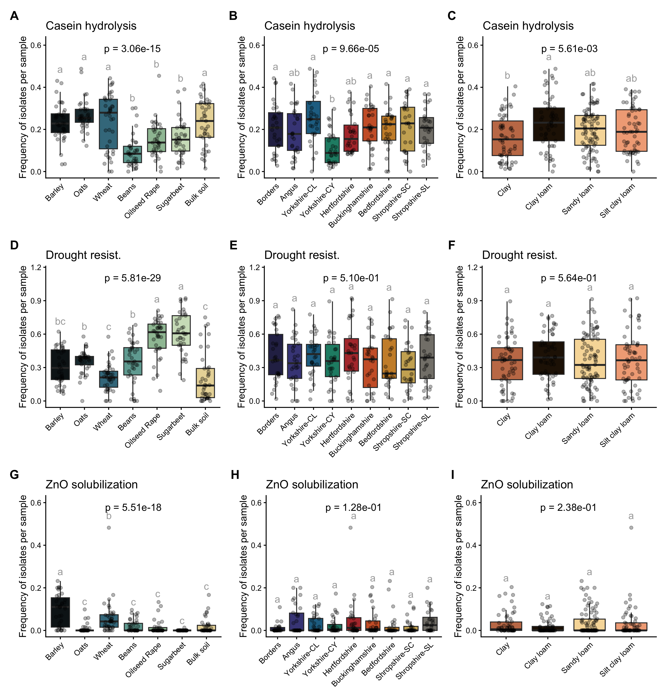

Paper figures
================
Rodrigo Taketani
2025-11-28

# Paper figures

This is a document for the creation of figures for the paper

## Load data

Load objects generated by other scripts

``` r
# Load the data
load("uncult_metabarcode_figs.RData")
load("isolate_metabarcode_figs.RData")
load("funct_figs.RData")
```

# Make figures

## Beta diversity NMDS

``` r
 library(patchwork)
library(ggplot2)
library(scales)

# Make ANOSIM values plot


df_unc <- data.frame(
  Factor = c("Crop", "Location", "Soil type"),
  R2 = c(0.02727, 0.936, 0.4326),
  Color = c("#40798c", "#b33939", "#c57b57")
)

# Plot
bar_unc <- ggplot(df_unc, aes(x = Factor, y = R2, fill = Factor)) +
  geom_bar(stat = "identity", color = "black") +
  scale_fill_manual(values = df_unc$Color) +
  labs(
    title = "16S Total Community",
    y = "ANOSIM R",   # <- superscript 2
    x = NULL
  ) +
  scale_y_continuous(labels = label_number(accuracy = 0.01)) +
  cowplot::theme_cowplot()+
  theme(
    legend.position = "none",
    plot.title = element_text(hjust = 0.5, face = "bold"),
    axis.text.x = element_text(angle = 45, hjust = 1)
  )

df_cult <- data.frame(
  Factor = c("Crop", "Location", "Soil type"),
  R2 = c(0.0669, 0.2176, 0.1734),
  Color = c("#40798c", "#b33939", "#c57b57")
)

# Plot
bar_cult <- ggplot(df_cult, aes(x = Factor, y = R2, fill = Factor)) +
  geom_bar(stat = "identity", color = "black") +
  scale_fill_manual(values = df_cult$Color) +
  labs(
    title = "16S Culturable",
    y = "ANOSIM R",   # <- superscript 2
    x = NULL
  ) +
  scale_y_continuous(labels = label_number(accuracy = 0.01)) +
  cowplot::theme_cowplot()+
  theme(
    legend.position = "none",
    plot.title = element_text(hjust = 0.5, face = "bold"),
    axis.text.x = element_text(angle = 45, hjust = 1)
  )

df_func <- data.frame(
  Factor = c("Crop", "Location", "Soil type"),
  R2 = c(0.2437, 0.03378, 0.0087),
  Color = c("#40798c", "#b33939", "#c57b57")
)

# Plot
bar_func <- ggplot(df_func, aes(x = Factor, y = R2, fill = Factor)) +
  geom_bar(stat = "identity", color = "black") +
  scale_fill_manual(values = df_func$Color) +
  labs(
    title = "PGP Functions",
    y = "ANOSIM R",   # <- superscript 2
    x = NULL
  ) +
  scale_y_continuous(labels = label_number(accuracy = 0.01)) +
  cowplot::theme_cowplot()+
  theme(
    legend.position = "none",
    plot.title = element_text(hjust = 0.5, face = "bold"),
    axis.text.x = element_text(angle = 45, hjust = 1)
  )

ANOSIM_bars <- bar_unc + bar_cult + bar_func 


nmds_plot_comb_uncult / nmds_plot_comb_isolates / nmds_func / ANOSIM_bars + plot_annotation(tag_levels = 'A') &
  theme(plot.tag = element_text(size = 14, face = "bold", hjust = 1, vjust = -1), 
    plot.tag.position = c(0, 1),
    plot.margin = margin(20, 20, 20, 20))
```

    ## Warning in plot_theme(plot): The `labels` theme element is not defined in the element hierarchy.
    ## The `labels` theme element is not defined in the element hierarchy.

<!-- -->

Also adding a ANOSIM barplot

``` r
 library(patchwork)
library(ggplot2)
library(scales)

# Make Permanova values plot

df_unc <- data.frame(
  Factor = c("Crop", "Location", "Soil type"),
  R2 = c(0.03, 0.428, 0.181),
  Color = c("#40798c", "#b33939", "#c57b57")
)

# Plot
bar_unc <- ggplot(df_unc, aes(x = Factor, y = R2, fill = Factor)) +
  geom_bar(stat = "identity", color = "black") +
  scale_fill_manual(values = df_unc$Color) +
  labs(
    title = "16S Total Community",
    y = expression("PERMANOVA " ~R^2),   # <- superscript 2
    x = NULL
  ) +
  scale_y_continuous(labels = label_number(accuracy = 0.01)) +
  cowplot::theme_cowplot()+
  theme(
    legend.position = "none",
    plot.title = element_text(hjust = 0.5, face = "bold"),
    axis.text.x = element_text(angle = 45, hjust = 1)
  )

df_cult <- data.frame(
  Factor = c("Crop", "Location", "Soil type"),
  R2 = c(0.0519, 0.1177, 0.0566),
  Color = c("#40798c", "#b33939", "#c57b57")
)

# Plot
bar_cult <- ggplot(df_cult, aes(x = Factor, y = R2, fill = Factor)) +
  geom_bar(stat = "identity", color = "black") +
  scale_fill_manual(values = df_cult$Color) +
  labs(
    title = "16S Culturable",
    y = expression("PERMANOVA " ~R^2),   # <- superscript 2
    x = NULL
  ) +
  scale_y_continuous(labels = label_number(accuracy = 0.01)) +
  cowplot::theme_cowplot()+
  theme(
    legend.position = "none",
    plot.title = element_text(hjust = 0.5, face = "bold"),
    axis.text.x = element_text(angle = 45, hjust = 1)
  )

df_func <- data.frame(
  Factor = c("Crop", "Location", "Soil type"),
  R2 = c(0.2217, 0.0668, 0.0202),
  Color = c("#40798c", "#b33939", "#c57b57")
)

# Plot
bar_func <- ggplot(df_func, aes(x = Factor, y = R2, fill = Factor)) +
  geom_bar(stat = "identity", color = "black") +
  scale_fill_manual(values = df_func$Color) +
  labs(
    title = "PGP Functions",
    y = expression("PERMANOVA " ~R^2),   # <- superscript 2
    x = NULL
  ) +
  scale_y_continuous(labels = label_number(accuracy = 0.01)) +
  cowplot::theme_cowplot()+
  theme(
    legend.position = "none",
    plot.title = element_text(hjust = 0.5, face = "bold"),
    axis.text.x = element_text(angle = 45, hjust = 1)
  )

perm_bars <- bar_unc + bar_cult + bar_func + plot_annotation(tag_levels = 'A') &
  theme(plot.tag = element_text(size = 14, face = "bold"))

perm_bars
```

<!-- -->

## Alpha diversity

``` r
alpha_combined_plot_uncult / alpha_shannon_isolates + plot_annotation(tag_levels = 'A') &
  theme(plot.tag = element_text(size = 14, face = "bold"))
```

<!-- -->

## Functions

``` r
# First row
pA <- cluster_list_box_crops[[4]] #+ labs(title = NULL)
pB <- cluster_list_box_locations[[4]] # + labs(title = NULL)
pC <- cluster_list_box_soils[[4]] #+ labs(title = NULL)

# Second row
pD <- cluster_list_box_crops[[7]] #+ labs(title = NULL)
pE <- cluster_list_box_locations[[7]]# + labs(title = NULL)
pF <- cluster_list_box_soils[[7]] #+ labs(title = NULL)

# Third row
pG <- cluster_list_box_crops[[8]] #+ labs(title = NULL)
pH <- cluster_list_box_locations[[8]] #+ labs(title = NULL)
pI <- cluster_list_box_soils[[8]] #+ labs(title = NULL)

library(patchwork)

# Combine using patchwork
layout <- (pA + pB + pC) /
          (pD + pE + pF) /
          (pG + pH + pI) +
          plot_annotation(tag_levels = 'A') &
  theme(plot.tag = element_text(size = 14, face = "bold"))  # Automatically tags A–I

layout
```

    ## Warning: `label` cannot be a <ggplot2::element_blank> object.
    ## `label` cannot be a <ggplot2::element_blank> object.
    ## `label` cannot be a <ggplot2::element_blank> object.
    ## `label` cannot be a <ggplot2::element_blank> object.
    ## `label` cannot be a <ggplot2::element_blank> object.
    ## `label` cannot be a <ggplot2::element_blank> object.
    ## `label` cannot be a <ggplot2::element_blank> object.
    ## `label` cannot be a <ggplot2::element_blank> object.
    ## `label` cannot be a <ggplot2::element_blank> object.

<!-- --> \# New plots
requested by reviewers

Let’s start by making the nmds plots with unifrac distance

``` r
df_unc <- data.frame(
  Factor = c("Crop", "Location", "Soil type"),
  R2 = c(0.026, 0.8814, 0.4419),
  Color = c("#40798c", "#b33939", "#c57b57")
)

# Plot
bar_unc <- ggplot(df_unc, aes(x = Factor, y = R2, fill = Factor)) +
  geom_bar(stat = "identity", color = "black") +
  scale_fill_manual(values = df_unc$Color) +
  labs(
    title = "16S Total Community",
    y = "ANOSIM R",   # <- superscript 2
    x = NULL
  ) +
  scale_y_continuous(labels = label_number(accuracy = 0.01)) +
  cowplot::theme_cowplot()+
  theme(
    legend.position = "none",
    plot.title = element_text(hjust = 0.5, face = "bold"),
    axis.text.x = element_text(angle = 45, hjust = 1)
  )

df_cult <- data.frame(
  Factor = c("Crop", "Location", "Soil type"),
  R2 = c(0.0763, 0.1061, 0.06332),
  Color = c("#40798c", "#b33939", "#c57b57")
)

# Plot
bar_cult <- ggplot(df_cult, aes(x = Factor, y = R2, fill = Factor)) +
  geom_bar(stat = "identity", color = "black") +
  scale_fill_manual(values = df_cult$Color) +
  labs(
    title = "16S Culturable",
    y = "ANOSIM R",   # <- superscript 2
    x = NULL
  ) +
  scale_y_continuous(labels = label_number(accuracy = 0.01)) +
  cowplot::theme_cowplot()+
  theme(
    legend.position = "none",
    plot.title = element_text(hjust = 0.5, face = "bold"),
    axis.text.x = element_text(angle = 45, hjust = 1)
  )


ANOSIM_bars <- bar_unc + bar_cult + plot_spacer()

nmds_plot_comb_wUniF_uncult / nmds_plot_comb_wUniF / ANOSIM_bars + plot_annotation(tag_levels = 'A') &
  theme(plot.tag = element_text(size = 14, face = "bold", hjust = 1, vjust = -1), 
    plot.tag.position = c(0, 1),
    plot.margin = margin(20, 20, 20, 20))
```

<!-- -->

No the alphadiversity plot with Faith pd index.

``` r
faith_combined_plot2_unc / faith_combined_plot2 + plot_annotation(tag_levels = 'A') + 
  plot_layout(guides = "collect") &
  theme(plot.tag = element_text(size = 14, face = "bold"),
        legend.position = "bottom")
```

<!-- -->

``` r
installed.packages()[names(sessionInfo()$otherPkgs), "Version"]
```

    ##    scales   ggplot2 patchwork 
    ##   "1.4.0"   "4.0.0"   "1.3.2"
