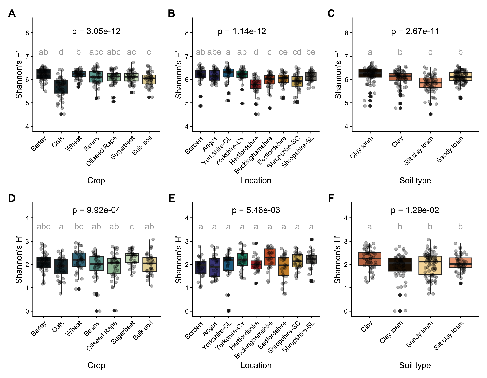

Paper figures
================
Rodrigo Taketani
2025-09-16

# Paper figures

This is a document for the creation of figures for the paper

## Load data

Load objects generated by other scripts

``` r
# Load the data
load("uncult_metabarcode_figs.RData")
load("isolate_metabarcode_figs.RData")
load("funct_figs.RData")
```

# Make figures

## Beta diversity NMDS

``` r
 library(patchwork)
library(ggplot2)
library(scales)

nmds_plot_comb_uncult / nmds_plot_comb_isolates / nmds_func + plot_annotation(tag_levels = 'A') &
  theme(plot.tag = element_text(size = 14, face = "bold", hjust = 1, vjust = -1), 
    plot.tag.position = c(0, 1),
    plot.margin = margin(20, 20, 20, 20))
```

    ## Warning in plot_theme(plot): The `labels` theme element is not defined in the element hierarchy.
    ## The `labels` theme element is not defined in the element hierarchy.

<!-- --> \##
Alpha diversity

``` r
alpha_combined_plot_uncult / alpha_shannon_isolates + plot_annotation(tag_levels = 'A') &
  theme(plot.tag = element_text(size = 14, face = "bold"))
```

<!-- -->

## Functions

``` r
# First row
pA <- cluster_list_box_crops[[4]] #+ labs(title = NULL)
pB <- cluster_list_box_locations[[4]] # + labs(title = NULL)
pC <- cluster_list_box_soils[[4]] #+ labs(title = NULL)

# Second row
pD <- cluster_list_box_crops[[7]] #+ labs(title = NULL)
pE <- cluster_list_box_locations[[7]]# + labs(title = NULL)
pF <- cluster_list_box_soils[[7]] #+ labs(title = NULL)

# Third row
pG <- cluster_list_box_crops[[8]] #+ labs(title = NULL)
pH <- cluster_list_box_locations[[8]] #+ labs(title = NULL)
pI <- cluster_list_box_soils[[8]] #+ labs(title = NULL)

library(patchwork)

# Combine using patchwork
layout <- (pA + pB + pC) /
          (pD + pE + pF) /
          (pG + pH + pI) +
          plot_annotation(tag_levels = 'A') &
  theme(plot.tag = element_text(size = 14, face = "bold"))  # Automatically tags A–I

layout
```

    ## Warning: `label` cannot be a <ggplot2::element_blank> object.
    ## `label` cannot be a <ggplot2::element_blank> object.
    ## `label` cannot be a <ggplot2::element_blank> object.
    ## `label` cannot be a <ggplot2::element_blank> object.
    ## `label` cannot be a <ggplot2::element_blank> object.
    ## `label` cannot be a <ggplot2::element_blank> object.
    ## `label` cannot be a <ggplot2::element_blank> object.
    ## `label` cannot be a <ggplot2::element_blank> object.
    ## `label` cannot be a <ggplot2::element_blank> object.

<!-- -->
