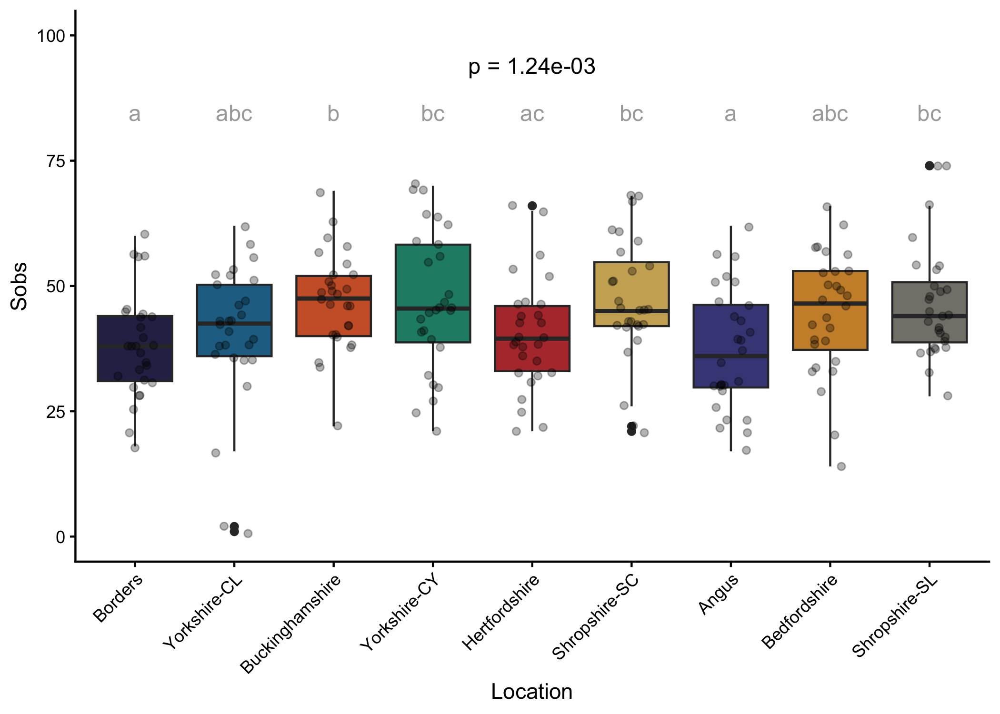
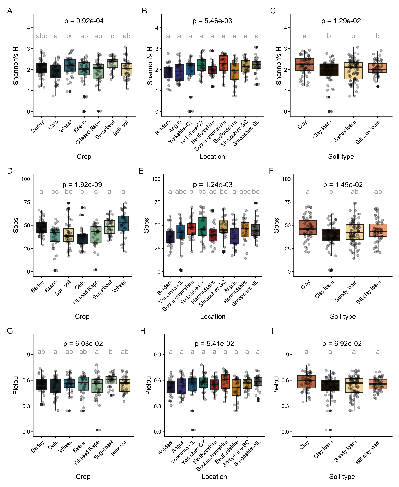
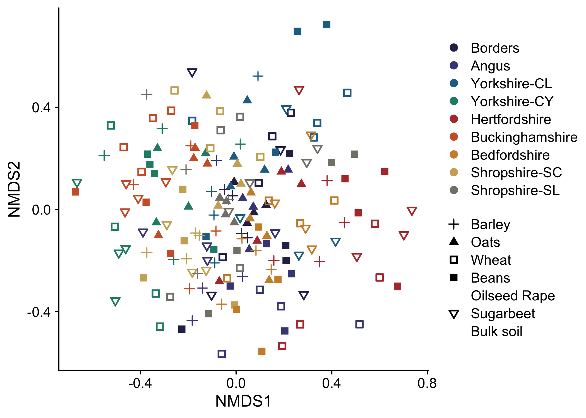
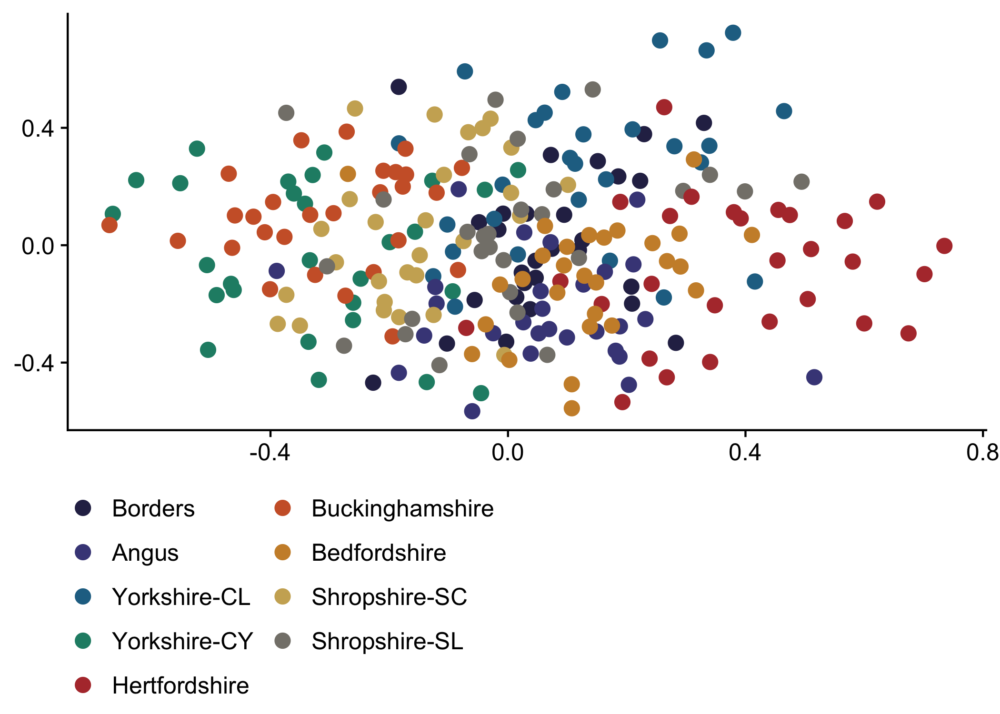
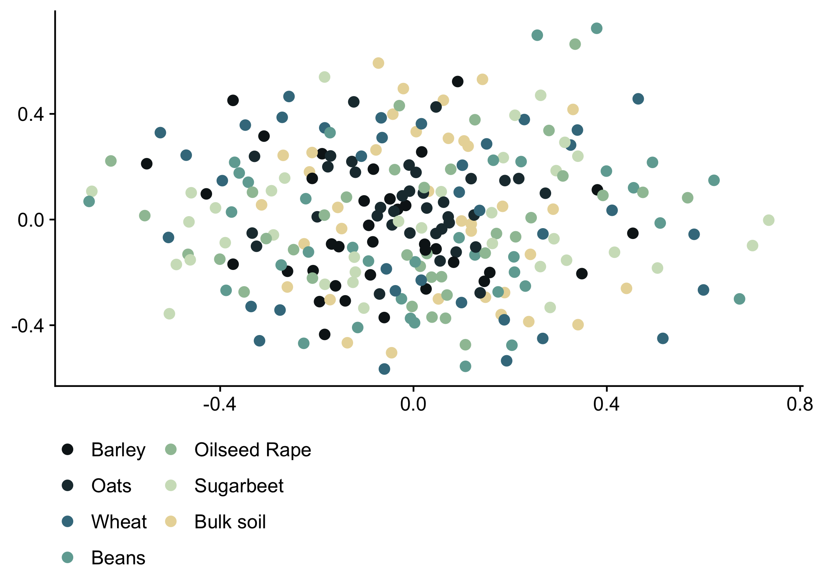
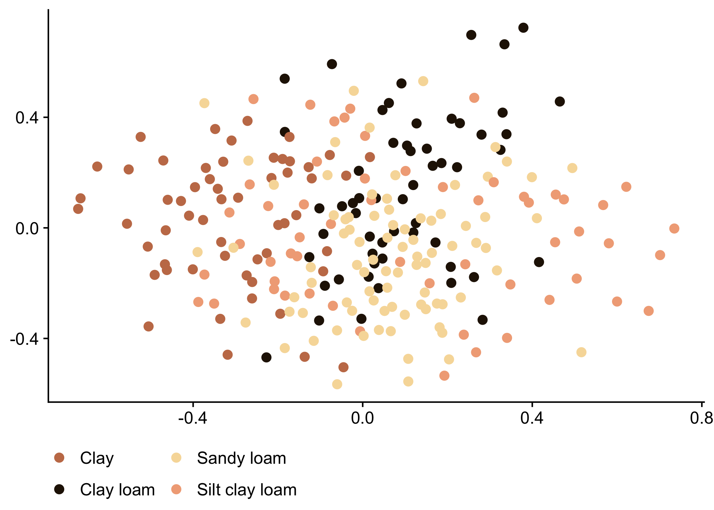
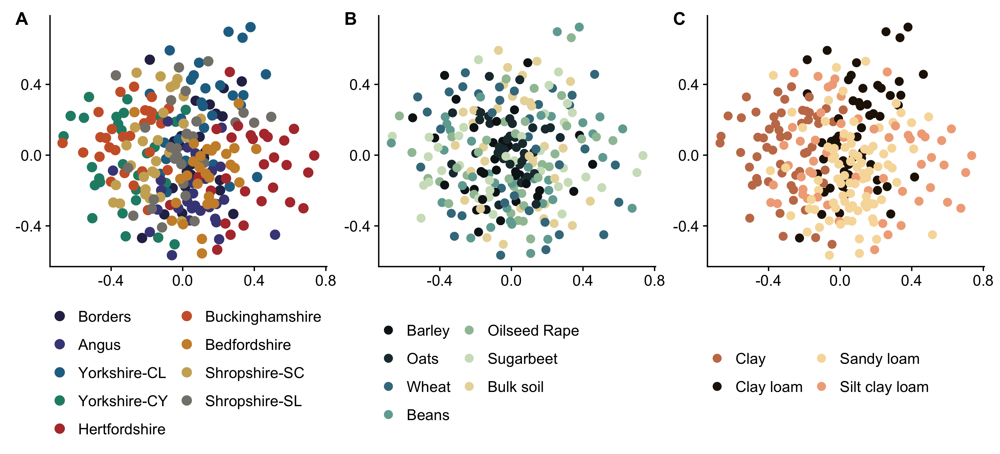

Isolates Metabarcoding
================
Rodrigo Taketani
2025-11-28

# Importing data

The DNA obtained from the isolates were set to Novogene for 16S
metabarcoding of the isolates polled per pot, i.e. each sample represent
one of the replicates of the UK Crop Microbiome Cryobank glasshouse
experiment. The samples presented here are the same used for functional
characterization of the isolates.

The sequences obtained from Novogene were analysed in Qiime2 using
DADA2, vsearch and Silva138 database as described below. We used the
demultiplexed, chimer checked and merged-pair sequences provided by
Novogene.

``` bash

# Import sequences to qiime2 artifact.

qiime tools import \
  --type 'SampleData[SequencesWithQuality]' \
  --input-path manifers.tsv \
  --output-path single-end-demux.qza \
  --input-format SingleEndFastqManifestPhred33V

#Denoise with Dada2

qiime dada2 denoise-single \
    --i-demultiplexed-seqs single-end-demux.qza \
    --p-trim-left 0 \
    --p-trunc-len 0 \
    --p-trunc-q 1 \
    --p-max-ee 5 \
    --o-representative-sequences rep-seqs.qza \
    --o-table table.qza \
    --o-denoising-stats stats.qza \
    --verbose \
    --p-n-threads 31
    
# Remove singletons and doubletons

qiime feature-table filter-features \
  --i-table table.qza \
  --p-min-frequency 2 \
  --o-filtered-table filtered-table.qza

# Filter sequences (*min-frequency) ~Remove sequences based on the filtered feature table"

qiime feature-table filter-seqs \
  --i-data rep-seqs.qza \
  --i-table filtered-table.qza \
  --o-filtered-data filtered-seqs.qza \
  --verbose 
  

# "Generate a tree for phylogenetic diversity analyses"
qiime phylogeny align-to-tree-mafft-fasttree \
  --i-sequences filtered-seqs.qza \
  --o-alignment aligned-rep-seqs.qza \
  --o-masked-alignment masked-aligned-rep-seqs.qza \
  --o-tree unrooted-tree.qza \
  --o-rooted-tree rooted-tree.qza 
  

# "Taxonomy analyses (with Vsearch consensus taxonomy classifier)"
qiime feature-classifier classify-consensus-vsearch \
--i-query filtered-seqs.qza \
--i-reference-reads /home/data/mmeg_ngs/rodrigo_taketani/mng2/silva-138-99-seqs.qza \
--i-reference-taxonomy /home/data/mmeg_ngs/rodrigo_taketani/mng2/silva-138-99-tax.qza  \
--o-classification taxonomy_modified.qza \
--o-search-results tax_search_results.qza \
--p-threads 31 \
--verbose

# "Export files for phyloseq (Taxonomy Table)"
qiime tools export \
--input-path taxonomy_modified.qza \
--output-path phyloseq_modified
#
# "Export files for phyloseq (Phylogenetic Tree)"
qiime tools export \
--input-path rooted-tree.qza \
--output-path phyloseq_modified
#
# "Export files for phyloseq (Feature Table) "
qiime tools export \
--input-path filtered-table.qza \
--output-path phyloseq_modified

# Add taxonomy to biom file
cd phyloseq_modified

var="#OTUID\ttaxonomy\tconfidence"

sed -i "1s/.*/$var/" taxonomy.tsv

biom add-metadata -i feature-table.biom -o table_tax.biom --observation-metadata-fp taxonomy.tsv
```

## Import data to R

``` r
library(phyloseq)
#Import Mapping File

sample_data_iso <- readxl::read_excel("./phyloseq_modified/sample.xlsx") # description of the pot experiment metadata

AgMicrobiome_RR <- readxl::read_excel("../R_functional_tool/AgMicrobiome-RR.xlsx", sheet = "Soils") # Data from the source soils

sample_metadata_iso <- merge(sample_data_iso, AgMicrobiome_RR, by = "Sample name", all.x = TRUE) 


library(dplyr)
```

    ## 
    ## Attaching package: 'dplyr'

    ## The following objects are masked from 'package:stats':
    ## 
    ##     filter, lag

    ## The following objects are masked from 'package:base':
    ## 
    ##     intersect, setdiff, setequal, union

``` r
#sample_metadata_iso <- sample_metadata_iso %>%
#  select(`sample-id`, everything())
row.names(sample_metadata_iso) <- sample_metadata_iso$`sample-id`

sample_metadata_iso$pot <- gsub("-", ".", sample_metadata_iso$pot)
sample_metadata_iso$`Soil Id` <- gsub("-", ".", sample_metadata_iso$`Soil Id`)

#Import OTU table 
#data in json.biom

otutableBac=import_biom(BIOMfilename="./phyloseq_modified/table_tax.biom",
                        parseFunction=parse_taxonomy_default)
```

    ## Warning in strsplit(conditionMessage(e), "\n"): unable to translate 'lexical error: invalid char in json text.
    ##                                        <89>HDF                        (right here) ------^
    ## ' to a wide string

    ## Warning in strsplit(conditionMessage(e), "\n"): input string 1 is invalid

``` r
tree <- ape::read.tree("phyloseq_modified/tree.nwk")

#tree = system.file("extdata", "phyloseq_modified/tree.nwk", package="phyloseq")

#Creating phyloseq object

bac_phylo = merge_phyloseq(otutableBac, sample_data(sample_metadata_iso), tree)

taxa_names(bac_phylo) <- paste("OTU.", formatC(seq(ntaxa(bac_phylo)), 
                                               width = nchar(ntaxa(bac_phylo)),
                                               flag = "0"), 
                               sep="")

# Adjust rank names
colnames(tax_table(bac_phylo)) = c("Kingdom", "Phylum", "Class", "Order", "Family", "Genus", "Species")
rank_names(bac_phylo) 
```

    ## [1] "Kingdom" "Phylum"  "Class"   "Order"   "Family"  "Genus"   "Species"

``` r
sample_names(bac_phylo) <- sample_data(bac_phylo)$pot

sample_names(bac_phylo)
```

    ##   [1] "SB.CL.BO.01" "SB.CL.BO.02" "SB.CL.BO.03" "SB.CL.BO.04" "FB.CL.BO.01"
    ##   [6] "FB.CL.BO.02" "FB.CL.BO.03" "FB.CL.BO.04" "CO.CL.BO.01" "CO.CL.BO.02"
    ##  [11] "CO.CL.BO.03" "CO.CL.BO.04" "SO.CL.BO.01" "SO.CL.BO.02" "SO.CL.BO.03"
    ##  [16] "SO.CL.BO.04" "OR.CL.BO.01" "OR.CL.BO.02" "OR.CL.BO.04" "OR.CL.BO.05"
    ##  [21] "SU.CL.BO.01" "SU.CL.BO.02" "SU.CL.BO.03" "SU.CL.BO.04" "SW.CL.BO.01"
    ##  [26] "SW.CL.BO.02" "SW.CL.BO.03" "SW.CL.BO.04" "SB.CY.YO.01" "SB.CY.YO.02"
    ##  [31] "SB.CY.YO.03" "SB.CY.YO.04" "FB.CY.YO.01" "FB.CY.YO.02" "FB.CY.YO.03"
    ##  [36] "FB.CY.YO.04" "CO.CY.YO.01" "CO.CY.YO.02" "CO.CY.YO.03" "CO.CY.YO.04"
    ##  [41] "SO.CY.YO.01" "SO.CY.YO.02" "SO.CY.YO.04" "SO.CY.YO.05" "OR.CY.YO.01"
    ##  [46] "OR.CY.YO.02" "OR.CY.YO.03" "OR.CY.YO.04" "SU.CY.YO.01" "SU.CY.YO.02"
    ##  [51] "SU.CY.YO.03" "SU.CY.YO.05" "SW.CY.YO.01" "SW.CY.YO.02" "SW.CY.YO.03"
    ##  [56] "SW.CY.YO.04" "SB.CL.YO.01" "SB.CL.YO.02" "SB.CL.YO.03" "SB.CL.YO.04"
    ##  [61] "FB.CL.YO.02" "FB.CL.YO.03" "FB.CL.YO.04" "FB.CL.YO.05" "CO.CL.YO.01"
    ##  [66] "CO.CL.YO.02" "CO.CL.YO.03" "CO.CL.YO.04" "SO.CL.YO.01" "SO.CL.YO.03"
    ##  [71] "SO.CL.YO.04" "SO.CL.YO.05" "OR.CL.YO.01" "OR.CL.YO.02" "OR.CL.YO.03"
    ##  [76] "OR.CL.YO.04" "SU.CL.YO.01" "SU.CL.YO.02" "SU.CL.YO.03" "SU.CL.YO.04"
    ##  [81] "SW.CL.YO.01" "SW.CL.YO.02" "SW.CL.YO.03" "SW.CL.YO.05" "SB.CY.BU.01"
    ##  [86] "SB.CY.BU.02" "SB.CY.BU.03" "SB.CY.BU.04" "FB.CY.BU.01" "FB.CY.BU.02"
    ##  [91] "FB.CY.BU.03" "FB.CY.BU.05" "CO.CY.BU.01" "CO.CY.BU.02" "CO.CY.BU.03"
    ##  [96] "CO.CY.BU.04" "SO.CY.BU.01" "SO.CY.BU.02" "SO.CY.BU.04" "SO.CY.BU.05"
    ## [101] "OR.CY.BU.02" "OR.CY.BU.03" "OR.CY.BU.04" "OR.CY.BU.05" "SU.CY.BU.01"
    ## [106] "SU.CY.BU.02" "SU.CY.BU.03" "SU.CY.BU.04" "SW.CY.BU.01" "SW.CY.BU.02"
    ## [111] "SW.CY.BU.03" "SW.CY.BU.04" "SB.SL.AN.01" "SB.SL.AN.02" "SB.SL.AN.03"
    ## [116] "SB.SL.AN.04" "FB.SL.AN.01" "FB.SL.AN.02" "FB.SL.AN.03" "FB.SL.AN.05"
    ## [121] "CO.SL.AN.01" "CO.SL.AN.02" "CO.SL.AN.03" "CO.SL.AN.04" "SO.SL.AN.01"
    ## [126] "SO.SL.AN.02" "SO.SL.AN.03" "SO.SL.AN.05" "OR.SL.AN.01" "OR.SL.AN.02"
    ## [131] "OR.SL.AN.03" "OR.SL.AN.04" "SU.SL.AN.01" "SU.SL.AN.02" "SU.SL.AN.03"
    ## [136] "SU.SL.AN.04" "SW.SL.AN.01" "SW.SL.AN.02" "SW.SL.AN.03" "SW.SL.AN.04"
    ## [141] "SB.SC.SH.01" "SB.SC.SH.02" "SB.SC.SH.03" "SB.SC.SH.04" "FB.SC.SH.01"
    ## [146] "FB.SC.SH.02" "FB.SC.SH.03" "FB.SC.SH.05" "CO.SC.SH.01" "CO.SC.SH.02"
    ## [151] "CO.SC.SH.03" "CO.SC.SH.04" "SO.SC.SH.01" "SO.SC.SH.02" "SO.SC.SH.03"
    ## [156] "SO.SC.SH.05" "OR.SC.SH.01" "OR.SC.SH.02" "OR.SC.SH.03" "OR.SC.SH.04"
    ## [161] "SU.SC.SH.02" "SU.SC.SH.03" "SU.SC.SH.04" "SU.SC.SH.05" "SW.SC.SH.02"
    ## [166] "SW.SC.SH.03" "SW.SC.SH.04" "SW.SC.SH.05" "SB.SL.SH.01" "SB.SL.SH.02"
    ## [171] "SB.SL.SH.03" "SB.SL.SH.04" "FB.SL.SH.01" "FB.SL.SH.02" "FB.SL.SH.03"
    ## [176] "FB.SL.SH.04" "CO.SL.SH.01" "CO.SL.SH.02" "CO.SL.SH.03" "CO.SL.SH.04"
    ## [181] "SO.SL.SH.01" "SO.SL.SH.02" "SO.SL.SH.03" "SO.SL.SH.04" "OR.SL.SH.01"
    ## [186] "OR.SL.SH.02" "OR.SL.SH.03" "OR.SL.SH.04" "SU.SL.SH.01" "SU.SL.SH.02"
    ## [191] "SU.SL.SH.03" "SU.SL.SH.04" "SW.SL.SH.01" "SW.SL.SH.02" "SW.SL.SH.03"
    ## [196] "SW.SL.SH.04" "SB.SC.HE.01" "SB.SC.HE.02" "SB.SC.HE.03" "SB.SC.HE.04"
    ## [201] "FB.SC.HE.02" "FB.SC.HE.03" "FB.SC.HE.04" "FB.SC.HE.05" "CO.SC.HE.01"
    ## [206] "CO.SC.HE.02" "CO.SC.HE.03" "CO.SC.HE.04" "SO.SC.HE.01" "SO.SC.HE.02"
    ## [211] "SO.SC.HE.03" "SO.SC.HE.04" "OR.SC.HE.01" "OR.SC.HE.02" "OR.SC.HE.03"
    ## [216] "OR.SC.HE.04" "SU.SC.HE.01" "SU.SC.HE.03" "SU.SC.HE.04" "SU.SC.HE.05"
    ## [221] "SW.SC.HE.01" "SW.SC.HE.02" "SW.SC.HE.03" "SW.SC.HE.04" "SB.SL.BE.01"
    ## [226] "SB.SL.BE.02" "SB.SL.BE.03" "SB.SL.BE.04" "FB.SL.BE.01" "FB.SL.BE.02"
    ## [231] "FB.SL.BE.03" "FB.SL.BE.04" "CO.SL.BE.01" "CO.SL.BE.02" "CO.SL.BE.03"
    ## [236] "CO.SL.BE.04" "SO.SL.BE.01" "SO.SL.BE.02" "SO.SL.BE.03" "SO.SL.BE.04"
    ## [241] "OR.SL.BE.01" "OR.SL.BE.02" "OR.SL.BE.03" "OR.SL.BE.04" "SU.SL.BE.02"
    ## [246] "SU.SL.BE.03" "SU.SL.BE.04" "SU.SL.BE.05" "SW.SL.BE.01" "SW.SL.BE.02"
    ## [251] "SW.SL.BE.03" "SW.SL.BE.04"

``` r
# Remove organelles

bac_phylo <- bac_phylo %>% subset_taxa( Family!= "c__mitochondria" & Class!="c__Chloroplast" ) 
bac_phylo <- bac_phylo %>% subset_taxa( Kingdom!= "Unassigned" | is.na(Phylum)) 

# Extract the taxonomy table
tax_table_original <- tax_table(bac_phylo)

# Remove the prefix (e.g., p__, c__, etc.) using gsub
# The regex pattern "^.+"__ matches any letter followed by `__`
tax_table_cleaned <- apply(tax_table_original, 2, function(x) gsub("^.+__", "", x))

# Replace the taxonomy table in the phyloseq object
tax_table(bac_phylo) <- tax_table(tax_table_cleaned)

# Check the updated taxonomy table
head(tax_table(bac_phylo))
```

    ## Taxonomy Table:     [6 taxa by 7 taxonomic ranks]:
    ##           Kingdom    Phylum             Class              Order             
    ## OTU.00203 "Bacteria" "Desulfobacterota" "Desulfuromonadia" "Geobacterales"   
    ## OTU.00204 "Bacteria" "Myxococcota"      "Polyangia"        "Polyangiales"    
    ## OTU.00205 "Bacteria" "Myxococcota"      "Polyangia"        "Polyangiales"    
    ## OTU.00206 "Bacteria" "Myxococcota"      "Myxococcia"       "Myxococcales"    
    ## OTU.00212 "Bacteria" "Latescibacterota" "Latescibacterota" "Latescibacterota"
    ## OTU.00213 "Bacteria" "Chloroflexi"      "Anaerolineae"     "SBR1031"         
    ##           Family             Genus              Species               
    ## OTU.00203 "Geobacteraceae"   "Geobacter"        NA                    
    ## OTU.00204 "Eel-36e1D6"       "Eel-36e1D6"       NA                    
    ## OTU.00205 "Polyangiaceae"    "Pajaroellobacter" "uncultured_bacterium"
    ## OTU.00206 "Myxococcaceae"    NA                 NA                    
    ## OTU.00212 "Latescibacterota" "Latescibacterota" "uncultured_bacterium"
    ## OTU.00213 "A4b"              "A4b"              "uncultured_bacterium"

## Aesthetic defaults

We will set a labels, colors, and shapes to represent the different
treatments on the plots. This consistency will help with the readability
of the plots.

``` r
# Aestetic parameters

colorvec <- c("AN" = "#005F73",
              "BE"  = "#0A9396",
              "BO" = "#94D2BD",
              "BU" = "#E9D8A6",
              "HE" = "#EE9B00",
              "SH" = "#CA6702",
              "YO" = "#BB3E03",
              "CL" = "#251605",
              "CY" = "#c57b57",
              "SC" = "#f1ab86",
              "SL" = "#f7dba7",
              "Barley" = "#0e181b", 
              "Oats" = "#1f363d", 
              "Wheat" = "#40798c", 
              "Beans" = "#70a9a1", 
              "OilseedRape" = "#9ec1a3", 
              "OSR" = "#9ec1a3", 
              "Sugarbeet" = "#cfe0c3", 
              "Bulksoil" = "#E9D8A6",
              "Bulk" = "#E9D8A6",
              "CL" = "#251605",
              "CY" = "#c57b57",
              "SC" = "#f1ab86",
              "SL" = "#f7dba7",
              "Clay loam" = "#251605",
              "Clay" = "#c57b57",
              "Silty clay loam" = "#f1ab86",
              "Sandy loam" = "#f7dba7",
              "CL.BO" = "#2c2c54",
              "SL.AN" = "#474787",
              "CL.YO" = "#227093",
              "CY.YO" = "#218c74",
              "SC.HE" = "#b33939",
              "CY.BU" = "#cd6133",
              "SL.BE" = "#cc8e35",
              "SC.SH" = "#ccae62",
              "SL.SH" = "#84817a"
              )

shapesvec <- c("Barley" = 3, "Beans" = 15, 
               "Bulksoil" = 16, "Oats" = 17, 
               "OilseedRape" = 18, "Sugarbeet" = 25, 
               "Wheat" = 0,
               "AN" = 3, "BE" = 15, 
               "BO" = 16, "BU" = 17, 
               "HE" = 18, "SH" = 25, 
               "YO" = 0)

labelsvec <- c("AN" = "Angus",
              "BE"  = "Bedfordshire",
              "BO" = "Borders",
              "BU" = "Buckinghamshire",
              "HE" = "Hertfordshire",
              "SH" = "Shropshire",
              "YO" = "Yorkshire",
              "Barley" = "Barley",
              "Beans" = "Beans", 
              "Bulksoil" = "Bulk soil",
              "Bulk" = "Bulk soil",
              "Oats" = "Oats", 
              "OilseedRape" = "Oilseed Rape", 
              "OSR" = "Oilseed Rape",
              "Sugarbeet" = "Sugarbeet", 
              "Wheat" = "Wheat",
              "CL" = "Clay loam",
              "CY" = "Clay",
              "SC" = "Silt clay loam",
              "SL" = "Sandy loam",
              "Clay loam" = "Clay loam",
              "Clay" = "Clay",
              "Silty clay loam" = "Silt clay loam",
              "Sandy loam" = "Sandy loam",
              "CL.BO" = "Borders",
              "CL.YO" = "Yorkshire-CL",
              "CY.BU" = "Buckinghamshire",
              "CY.YO" = "Yorkshire-CY",
              "SC.HE" = "Hertfordshire",
              "SC.SH" = "Shropshire-SC",
              "SL.AN" = "Angus",
              "SL.BE" = "Bedfordshire",
              "SL.SH" = "Shropshire-SL"
              )

crop_order = c("Barley", "Oats", "Wheat", "Beans", "OSR", "Sugarbeet", "Bulk")

local_order = c("CL.BO", "SL.AN", "CL.YO", "CY.YO", "SC.HE", "CY.BU", "SL.BE", "SC.SH", "SL.SH")

tax_color = c("Acidimicrobiia"  = "#001219",
              "Acidobacteriae"  ="#003441",
              "Actinobacteria" = "#00576A",
              "Alphaproteobacteria"  = "#03717F",
              "Bacilli" = "#08888F",
              "Bacteroidia"  = "#2CA29F",
              "Blastocatellia"  = "#6ABFB1",
              "Chloroflexia"   = "#A0D2B9",
              "Clostridia" = "#C7D5AF",
              "Gammaproteobacteria"  = "#E9D49D",
              "Gemmatimonadetes"  =   "#EBB953",   
              "KD4-96"   =  "#ED9E08",
              "MB-A2-108"  =   "#DF8600",
              "Nitrospiria" = "#CF6E01",
              "Phycisphaerae" = "#C55A02", 
              "Planctomycetes"  =   "#BE4802",
              "Polyangia" =   "#B83706",
              "Thermoleophilia" =   "#B22A0C", 
              "Verrucomicrobiae"  = "#AC2014",
              "Vicinamibacteria" =  "#A3211D")
```

# Eliminate contaminants and normalize data

Considering we have 20% of cultures that did not grow again and 20% of
cultures that are mixed. So, we expect that the maximum number of ASVs
per plate should be close to 100. With the data above, we considered
that 0.05% is the reasonable cut-off.

``` r
phylo_relative <- transform_sample_counts(bac_phylo, function(x) (x / sum(x)) * 100)
  
# Set values below cut-off to zero
otu_table(phylo_relative)[otu_table(phylo_relative) < 0.05] <- 0
  
# Prune taxa that are zero in all samples
bac_phylo_norm <- prune_taxa(taxa_sums(phylo_relative) > 0, phylo_relative)

# Do normalization again
bac_phylo_norm <- transform_sample_counts(bac_phylo_norm, function(x) (x / sum(x)) * 100)
```

# Alpha-diversity measurements

Here we will evaluate the differences in alpha diversity indexes of the
samples. We will calculate Sobs, Pielou’s Evenness, and Shannon’s H’.

``` r
# Calculate the Sobs, Pielou's Evenness, and Shannon's H'
library(picante)
```

    ## Loading required package: ape

    ## 
    ## Attaching package: 'ape'

    ## The following object is masked from 'package:dplyr':
    ## 
    ##     where

    ## Loading required package: vegan

    ## Loading required package: permute

    ## Loading required package: nlme

    ## 
    ## Attaching package: 'nlme'

    ## The following object is masked from 'package:dplyr':
    ## 
    ##     collapse

``` r
library(vegan)

physeq.norm.raref <- bac_phylo_norm
community_matrix <- as(t(otu_table(physeq.norm.raref)), "matrix")

# Calculate Observed Species (Sobs)
Sobs <- specnumber(community_matrix)

# Calculate Shannon Diversity Index
shannon_index <- vegan::diversity(community_matrix, index = "shannon")

# Calculate Pielou's Evenness
pielou_evenness <- shannon_index / log(Sobs)


# Create a data frame with the results
diversity_table <- data.frame(
  Sample = rownames(community_matrix),
  Sobs = Sobs,
  Shannon = shannon_index,
  Pielou = pielou_evenness
)

# Print the diversity table
print(diversity_table)
```

    ##                  Sample Sobs    Shannon    Pielou
    ## SB.CL.BO.01 SB.CL.BO.01   38 2.36601274 0.6504348
    ## SB.CL.BO.02 SB.CL.BO.02   44 2.17528458 0.5748350
    ## SB.CL.BO.03 SB.CL.BO.03   38 1.84781011 0.5079770
    ## SB.CL.BO.04 SB.CL.BO.04   38 1.88992967 0.5195560
    ## FB.CL.BO.01 FB.CL.BO.01   31 1.60285546 0.4667622
    ## FB.CL.BO.02 FB.CL.BO.02   45 2.42100004 0.6359902
    ## FB.CL.BO.03 FB.CL.BO.03   44 1.88014604 0.4968424
    ## FB.CL.BO.04 FB.CL.BO.04   25 1.78568018 0.5547527
    ## CO.CL.BO.01 CO.CL.BO.01   21 1.07575108 0.3533398
    ## CO.CL.BO.02 CO.CL.BO.02   56 2.77770457 0.6900526
    ## CO.CL.BO.03 CO.CL.BO.03   32 1.50765038 0.4350159
    ## CO.CL.BO.04 CO.CL.BO.04   38 1.49714979 0.4115778
    ## SO.CL.BO.01 SO.CL.BO.01   40 2.03168647 0.5507598
    ## SO.CL.BO.02 SO.CL.BO.02   28 1.72414451 0.5174186
    ## SO.CL.BO.03 SO.CL.BO.03   34 2.31650052 0.6569097
    ## SO.CL.BO.04 SO.CL.BO.04   30 1.98752548 0.5843605
    ## OR.CL.BO.01 OR.CL.BO.01   28 1.01829271 0.3055913
    ## OR.CL.BO.02 OR.CL.BO.02   35 2.06577220 0.5810323
    ## OR.CL.BO.04 OR.CL.BO.04   31 1.23695228 0.3602088
    ## OR.CL.BO.05 OR.CL.BO.05   18 1.03492270 0.3580587
    ## SU.CL.BO.01 SU.CL.BO.01   56 2.09393949 0.5201880
    ## SU.CL.BO.02 SU.CL.BO.02   33 2.08919652 0.5975095
    ## SU.CL.BO.03 SU.CL.BO.03   45 2.36330411 0.6208336
    ## SU.CL.BO.04 SU.CL.BO.04   37 2.04417625 0.5661099
    ## SW.CL.BO.01 SW.CL.BO.01   42 2.11556827 0.5660126
    ## SW.CL.BO.02 SW.CL.BO.02   60 2.32154497 0.5670126
    ## SW.CL.BO.03 SW.CL.BO.03   44 1.96837513 0.5201576
    ## SW.CL.BO.04 SW.CL.BO.04   56 1.60850598 0.3995939
    ## SB.CY.YO.01 SB.CY.YO.01   64 2.30270147 0.5536827
    ## SB.CY.YO.02 SB.CY.YO.02   64 2.81897951 0.6778213
    ## SB.CY.YO.03 SB.CY.YO.03   46 2.09530872 0.5472721
    ## SB.CY.YO.04 SB.CY.YO.04   59 2.41702973 0.5927670
    ## FB.CY.YO.01 FB.CY.YO.01   46 1.98905147 0.5195189
    ## FB.CY.YO.02 FB.CY.YO.02   41 1.67057217 0.4498559
    ## FB.CY.YO.03 FB.CY.YO.03   45 1.42424480 0.3741453
    ## FB.CY.YO.04 FB.CY.YO.04   41 2.56405869 0.6904562
    ## CO.CY.YO.01 CO.CY.YO.01   39 2.07950985 0.5676197
    ## CO.CY.YO.02 CO.CY.YO.02   25 1.45863392 0.4531501
    ## CO.CY.YO.03 CO.CY.YO.03   32 1.78219320 0.5142323
    ## CO.CY.YO.04 CO.CY.YO.04   45 2.45330342 0.6444762
    ## SO.CY.YO.01 SO.CY.YO.01   38 2.17406049 0.5976657
    ## SO.CY.YO.02 SO.CY.YO.02   21 1.39415082 0.4579210
    ## SO.CY.YO.04 SO.CY.YO.04   69 2.56511369 0.6058217
    ## SO.CY.YO.05 SO.CY.YO.05   30 1.95938360 0.5760864
    ## OR.CY.YO.01 OR.CY.YO.01   30 2.64862453 0.7787330
    ## OR.CY.YO.02 OR.CY.YO.02   27 2.11294035 0.6410937
    ## OR.CY.YO.03 OR.CY.YO.03   48 1.93187143 0.4990367
    ## OR.CY.YO.04 OR.CY.YO.04   43 2.08092049 0.5532597
    ## SU.CY.YO.01 SU.CY.YO.01   62 2.47561025 0.5998376
    ## SU.CY.YO.02 SU.CY.YO.02   45 2.22839795 0.5853941
    ## SU.CY.YO.03 SU.CY.YO.03   56 2.50334765 0.6218954
    ## SU.CY.YO.05 SU.CY.YO.05   55 2.44058469 0.6090296
    ## SW.CY.YO.01 SW.CY.YO.01   58 2.27105324 0.5593117
    ## SW.CY.YO.02 SW.CY.YO.02   69 2.93032864 0.6920772
    ## SW.CY.YO.03 SW.CY.YO.03   47 1.54676328 0.4017413
    ## SW.CY.YO.04 SW.CY.YO.04   70 2.89770250 0.6820538
    ## SB.CL.YO.01 SB.CL.YO.01   44 2.27306709 0.6006747
    ## SB.CL.YO.02 SB.CL.YO.02   35 1.69365416 0.4763680
    ## SB.CL.YO.03 SB.CL.YO.03   53 2.28698618 0.5760247
    ## SB.CL.YO.04 SB.CL.YO.04   62 2.15747975 0.5227549
    ## FB.CL.YO.02 FB.CL.YO.02    1 0.00000000       NaN
    ## FB.CL.YO.03 FB.CL.YO.03   17 0.68864897 0.2430629
    ## FB.CL.YO.04 FB.CL.YO.04   52 2.66711905 0.6750075
    ## FB.CL.YO.05 FB.CL.YO.05   43 2.40128547 0.6384360
    ## CO.CL.YO.01 CO.CL.YO.01   30 2.17017636 0.6380625
    ## CO.CL.YO.02 CO.CL.YO.02   51 2.30104052 0.5852346
    ## CO.CL.YO.03 CO.CL.YO.03   36 2.26038010 0.6307711
    ## CO.CL.YO.04 CO.CL.YO.04   38 2.03398027 0.5591566
    ## SO.CL.YO.01 SO.CL.YO.01   39 2.21188409 0.6037524
    ## SO.CL.YO.03 SO.CL.YO.03   38 1.72665665 0.4746710
    ## SO.CL.YO.04 SO.CL.YO.04   35 1.96037146 0.5513867
    ## SO.CL.YO.05 SO.CL.YO.05   38 2.26373337 0.6223175
    ## OR.CL.YO.01 OR.CL.YO.01    2 0.01439362 0.0207656
    ## OR.CL.YO.02 OR.CL.YO.02   42 2.11439098 0.5656977
    ## OR.CL.YO.03 OR.CL.YO.03   43 1.75633151 0.4669604
    ## OR.CL.YO.04 OR.CL.YO.04   43 1.60603027 0.4269994
    ## SU.CL.YO.01 SU.CL.YO.01   36 1.53691272 0.4288837
    ## SU.CL.YO.02 SU.CL.YO.02   41 2.65448518 0.7148064
    ## SU.CL.YO.03 SU.CL.YO.03   46 2.59233761 0.6770907
    ## SU.CL.YO.04 SU.CL.YO.04   52 2.36041947 0.5973865
    ## SW.CL.YO.01 SW.CL.YO.01   56 2.49204400 0.6190873
    ## SW.CL.YO.02 SW.CL.YO.02   47 2.22450920 0.5777724
    ## SW.CL.YO.03 SW.CL.YO.03   58 2.24915223 0.5539179
    ## SW.CL.YO.05 SW.CL.YO.05   50 1.91277098 0.4889468
    ## SB.CY.BU.01 SB.CY.BU.01   49 1.85487165 0.4766077
    ## SB.CY.BU.02 SB.CY.BU.02   42 1.29555638 0.3466214
    ## SB.CY.BU.03 SB.CY.BU.03   54 1.98791485 0.4983512
    ## SB.CY.BU.04 SB.CY.BU.04   38 2.66765843 0.7333595
    ## FB.CY.BU.01 FB.CY.BU.01   46 2.49407979 0.6514268
    ## FB.CY.BU.02 FB.CY.BU.02   46 2.33607301 0.6101572
    ## FB.CY.BU.03 FB.CY.BU.03   48 1.84423373 0.4763983
    ## FB.CY.BU.05 FB.CY.BU.05   47 2.50466097 0.6505364
    ## CO.CY.BU.01 CO.CY.BU.01   35 2.48731945 0.6995994
    ## CO.CY.BU.02 CO.CY.BU.02   50 2.74872790 0.7026359
    ## CO.CY.BU.03 CO.CY.BU.03   42 2.06262891 0.5518489
    ## CO.CY.BU.04 CO.CY.BU.04   40 2.19891908 0.5960940
    ## SO.CY.BU.01 SO.CY.BU.01   40 2.26334607 0.6135592
    ## SO.CY.BU.02 SO.CY.BU.02   22 1.23891286 0.4008075
    ## SO.CY.BU.04 SO.CY.BU.04   46 2.46292418 0.6432893
    ## SO.CY.BU.05 SO.CY.BU.05   40 1.87194312 0.5074558
    ## OR.CY.BU.02 OR.CY.BU.02   52 2.70595871 0.6848372
    ## OR.CY.BU.03 OR.CY.BU.03   49 2.72510442 0.7002133
    ## OR.CY.BU.04 OR.CY.BU.04   49 2.76912484 0.7115243
    ## OR.CY.BU.05 OR.CY.BU.05   52 2.26247720 0.5725987
    ## SU.CY.BU.01 SU.CY.BU.01   34 2.19708000 0.6230446
    ## SU.CY.BU.02 SU.CY.BU.02   57 2.67813938 0.6624055
    ## SU.CY.BU.03 SU.CY.BU.03   51 1.91773678 0.4877472
    ## SU.CY.BU.04 SU.CY.BU.04   38 1.67036986 0.4591973
    ## SW.CY.BU.01 SW.CY.BU.01   58 2.06859382 0.5094503
    ## SW.CY.BU.02 SW.CY.BU.02   60 2.81304884 0.6870572
    ## SW.CY.BU.03 SW.CY.BU.03   63 2.51066789 0.6059827
    ## SW.CY.BU.04 SW.CY.BU.04   69 2.80459052 0.6623807
    ## SB.SL.AN.01 SB.SL.AN.01   43 1.74841662 0.4648560
    ## SB.SL.AN.02 SB.SL.AN.02   39 2.26771253 0.6189912
    ## SB.SL.AN.03 SB.SL.AN.03   52 2.79264490 0.7067762
    ## SB.SL.AN.04 SB.SL.AN.04   56 2.07800403 0.5162292
    ## FB.SL.AN.01 FB.SL.AN.01   30 1.27975474 0.3762659
    ## FB.SL.AN.02 FB.SL.AN.02   37 2.19199794 0.6070473
    ## FB.SL.AN.03 FB.SL.AN.03   44 2.33048027 0.6158466
    ## FB.SL.AN.05 FB.SL.AN.05   35 1.45617029 0.4095718
    ## CO.SL.AN.01 CO.SL.AN.01   23 1.72201974 0.5492020
    ## CO.SL.AN.02 CO.SL.AN.02   17 1.32095662 0.4662397
    ## CO.SL.AN.03 CO.SL.AN.03   21 1.84011101 0.6044005
    ## CO.SL.AN.04 CO.SL.AN.04   23 1.47867530 0.4715924
    ## SO.SL.AN.01 SO.SL.AN.01   47 2.23534501 0.5805868
    ## SO.SL.AN.02 SO.SL.AN.02   39 1.24059593 0.3386311
    ## SO.SL.AN.03 SO.SL.AN.03   30 1.49432523 0.4393527
    ## SO.SL.AN.05 SO.SL.AN.05   30 2.13424497 0.6274981
    ## OR.SL.AN.01 OR.SL.AN.01   51 2.24481953 0.5709357
    ## OR.SL.AN.02 OR.SL.AN.02   31 1.57683517 0.4591849
    ## OR.SL.AN.03 OR.SL.AN.03   30 1.27766040 0.3756502
    ## OR.SL.AN.04 OR.SL.AN.04   51 1.53667761 0.3908306
    ## SU.SL.AN.01 SU.SL.AN.01   46 2.65802519 0.6942476
    ## SU.SL.AN.02 SU.SL.AN.02   56 2.72666234 0.6773725
    ## SU.SL.AN.03 SU.SL.AN.03   41 2.42312275 0.6525046
    ## SU.SL.AN.04 SU.SL.AN.04   62 2.16108561 0.5236286
    ## SW.SL.AN.01 SW.SL.AN.01   26 1.31637984 0.4040334
    ## SW.SL.AN.02 SW.SL.AN.02   29 1.96065329 0.5822635
    ## SW.SL.AN.03 SW.SL.AN.03   30 2.41770906 0.7108406
    ## SW.SL.AN.04 SW.SL.AN.04   22 1.38369972 0.4476482
    ## SB.SC.SH.01 SB.SC.SH.01   42 2.20467193 0.5898520
    ## SB.SC.SH.02 SB.SC.SH.02   45 1.89374739 0.4974823
    ## SB.SC.SH.03 SB.SC.SH.03   47 2.00050019 0.5195905
    ## SB.SC.SH.04 SB.SC.SH.04   37 2.16127537 0.5985390
    ## FB.SC.SH.01 FB.SC.SH.01   42 1.94138482 0.5194105
    ## FB.SC.SH.02 FB.SC.SH.02   46 1.50706545 0.3936293
    ## FB.SC.SH.03 FB.SC.SH.03   57 2.43739401 0.6028600
    ## FB.SC.SH.05 FB.SC.SH.05   42 2.33992216 0.6260377
    ## CO.SC.SH.01 CO.SC.SH.01   42 2.11883951 0.5668879
    ## CO.SC.SH.02 CO.SC.SH.02   43 1.62765355 0.4327485
    ## CO.SC.SH.03 CO.SC.SH.03   59 2.68922779 0.6595225
    ## CO.SC.SH.04 CO.SC.SH.04   68 2.40941900 0.5710190
    ## SO.SC.SH.01 SO.SC.SH.01   22 1.99071770 0.6440279
    ## SO.SC.SH.02 SO.SC.SH.02   26 1.65433169 0.5077602
    ## SO.SC.SH.03 SO.SC.SH.03   61 1.91999665 0.4670532
    ## SO.SC.SH.05 SO.SC.SH.05   39 1.86834566 0.5099807
    ## OR.SC.SH.01 OR.SC.SH.01   45 1.89294063 0.4972704
    ## OR.SC.SH.02 OR.SC.SH.02   21 1.41193932 0.4637638
    ## OR.SC.SH.03 OR.SC.SH.03   53 2.49580242 0.6286194
    ## OR.SC.SH.04 OR.SC.SH.04   43 2.15328509 0.5724995
    ## SU.SC.SH.02 SU.SC.SH.02   61 2.44658535 0.5951497
    ## SU.SC.SH.03 SU.SC.SH.03   51 2.44759070 0.6225074
    ## SU.SC.SH.04 SU.SC.SH.04   54 2.57090228 0.6445005
    ## SU.SC.SH.05 SU.SC.SH.05   45 1.82887297 0.4804400
    ## SW.SC.SH.02 SW.SC.SH.02   51 2.74345582 0.6977562
    ## SW.SC.SH.03 SW.SC.SH.03   68 2.53400986 0.6005463
    ## SW.SC.SH.04 SW.SC.SH.04   67 2.19707764 0.5225299
    ## SW.SC.SH.05 SW.SC.SH.05   42 2.03065862 0.5432954
    ## SB.SL.SH.01 SB.SL.SH.01   48 2.02230671 0.5223978
    ## SB.SL.SH.02 SB.SL.SH.02   41 1.55943490 0.4199285
    ## SB.SL.SH.03 SB.SL.SH.03   60 2.53662449 0.6195435
    ## SB.SL.SH.04 SB.SL.SH.04   47 2.20363427 0.5723506
    ## FB.SL.SH.01 FB.SL.SH.01   54 2.15001695 0.5389886
    ## FB.SL.SH.02 FB.SL.SH.02   33 2.23344706 0.6387651
    ## FB.SL.SH.03 FB.SL.SH.03   43 2.30002660 0.6115140
    ## FB.SL.SH.04 FB.SL.SH.04   39 2.38005243 0.6496554
    ## CO.SL.SH.01 CO.SL.SH.01   66 2.38857738 0.5701132
    ## CO.SL.SH.02 CO.SL.SH.02   42 1.80375228 0.4825874
    ## CO.SL.SH.03 CO.SL.SH.03   38 1.82080332 0.5005526
    ## CO.SL.SH.04 CO.SL.SH.04   74 3.07540833 0.7145357
    ## SO.SL.SH.01 SO.SL.SH.01   40 2.61399894 0.7086160
    ## SO.SL.SH.02 SO.SL.SH.02   37 2.35825490 0.6530901
    ## SO.SL.SH.03 SO.SL.SH.03   28 1.27994774 0.3841144
    ## SO.SL.SH.04 SO.SL.SH.04   37 1.30415520 0.3611700
    ## OR.SL.SH.01 OR.SL.SH.01   49 2.10440422 0.5407249
    ## OR.SL.SH.02 OR.SL.SH.02   37 2.07399581 0.5743680
    ## OR.SL.SH.03 OR.SL.SH.03   41 2.25718341 0.6078200
    ## OR.SL.SH.04 OR.SL.SH.04   45 2.35445251 0.6185083
    ## SU.SL.SH.01 SU.SL.SH.01   53 2.34834648 0.5914796
    ## SU.SL.SH.02 SU.SL.SH.02   44 2.44175173 0.6452509
    ## SU.SL.SH.03 SU.SL.SH.03   38 2.09104199 0.5748433
    ## SU.SL.SH.04 SU.SL.SH.04   49 2.74728420 0.7059124
    ## SW.SL.SH.01 SW.SL.SH.01   44 2.11033843 0.5576725
    ## SW.SL.SH.02 SW.SL.SH.02   54 1.82929382 0.4585864
    ## SW.SL.SH.03 SW.SL.SH.03   74 2.55099087 0.5926934
    ## SW.SL.SH.04 SW.SL.SH.04   50 2.44136399 0.6240669
    ## SB.SC.HE.01 SB.SC.HE.01   46 2.44515199 0.6386474
    ## SB.SC.HE.02 SB.SC.HE.02   66 2.90828279 0.6941581
    ## SB.SC.HE.03 SB.SC.HE.03   53 1.98999497 0.5012213
    ## SB.SC.HE.04 SB.SC.HE.04   56 2.51690420 0.6252632
    ## FB.SC.HE.02 FB.SC.HE.02   32 1.91898028 0.5537007
    ## FB.SC.HE.03 FB.SC.HE.03   25 2.06401695 0.6412229
    ## FB.SC.HE.04 FB.SC.HE.04   33 1.99583196 0.5708073
    ## FB.SC.HE.05 FB.SC.HE.05   27 2.10862702 0.6397850
    ## CO.SC.HE.01 CO.SC.HE.01   33 2.00391220 0.5731182
    ## CO.SC.HE.02 CO.SC.HE.02   38 1.62207184 0.4459198
    ## CO.SC.HE.03 CO.SC.HE.03   35 1.72583180 0.4854185
    ## CO.SC.HE.04 CO.SC.HE.04   43 2.26637071 0.6025658
    ## SO.SC.HE.01 SO.SC.HE.01   38 2.13487962 0.5868946
    ## SO.SC.HE.02 SO.SC.HE.02   22 1.19662973 0.3871282
    ## SO.SC.HE.03 SO.SC.HE.03   40 1.92577175 0.5220479
    ## SO.SC.HE.04 SO.SC.HE.04   44 1.75760351 0.4644597
    ## OR.SC.HE.01 OR.SC.HE.01   31 2.09973441 0.6114567
    ## OR.SC.HE.02 OR.SC.HE.02   44 2.20946357 0.5838670
    ## OR.SC.HE.03 OR.SC.HE.03   43 1.81835060 0.4834496
    ## OR.SC.HE.04 OR.SC.HE.04   40 1.68216668 0.4560102
    ## SU.SC.HE.01 SU.SC.HE.01   46 2.03444574 0.5313754
    ## SU.SC.HE.03 SU.SC.HE.03   65 1.77714224 0.4257253
    ## SU.SC.HE.04 SU.SC.HE.04   38 2.33385487 0.6415944
    ## SU.SC.HE.05 SU.SC.HE.05   39 1.93201110 0.5273587
    ## SW.SC.HE.01 SW.SC.HE.01   36 1.93295292 0.5394008
    ## SW.SC.HE.02 SW.SC.HE.02   47 1.85738833 0.4824200
    ## SW.SC.HE.03 SW.SC.HE.03   21 1.67796385 0.5511419
    ## SW.SC.HE.04 SW.SC.HE.04   52 2.20707824 0.5585781
    ## SB.SL.BE.01 SB.SL.BE.01   42 1.20319303 0.3219099
    ## SB.SL.BE.02 SB.SL.BE.02   46 1.80635332 0.4718001
    ## SB.SL.BE.03 SB.SL.BE.03   29 1.54695647 0.4594062
    ## SB.SL.BE.04 SB.SL.BE.04   42 1.16684012 0.3121839
    ## FB.SL.BE.01 FB.SL.BE.01   14 0.73891820 0.2799932
    ## FB.SL.BE.02 FB.SL.BE.02   47 1.88466808 0.4895054
    ## FB.SL.BE.03 FB.SL.BE.03   33 1.94566856 0.5564606
    ## FB.SL.BE.04 FB.SL.BE.04   44 2.33827444 0.6179063
    ## CO.SL.BE.01 CO.SL.BE.01   57 1.85037893 0.4576689
    ## CO.SL.BE.02 CO.SL.BE.02   50 2.30300214 0.5886985
    ## CO.SL.BE.03 CO.SL.BE.03   39 1.53357746 0.4186029
    ## CO.SL.BE.04 CO.SL.BE.04   34 2.21972601 0.6294666
    ## SO.SL.BE.01 SO.SL.BE.01   35 1.21834796 0.3426804
    ## SO.SL.BE.02 SO.SL.BE.02   20 0.74031987 0.2471248
    ## SO.SL.BE.03 SO.SL.BE.03   39 2.23559890 0.6102255
    ## SO.SL.BE.04 SO.SL.BE.04   38 1.67289334 0.4598911
    ## OR.SL.BE.01 OR.SL.BE.01   33 1.47901321 0.4229973
    ## OR.SL.BE.02 OR.SL.BE.02   53 2.26457949 0.5703811
    ## OR.SL.BE.03 OR.SL.BE.03   56 2.46156970 0.6115167
    ## OR.SL.BE.04 OR.SL.BE.04   50 1.98467995 0.5073283
    ## SU.SL.BE.02 SU.SL.BE.02   53 2.41582586 0.6084756
    ## SU.SL.BE.03 SU.SL.BE.03   53 2.43526240 0.6133711
    ## SU.SL.BE.04 SU.SL.BE.04   62 2.68445350 0.6504401
    ## SU.SL.BE.05 SU.SL.BE.05   48 2.41295573 0.6233093
    ## SW.SL.BE.01 SW.SL.BE.01   49 0.94715550 0.2433708
    ## SW.SL.BE.02 SW.SL.BE.02   58 2.54527206 0.6268459
    ## SW.SL.BE.03 SW.SL.BE.03   58 2.29083701 0.5641840
    ## SW.SL.BE.04 SW.SL.BE.04   66 2.18439201 0.5213776

First we prepare the data.

``` r
library(tibble)
library(dplyr)
# Extract the sample data
sample_data_df <- data.frame(sample_data(physeq.norm.raref))
sample_data_df <- sample_data_df %>% rownames_to_column("Sample")

# Merge the diversity index with the sample data based on sample names

merged_sample_data_iso <- merge(sample_data_df, diversity_table, by = "Sample")
```

Below we will plot and compare the diversity indexes by location, crop
and soil type. first will test the normality of the data using
Shapiro-Wilk

``` r
#Shannon
shapiro_test_shannon_crop <- by(merged_sample_data_iso$Shannon, merged_sample_data_iso$Crop, shapiro.test) #shapiro.test(diversity_table$Shannon)
print(shapiro_test_shannon_crop)
```

    ## merged_sample_data_iso$Crop: Barley
    ## 
    ##  Shapiro-Wilk normality test
    ## 
    ## data:  dd[x, ]
    ## W = 0.97953, p-value = 0.7297
    ## 
    ## ------------------------------------------------------------ 
    ## merged_sample_data_iso$Crop: Beans
    ## 
    ##  Shapiro-Wilk normality test
    ## 
    ## data:  dd[x, ]
    ## W = 0.86476, p-value = 0.0004241
    ## 
    ## ------------------------------------------------------------ 
    ## merged_sample_data_iso$Crop: Bulk
    ## 
    ##  Shapiro-Wilk normality test
    ## 
    ## data:  dd[x, ]
    ## W = 0.98739, p-value = 0.9479
    ## 
    ## ------------------------------------------------------------ 
    ## merged_sample_data_iso$Crop: Oats
    ## 
    ##  Shapiro-Wilk normality test
    ## 
    ## data:  dd[x, ]
    ## W = 0.96012, p-value = 0.2169
    ## 
    ## ------------------------------------------------------------ 
    ## merged_sample_data_iso$Crop: OSR
    ## 
    ##  Shapiro-Wilk normality test
    ## 
    ## data:  dd[x, ]
    ## W = 0.92443, p-value = 0.01702
    ## 
    ## ------------------------------------------------------------ 
    ## merged_sample_data_iso$Crop: Sugarbeet
    ## 
    ##  Shapiro-Wilk normality test
    ## 
    ## data:  dd[x, ]
    ## W = 0.94505, p-value = 0.07306
    ## 
    ## ------------------------------------------------------------ 
    ## merged_sample_data_iso$Crop: Wheat
    ## 
    ##  Shapiro-Wilk normality test
    ## 
    ## data:  dd[x, ]
    ## W = 0.97411, p-value = 0.5478

``` r
shapiro_test_shannon_location <- by(merged_sample_data_iso$Shannon, merged_sample_data_iso$Soil.Id, shapiro.test) #shapiro.test(diversity_table$Shannon)
print(shapiro_test_shannon_location)
```

    ## merged_sample_data_iso$Soil.Id: CL.BO
    ## 
    ##  Shapiro-Wilk normality test
    ## 
    ## data:  dd[x, ]
    ## W = 0.95711, p-value = 0.2972
    ## 
    ## ------------------------------------------------------------ 
    ## merged_sample_data_iso$Soil.Id: CL.YO
    ## 
    ##  Shapiro-Wilk normality test
    ## 
    ## data:  dd[x, ]
    ## W = 0.76693, p-value = 2.941e-05
    ## 
    ## ------------------------------------------------------------ 
    ## merged_sample_data_iso$Soil.Id: CY.BU
    ## 
    ##  Shapiro-Wilk normality test
    ## 
    ## data:  dd[x, ]
    ## W = 0.92648, p-value = 0.05028
    ## 
    ## ------------------------------------------------------------ 
    ## merged_sample_data_iso$Soil.Id: CY.YO
    ## 
    ##  Shapiro-Wilk normality test
    ## 
    ## data:  dd[x, ]
    ## W = 0.96539, p-value = 0.4638
    ## 
    ## ------------------------------------------------------------ 
    ## merged_sample_data_iso$Soil.Id: SC.HE
    ## 
    ##  Shapiro-Wilk normality test
    ## 
    ## data:  dd[x, ]
    ## W = 0.96458, p-value = 0.4448
    ## 
    ## ------------------------------------------------------------ 
    ## merged_sample_data_iso$Soil.Id: SC.SH
    ## 
    ##  Shapiro-Wilk normality test
    ## 
    ## data:  dd[x, ]
    ## W = 0.97436, p-value = 0.7008
    ## 
    ## ------------------------------------------------------------ 
    ## merged_sample_data_iso$Soil.Id: SL.AN
    ## 
    ##  Shapiro-Wilk normality test
    ## 
    ## data:  dd[x, ]
    ## W = 0.92941, p-value = 0.05956
    ## 
    ## ------------------------------------------------------------ 
    ## merged_sample_data_iso$Soil.Id: SL.BE
    ## 
    ##  Shapiro-Wilk normality test
    ## 
    ## data:  dd[x, ]
    ## W = 0.92324, p-value = 0.04174
    ## 
    ## ------------------------------------------------------------ 
    ## merged_sample_data_iso$Soil.Id: SL.SH
    ## 
    ##  Shapiro-Wilk normality test
    ## 
    ## data:  dd[x, ]
    ## W = 0.95691, p-value = 0.2939

``` r
shapiro_test_shannon_soil <- by(merged_sample_data_iso$Shannon, merged_sample_data_iso$Textural.class, shapiro.test) #shapiro.test(diversity_table$Shannon)
print(shapiro_test_shannon_soil)
```

    ## merged_sample_data_iso$Textural.class: Clay
    ## 
    ##  Shapiro-Wilk normality test
    ## 
    ## data:  dd[x, ]
    ## W = 0.9634, p-value = 0.08718
    ## 
    ## ------------------------------------------------------------ 
    ## merged_sample_data_iso$Textural.class: Clay loam
    ## 
    ##  Shapiro-Wilk normality test
    ## 
    ## data:  dd[x, ]
    ## W = 0.87046, p-value = 2.331e-05
    ## 
    ## ------------------------------------------------------------ 
    ## merged_sample_data_iso$Textural.class: Sandy loam
    ## 
    ##  Shapiro-Wilk normality test
    ## 
    ## data:  dd[x, ]
    ## W = 0.96118, p-value = 0.0125
    ## 
    ## ------------------------------------------------------------ 
    ## merged_sample_data_iso$Textural.class: Silty clay loam
    ## 
    ##  Shapiro-Wilk normality test
    ## 
    ## data:  dd[x, ]
    ## W = 0.9909, p-value = 0.9484

``` r
#Sobs
shapiro_test_sobs_crop <- by(merged_sample_data_iso$Sobs, merged_sample_data_iso$Crop, shapiro.test) #shapiro.test(diversity_table$Sobs)
print(shapiro_test_sobs_crop)
```

    ## merged_sample_data_iso$Crop: Barley
    ## 
    ##  Shapiro-Wilk normality test
    ## 
    ## data:  dd[x, ]
    ## W = 0.95949, p-value = 0.2073
    ## 
    ## ------------------------------------------------------------ 
    ## merged_sample_data_iso$Crop: Beans
    ## 
    ##  Shapiro-Wilk normality test
    ## 
    ## data:  dd[x, ]
    ## W = 0.90782, p-value = 0.00562
    ## 
    ## ------------------------------------------------------------ 
    ## merged_sample_data_iso$Crop: Bulk
    ## 
    ##  Shapiro-Wilk normality test
    ## 
    ## data:  dd[x, ]
    ## W = 0.95834, p-value = 0.191
    ## 
    ## ------------------------------------------------------------ 
    ## merged_sample_data_iso$Crop: Oats
    ## 
    ##  Shapiro-Wilk normality test
    ## 
    ## data:  dd[x, ]
    ## W = 0.89281, p-value = 0.002183
    ## 
    ## ------------------------------------------------------------ 
    ## merged_sample_data_iso$Crop: OSR
    ## 
    ##  Shapiro-Wilk normality test
    ## 
    ## data:  dd[x, ]
    ## W = 0.90892, p-value = 0.006038
    ## 
    ## ------------------------------------------------------------ 
    ## merged_sample_data_iso$Crop: Sugarbeet
    ## 
    ##  Shapiro-Wilk normality test
    ## 
    ## data:  dd[x, ]
    ## W = 0.96557, p-value = 0.3171
    ## 
    ## ------------------------------------------------------------ 
    ## merged_sample_data_iso$Crop: Wheat
    ## 
    ##  Shapiro-Wilk normality test
    ## 
    ## data:  dd[x, ]
    ## W = 0.9505, p-value = 0.1084

``` r
shapiro_test_sobs_location <- by(merged_sample_data_iso$Sobs, merged_sample_data_iso$Soil.Id, shapiro.test) #shapiro.test(diversity_table$Sobs)
print(shapiro_test_sobs_location)
```

    ## merged_sample_data_iso$Soil.Id: CL.BO
    ## 
    ##  Shapiro-Wilk normality test
    ## 
    ## data:  dd[x, ]
    ## W = 0.96565, p-value = 0.4698
    ## 
    ## ------------------------------------------------------------ 
    ## merged_sample_data_iso$Soil.Id: CL.YO
    ## 
    ##  Shapiro-Wilk normality test
    ## 
    ## data:  dd[x, ]
    ## W = 0.87022, p-value = 0.002461
    ## 
    ## ------------------------------------------------------------ 
    ## merged_sample_data_iso$Soil.Id: CY.BU
    ## 
    ##  Shapiro-Wilk normality test
    ## 
    ## data:  dd[x, ]
    ## W = 0.98358, p-value = 0.9257
    ## 
    ## ------------------------------------------------------------ 
    ## merged_sample_data_iso$Soil.Id: CY.YO
    ## 
    ##  Shapiro-Wilk normality test
    ## 
    ## data:  dd[x, ]
    ## W = 0.96088, p-value = 0.3657
    ## 
    ## ------------------------------------------------------------ 
    ## merged_sample_data_iso$Soil.Id: SC.HE
    ## 
    ##  Shapiro-Wilk normality test
    ## 
    ## data:  dd[x, ]
    ## W = 0.96724, p-value = 0.509
    ## 
    ## ------------------------------------------------------------ 
    ## merged_sample_data_iso$Soil.Id: SC.SH
    ## 
    ##  Shapiro-Wilk normality test
    ## 
    ## data:  dd[x, ]
    ## W = 0.9454, p-value = 0.1516
    ## 
    ## ------------------------------------------------------------ 
    ## merged_sample_data_iso$Soil.Id: SL.AN
    ## 
    ##  Shapiro-Wilk normality test
    ## 
    ## data:  dd[x, ]
    ## W = 0.96006, p-value = 0.3497
    ## 
    ## ------------------------------------------------------------ 
    ## merged_sample_data_iso$Soil.Id: SL.BE
    ## 
    ##  Shapiro-Wilk normality test
    ## 
    ## data:  dd[x, ]
    ## W = 0.97163, p-value = 0.6249
    ## 
    ## ------------------------------------------------------------ 
    ## merged_sample_data_iso$Soil.Id: SL.SH
    ## 
    ##  Shapiro-Wilk normality test
    ## 
    ## data:  dd[x, ]
    ## W = 0.91083, p-value = 0.0207

``` r
shapiro_test_sobs_soil <- by(merged_sample_data_iso$Sobs, merged_sample_data_iso$Textural.class, shapiro.test) #shapiro.test(diversity_table$Sobs)
print(shapiro_test_sobs_soil)
```

    ## merged_sample_data_iso$Textural.class: Clay
    ## 
    ##  Shapiro-Wilk normality test
    ## 
    ## data:  dd[x, ]
    ## W = 0.98092, p-value = 0.5161
    ## 
    ## ------------------------------------------------------------ 
    ## merged_sample_data_iso$Textural.class: Clay loam
    ## 
    ##  Shapiro-Wilk normality test
    ## 
    ## data:  dd[x, ]
    ## W = 0.94657, p-value = 0.01497
    ## 
    ## ------------------------------------------------------------ 
    ## merged_sample_data_iso$Textural.class: Sandy loam
    ## 
    ##  Shapiro-Wilk normality test
    ## 
    ## data:  dd[x, ]
    ## W = 0.99331, p-value = 0.9476
    ## 
    ## ------------------------------------------------------------ 
    ## merged_sample_data_iso$Textural.class: Silty clay loam
    ## 
    ##  Shapiro-Wilk normality test
    ## 
    ## data:  dd[x, ]
    ## W = 0.96814, p-value = 0.1444

``` r
#Pielou
shapiro_test_Pielou_crop <- by(merged_sample_data_iso$Pielou, merged_sample_data_iso$Crop, shapiro.test) #shapiro.test(diversity_table$Pielou)
print(shapiro_test_Pielou_crop)
```

    ## merged_sample_data_iso$Crop: Barley
    ## 
    ##  Shapiro-Wilk normality test
    ## 
    ## data:  dd[x, ]
    ## W = 0.97073, p-value = 0.4459
    ## 
    ## ------------------------------------------------------------ 
    ## merged_sample_data_iso$Crop: Beans
    ## 
    ##  Shapiro-Wilk normality test
    ## 
    ## data:  dd[x, ]
    ## W = 0.89641, p-value = 0.003171
    ## 
    ## ------------------------------------------------------------ 
    ## merged_sample_data_iso$Crop: Bulk
    ## 
    ##  Shapiro-Wilk normality test
    ## 
    ## data:  dd[x, ]
    ## W = 0.97111, p-value = 0.4568
    ## 
    ## ------------------------------------------------------------ 
    ## merged_sample_data_iso$Crop: Oats
    ## 
    ##  Shapiro-Wilk normality test
    ## 
    ## data:  dd[x, ]
    ## W = 0.95746, p-value = 0.1793
    ## 
    ## ------------------------------------------------------------ 
    ## merged_sample_data_iso$Crop: OSR
    ## 
    ##  Shapiro-Wilk normality test
    ## 
    ## data:  dd[x, ]
    ## W = 0.91937, p-value = 0.01206
    ## 
    ## ------------------------------------------------------------ 
    ## merged_sample_data_iso$Crop: Sugarbeet
    ## 
    ##  Shapiro-Wilk normality test
    ## 
    ## data:  dd[x, ]
    ## W = 0.94344, p-value = 0.06506
    ## 
    ## ------------------------------------------------------------ 
    ## merged_sample_data_iso$Crop: Wheat
    ## 
    ##  Shapiro-Wilk normality test
    ## 
    ## data:  dd[x, ]
    ## W = 0.94421, p-value = 0.06876

``` r
shapiro_test_Pielou_location <- by(merged_sample_data_iso$Pielou, merged_sample_data_iso$Soil.Id, shapiro.test) #shapiro.test(diversity_table$Pielou)
print(shapiro_test_Pielou_location)
```

    ## merged_sample_data_iso$Soil.Id: CL.BO
    ## 
    ##  Shapiro-Wilk normality test
    ## 
    ## data:  dd[x, ]
    ## W = 0.95317, p-value = 0.2377
    ## 
    ## ------------------------------------------------------------ 
    ## merged_sample_data_iso$Soil.Id: CL.YO
    ## 
    ##  Shapiro-Wilk normality test
    ## 
    ## data:  dd[x, ]
    ## W = 0.79542, p-value = 0.0001141
    ## 
    ## ------------------------------------------------------------ 
    ## merged_sample_data_iso$Soil.Id: CY.BU
    ## 
    ##  Shapiro-Wilk normality test
    ## 
    ## data:  dd[x, ]
    ## W = 0.935, p-value = 0.08248
    ## 
    ## ------------------------------------------------------------ 
    ## merged_sample_data_iso$Soil.Id: CY.YO
    ## 
    ##  Shapiro-Wilk normality test
    ## 
    ## data:  dd[x, ]
    ## W = 0.9829, p-value = 0.9132
    ## 
    ## ------------------------------------------------------------ 
    ## merged_sample_data_iso$Soil.Id: SC.HE
    ## 
    ##  Shapiro-Wilk normality test
    ## 
    ## data:  dd[x, ]
    ## W = 0.98284, p-value = 0.912
    ## 
    ## ------------------------------------------------------------ 
    ## merged_sample_data_iso$Soil.Id: SC.SH
    ## 
    ##  Shapiro-Wilk normality test
    ## 
    ## data:  dd[x, ]
    ## W = 0.98047, p-value = 0.8614
    ## 
    ## ------------------------------------------------------------ 
    ## merged_sample_data_iso$Soil.Id: SL.AN
    ## 
    ##  Shapiro-Wilk normality test
    ## 
    ## data:  dd[x, ]
    ## W = 0.95114, p-value = 0.2116
    ## 
    ## ------------------------------------------------------------ 
    ## merged_sample_data_iso$Soil.Id: SL.BE
    ## 
    ##  Shapiro-Wilk normality test
    ## 
    ## data:  dd[x, ]
    ## W = 0.89626, p-value = 0.00936
    ## 
    ## ------------------------------------------------------------ 
    ## merged_sample_data_iso$Soil.Id: SL.SH
    ## 
    ##  Shapiro-Wilk normality test
    ## 
    ## data:  dd[x, ]
    ## W = 0.95066, p-value = 0.2059

``` r
shapiro_test_Pielou_soil <- by(merged_sample_data_iso$Pielou, merged_sample_data_iso$Textural.class, shapiro.test) #shapiro.test(diversity_table$Pielou)
print(shapiro_test_Pielou_soil)
```

    ## merged_sample_data_iso$Textural.class: Clay
    ## 
    ##  Shapiro-Wilk normality test
    ## 
    ## data:  dd[x, ]
    ## W = 0.97635, p-value = 0.337
    ## 
    ## ------------------------------------------------------------ 
    ## merged_sample_data_iso$Textural.class: Clay loam
    ## 
    ##  Shapiro-Wilk normality test
    ## 
    ## data:  dd[x, ]
    ## W = 0.88428, p-value = 7.383e-05
    ## 
    ## ------------------------------------------------------------ 
    ## merged_sample_data_iso$Textural.class: Sandy loam
    ## 
    ##  Shapiro-Wilk normality test
    ## 
    ## data:  dd[x, ]
    ## W = 0.95217, p-value = 0.003468
    ## 
    ## ------------------------------------------------------------ 
    ## merged_sample_data_iso$Textural.class: Silty clay loam
    ## 
    ##  Shapiro-Wilk normality test
    ## 
    ## data:  dd[x, ]
    ## W = 0.98194, p-value = 0.5627

Normality was rejected, so, we will test differences using
Kruskal-Wallis.

## Shannon H’

Then let’s start looking at the Shannon results.

``` r
# Here I deficne a fuction to get letters from pairwise test 
# Define the function
generate_significant_letters <- function(p_values_matrix) {
  
  # Load necessary library for generating letters
  library(multcompView)
  
  # Get the location names
  
  location_names <- rownames(p_values_matrix)
  
  # Add a first row with NAs and the name of the first column
  first_row <- c(NA, rep(NA, ncol(p_values_matrix)))
  #rownames(p_values_matrix)[1] <- colnames(p_values_matrix)[1]
  p_values_matrix <- rbind(first_row, p_values_matrix)
  rownames(p_values_matrix)[1] <- colnames(p_values_matrix)[1]
  # Add a last column with NAs and the name of the last row
  p_values_matrix <- cbind(p_values_matrix, NA)
  colnames(p_values_matrix)[ncol(p_values_matrix)] <- rownames(p_values_matrix)[nrow(p_values_matrix)]
  
  # Fill the diagonal with 1s to avoid issues with self-comparisons
  #diag(p_values_matrix) <- 1
  
  # Generate letters for the significant differences
  significant_letters <- multcompLetters(p_values_matrix)$Letters
  
  # Return the significant letters
  return(significant_letters)
}
```

### Location:

``` r
#Location

# Perform the Kruskal-Wallis test
kruskal_test <- kruskal.test(Shannon ~ Soil.Id, data = merged_sample_data_iso)

# Print the result of the Kruskal-Wallis test
print(kruskal_test)
```

    ## 
    ##  Kruskal-Wallis rank sum test
    ## 
    ## data:  Shannon by Soil.Id
    ## Kruskal-Wallis chi-squared = 21.723, df = 8, p-value = 0.005456

``` r
# Extract the p-value
p_value <- kruskal_test$p.value

# Format the p-value for display
p_value_text <- paste0("p = ", formatC(p_value, format = "e", digits = 2))

# Perform pairwise comparisons using Wilcox on rank-sum test
pairwise_comparisons <- pairwise.wilcox.test(merged_sample_data_iso$Shannon, merged_sample_data_iso$Soil.Id, p.adjust.method = "BH")

# Print the pairwise comparison results
print(pairwise_comparisons)
```

    ## 
    ##  Pairwise comparisons using Wilcoxon rank sum exact test 
    ## 
    ## data:  merged_sample_data_iso$Shannon and merged_sample_data_iso$Soil.Id 
    ## 
    ##       CL.BO CL.YO CY.BU CY.YO SC.HE SC.SH SL.AN SL.BE
    ## CL.YO 0.335 -     -     -     -     -     -     -    
    ## CY.BU 0.063 0.155 -     -     -     -     -     -    
    ## CY.YO 0.084 0.546 0.633 -     -     -     -     -    
    ## SC.HE 0.633 0.443 0.084 0.155 -     -     -     -    
    ## SC.SH 0.152 0.860 0.275 0.633 0.347 -     -     -    
    ## SL.AN 0.995 0.426 0.063 0.127 0.633 0.168 -     -    
    ## SL.BE 0.860 0.650 0.063 0.155 0.860 0.304 0.956 -    
    ## SL.SH 0.063 0.443 0.589 1.000 0.084 0.633 0.126 0.155
    ## 
    ## P value adjustment method: BH

``` r
p_values_matrix <- pairwise_comparisons$p.value

# Generate letters for significant differences using the custom function
significant_letters <- generate_significant_letters(p_values_matrix)
```

    ## Warning in rbind(first_row, p_values_matrix): number of columns of result is
    ## not a multiple of vector length (arg 1)

``` r
# Create a data frame for the letters to use in plotting
letters_df <- data.frame(Soil.Id = names(significant_letters), Letters = significant_letters)

# Create a boxplot with letters
library(ggplot2)
sha_loc_plot <- ggplot(merged_sample_data_iso, aes(x = Soil.Id, y = Shannon, fill = Soil.Id)) +
                        geom_boxplot() +
                        labs(x = "Location", y = "Shannon's H'") +
                        geom_jitter(show.legend = FALSE, width = 0.2, alpha = 0.3) + 
                        theme_classic() +
                        theme(axis.text.x = element_text(angle = 45, hjust = 1)) +
                        geom_text(data = letters_df, aes(x = Soil.Id, y = max(merged_sample_data_iso$Shannon)  * 1.1, 
                                                         label = Letters), 
                                  vjust = -0.5, color = "darkgray", size = 4) +
                        scale_fill_manual(values = colorvec, name = NULL) +
                        scale_x_discrete(labels = labelsvec, limits = local_order) +
                        theme(legend.position = "none")+
                        annotate("text", x = 5, y = max(merged_sample_data_iso$Shannon) + 1.27, label = p_value_text, size = 4) +
                        coord_cartesian(ylim = c(0, max(merged_sample_data_iso$Shannon) + 1.35))


sha_loc_plot
```

<!-- -->

### Crop:

``` r
#Crop

# Perform the Kruskal-Wallis test
kruskal_test <- kruskal.test(Shannon ~ Crop, data = merged_sample_data_iso)

# Print the result of the Kruskal-Wallis test
print(kruskal_test)
```

    ## 
    ##  Kruskal-Wallis rank sum test
    ## 
    ## data:  Shannon by Crop
    ## Kruskal-Wallis chi-squared = 22.477, df = 6, p-value = 0.000992

``` r
# Extract the p-value
p_value <- kruskal_test$p.value

# Format the p-value for display
p_value_text <- paste0("p = ", formatC(p_value, format = "e", digits = 2))

# Perform pairwise comparisons using Wilcox on rank-sum test
pairwise_comparisons <- pairwise.wilcox.test(merged_sample_data_iso$Shannon, merged_sample_data_iso$Crop, p.adjust.method = "BH")

# Print the pairwise comparison results
print(pairwise_comparisons)
```

    ## 
    ##  Pairwise comparisons using Wilcoxon rank sum exact test 
    ## 
    ## data:  merged_sample_data_iso$Shannon and merged_sample_data_iso$Crop 
    ## 
    ##           Barley  Beans   Bulk    Oats    OSR     Sugarbeet
    ## Beans     0.58093 -       -       -       -       -        
    ## Bulk      0.53872 0.95092 -       -       -       -        
    ## Oats      0.15914 0.38906 0.38906 -       -       -        
    ## OSR       0.41100 0.81408 0.77294 0.53872 -       -        
    ## Sugarbeet 0.07219 0.01294 0.01559 0.00028 0.01294 -        
    ## Wheat     0.53872 0.27997 0.27997 0.03473 0.18508 0.38906  
    ## 
    ## P value adjustment method: BH

``` r
p_values_matrix <- pairwise_comparisons$p.value

# Generate letters for significant differences using the custom function
significant_letters <- generate_significant_letters(p_values_matrix)
```

    ## Warning in rbind(first_row, p_values_matrix): number of columns of result is
    ## not a multiple of vector length (arg 1)

``` r
# Create a data frame for the letters to use in plotting
letters_df <- data.frame(Crop = names(significant_letters), Letters = significant_letters)

# Create a boxplot with letters
sha_crop_plot <- ggplot(merged_sample_data_iso, aes(x = Crop, y = Shannon, fill = Crop)) +
                        geom_boxplot() +
                        labs(x = "Crop", y = "Shannon's H'") +
                        geom_jitter(show.legend = FALSE, width = 0.2, alpha = 0.3) + 
                        theme_classic() +
                        theme(axis.text.x = element_text(angle = 45, hjust = 1)) +
                        geom_text(data = letters_df, aes(x = Crop, y = max(merged_sample_data_iso$Shannon)  * 1.1, 
                                                         label = Letters), 
                                  vjust = -0.5, color = "darkgray", size = 4) +
                        scale_fill_manual(values = colorvec, name = NULL) +
                        scale_x_discrete(labels = labelsvec, limits = crop_order) +
                        theme(legend.position = "none")+
                        annotate("text", x = 4, y = max(merged_sample_data_iso$Shannon) + 1.27, label = p_value_text, size = 4) +
                        coord_cartesian(ylim = c(0, max(merged_sample_data_iso$Shannon) + 1.35))
  
  


sha_crop_plot
```

<!-- -->

### Soil type:

``` r
#Soil type

# Perform the Kruskal-Wallis test
kruskal_test <- kruskal.test(Shannon ~ Textural.class, data = merged_sample_data_iso)

# Print the result of the Kruskal-Wallis test
print(kruskal_test)
```

    ## 
    ##  Kruskal-Wallis rank sum test
    ## 
    ## data:  Shannon by Textural.class
    ## Kruskal-Wallis chi-squared = 10.799, df = 3, p-value = 0.01286

``` r
# Extract the p-value
p_value <- kruskal_test$p.value

# Format the p-value for display
p_value_text <- paste0("p = ", formatC(p_value, format = "e", digits = 2))

# Perform pairwise comparisons using Wilcox on rank-sum test
pairwise_comparisons <- pairwise.wilcox.test(merged_sample_data_iso$Shannon, merged_sample_data_iso$Textural.class, p.adjust.method = "BH")

# Print the pairwise comparison results
print(pairwise_comparisons)
```

    ## 
    ##  Pairwise comparisons using Wilcoxon rank sum test with continuity correction 
    ## 
    ## data:  merged_sample_data_iso$Shannon and merged_sample_data_iso$Textural.class 
    ## 
    ##                 Clay  Clay loam Sandy loam
    ## Clay loam       0.020 -         -         
    ## Sandy loam      0.023 0.650     -         
    ## Silty clay loam 0.037 0.650     0.751     
    ## 
    ## P value adjustment method: BH

``` r
p_values_matrix <- pairwise_comparisons$p.value

# Generate letters for significant differences using the custom function
significant_letters <- generate_significant_letters(p_values_matrix)
```

    ## Warning in rbind(first_row, p_values_matrix): number of columns of result is
    ## not a multiple of vector length (arg 1)

``` r
# Create a data frame for the letters to use in plotting
letters_df <- data.frame(Textural.class = names(significant_letters), Letters = significant_letters)

# Create a boxplot with letters
sha_Textural.class_plot <- ggplot(merged_sample_data_iso, aes(x = Textural.class, y = Shannon, fill = Textural.class)) +
                        geom_boxplot() +
                        labs(x = "Soil type", y = "Shannon's H'") +
                        geom_jitter(show.legend = FALSE, width = 0.2, alpha = 0.3) + 
                        theme_classic() +
                        theme(axis.text.x = element_text(angle = 45, hjust = 1)) +
                        geom_text(data = letters_df, aes(x = Textural.class, y = max(merged_sample_data_iso$Shannon)  * 1.1, 
                                                         label = Letters), 
                                  vjust = -0.5, color = "darkgray", size = 4) +
                        scale_fill_manual(values = colorvec, name = NULL) +
                        scale_x_discrete(labels = labelsvec) +
                        theme(legend.position = "none")+
                        annotate("text", x = 2.5, y = max(merged_sample_data_iso$Shannon) + 1.27, label = p_value_text, size = 4) +
                        coord_cartesian(ylim = c(0, max(merged_sample_data_iso$Shannon) + 1.35))


sha_Textural.class_plot
```

<!-- -->

## Sobs

Now we will do the same with Sobs

\###Location:

``` r
#Location

# Perform the Kruskal-Wallis test
kruskal_test <- kruskal.test(Sobs ~ Soil.Id, data = merged_sample_data_iso)

# Print the result of the Kruskal-Wallis test
print(kruskal_test)
```

    ## 
    ##  Kruskal-Wallis rank sum test
    ## 
    ## data:  Sobs by Soil.Id
    ## Kruskal-Wallis chi-squared = 25.584, df = 8, p-value = 0.001237

``` r
# Extract the p-value
p_value <- kruskal_test$p.value

# Format the p-value for display
p_value_text <- paste0("p = ", formatC(p_value, format = "e", digits = 2))

# Perform pairwise comparisons using Wilcox on rank-sum test
pairwise_comparisons <- pairwise.wilcox.test(merged_sample_data_iso$Sobs, merged_sample_data_iso$Soil.Id, p.adjust.method = "BH")
```

    ## Warning in wilcox.test.default(xi, xj, paired = paired, ...): cannot compute
    ## exact p-value with ties
    ## Warning in wilcox.test.default(xi, xj, paired = paired, ...): cannot compute
    ## exact p-value with ties
    ## Warning in wilcox.test.default(xi, xj, paired = paired, ...): cannot compute
    ## exact p-value with ties
    ## Warning in wilcox.test.default(xi, xj, paired = paired, ...): cannot compute
    ## exact p-value with ties
    ## Warning in wilcox.test.default(xi, xj, paired = paired, ...): cannot compute
    ## exact p-value with ties
    ## Warning in wilcox.test.default(xi, xj, paired = paired, ...): cannot compute
    ## exact p-value with ties
    ## Warning in wilcox.test.default(xi, xj, paired = paired, ...): cannot compute
    ## exact p-value with ties
    ## Warning in wilcox.test.default(xi, xj, paired = paired, ...): cannot compute
    ## exact p-value with ties
    ## Warning in wilcox.test.default(xi, xj, paired = paired, ...): cannot compute
    ## exact p-value with ties
    ## Warning in wilcox.test.default(xi, xj, paired = paired, ...): cannot compute
    ## exact p-value with ties
    ## Warning in wilcox.test.default(xi, xj, paired = paired, ...): cannot compute
    ## exact p-value with ties
    ## Warning in wilcox.test.default(xi, xj, paired = paired, ...): cannot compute
    ## exact p-value with ties
    ## Warning in wilcox.test.default(xi, xj, paired = paired, ...): cannot compute
    ## exact p-value with ties
    ## Warning in wilcox.test.default(xi, xj, paired = paired, ...): cannot compute
    ## exact p-value with ties
    ## Warning in wilcox.test.default(xi, xj, paired = paired, ...): cannot compute
    ## exact p-value with ties
    ## Warning in wilcox.test.default(xi, xj, paired = paired, ...): cannot compute
    ## exact p-value with ties
    ## Warning in wilcox.test.default(xi, xj, paired = paired, ...): cannot compute
    ## exact p-value with ties
    ## Warning in wilcox.test.default(xi, xj, paired = paired, ...): cannot compute
    ## exact p-value with ties
    ## Warning in wilcox.test.default(xi, xj, paired = paired, ...): cannot compute
    ## exact p-value with ties
    ## Warning in wilcox.test.default(xi, xj, paired = paired, ...): cannot compute
    ## exact p-value with ties
    ## Warning in wilcox.test.default(xi, xj, paired = paired, ...): cannot compute
    ## exact p-value with ties
    ## Warning in wilcox.test.default(xi, xj, paired = paired, ...): cannot compute
    ## exact p-value with ties
    ## Warning in wilcox.test.default(xi, xj, paired = paired, ...): cannot compute
    ## exact p-value with ties
    ## Warning in wilcox.test.default(xi, xj, paired = paired, ...): cannot compute
    ## exact p-value with ties
    ## Warning in wilcox.test.default(xi, xj, paired = paired, ...): cannot compute
    ## exact p-value with ties
    ## Warning in wilcox.test.default(xi, xj, paired = paired, ...): cannot compute
    ## exact p-value with ties
    ## Warning in wilcox.test.default(xi, xj, paired = paired, ...): cannot compute
    ## exact p-value with ties
    ## Warning in wilcox.test.default(xi, xj, paired = paired, ...): cannot compute
    ## exact p-value with ties
    ## Warning in wilcox.test.default(xi, xj, paired = paired, ...): cannot compute
    ## exact p-value with ties
    ## Warning in wilcox.test.default(xi, xj, paired = paired, ...): cannot compute
    ## exact p-value with ties
    ## Warning in wilcox.test.default(xi, xj, paired = paired, ...): cannot compute
    ## exact p-value with ties
    ## Warning in wilcox.test.default(xi, xj, paired = paired, ...): cannot compute
    ## exact p-value with ties
    ## Warning in wilcox.test.default(xi, xj, paired = paired, ...): cannot compute
    ## exact p-value with ties
    ## Warning in wilcox.test.default(xi, xj, paired = paired, ...): cannot compute
    ## exact p-value with ties
    ## Warning in wilcox.test.default(xi, xj, paired = paired, ...): cannot compute
    ## exact p-value with ties
    ## Warning in wilcox.test.default(xi, xj, paired = paired, ...): cannot compute
    ## exact p-value with ties

``` r
# Print the pairwise comparison results
print(pairwise_comparisons)
```

    ## 
    ##  Pairwise comparisons using Wilcoxon rank sum test with continuity correction 
    ## 
    ## data:  merged_sample_data_iso$Sobs and merged_sample_data_iso$Soil.Id 
    ## 
    ##       CL.BO CL.YO CY.BU CY.YO SC.HE SC.SH SL.AN SL.BE
    ## CL.YO 0.298 -     -     -     -     -     -     -    
    ## CY.BU 0.036 0.191 -     -     -     -     -     -    
    ## CY.YO 0.048 0.271 0.921 -     -     -     -     -    
    ## SC.HE 0.590 0.702 0.048 0.161 -     -     -     -    
    ## SC.SH 0.037 0.171 0.974 0.974 0.074 -     -     -    
    ## SL.AN 0.764 0.298 0.037 0.048 0.451 0.048 -     -    
    ## SL.BE 0.074 0.484 0.702 0.764 0.233 0.668 0.074 -    
    ## SL.SH 0.048 0.391 0.668 0.864 0.128 0.668 0.048 0.974
    ## 
    ## P value adjustment method: BH

``` r
p_values_matrix <- pairwise_comparisons$p.value

# Generate letters for significant differences using the custom function
significant_letters <- generate_significant_letters(p_values_matrix)
```

    ## Warning in rbind(first_row, p_values_matrix): number of columns of result is
    ## not a multiple of vector length (arg 1)

``` r
# Create a data frame for the letters to use in plotting
letters_df <- data.frame(Soil.Id = names(significant_letters), Letters = significant_letters)

# Create a boxplot with letters
sobs_loc_plot <- ggplot(merged_sample_data_iso, aes(x = Soil.Id, y = Sobs, fill = Soil.Id)) +
                        geom_boxplot() +
                        labs(x = "Location", y = "Sobs") +
                        geom_jitter(show.legend = FALSE, width = 0.2, alpha = 0.3) + 
                        theme_classic() +
                        theme(axis.text.x = element_text(angle = 45, hjust = 1)) +
                        geom_text(data = letters_df, aes(x = Soil.Id, y = max(merged_sample_data_iso$Sobs) * 1.1, 
                                                         label = Letters), 
                                  vjust = -0.5, color = "darkgray", size = 4) +
                        scale_fill_manual(values = colorvec, name = NULL) +
                        scale_x_discrete(labels = labelsvec) +
                        theme(legend.position = "none")+
                        annotate("text", x = 5, y = max(merged_sample_data_iso$Sobs) * 1.27, label = p_value_text, size = 4) +
                        coord_cartesian(ylim = c(0, max(merged_sample_data_iso$Sobs) * 1.35))


sobs_loc_plot
```

<!-- -->

### Crop:

``` r
#Crop 

library(multcomp)
```

    ## Loading required package: mvtnorm

    ## Loading required package: survival

    ## Loading required package: TH.data

    ## Loading required package: MASS

    ## 
    ## Attaching package: 'MASS'

    ## The following object is masked from 'package:dplyr':
    ## 
    ##     select

    ## 
    ## Attaching package: 'TH.data'

    ## The following object is masked from 'package:MASS':
    ## 
    ##     geyser

``` r
library(multcompView)

# Perform the Kruskal-Wallis test
kruskal_test <- kruskal.test(Sobs ~ Crop, data = merged_sample_data_iso)

# Print the result of the Kruskal-Wallis test
print(kruskal_test)
```

    ## 
    ##  Kruskal-Wallis rank sum test
    ## 
    ## data:  Sobs by Crop
    ## Kruskal-Wallis chi-squared = 51.94, df = 6, p-value = 1.918e-09

``` r
# Extract the p-value
p_value <- kruskal_test$p.value

# Format the p-value for display
p_value_text <- paste0("p = ", formatC(p_value, format = "e", digits = 2))

# Perform pairwise comparisons using Wilcox on rank-sum test
pairwise_comparisons <- pairwise.wilcox.test(merged_sample_data_iso$Sobs, merged_sample_data_iso$Crop, p.adjust.method = "BH")
```

    ## Warning in wilcox.test.default(xi, xj, paired = paired, ...): cannot compute
    ## exact p-value with ties
    ## Warning in wilcox.test.default(xi, xj, paired = paired, ...): cannot compute
    ## exact p-value with ties
    ## Warning in wilcox.test.default(xi, xj, paired = paired, ...): cannot compute
    ## exact p-value with ties
    ## Warning in wilcox.test.default(xi, xj, paired = paired, ...): cannot compute
    ## exact p-value with ties
    ## Warning in wilcox.test.default(xi, xj, paired = paired, ...): cannot compute
    ## exact p-value with ties
    ## Warning in wilcox.test.default(xi, xj, paired = paired, ...): cannot compute
    ## exact p-value with ties
    ## Warning in wilcox.test.default(xi, xj, paired = paired, ...): cannot compute
    ## exact p-value with ties
    ## Warning in wilcox.test.default(xi, xj, paired = paired, ...): cannot compute
    ## exact p-value with ties
    ## Warning in wilcox.test.default(xi, xj, paired = paired, ...): cannot compute
    ## exact p-value with ties
    ## Warning in wilcox.test.default(xi, xj, paired = paired, ...): cannot compute
    ## exact p-value with ties
    ## Warning in wilcox.test.default(xi, xj, paired = paired, ...): cannot compute
    ## exact p-value with ties
    ## Warning in wilcox.test.default(xi, xj, paired = paired, ...): cannot compute
    ## exact p-value with ties
    ## Warning in wilcox.test.default(xi, xj, paired = paired, ...): cannot compute
    ## exact p-value with ties
    ## Warning in wilcox.test.default(xi, xj, paired = paired, ...): cannot compute
    ## exact p-value with ties
    ## Warning in wilcox.test.default(xi, xj, paired = paired, ...): cannot compute
    ## exact p-value with ties
    ## Warning in wilcox.test.default(xi, xj, paired = paired, ...): cannot compute
    ## exact p-value with ties
    ## Warning in wilcox.test.default(xi, xj, paired = paired, ...): cannot compute
    ## exact p-value with ties
    ## Warning in wilcox.test.default(xi, xj, paired = paired, ...): cannot compute
    ## exact p-value with ties
    ## Warning in wilcox.test.default(xi, xj, paired = paired, ...): cannot compute
    ## exact p-value with ties
    ## Warning in wilcox.test.default(xi, xj, paired = paired, ...): cannot compute
    ## exact p-value with ties
    ## Warning in wilcox.test.default(xi, xj, paired = paired, ...): cannot compute
    ## exact p-value with ties

``` r
# Print the pairwise comparison results
print(pairwise_comparisons)
```

    ## 
    ##  Pairwise comparisons using Wilcoxon rank sum test with continuity correction 
    ## 
    ## data:  merged_sample_data_iso$Sobs and merged_sample_data_iso$Crop 
    ## 
    ##           Barley  Beans   Bulk    Oats    OSR     Sugarbeet
    ## Beans     0.00578 -       -       -       -       -        
    ## Bulk      0.00951 0.88796 -       -       -       -        
    ## Oats      2.2e-05 0.07942 0.20615 -       -       -        
    ## OSR       0.03960 0.54899 0.60568 0.02855 -       -        
    ## Sugarbeet 0.60568 0.00093 0.00443 2.2e-05 0.00443 -        
    ## Wheat     0.07671 0.00014 0.00204 2.2e-05 0.00106 0.18556  
    ## 
    ## P value adjustment method: BH

``` r
p_values_matrix <- pairwise_comparisons$p.value

# Generate letters for significant differences using the custom function
significant_letters <- generate_significant_letters(p_values_matrix)
```

    ## Warning in rbind(first_row, p_values_matrix): number of columns of result is
    ## not a multiple of vector length (arg 1)

``` r
# Create a data frame for the letters to use in plotting
letters_df <- data.frame(Crop = names(significant_letters), Letters = significant_letters)

# Create a boxplot with letters
sobs_crop_plot <- ggplot(merged_sample_data_iso, aes(x = Crop, y = Sobs, fill = Crop)) +
                        geom_boxplot() +
                        labs(x = "Crop", y = "Sobs") +
                        geom_jitter(show.legend = FALSE, width = 0.2, alpha = 0.3) + 
                        theme_classic() +
                        theme(axis.text.x = element_text(angle = 45, hjust = 1)) +
                        geom_text(data = letters_df, aes(x = Crop, y = max(merged_sample_data_iso$Sobs)  * 1.1, 
                                                         label = Letters), 
                                  vjust = -0.5, color = "darkgray", size = 4) +
                        scale_fill_manual(values = colorvec, name = NULL) +
                        scale_x_discrete(labels = labelsvec) +
                        theme(legend.position = "none")+
                        annotate("text", x = 4, y = max(merged_sample_data_iso$Sobs) * 1.27, label = p_value_text, size = 4) +
                        coord_cartesian(ylim = c(0, max(merged_sample_data_iso$Sobs) * 1.35))

sobs_crop_plot
```

<!-- -->

### Soil type:

``` r
library(multcomp)
library(multcompView)

# Soil type

# Perform the Kruskal-Wallis test
kruskal_test <- kruskal.test(Sobs ~ Textural.class, data = merged_sample_data_iso)

# Print the result of the Kruskal-Wallis test
print(kruskal_test)
```

    ## 
    ##  Kruskal-Wallis rank sum test
    ## 
    ## data:  Sobs by Textural.class
    ## Kruskal-Wallis chi-squared = 10.481, df = 3, p-value = 0.01489

``` r
# Extract the p-value
p_value <- kruskal_test$p.value

# Format the p-value for display
p_value_text <- paste0("p = ", formatC(p_value, format = "e", digits = 2))

# Perform pairwise comparisons using Wilcox on rank-sum test
pairwise_comparisons <- pairwise.wilcox.test(merged_sample_data_iso$Sobs, merged_sample_data_iso$Textural.class, p.adjust.method = "BH")

# Print the pairwise comparison results
print(pairwise_comparisons)
```

    ## 
    ##  Pairwise comparisons using Wilcoxon rank sum test with continuity correction 
    ## 
    ## data:  merged_sample_data_iso$Sobs and merged_sample_data_iso$Textural.class 
    ## 
    ##                 Clay   Clay loam Sandy loam
    ## Clay loam       0.0073 -         -         
    ## Sandy loam      0.1466 0.1968    -         
    ## Silty clay loam 0.1800 0.1466    0.6813    
    ## 
    ## P value adjustment method: BH

``` r
p_values_matrix <- pairwise_comparisons$p.value

# Generate letters for significant differences using the custom function
significant_letters <- generate_significant_letters(p_values_matrix)
```

    ## Warning in rbind(first_row, p_values_matrix): number of columns of result is
    ## not a multiple of vector length (arg 1)

``` r
# Create a data frame for the letters to use in plotting
letters_df <- data.frame(Textural.class = names(significant_letters), Letters = significant_letters)

# Create a boxplot with letters
sobs_Textural.class_plot <- ggplot(merged_sample_data_iso, aes(x = Textural.class, y = Sobs, fill = Textural.class)) +
                        geom_boxplot() +
                        labs(x = "Soil type", y = "Sobs") +
                        geom_jitter(show.legend = FALSE, width = 0.2, alpha = 0.3) + 
                        theme_classic() +
                        theme(axis.text.x = element_text(angle = 45, hjust = 1)) +
                        geom_text(data = letters_df, aes(x = Textural.class, y = max(merged_sample_data_iso$Sobs)  * 1.1, 
                                                         label = Letters), 
                                  vjust = -0.5, color = "darkgray", size = 4) +
                        scale_fill_manual(values = colorvec, name = NULL) +
                        scale_x_discrete(labels = labelsvec) +
                        theme(legend.position = "none")+
                        annotate("text", x = 2.5, y = max(merged_sample_data_iso$Sobs) * 1.27, label = p_value_text, size = 4) +
                        coord_cartesian(ylim = c(0, max(merged_sample_data_iso$Sobs) * 1.35))

# Print the plot
sobs_Textural.class_plot
```

<!-- -->

## Pielou

Now we will do the same with Pielou

### Location:

``` r
#Location

# Perform the Kruskal-Wallis test
kruskal_test <- kruskal.test(Pielou ~ Soil.Id, data = merged_sample_data_iso)

# Print the result of the Kruskal-Wallis test
print(kruskal_test)
```

    ## 
    ##  Kruskal-Wallis rank sum test
    ## 
    ## data:  Pielou by Soil.Id
    ## Kruskal-Wallis chi-squared = 15.27, df = 8, p-value = 0.0541

``` r
# Extract the p-value
p_value <- kruskal_test$p.value

# Format the p-value for display
p_value_text <- paste0("p = ", formatC(p_value, format = "e", digits = 2))

# Perform pairwise comparisons using Wilcox on rank-sum test
pairwise_comparisons <- pairwise.wilcox.test(merged_sample_data_iso$Pielou, merged_sample_data_iso$Soil.Id, p.adjust.method = "BH")

# Print the pairwise comparison results
print(pairwise_comparisons)
```

    ## 
    ##  Pairwise comparisons using Wilcoxon rank sum exact test 
    ## 
    ## data:  merged_sample_data_iso$Pielou and merged_sample_data_iso$Soil.Id 
    ## 
    ##       CL.BO CL.YO CY.BU CY.YO SC.HE SC.SH SL.AN SL.BE
    ## CL.YO 0.47  -     -     -     -     -     -     -    
    ## CY.BU 0.26  0.37  -     -     -     -     -     -    
    ## CY.YO 0.28  0.70  0.56  -     -     -     -     -    
    ## SC.HE 0.60  0.70  0.26  0.53  -     -     -     -    
    ## SC.SH 0.47  0.91  0.36  0.66  0.71  -     -     -    
    ## SL.AN 0.73  0.60  0.26  0.50  0.70  0.60  -     -    
    ## SL.BE 0.70  0.44  0.11  0.28  0.47  0.36  0.60  -    
    ## SL.SH 0.26  0.66  0.60  0.84  0.44  0.60  0.44  0.26 
    ## 
    ## P value adjustment method: BH

``` r
p_values_matrix <- pairwise_comparisons$p.value

# Generate letters for significant differences using the custom function
significant_letters <- generate_significant_letters(p_values_matrix)
```

    ## Warning in rbind(first_row, p_values_matrix): number of columns of result is
    ## not a multiple of vector length (arg 1)

``` r
# Create a data frame for the letters to use in plotting
letters_df <- data.frame(Soil.Id = names(significant_letters), Letters = significant_letters)

# Create a boxplot with letters
Pielou_loc_plot <- ggplot(merged_sample_data_iso, aes(x = Soil.Id, y = Pielou, fill = Soil.Id)) +
                        geom_boxplot() +
                        labs(x = "Location", y = "Pielou") +
                        geom_jitter(show.legend = FALSE, width = 0.2, alpha = 0.3) + 
                        theme_classic() +
                        theme(axis.text.x = element_text(angle = 45, hjust = 1)) +
                        geom_text(data = letters_df, aes(x = Soil.Id, y = max(merged_sample_data_iso$Pielou, na.rm = TRUE) + 0.1, 
                                                         label = Letters), 
                                  vjust = -0.5, color = "darkgray", size = 4) +
                        scale_fill_manual(values = colorvec, name = NULL) +
                        scale_x_discrete(labels = labelsvec, limits = local_order) +
                        theme(legend.position = "none")+
                        annotate("text", x = 5, y = max(merged_sample_data_iso$Pielou, na.rm = TRUE) + 0.25, label = p_value_text, size = 4) +
                        coord_cartesian(ylim = c(0, max(merged_sample_data_iso$Pielou, na.rm = TRUE) + 0.3 ))


Pielou_loc_plot
```

    ## Warning: Removed 1 row containing non-finite outside the scale range
    ## (`stat_boxplot()`).

    ## Warning: Removed 1 row containing missing values or values outside the scale range
    ## (`geom_point()`).

<!-- -->

### Crop:

``` r
#Location

# Perform the Kruskal-Wallis test
kruskal_test <- kruskal.test(Pielou ~ Crop, data = merged_sample_data_iso)

# Print the result of the Kruskal-Wallis test
print(kruskal_test)
```

    ## 
    ##  Kruskal-Wallis rank sum test
    ## 
    ## data:  Pielou by Crop
    ## Kruskal-Wallis chi-squared = 12.075, df = 6, p-value = 0.06032

``` r
# Extract the p-value
p_value <- kruskal_test$p.value

# Format the p-value for display
p_value_text <- paste0("p = ", formatC(p_value, format = "e", digits = 2))

# Perform pairwise comparisons using Wilcox on rank-sum test
pairwise_comparisons <- pairwise.wilcox.test(merged_sample_data_iso$Pielou, merged_sample_data_iso$Crop, p.adjust.method = "BH")

# Print the pairwise comparison results
print(pairwise_comparisons)
```

    ## 
    ##  Pairwise comparisons using Wilcoxon rank sum exact test 
    ## 
    ## data:  merged_sample_data_iso$Pielou and merged_sample_data_iso$Crop 
    ## 
    ##           Barley Beans Bulk  Oats  OSR   Sugarbeet
    ## Beans     0.760  -     -     -     -     -        
    ## Bulk      0.969  0.931 -     -     -     -        
    ## Oats      0.760  0.746 0.760 -     -     -        
    ## OSR       0.760  0.760 0.760 0.969 -     -        
    ## Sugarbeet 0.079  0.347 0.130 0.038 0.038 -        
    ## Wheat     0.760  0.969 0.969 0.746 0.760 0.156    
    ## 
    ## P value adjustment method: BH

``` r
p_values_matrix <- pairwise_comparisons$p.value

# Generate letters for significant differences using the custom function
significant_letters <- generate_significant_letters(p_values_matrix)
```

    ## Warning in rbind(first_row, p_values_matrix): number of columns of result is
    ## not a multiple of vector length (arg 1)

``` r
# Create a data frame for the letters to use in plotting
letters_df <- data.frame(Crop = names(significant_letters), Letters = significant_letters)

# Create a boxplot with letters
Pielou_crop_plot <- ggplot(merged_sample_data_iso, aes(x = Crop, y = Pielou, fill = Crop)) +
                        geom_boxplot() +
                        labs(x = "Crop", y = "Pielou") +
                        geom_jitter(show.legend = FALSE, width = 0.2, alpha = 0.3) + 
                        theme_classic() +
                        theme(axis.text.x = element_text(angle = 45, hjust = 1)) +
                        geom_text(data = letters_df, aes(x = Crop, y = max(merged_sample_data_iso$Pielou, na.rm = TRUE)  + 0.1, 
                                                         label = Letters), 
                                  vjust = -0.5, color = "darkgray", size = 4) +
                        scale_fill_manual(values = colorvec, name = NULL) +
                        scale_x_discrete(labels = labelsvec, limits = crop_order) +
                        theme(legend.position = "none")+
                        annotate("text", x = 4, y = max(merged_sample_data_iso$Pielou, na.rm = TRUE) + 0.25, label = p_value_text, size = 4) +
                        coord_cartesian(ylim = c(0, max(merged_sample_data_iso$Pielou, na.rm = TRUE) + 0.3 ))
  
  


Pielou_crop_plot
```

    ## Warning: Removed 1 row containing non-finite outside the scale range
    ## (`stat_boxplot()`).

    ## Warning: Removed 1 row containing missing values or values outside the scale range
    ## (`geom_point()`).

<!-- -->

### Soil type:

``` r
#Soil type

# Perform the Kruskal-Wallis test
kruskal_test <- kruskal.test(Pielou ~ Textural.class, data = merged_sample_data_iso)

# Print the result of the Kruskal-Wallis test
print(kruskal_test)
```

    ## 
    ##  Kruskal-Wallis rank sum test
    ## 
    ## data:  Pielou by Textural.class
    ## Kruskal-Wallis chi-squared = 7.0876, df = 3, p-value = 0.06916

``` r
# Extract the p-value
p_value <- kruskal_test$p.value

# Format the p-value for display
p_value_text <- paste0("p = ", formatC(p_value, format = "e", digits = 2))

# Perform pairwise comparisons using Wilcox on rank-sum test
pairwise_comparisons <- pairwise.wilcox.test(merged_sample_data_iso$Pielou, merged_sample_data_iso$Textural.class, p.adjust.method = "BH")

# Print the pairwise comparison results
print(pairwise_comparisons)
```

    ## 
    ##  Pairwise comparisons using Wilcoxon rank sum test with continuity correction 
    ## 
    ## data:  merged_sample_data_iso$Pielou and merged_sample_data_iso$Textural.class 
    ## 
    ##                 Clay  Clay loam Sandy loam
    ## Clay loam       0.076 -         -         
    ## Sandy loam      0.076 0.913     -         
    ## Silty clay loam 0.106 0.733     0.733     
    ## 
    ## P value adjustment method: BH

``` r
p_values_matrix <- pairwise_comparisons$p.value

# Generate letters for significant differences using the custom function
significant_letters <- generate_significant_letters(p_values_matrix)
```

    ## Warning in rbind(first_row, p_values_matrix): number of columns of result is
    ## not a multiple of vector length (arg 1)

``` r
# Create a data frame for the letters to use in plotting
letters_df <- data.frame(Textural.class = names(significant_letters), Letters = significant_letters)

# Create a boxplot with letters
Pielou_Textural.class_plot <- ggplot(merged_sample_data_iso, aes(x = Textural.class, y = Pielou, fill = Textural.class)) +
                        geom_boxplot() +
                        labs(x = "Soil type", y = "Pielou") +
                        geom_jitter(show.legend = FALSE, width = 0.2, alpha = 0.3) + 
                        theme_classic() +
                        theme(axis.text.x = element_text(angle = 45, hjust = 1)) +
                        geom_text(data = letters_df, aes(x = Textural.class, y = max(merged_sample_data_iso$Pielou, na.rm = TRUE)  + 0.1, 
                                                         label = Letters), 
                                  vjust = -0.5, color = "darkgray", size = 4) +
                        scale_fill_manual(values = colorvec, name = NULL) +
                        scale_x_discrete(labels = labelsvec) +
                        theme(legend.position = "none")+
                        annotate("text", x = 2.5, y = max(merged_sample_data_iso$Pielou, na.rm = TRUE) + 0.25, label = p_value_text, size = 4) +
                        coord_cartesian(ylim = c(0, max(merged_sample_data_iso$Pielou, na.rm = TRUE) + 0.3 ))


Pielou_Textural.class_plot
```

    ## Warning: Removed 1 row containing non-finite outside the scale range
    ## (`stat_boxplot()`).

    ## Warning: Removed 1 row containing missing values or values outside the scale range
    ## (`geom_point()`).

<!-- -->

## Join plots

``` r
library(patchwork)
```

    ## 
    ## Attaching package: 'patchwork'

    ## The following object is masked from 'package:MASS':
    ## 
    ##     area

``` r
combined_plot <- (sha_crop_plot  + sha_loc_plot + sha_Textural.class_plot) / (sobs_crop_plot + sobs_loc_plot +   sobs_Textural.class_plot) / (Pielou_crop_plot + Pielou_loc_plot +   Pielou_Textural.class_plot)

alpha_shannon_isolates <- (sha_crop_plot + sha_loc_plot +  sha_Textural.class_plot)

# Add labels to the combined plot
combined_plot <- combined_plot + plot_annotation(tag_levels = 'A')
combined_plot
```

    ## Warning: Removed 1 row containing non-finite outside the scale range
    ## (`stat_boxplot()`).

    ## Warning: Removed 1 row containing missing values or values outside the scale range
    ## (`geom_point()`).

    ## Warning: Removed 1 row containing non-finite outside the scale range
    ## (`stat_boxplot()`).

    ## Warning: Removed 1 row containing missing values or values outside the scale range
    ## (`geom_point()`).

    ## Warning: Removed 1 row containing non-finite outside the scale range
    ## (`stat_boxplot()`).

    ## Warning: Removed 1 row containing missing values or values outside the scale range
    ## (`geom_point()`).



# Taxonomic evaluation of the samples

Let’s make plots using with the taxonomic assignment of the ASVs. The
goal of the plots is to show the differences due to location, soil type,
and crop.

``` r
classGlommed = tax_glom(physeq.norm.raref, "Class")
phylGlommed = tax_glom(physeq.norm.raref, "Phylum")

plot_bar(phylGlommed, fill ="Phylum") + 
  cowplot::theme_cowplot()+
  #scale_fill_manual(values = tax_color)+ 
  ylab('Normalized and Rarefied Abundance')+
  theme(axis.text.x=element_text(angle = 90, hjust = 1, vjust = 0.5))
```

    ## Warning: `aes_string()` was deprecated in ggplot2 3.0.0.
    ## ℹ Please use tidy evaluation idioms with `aes()`.
    ## ℹ See also `vignette("ggplot2-in-packages")` for more information.
    ## ℹ The deprecated feature was likely used in the phyloseq package.
    ##   Please report the issue at <https://github.com/joey711/phyloseq/issues>.
    ## This warning is displayed once every 8 hours.
    ## Call `lifecycle::last_lifecycle_warnings()` to see where this warning was
    ## generated.

<!-- -->

``` r
top20class.phy  <- prune_taxa(names(sort(taxa_sums(classGlommed), decreasing = TRUE))[1:20], classGlommed)
library(RColorBrewer)

plot_bar(top20class.phy, fill ="Class") + 
  cowplot::theme_cowplot()+
  scale_fill_manual(values = tax_color) +
  ylab('Relative Abundance')+
  theme(axis.text.x=element_text(angle = 90, hjust = 1, vjust = 0.5))
```

<!-- -->

Now we will get the overall abundance of all samples from different
locations, crops and soil types.

## Location

``` r
# Location

classGlommed.locat <- merge_samples(classGlommed, "Soil.Id")
```

    ## Warning in asMethod(object): NAs introduced by coercion
    ## Warning in asMethod(object): NAs introduced by coercion
    ## Warning in asMethod(object): NAs introduced by coercion
    ## Warning in asMethod(object): NAs introduced by coercion
    ## Warning in asMethod(object): NAs introduced by coercion
    ## Warning in asMethod(object): NAs introduced by coercion
    ## Warning in asMethod(object): NAs introduced by coercion
    ## Warning in asMethod(object): NAs introduced by coercion
    ## Warning in asMethod(object): NAs introduced by coercion
    ## Warning in asMethod(object): NAs introduced by coercion
    ## Warning in asMethod(object): NAs introduced by coercion
    ## Warning in asMethod(object): NAs introduced by coercion
    ## Warning in asMethod(object): NAs introduced by coercion
    ## Warning in asMethod(object): NAs introduced by coercion
    ## Warning in asMethod(object): NAs introduced by coercion
    ## Warning in asMethod(object): NAs introduced by coercion
    ## Warning in asMethod(object): NAs introduced by coercion
    ## Warning in asMethod(object): NAs introduced by coercion
    ## Warning in asMethod(object): NAs introduced by coercion
    ## Warning in asMethod(object): NAs introduced by coercion
    ## Warning in asMethod(object): NAs introduced by coercion
    ## Warning in asMethod(object): NAs introduced by coercion
    ## Warning in asMethod(object): NAs introduced by coercion
    ## Warning in asMethod(object): NAs introduced by coercion
    ## Warning in asMethod(object): NAs introduced by coercion

``` r
classGlommed.locat <- transform_sample_counts(classGlommed.locat, function(x) x / sum(x)) # convert to relative abundances


top10class.classGlommed.locat  <- prune_taxa(names(sort(taxa_sums(classGlommed.locat), decreasing = TRUE))[1:20], classGlommed.locat)


tax_plot_locat <- plot_bar(top10class.classGlommed.locat, fill ="Class") + 
                            cowplot::theme_cowplot()+
                            scale_fill_manual(values = tax_color)+ 
                            ylab('Relative Abundance')+
                            theme(axis.text.x=element_text(angle = 90, hjust = 1, vjust = 0.5)) +
                            scale_x_discrete(labels = labelsvec, limits = local_order) #, limits = crop_order) +

tax_plot_locat
```

<!-- -->

## Crop

``` r
# Location

classGlommed.crop <- merge_samples(classGlommed, "Crop")
```

    ## Warning in asMethod(object): NAs introduced by coercion
    ## Warning in asMethod(object): NAs introduced by coercion
    ## Warning in asMethod(object): NAs introduced by coercion
    ## Warning in asMethod(object): NAs introduced by coercion
    ## Warning in asMethod(object): NAs introduced by coercion
    ## Warning in asMethod(object): NAs introduced by coercion
    ## Warning in asMethod(object): NAs introduced by coercion
    ## Warning in asMethod(object): NAs introduced by coercion
    ## Warning in asMethod(object): NAs introduced by coercion
    ## Warning in asMethod(object): NAs introduced by coercion
    ## Warning in asMethod(object): NAs introduced by coercion
    ## Warning in asMethod(object): NAs introduced by coercion
    ## Warning in asMethod(object): NAs introduced by coercion
    ## Warning in asMethod(object): NAs introduced by coercion
    ## Warning in asMethod(object): NAs introduced by coercion
    ## Warning in asMethod(object): NAs introduced by coercion
    ## Warning in asMethod(object): NAs introduced by coercion
    ## Warning in asMethod(object): NAs introduced by coercion
    ## Warning in asMethod(object): NAs introduced by coercion
    ## Warning in asMethod(object): NAs introduced by coercion
    ## Warning in asMethod(object): NAs introduced by coercion
    ## Warning in asMethod(object): NAs introduced by coercion
    ## Warning in asMethod(object): NAs introduced by coercion
    ## Warning in asMethod(object): NAs introduced by coercion
    ## Warning in asMethod(object): NAs introduced by coercion

``` r
classGlommed.crop <- transform_sample_counts(classGlommed.crop, function(x) x / sum(x)) # convert to relative abundances


top10class.classGlommed.crop  <- prune_taxa(names(sort(taxa_sums(classGlommed.crop), decreasing = TRUE))[1:20], classGlommed.crop)


tax_plot_crop <- plot_bar(top10class.classGlommed.crop, fill ="Class") + 
                            cowplot::theme_cowplot()+
                            scale_fill_manual(values = tax_color)+ 
                            ylab('Relative Abundance')+
                            theme(axis.text.x=element_text(angle = 90, hjust = 1, vjust = 0.5)) +
                            scale_x_discrete(labels = labelsvec, limits = crop_order) 

tax_plot_crop
```

<!-- -->

## Textural.class type

``` r
# Location

classGlommed.soil <- merge_samples(classGlommed, "Textural.class")
```

    ## Warning in asMethod(object): NAs introduced by coercion
    ## Warning in asMethod(object): NAs introduced by coercion
    ## Warning in asMethod(object): NAs introduced by coercion
    ## Warning in asMethod(object): NAs introduced by coercion
    ## Warning in asMethod(object): NAs introduced by coercion
    ## Warning in asMethod(object): NAs introduced by coercion
    ## Warning in asMethod(object): NAs introduced by coercion
    ## Warning in asMethod(object): NAs introduced by coercion
    ## Warning in asMethod(object): NAs introduced by coercion
    ## Warning in asMethod(object): NAs introduced by coercion
    ## Warning in asMethod(object): NAs introduced by coercion
    ## Warning in asMethod(object): NAs introduced by coercion
    ## Warning in asMethod(object): NAs introduced by coercion
    ## Warning in asMethod(object): NAs introduced by coercion
    ## Warning in asMethod(object): NAs introduced by coercion
    ## Warning in asMethod(object): NAs introduced by coercion
    ## Warning in asMethod(object): NAs introduced by coercion
    ## Warning in asMethod(object): NAs introduced by coercion
    ## Warning in asMethod(object): NAs introduced by coercion
    ## Warning in asMethod(object): NAs introduced by coercion
    ## Warning in asMethod(object): NAs introduced by coercion
    ## Warning in asMethod(object): NAs introduced by coercion
    ## Warning in asMethod(object): NAs introduced by coercion
    ## Warning in asMethod(object): NAs introduced by coercion
    ## Warning in asMethod(object): NAs introduced by coercion

``` r
classGlommed.soil <- transform_sample_counts(classGlommed.soil, function(x) x / sum(x)) # convert to relative abundances


top10class.classGlommed.soil  <- prune_taxa(names(sort(taxa_sums(classGlommed.soil), decreasing = TRUE))[1:20], classGlommed.soil)


tax_plot_soil <- plot_bar(top10class.classGlommed.soil, fill ="Class") + 
                            cowplot::theme_cowplot()+
                            scale_fill_manual(values = tax_color)+ 
                            ylab('Relative Abundance') + 
                            theme(axis.text.x=element_text(angle = 90, hjust = 1, vjust = 0.5)) +
                            scale_x_discrete(labels = labelsvec) #, limits = crop_order) 

tax_plot_soil
```

<!-- -->

Because the top 20 classes are not the same between comparisons and to
keep the colors consistent we will create a single color vector
associated with plots

``` r
# Load the necessary library
library(phyloseq)

# Extract the taxonomy table
taxonomy1 <- tax_table(top10class.classGlommed.soil)
taxonomy2 <- tax_table(top10class.classGlommed.locat)
taxonomy3 <- tax_table(top10class.classGlommed.crop)

# Extract unique classes
# Assuming "Class" is the taxonomic rank of interest
classes1 <- unique(taxonomy1[, "Class"])
classes2 <- unique(taxonomy2[, "Class"])
classes3 <- unique(taxonomy3[, "Class"])

# Convert to character vectors
classes1 <- as.character(classes1)
classes2 <- as.character(classes2)
classes3 <- as.character(classes3)

# Combine the class lists and identify non-redundant classes
combined_classes <- unique(c(classes1, classes2, classes3))

# Sort the combined classes alphabetically
combined_classes <- sort(combined_classes)

# Print the non-redundant classes
combined_classes
```

    ## [1] "Acidimicrobiia"      "Actinobacteria"      "Alphaproteobacteria"
    ## [4] "Anaerolineae"        "Bacilli"             "Bacteroidia"        
    ## [7] "Gammaproteobacteria" "Thermoleophilia"

``` r
# Crete a palette with the number of colors needed. Based on [this palette] (https://coolors.co/palette/001219-005f73-0a9396-94d2bd-e9d8a6-ee9b00-ca6702-bb3e03-ae2012-9b2226)

# Now we reprint the plots
tax_plot_soil <- plot_bar(top10class.classGlommed.soil, fill ="Class") + 
                            cowplot::theme_cowplot()+
                            scale_fill_manual(values = tax_color)+ 
                            ylab('Relative Abundance') + 
                            theme(axis.text.x=element_text(angle = 90, hjust = 1, vjust = 0.5)) +
                            scale_x_discrete(labels = labelsvec) #, limits = crop_order) 
tax_plot_crop <- plot_bar(top10class.classGlommed.crop, fill ="Class") + 
                            cowplot::theme_cowplot()+
                            scale_fill_manual(values = tax_color)+ 
                            ylab('Relative Abundance')+
                            theme(axis.text.x=element_text(angle = 90, hjust = 1, vjust = 0.5)) +
                            scale_x_discrete(labels = labelsvec, limits = crop_order) 
tax_plot_locat <- plot_bar(top10class.classGlommed.locat, fill ="Class") + 
                            cowplot::theme_cowplot()+
                            scale_fill_manual(values = tax_color)+ 
                            ylab('Relative Abundance')+
                            theme(axis.text.x=element_text(angle = 90, hjust = 1, vjust = 0.5)) +
                            scale_x_discrete(labels = labelsvec, limits = local_order) #, limits = crop_order) +
```

``` r
library(patchwork)
taxa_plot_comb <- (tax_plot_crop  + tax_plot_locat +  tax_plot_soil) + plot_annotation(tag_levels = 'A') + 
  plot_layout(nrow = 1, guides = "collect") &
  theme(legend.position = "bottom", legend.box="vertical", 
        legend.margin=margin(),
        plot.margin = unit(c(2,2,2,2), "mm"),
        text = element_text(size = 10),   # Set global text size (for all text elements)
      legend.text = element_text(size = 8),  # Adjust legend text size
      axis.title = element_text(size = 9),   # Adjust axis title text size
      axis.text = element_text(size = 8))

taxa_plot_comb
```


``` r
taxa_plot_comb_isol <- (tax_plot_crop  + tax_plot_locat +  tax_plot_soil)
```

``` r
library(tidyverse)
```

    ## ── Attaching core tidyverse packages ──────────────────────── tidyverse 2.0.0 ──
    ## ✔ forcats   1.0.1     ✔ readr     2.1.5
    ## ✔ lubridate 1.9.4     ✔ stringr   1.5.2
    ## ✔ purrr     1.1.0     ✔ tidyr     1.3.1
    ## ── Conflicts ────────────────────────────────────────── tidyverse_conflicts() ──
    ## ✖ nlme::collapse() masks dplyr::collapse()
    ## ✖ dplyr::filter()  masks stats::filter()
    ## ✖ dplyr::lag()     masks stats::lag()
    ## ✖ MASS::select()   masks dplyr::select()
    ## ✖ ape::where()     masks dplyr::where()
    ## ℹ Use the conflicted package (<http://conflicted.r-lib.org/>) to force all conflicts to become errors

``` r
library(multcompView)


# Taxa aggregation and data formatting
ps_class <- tax_glom(physeq.norm.raref, "Class")
ps_class_rel <- transform_sample_counts(ps_class, function(x) x / sum(x))
df <- psmelt(ps_class_rel)

# Filter to top 20 classes
top_classes <- df %>%
  group_by(Class) %>%
  summarise(mean_abund = mean(Abundance, na.rm = TRUE)) %>%
  slice_max(order_by = mean_abund, n = 20) %>%
  pull(Class)

df_top <- df %>%
  filter(Class %in% top_classes)

# Function to return formatted string: "mean ± sd^group"
format_cell <- function(mean, sd, letter) {
  sprintf("%.3f ± %.3f⁽%s⁾", mean, sd, letter)
}

## Crop

run_anova_tukey_wide <- function(df, class_name, factor_var = "Crop", labelsvec = NULL) {
  df_sub <- df %>% filter(Class == class_name)
  
  # Ensure factor
  df_sub[[factor_var]] <- factor(df_sub[[factor_var]])
  
  model <- aov(as.formula(paste("Abundance ~", factor_var)), data = df_sub)
  tukey <- TukeyHSD(model, factor_var)
  letters <- multcompLetters(tukey[[factor_var]][,"p adj"])$Letters
  
  summary_df <- df_sub %>%
    group_by(.data[[factor_var]]) %>%
    summarise(
      mean = mean(Abundance),
      sd = sd(Abundance),
      .groups = "drop"
    ) %>%
    mutate(
      Class = class_name,
      group = letters[as.character(.data[[factor_var]])],
      Label = if (!is.null(labelsvec)) labelsvec[as.character(.data[[factor_var]])] else as.character(.data[[factor_var]]),
      cell = format_cell(mean, sd, group)
    ) %>% dplyr::select(Class, Label, cell)
  return(summary_df)
}

# Run for all classes and pivot
anova_wide <- map_dfr(top_classes, ~run_anova_tukey_wide(df = df_top, .x, factor_var = "Crop", labelsvec = labelsvec)) %>%
  pivot_wider(names_from = Label, values_from = cell)

# Clean up
anova_wide <- anova_wide %>%
  arrange(Class)

# Display
knitr::kable(
  anova_wide,
  caption = "Mean ± SD (with Tukey group letters) of Class abundance per Crop",
  align = "l"
) 
```

| Class | Barley | Beans | Bulk soil | Oats | Oilseed Rape | Sugarbeet | Wheat |
|:---|:---|:---|:---|:---|:---|:---|:---|
| Acidimicrobiia | 0.000 ± 0.000⁽a⁾ | 0.000 ± 0.000⁽a⁾ | 0.000 ± 0.000⁽a⁾ | 0.000 ± 0.000⁽a⁾ | 0.000 ± 0.000⁽a⁾ | 0.000 ± 0.000⁽a⁾ | 0.000 ± 0.000⁽a⁾ |
| Actinobacteria | 0.605 ± 0.228⁽b⁾ | 0.471 ± 0.247⁽ab⁾ | 0.431 ± 0.222⁽a⁾ | 0.549 ± 0.230⁽ab⁾ | 0.461 ± 0.248⁽ab⁾ | 0.446 ± 0.233⁽ab⁾ | 0.431 ± 0.223⁽a⁾ |
| Alphaproteobacteria | 0.059 ± 0.076⁽c⁾ | 0.136 ± 0.190⁽ab⁾ | 0.026 ± 0.050⁽c⁾ | 0.043 ± 0.089⁽c⁾ | 0.060 ± 0.098⁽ac⁾ | 0.161 ± 0.138⁽b⁾ | 0.023 ± 0.061⁽c⁾ |
| Anaerolineae | 0.000 ± 0.000⁽a⁾ | 0.000 ± 0.000⁽a⁾ | 0.000 ± 0.000⁽a⁾ | 0.000 ± 0.000⁽a⁾ | 0.000 ± 0.000⁽a⁾ | 0.000 ± 0.000⁽a⁾ | 0.000 ± 0.000⁽a⁾ |
| Bacilli | 0.129 ± 0.117⁽a⁾ | 0.125 ± 0.230⁽a⁾ | 0.205 ± 0.186⁽a⁾ | 0.229 ± 0.168⁽a⁾ | 0.200 ± 0.228⁽a⁾ | 0.168 ± 0.195⁽a⁾ | 0.162 ± 0.182⁽a⁾ |
| Bacteroidia | 0.012 ± 0.047⁽ab⁾ | 0.029 ± 0.071⁽ab⁾ | 0.040 ± 0.140⁽ab⁾ | 0.001 ± 0.005⁽a⁾ | 0.014 ± 0.064⁽ab⁾ | 0.004 ± 0.023⁽a⁾ | 0.068 ± 0.114⁽b⁾ |
| Gammaproteobacteria | 0.195 ± 0.238⁽a⁾ | 0.237 ± 0.192⁽a⁾ | 0.299 ± 0.252⁽a⁾ | 0.179 ± 0.212⁽a⁾ | 0.266 ± 0.218⁽a⁾ | 0.220 ± 0.182⁽a⁾ | 0.318 ± 0.252⁽a⁾ |
| Thermoleophilia | 0.000 ± 0.000⁽a⁾ | 0.001 ± 0.003⁽a⁾ | 0.000 ± 0.000⁽a⁾ | 0.000 ± 0.000⁽a⁾ | 0.000 ± 0.000⁽a⁾ | 0.000 ± 0.000⁽a⁾ | 0.000 ± 0.000⁽a⁾ |

Mean ± SD (with Tukey group letters) of Class abundance per Crop

``` r
## Soil 
run_anova_tukey_wide <- function(df, class_name, factor_var = "Soil.Id", labelsvec = NULL) {
  df_sub <- df %>% filter(Class == class_name)
  
  # Ensure factor
  df_sub[[factor_var]] <- factor(df_sub[[factor_var]])
  
  model <- aov(as.formula(paste("Abundance ~", factor_var)), data = df_sub)
  tukey <- TukeyHSD(model, factor_var)
  letters <- multcompLetters(tukey[[factor_var]][,"p adj"])$Letters
  
  summary_df <- df_sub %>%
    group_by(.data[[factor_var]]) %>%
    summarise(
      mean = mean(Abundance),
      sd = sd(Abundance),
      .groups = "drop"
    ) %>%
    mutate(
      Class = class_name,
      group = letters[as.character(.data[[factor_var]])],
      Label = if (!is.null(labelsvec)) labelsvec[as.character(.data[[factor_var]])] else as.character(.data[[factor_var]]),
      cell = format_cell(mean, sd, group)
    ) %>%
    dplyr::select(Class, Label, cell)
  
  return(summary_df)
}

# Run for all classes and pivot
anova_wide <- map_dfr(top_classes, ~run_anova_tukey_wide(df_top, .x, factor_var = "Soil.Id", labelsvec = labelsvec)) %>%
  pivot_wider(names_from = Label, values_from = cell)

# Clean up
anova_wide <- anova_wide %>%
  arrange(Class)

# Display
knitr::kable(
  anova_wide,
  caption = "Mean ± SD (with Tukey group letters) of Class abundance per Soil type",
  align = "l"
)
```

| Class | Borders | Yorkshire-CL | Buckinghamshire | Yorkshire-CY | Hertfordshire | Shropshire-SC | Angus | Bedfordshire | Shropshire-SL |
|:---|:---|:---|:---|:---|:---|:---|:---|:---|:---|
| Acidimicrobiia | 0.000 ± 0.000⁽a⁾ | 0.000 ± 0.000⁽a⁾ | 0.000 ± 0.000⁽a⁾ | 0.000 ± 0.000⁽a⁾ | 0.000 ± 0.000⁽a⁾ | 0.000 ± 0.000⁽a⁾ | 0.000 ± 0.000⁽a⁾ | 0.000 ± 0.000⁽a⁾ | 0.000 ± 0.000⁽a⁾ |
| Actinobacteria | 0.450 ± 0.252⁽ab⁾ | 0.276 ± 0.206⁽a⁾ | 0.533 ± 0.197⁽b⁾ | 0.593 ± 0.210⁽b⁾ | 0.409 ± 0.211⁽ab⁾ | 0.545 ± 0.238⁽b⁾ | 0.491 ± 0.238⁽b⁾ | 0.575 ± 0.245⁽b⁾ | 0.491 ± 0.207⁽b⁾ |
| Alphaproteobacteria | 0.100 ± 0.174⁽a⁾ | 0.058 ± 0.090⁽a⁾ | 0.072 ± 0.131⁽a⁾ | 0.061 ± 0.101⁽a⁾ | 0.083 ± 0.135⁽a⁾ | 0.084 ± 0.130⁽a⁾ | 0.072 ± 0.112⁽a⁾ | 0.064 ± 0.089⁽a⁾ | 0.060 ± 0.100⁽a⁾ |
| Anaerolineae | 0.000 ± 0.000⁽a⁾ | 0.000 ± 0.000⁽a⁾ | 0.000 ± 0.000⁽a⁾ | 0.000 ± 0.000⁽a⁾ | 0.000 ± 0.000⁽a⁾ | 0.000 ± 0.000⁽a⁾ | 0.000 ± 0.000⁽a⁾ | 0.000 ± 0.000⁽a⁾ | 0.000 ± 0.000⁽a⁾ |
| Bacilli | 0.208 ± 0.207⁽ab⁾ | 0.297 ± 0.291⁽a⁾ | 0.131 ± 0.119⁽b⁾ | 0.095 ± 0.108⁽b⁾ | 0.107 ± 0.169⁽b⁾ | 0.200 ± 0.208⁽ab⁾ | 0.100 ± 0.119⁽b⁾ | 0.199 ± 0.163⁽ab⁾ | 0.226 ± 0.185⁽ab⁾ |
| Bacteroidia | 0.040 ± 0.144⁽a⁾ | 0.022 ± 0.072⁽a⁾ | 0.013 ± 0.041⁽a⁾ | 0.023 ± 0.069⁽a⁾ | 0.021 ± 0.061⁽a⁾ | 0.032 ± 0.094⁽a⁾ | 0.035 ± 0.082⁽a⁾ | 0.014 ± 0.066⁽a⁾ | 0.016 ± 0.072⁽a⁾ |
| Gammaproteobacteria | 0.203 ± 0.169⁽ab⁾ | 0.347 ± 0.261⁽a⁾ | 0.251 ± 0.189⁽ab⁾ | 0.227 ± 0.209⁽ab⁾ | 0.380 ± 0.223⁽a⁾ | 0.139 ± 0.193⁽b⁾ | 0.302 ± 0.279⁽ab⁾ | 0.148 ± 0.165⁽b⁾ | 0.207 ± 0.212⁽ab⁾ |
| Thermoleophilia | 0.000 ± 0.000⁽a⁾ | 0.000 ± 0.000⁽a⁾ | 0.000 ± 0.000⁽a⁾ | 0.000 ± 0.000⁽a⁾ | 0.000 ± 0.000⁽a⁾ | 0.000 ± 0.000⁽a⁾ | 0.000 ± 0.000⁽a⁾ | 0.001 ± 0.004⁽a⁾ | 0.000 ± 0.000⁽a⁾ |

Mean ± SD (with Tukey group letters) of Class abundance per Soil type

``` r
## Location 
run_anova_tukey_wide <- function(df, class_name, factor_var = "Textural.class", labelsvec = NULL) {
  df_sub <- df %>% filter(Class == class_name)
  
  # Ensure factor
  df_sub[[factor_var]] <- factor(df_sub[[factor_var]])
  
  model <- aov(as.formula(paste("Abundance ~", factor_var)), data = df_sub)
  tukey <- TukeyHSD(model, factor_var)
  letters <- multcompLetters(tukey[[factor_var]][,"p adj"])$Letters
  
  summary_df <- df_sub %>%
    group_by(.data[[factor_var]]) %>%
    summarise(
      mean = mean(Abundance),
      sd = sd(Abundance),
      .groups = "drop"
    ) %>%
    mutate(
      Class = class_name,
      group = letters[as.character(.data[[factor_var]])],
      Label = if (!is.null(labelsvec)) labelsvec[as.character(.data[[factor_var]])] else as.character(.data[[factor_var]]),
      cell = format_cell(mean, sd, group)
    ) %>%
    dplyr::select(Class, Label, cell)
  
  return(summary_df)
}

# Run for all classes and pivot
anova_wide <- map_dfr(top_classes, ~run_anova_tukey_wide(df_top, .x, factor_var = "Textural.class", labelsvec = labelsvec)) %>%
  pivot_wider(names_from = Label, values_from = cell)

# Clean up
anova_wide <- anova_wide %>%
  arrange(Class)

# Display
knitr::kable(
  anova_wide,
  caption = "Mean ± SD (with Tukey group letters) of Class abundance per Location",
  align = "l"
) 
```

| Class | Clay | Clay loam | Sandy loam | Silt clay loam |
|:---|:---|:---|:---|:---|
| Acidimicrobiia | 0.000 ± 0.000⁽a⁾ | 0.000 ± 0.000⁽a⁾ | 0.000 ± 0.000⁽a⁾ | 0.000 ± 0.000⁽a⁾ |
| Actinobacteria | 0.563 ± 0.204⁽b⁾ | 0.363 ± 0.244⁽a⁾ | 0.519 ± 0.231⁽b⁾ | 0.477 ± 0.233⁽b⁾ |
| Alphaproteobacteria | 0.067 ± 0.116⁽a⁾ | 0.079 ± 0.139⁽a⁾ | 0.065 ± 0.100⁽a⁾ | 0.084 ± 0.132⁽a⁾ |
| Anaerolineae | 0.000 ± 0.000⁽a⁾ | 0.000 ± 0.000⁽a⁾ | 0.000 ± 0.000⁽a⁾ | 0.000 ± 0.000⁽a⁾ |
| Bacilli | 0.113 ± 0.114⁽b⁾ | 0.252 ± 0.254⁽a⁾ | 0.175 ± 0.166⁽ab⁾ | 0.154 ± 0.193⁽b⁾ |
| Bacteroidia | 0.018 ± 0.056⁽a⁾ | 0.031 ± 0.113⁽a⁾ | 0.022 ± 0.074⁽a⁾ | 0.027 ± 0.079⁽a⁾ |
| Gammaproteobacteria | 0.239 ± 0.198⁽a⁾ | 0.275 ± 0.230⁽a⁾ | 0.219 ± 0.230⁽a⁾ | 0.259 ± 0.240⁽a⁾ |
| Thermoleophilia | 0.000 ± 0.000⁽a⁾ | 0.000 ± 0.000⁽a⁾ | 0.000 ± 0.002⁽a⁾ | 0.000 ± 0.000⁽a⁾ |

Mean ± SD (with Tukey group letters) of Class abundance per Location

# Beta-Diversity analysis

``` r
NMDS <- ordinate(physeq = physeq.norm.raref, 
                 method = "NMDS", 
                 distance = "bray")
```

    ## Square root transformation
    ## Wisconsin double standardization
    ## Run 0 stress 0.3118237 
    ## Run 1 stress 0.313976 
    ## Run 2 stress 0.3122341 
    ## ... Procrustes: rmse 0.01594606  max resid 0.1621917 
    ## Run 3 stress 0.3183052 
    ## Run 4 stress 0.3128313 
    ## Run 5 stress 0.3123139 
    ## ... Procrustes: rmse 0.01916841  max resid 0.1654285 
    ## Run 6 stress 0.3120067 
    ## ... Procrustes: rmse 0.01458911  max resid 0.1676868 
    ## Run 7 stress 0.312609 
    ## Run 8 stress 0.315365 
    ## Run 9 stress 0.3358457 
    ## Run 10 stress 0.312527 
    ## Run 11 stress 0.3120499 
    ## ... Procrustes: rmse 0.01296947  max resid 0.1657576 
    ## Run 12 stress 0.3135471 
    ## Run 13 stress 0.3139265 
    ## Run 14 stress 0.3116225 
    ## ... New best solution
    ## ... Procrustes: rmse 0.0177464  max resid 0.1914029 
    ## Run 15 stress 0.3368767 
    ## Run 16 stress 0.3126265 
    ## Run 17 stress 0.313338 
    ## Run 18 stress 0.3123648 
    ## Run 19 stress 0.3163615 
    ## Run 20 stress 0.3119246 
    ## ... Procrustes: rmse 0.01922854  max resid 0.1897319 
    ## *** Best solution was not repeated -- monoMDS stopping criteria:
    ##      9: no. of iterations >= maxit
    ##     11: stress ratio > sratmax

``` r
NMDS$stress
```

    ## [1] 0.3116225

``` r
iso_bac_phylo_norm <- bac_phylo_norm
save(iso_bac_phylo_norm, file = "../Comparisons/isolate_metabarcode.RData")

NMDS_plot_all <- plot_ordination(physeq = physeq.norm.raref, 
                                   ordination = NMDS, 
                                   color = "Soil.Id", 
                                   shape = "Crop")+
            geom_point(size = 2.5) +
            scale_color_manual(values = colorvec, name = NULL, labels = labelsvec, limits = local_order) +
            scale_shape_manual(values = shapesvec, name = NULL, labels = labelsvec, limits = crop_order) +
            cowplot::theme_cowplot()
            
NMDS_plot_all
```

    ## Warning: Removed 72 rows containing missing values or values outside the scale range
    ## (`geom_point()`).

<!-- -->

Now we will repeat the plots highlighting the differences between crops,
locations and soil types with colors.

``` r
library(scales)
```

    ## 
    ## Attaching package: 'scales'

    ## The following object is masked from 'package:purrr':
    ## 
    ##     discard

    ## The following object is masked from 'package:readr':
    ## 
    ##     col_factor

``` r
# location

NMDS_plot_loc <- plot_ordination(physeq = physeq.norm.raref, 
                                   ordination = NMDS, 
                                   color = "Soil.Id" 
                                   )+
            geom_point(size = 3) +
            scale_color_manual(values = colorvec, name = NULL, labels = labelsvec, limits = local_order) +
            #scale_shape_manual(values = shapesvec, ) +
            cowplot::theme_cowplot()+
             scale_x_continuous(labels = label_number(accuracy = 0.1)) +
             scale_y_continuous(labels = label_number(accuracy = 0.1)) +
            theme(legend.position = "bottom", legend.box="vertical", labels = labelsvec, axis.title = element_blank()) +
            guides(color = guide_legend(ncol=2)) 

            
NMDS_plot_loc
```

    ## Warning in plot_theme(plot): The `labels` theme element is not defined in the
    ## element hierarchy.

<!-- -->

``` r
NMDS_plot_crop <- plot_ordination(physeq = physeq.norm.raref, 
                                   ordination = NMDS, 
                                   color = "Crop" 
                                   )+
            geom_point(size = 2.5) +
            scale_color_manual(values = colorvec, name = NULL, labels = labelsvec, limits = crop_order) +
            #scale_shape_manual(values = shapesvec, ) +
            cowplot::theme_cowplot()+
             scale_x_continuous(labels = label_number(accuracy = 0.1)) +
             scale_y_continuous(labels = label_number(accuracy = 0.1)) +
            theme(legend.position = "bottom", legend.box="vertical", labels = labelsvec, axis.title = element_blank()) +
            guides(color = guide_legend(ncol=2)) 

            
NMDS_plot_crop
```

    ## Warning in plot_theme(plot): The `labels` theme element is not defined in the
    ## element hierarchy.

<!-- -->

``` r
NMDS_plot_soil <- plot_ordination(physeq = physeq.norm.raref, 
                                   ordination = NMDS, 
                                   color = "Textural.class" 
                                   )+
            geom_point(size = 2.5) +
            scale_color_manual(values = colorvec, name = NULL, labels = labelsvec) +
            #scale_shape_manual(values = shapesvec, ) +
            cowplot::theme_cowplot()+
             scale_x_continuous(labels = label_number(accuracy = 0.1)) +
             scale_y_continuous(labels = label_number(accuracy = 0.1)) +
            theme(legend.position = "bottom", legend.box="vertical", axis.title = element_blank()) +
            guides(color = guide_legend(ncol=2)) 

            
NMDS_plot_soil
```

<!-- -->

Now, we will collect the plot in a single figure.

``` r
nmds_plot_comb <- (NMDS_plot_loc + NMDS_plot_crop + NMDS_plot_soil) + 
  plot_annotation(tag_levels = 'A') + 
  plot_layout(nrow = 1)
  
nmds_plot_comb
```

    ## Warning in plot_theme(plot): The `labels` theme element is not defined in the element hierarchy.
    ## The `labels` theme element is not defined in the element hierarchy.


``` r
nmds_plot_comb
```

    ## Warning in plot_theme(plot): The `labels` theme element is not defined in the element hierarchy.
    ## The `labels` theme element is not defined in the element hierarchy.



``` r
nmds_plot_comb_isolates <- (NMDS_plot_crop + NMDS_plot_loc + NMDS_plot_soil) & theme(legend.position = "none")
```

# PERMANOVA

We will now perform PERMANOVA tests to see if the differences in the
community composition are due to the soil type, location or crop.

``` r
# Transform the data
ps_tr <- microbiome::transform(physeq.norm.raref, "clr")

ps_dist_matrix <- phyloseq::distance(physeq.norm.raref, method ="bray")

permanova_soil <- vegan::adonis2(ps_dist_matrix ~ phyloseq::sample_data(ps_tr)$Textural.class)
permanova_crop <- vegan::adonis2(ps_dist_matrix ~ phyloseq::sample_data(ps_tr)$Crop)
permanova_local <- vegan::adonis2(ps_dist_matrix ~ phyloseq::sample_data(ps_tr)$Soil.Id)

knitr::kable(as.data.frame(permanova_soil), digits = 4, caption = "PERMANOVA soil results")
```

|          |  Df | SumOfSqs |     R2 |      F | Pr(\>F) |
|:---------|----:|---------:|-------:|-------:|--------:|
| Model    |   3 |   5.4303 | 0.0566 | 4.9626 |   0.001 |
| Residual | 248 |  90.4570 | 0.9434 |     NA |      NA |
| Total    | 251 |  95.8873 | 1.0000 |     NA |      NA |

PERMANOVA soil results

``` r
knitr::kable(as.data.frame(permanova_crop), digits = 4, caption = "PERMANOVA crop results")
```

|          |  Df | SumOfSqs |     R2 |     F | Pr(\>F) |
|:---------|----:|---------:|-------:|------:|--------:|
| Model    |   6 |   4.9802 | 0.0519 | 2.237 |   0.001 |
| Residual | 245 |  90.9071 | 0.9481 |    NA |      NA |
| Total    | 251 |  95.8873 | 1.0000 |    NA |      NA |

PERMANOVA crop results

``` r
knitr::kable(as.data.frame(permanova_local), digits = 4, caption = "PERMANOVA location results")
```

|          |  Df | SumOfSqs |     R2 |      F | Pr(\>F) |
|:---------|----:|---------:|-------:|-------:|--------:|
| Model    |   8 |  11.2869 | 0.1177 | 4.0525 |   0.001 |
| Residual | 243 |  84.6003 | 0.8823 |     NA |      NA |
| Total    | 251 |  95.8873 | 1.0000 |     NA |      NA |

PERMANOVA location results

# Pairwise PERMANOVA

We will now perform pairwise PERMANOVA tests to see if the differences
in the community composition are due to the soil type, location or crop.

``` r
library(pairwiseAdonis)
```

    ## Loading required package: cluster

``` r
pairwise.adonis(ps_dist_matrix, phyloseq::sample_data(ps_tr)$Textural.class)
```

    ##                           pairs Df SumsOfSqs  F.Model         R2 p.value
    ## 1             Clay loam vs Clay  1  1.866854 4.875022 0.04243762   0.001
    ## 2       Clay loam vs Sandy loam  1  1.096888 3.181155 0.02253243   0.003
    ## 3  Clay loam vs Silty clay loam  1  1.217085 3.168675 0.02799957   0.001
    ## 4            Clay vs Sandy loam  1  3.057977 8.754101 0.05965149   0.001
    ## 5       Clay vs Silty clay loam  1  1.779650 4.566030 0.03985500   0.001
    ## 6 Sandy loam vs Silty clay loam  1  1.728770 4.935940 0.03453253   0.001
    ##   p.adjusted sig
    ## 1      0.006   *
    ## 2      0.018   .
    ## 3      0.006   *
    ## 4      0.006   *
    ## 5      0.006   *
    ## 6      0.006   *

``` r
pairwise.adonis(ps_dist_matrix, phyloseq::sample_data(ps_tr)$Crop)
```

    ##                  pairs Df SumsOfSqs  F.Model         R2 p.value p.adjusted sig
    ## 1      Barley vs Beans  1 0.6856281 1.840606 0.02562069   0.018      0.378    
    ## 2       Barley vs Bulk  1 0.9552074 2.728453 0.03751562   0.001      0.021   .
    ## 3       Barley vs Oats  1 0.9597603 2.867802 0.03935623   0.002      0.042   .
    ## 4        Barley vs OSR  1 0.6455047 1.835018 0.02554489   0.028      0.588    
    ## 5  Barley vs Sugarbeet  1 1.0274182 2.836481 0.03894314   0.001      0.021   .
    ## 6      Barley vs Wheat  1 1.2123773 3.297626 0.04498953   0.001      0.021   .
    ## 7        Beans vs Bulk  1 0.7246194 1.874812 0.02608441   0.009      0.189    
    ## 8        Beans vs Oats  1 0.9669703 2.605836 0.03589017   0.004      0.084    
    ## 9         Beans vs OSR  1 0.4586258 1.181472 0.01659803   0.208      1.000    
    ## 10  Beans vs Sugarbeet  1 0.7119660 1.786046 0.02488012   0.012      0.252    
    ## 11      Beans vs Wheat  1 0.7240159 1.791840 0.02495882   0.011      0.231    
    ## 12        Bulk vs Oats  1 0.9958593 2.856177 0.03920295   0.001      0.021   .
    ## 13         Bulk vs OSR  1 0.5688145 1.555109 0.02173303   0.064      1.000    
    ## 14   Bulk vs Sugarbeet  1 1.0417453 2.769002 0.03805195   0.002      0.042   .
    ## 15       Bulk vs Wheat  1 0.4951335 1.297341 0.01819620   0.131      1.000    
    ## 16         Oats vs OSR  1 0.6637814 1.894636 0.02635295   0.022      0.462    
    ## 17   Oats vs Sugarbeet  1 1.1792089 3.268379 0.04460831   0.001      0.021   .
    ## 18       Oats vs Wheat  1 0.9822283 2.682006 0.03690055   0.001      0.021   .
    ## 19    OSR vs Sugarbeet  1 0.8613194 2.279250 0.03153395   0.002      0.042   .
    ## 20        OSR vs Wheat  1 0.6733693 1.756623 0.02448029   0.029      0.609    
    ## 21  Sugarbeet vs Wheat  1 0.8971419 2.278298 0.03152119   0.001      0.021   .

``` r
pairwise.adonis(ps_dist_matrix, phyloseq::sample_data(ps_tr)$Soil.Id)
```

    ##             pairs Df SumsOfSqs  F.Model         R2 p.value p.adjusted sig
    ## 1  CL.BO vs CY.YO  1 1.1667592 3.175788 0.05554427   0.001      0.036   .
    ## 2  CL.BO vs CL.YO  1 1.0156197 2.779001 0.04894418   0.001      0.036   .
    ## 3  CL.BO vs CY.BU  1 1.5347727 4.169977 0.07168607   0.001      0.036   .
    ## 4  CL.BO vs SL.AN  1 0.6499922 1.951851 0.03488448   0.019      0.684    
    ## 5  CL.BO vs SC.SH  1 0.5749972 1.596796 0.02872101   0.040      1.000    
    ## 6  CL.BO vs SL.SH  1 0.3634982 1.024129 0.01861236   0.394      1.000    
    ## 7  CL.BO vs SC.HE  1 1.7967801 5.118486 0.08658013   0.001      0.036   .
    ## 8  CL.BO vs SL.BE  1 0.5688874 1.858573 0.03327283   0.044      1.000    
    ## 9  CY.YO vs CL.YO  1 1.4085635 3.719082 0.06443419   0.001      0.036   .
    ## 10 CY.YO vs CY.BU  1 0.7812836 2.048836 0.03655448   0.005      0.180    
    ## 11 CY.YO vs SL.AN  1 1.4106260 4.073532 0.07014438   0.001      0.036   .
    ## 12 CY.YO vs SC.SH  1 0.6755874 1.809423 0.03242146   0.010      0.360    
    ## 13 CY.YO vs SL.SH  1 1.0940152 2.971160 0.05215201   0.001      0.036   .
    ## 14 CY.YO vs SC.HE  1 2.3438077 6.433468 0.10645539   0.001      0.036   .
    ## 15 CY.YO vs SL.BE  1 1.9278954 6.036639 0.10054925   0.001      0.036   .
    ## 16 CL.YO vs CY.BU  1 1.4205168 3.744109 0.06483967   0.001      0.036   .
    ## 17 CL.YO vs SL.AN  1 1.8628885 5.409701 0.09105754   0.001      0.036   .
    ## 18 CL.YO vs SC.SH  1 1.1195847 3.014159 0.05286686   0.001      0.036   .
    ## 19 CL.YO vs SL.SH  1 0.8168638 2.230153 0.03966116   0.003      0.108    
    ## 20 CL.YO vs SC.HE  1 2.1798480 6.015285 0.10022921   0.001      0.036   .
    ## 21 CL.YO vs SL.BE  1 1.8418358 5.802232 0.09702367   0.001      0.036   .
    ## 22 CY.BU vs SL.AN  1 2.2559378 6.502168 0.10747001   0.001      0.036   .
    ## 23 CY.BU vs SC.SH  1 0.9461571 2.529611 0.04474842   0.002      0.072    
    ## 24 CY.BU vs SL.SH  1 1.3368964 3.624279 0.06289499   0.001      0.036   .
    ## 25 CY.BU vs SC.HE  1 2.5964509 7.114037 0.11640594   0.001      0.036   .
    ## 26 CY.BU vs SL.BE  1 2.6298133 8.217482 0.13207673   0.001      0.036   .
    ## 27 SL.AN vs SC.SH  1 1.2334569 3.638592 0.06312771   0.001      0.036   .
    ## 28 SL.AN vs SL.SH  1 1.0502440 3.146020 0.05505230   0.001      0.036   .
    ## 29 SL.AN vs SC.HE  1 2.2220943 6.734926 0.11089050   0.001      0.036   .
    ## 30 SL.AN vs SL.BE  1 0.7774573 2.728046 0.04808990   0.003      0.108    
    ## 31 SC.SH vs SL.SH  1 0.5810170 1.609850 0.02894902   0.043      1.000    
    ## 32 SC.SH vs SC.HE  1 2.2214194 6.222167 0.10332021   0.001      0.036   .
    ## 33 SC.SH vs SL.BE  1 1.2358263 3.960120 0.06832491   0.001      0.036   .
    ## 34 SL.SH vs SC.HE  1 1.9896123 5.654609 0.09478914   0.001      0.036   .
    ## 35 SL.SH vs SL.BE  1 0.9297724 3.029486 0.05312140   0.001      0.036   .
    ## 36 SC.HE vs SL.BE  1 2.2303620 7.360663 0.11995736   0.001      0.036   .

# PERMDIST

We will now perform PERMDIST tests to see if the differences in the
community composition are due to the soil type, location or crop.

``` r
# Perform PERMDIST
#soil 
soil_type_permdist <- vegan::betadisper(ps_dist_matrix, phyloseq::sample_data(ps_tr)$Textural.class, type = "centroid")
anova(soil_type_permdist)
```

    ## Analysis of Variance Table
    ## 
    ## Response: Distances
    ##            Df  Sum Sq  Mean Sq F value    Pr(>F)    
    ## Groups      3 0.19283 0.064277  9.7564 4.154e-06 ***
    ## Residuals 248 1.63386 0.006588                      
    ## ---
    ## Signif. codes:  0 '***' 0.001 '**' 0.01 '*' 0.05 '.' 0.1 ' ' 1

``` r
#location
loc_type_permdist <- vegan::betadisper(ps_dist_matrix, phyloseq::sample_data(ps_tr)$Soil.Id, type = "centroid")
anova(loc_type_permdist)
```

    ## Analysis of Variance Table
    ## 
    ## Response: Distances
    ##            Df  Sum Sq  Mean Sq F value    Pr(>F)    
    ## Groups      8 0.32686 0.040858  5.8601 7.427e-07 ***
    ## Residuals 243 1.69426 0.006972                      
    ## ---
    ## Signif. codes:  0 '***' 0.001 '**' 0.01 '*' 0.05 '.' 0.1 ' ' 1

``` r
#crop
crop_type_permdist <- vegan::betadisper(ps_dist_matrix, phyloseq::sample_data(ps_tr)$Crop, type = "centroid")
anova(crop_type_permdist)
```

    ## Analysis of Variance Table
    ## 
    ## Response: Distances
    ##            Df  Sum Sq   Mean Sq F value   Pr(>F)    
    ## Groups      6 0.14251 0.0237510  3.9292 0.000907 ***
    ## Residuals 245 1.48096 0.0060447                     
    ## ---
    ## Signif. codes:  0 '***' 0.001 '**' 0.01 '*' 0.05 '.' 0.1 ' ' 1

Because the PERMDIST test indicated that the dispersal of the samples is
significant as were the PERMANOVA tests we cannot affirm that the are
due to Soil type, location or crop because PERMANOVA assumes that
distances are homogeneous.

# ANOSIM

Because the PERMANOVA results are not reliable we will use the
non-parametric ANOSIM test.

``` r
# Soil type
vegan::anosim(ps_dist_matrix, phyloseq::sample_data(ps_tr)$Textural.class, distance = "bray", permutations = 999)
```

    ## 
    ## Call:
    ## vegan::anosim(x = ps_dist_matrix, grouping = phyloseq::sample_data(ps_tr)$Textural.class,      permutations = 999, distance = "bray") 
    ## Dissimilarity: bray 
    ## 
    ## ANOSIM statistic R: 0.1734 
    ##       Significance: 0.001 
    ## 
    ## Permutation: free
    ## Number of permutations: 999

``` r
# Location
vegan::anosim(ps_dist_matrix, phyloseq::sample_data(ps_tr)$Soil.Id, distance = "bray", permutations = 999)
```

    ## 
    ## Call:
    ## vegan::anosim(x = ps_dist_matrix, grouping = phyloseq::sample_data(ps_tr)$Soil.Id,      permutations = 999, distance = "bray") 
    ## Dissimilarity: bray 
    ## 
    ## ANOSIM statistic R: 0.2176 
    ##       Significance: 0.001 
    ## 
    ## Permutation: free
    ## Number of permutations: 999

``` r
# Crop
vegan::anosim(ps_dist_matrix, phyloseq::sample_data(ps_tr)$Crop, distance = "bray", permutations = 999)
```

    ## 
    ## Call:
    ## vegan::anosim(x = ps_dist_matrix, grouping = phyloseq::sample_data(ps_tr)$Crop,      permutations = 999, distance = "bray") 
    ## Dissimilarity: bray 
    ## 
    ## ANOSIM statistic R: 0.06699 
    ##       Significance: 0.001 
    ## 
    ## Permutation: free
    ## Number of permutations: 999

##################################################### 

# Taxonomic evaluation of the samples

Let’s make plots using with the taxonomic assignment of the ASVs. The
goal of the plots is to show the differences due to location, soil type,
and crop.

``` r
library(ggplot2)

classGlommed = tax_glom(bac_phylo_norm, "Order")
phylGlommed = tax_glom(bac_phylo_norm, "Phylum")

plot_bar(phylGlommed, fill ="Phylum") + 
  cowplot::theme_cowplot()+
  #scale_fill_manual(values = tax_color)+ 
  ylab('Normalized and Rarefied Abundance')+
  theme(axis.text.x=element_text(angle = 90, hjust = 1, vjust = 0.5))
```

<!-- -->

``` r
top20class.phy  <- prune_taxa(names(sort(taxa_sums(classGlommed), decreasing = TRUE))[1:20], classGlommed)
library(RColorBrewer)
tax_color <- colorRampPalette(c("#da2c38", "#226f54", "#87c38f", "#f4f0bb", "#43291f"))(21)

plot_bar(top20class.phy, fill ="Order") + 
  cowplot::theme_cowplot()+
  scale_fill_manual(values = tax_color)+ 
  ylab('Relative Abundance')+
  theme(axis.text.x=element_text(angle = 90, hjust = 1, vjust = 0.5))
```

<!-- -->

Now we will get the overall abundance of all samples from different
locations, crops and soil types.

## Location

``` r
# Location

classGlommed.locat <- merge_samples(classGlommed, "Soil.Id")
```

    ## Warning in asMethod(object): NAs introduced by coercion
    ## Warning in asMethod(object): NAs introduced by coercion
    ## Warning in asMethod(object): NAs introduced by coercion
    ## Warning in asMethod(object): NAs introduced by coercion
    ## Warning in asMethod(object): NAs introduced by coercion
    ## Warning in asMethod(object): NAs introduced by coercion
    ## Warning in asMethod(object): NAs introduced by coercion
    ## Warning in asMethod(object): NAs introduced by coercion
    ## Warning in asMethod(object): NAs introduced by coercion
    ## Warning in asMethod(object): NAs introduced by coercion
    ## Warning in asMethod(object): NAs introduced by coercion
    ## Warning in asMethod(object): NAs introduced by coercion
    ## Warning in asMethod(object): NAs introduced by coercion
    ## Warning in asMethod(object): NAs introduced by coercion
    ## Warning in asMethod(object): NAs introduced by coercion
    ## Warning in asMethod(object): NAs introduced by coercion
    ## Warning in asMethod(object): NAs introduced by coercion
    ## Warning in asMethod(object): NAs introduced by coercion
    ## Warning in asMethod(object): NAs introduced by coercion
    ## Warning in asMethod(object): NAs introduced by coercion
    ## Warning in asMethod(object): NAs introduced by coercion
    ## Warning in asMethod(object): NAs introduced by coercion
    ## Warning in asMethod(object): NAs introduced by coercion
    ## Warning in asMethod(object): NAs introduced by coercion
    ## Warning in asMethod(object): NAs introduced by coercion

``` r
classGlommed.locat <- transform_sample_counts(classGlommed.locat, function(x) x / sum(x)) # convert to relative abundances


top10class.classGlommed.locat  <- prune_taxa(names(sort(taxa_sums(classGlommed.locat), decreasing = TRUE))[1:20], classGlommed.locat)


tax_plot_locat <- plot_bar(top10class.classGlommed.locat, fill ="Order") + 
                            cowplot::theme_cowplot()+
                            scale_fill_manual(values = tax_color)+ 
                            ylab('Relative Abundance')+
                            theme(axis.text.x=element_text(angle = 90, hjust = 1, vjust = 0.5)) +
                            scale_x_discrete(labels = labelsvec, limits = local_order) #, limits = crop_order) +

tax_plot_locat
```

<!-- -->

## Crop

``` r
# Location

classGlommed.crop <- merge_samples(classGlommed, "Crop")
```

    ## Warning in asMethod(object): NAs introduced by coercion
    ## Warning in asMethod(object): NAs introduced by coercion
    ## Warning in asMethod(object): NAs introduced by coercion
    ## Warning in asMethod(object): NAs introduced by coercion
    ## Warning in asMethod(object): NAs introduced by coercion
    ## Warning in asMethod(object): NAs introduced by coercion
    ## Warning in asMethod(object): NAs introduced by coercion
    ## Warning in asMethod(object): NAs introduced by coercion
    ## Warning in asMethod(object): NAs introduced by coercion
    ## Warning in asMethod(object): NAs introduced by coercion
    ## Warning in asMethod(object): NAs introduced by coercion
    ## Warning in asMethod(object): NAs introduced by coercion
    ## Warning in asMethod(object): NAs introduced by coercion
    ## Warning in asMethod(object): NAs introduced by coercion
    ## Warning in asMethod(object): NAs introduced by coercion
    ## Warning in asMethod(object): NAs introduced by coercion
    ## Warning in asMethod(object): NAs introduced by coercion
    ## Warning in asMethod(object): NAs introduced by coercion
    ## Warning in asMethod(object): NAs introduced by coercion
    ## Warning in asMethod(object): NAs introduced by coercion
    ## Warning in asMethod(object): NAs introduced by coercion
    ## Warning in asMethod(object): NAs introduced by coercion
    ## Warning in asMethod(object): NAs introduced by coercion
    ## Warning in asMethod(object): NAs introduced by coercion
    ## Warning in asMethod(object): NAs introduced by coercion

``` r
classGlommed.crop <- transform_sample_counts(classGlommed.crop, function(x) x / sum(x)) # convert to relative abundances


top10class.classGlommed.crop  <- prune_taxa(names(sort(taxa_sums(classGlommed.crop), decreasing = TRUE))[1:20], classGlommed.crop)


tax_plot_crop <- plot_bar(top10class.classGlommed.crop, fill ="Order") + 
                            cowplot::theme_cowplot()+
                            scale_fill_manual(values = tax_color)+ 
                            ylab('Relative Abundance')+
                            theme(axis.text.x=element_text(angle = 90, hjust = 1, vjust = 0.5)) +
                            scale_x_discrete(labels = labelsvec, limits = crop_order) 

tax_plot_crop
```

<!-- -->

## Soil type

``` r
# Location

classGlommed.soil <- merge_samples(classGlommed, "Textural.class")
```

    ## Warning in asMethod(object): NAs introduced by coercion
    ## Warning in asMethod(object): NAs introduced by coercion
    ## Warning in asMethod(object): NAs introduced by coercion
    ## Warning in asMethod(object): NAs introduced by coercion
    ## Warning in asMethod(object): NAs introduced by coercion
    ## Warning in asMethod(object): NAs introduced by coercion
    ## Warning in asMethod(object): NAs introduced by coercion
    ## Warning in asMethod(object): NAs introduced by coercion
    ## Warning in asMethod(object): NAs introduced by coercion
    ## Warning in asMethod(object): NAs introduced by coercion
    ## Warning in asMethod(object): NAs introduced by coercion
    ## Warning in asMethod(object): NAs introduced by coercion
    ## Warning in asMethod(object): NAs introduced by coercion
    ## Warning in asMethod(object): NAs introduced by coercion
    ## Warning in asMethod(object): NAs introduced by coercion
    ## Warning in asMethod(object): NAs introduced by coercion
    ## Warning in asMethod(object): NAs introduced by coercion
    ## Warning in asMethod(object): NAs introduced by coercion
    ## Warning in asMethod(object): NAs introduced by coercion
    ## Warning in asMethod(object): NAs introduced by coercion
    ## Warning in asMethod(object): NAs introduced by coercion
    ## Warning in asMethod(object): NAs introduced by coercion
    ## Warning in asMethod(object): NAs introduced by coercion
    ## Warning in asMethod(object): NAs introduced by coercion
    ## Warning in asMethod(object): NAs introduced by coercion

``` r
classGlommed.soil <- transform_sample_counts(classGlommed.soil, function(x) x / sum(x)) # convert to relative abundances


top10class.classGlommed.soil  <- prune_taxa(names(sort(taxa_sums(classGlommed.soil), decreasing = TRUE))[1:20], classGlommed.soil)


tax_plot_soil <- plot_bar(top10class.classGlommed.soil, fill ="Order") + 
                            cowplot::theme_cowplot()+
                            scale_fill_manual(values = tax_color)+ 
                            ylab('Relative Abundance') + 
                            theme(axis.text.x=element_text(angle = 90, hjust = 1, vjust = 0.5)) +
                            scale_x_discrete(labels = labelsvec) #, limits = crop_order) 

tax_plot_soil
```

<!-- -->

Because the top 20 classes are not the same between comparisons and to
keep the colors consistent we will create a single color vector
associated with plots

``` r
# Load the necessary library
library(phyloseq)

# Extract the taxonomy table
taxonomy1 <- tax_table(top10class.classGlommed.soil)
taxonomy2 <- tax_table(top10class.classGlommed.locat)
taxonomy3 <- tax_table(top10class.classGlommed.crop)

# Extract unique classes
# Assuming "Order" is the taxonomic rank of interest
classes1 <- unique(taxonomy1[, "Order"])
classes2 <- unique(taxonomy2[, "Order"])
classes3 <- unique(taxonomy3[, "Order"])

# Convert to character vectors
classes1 <- as.character(classes1)
classes2 <- as.character(classes2)
classes3 <- as.character(classes3)

# Combine the class lists and identify non-redundant classes
combined_classes <- unique(c(classes1, classes2, classes3))

# Sort the combined classes alphabetically
combined_classes <- sort(combined_classes)

# Print the non-redundant classes
combined_classes
```

    ##  [1] "Acetobacterales"     "Aeromonadales"       "Azospirillales"     
    ##  [4] "Bacillales"          "Burkholderiales"     "Caulobacterales"    
    ##  [7] "Corynebacteriales"   "Cytophagales"        "Flavobacteriales"   
    ## [10] "Micrococcales"       "Paenibacillales"     "Propionibacteriales"
    ## [13] "Pseudomonadales"     "Pseudonocardiales"   "Rhizobiales"        
    ## [16] "Sphingobacteriales"  "Sphingomonadales"    "Staphylococcales"   
    ## [19] "Streptomycetales"    "Xanthomonadales"

``` r
# Crete a palette with the number of colors needed. Based on [this palette] (https://coolors.co/palette/001219-005f73-0a9396-94d2bd-e9d8a6-ee9b00-ca6702-bb3e03-ae2012-9b2226)

library(RColorBrewer)
colors_new <- colorRampPalette(c("#da2c38", "#226f54", "#87c38f", "#f4f0bb", "#43291f"))(length(combined_classes))

# Create the named vector
tax_color <- setNames(colors_new, combined_classes)

# Print the resulting named vector
print(tax_color)
```

    ##     Acetobacterales       Aeromonadales      Azospirillales          Bacillales 
    ##           "#DA2C38"           "#B33A3D"           "#8C4843"           "#655649" 
    ##     Burkholderiales     Caulobacterales   Corynebacteriales        Cytophagales 
    ##           "#3F644F"           "#277357"           "#3C8563"           "#51966F" 
    ##    Flavobacteriales       Micrococcales     Paenibacillales Propionibacteriales 
    ##           "#67A87C"           "#7CBA88"           "#92C793"           "#A9D19C" 
    ##     Pseudomonadales   Pseudonocardiales         Rhizobiales  Sphingobacteriales 
    ##           "#C0DAA6"           "#D7E4AF"           "#EEEDB8"           "#D8D0A2" 
    ##    Sphingomonadales    Staphylococcales    Streptomycetales     Xanthomonadales 
    ##           "#B2A681"           "#8D7C60"           "#68523F"           "#43291F"

``` r
# Now we reprint the plots
tax_plot_soil <- plot_bar(top10class.classGlommed.soil, fill ="Order") + 
                            cowplot::theme_cowplot()+
                            scale_fill_manual(values = tax_color)+ 
                            ylab('Relative Abundance') + 
                            theme(axis.text.x=element_text(angle = 90, hjust = 1, vjust = 0.5)) +
                            scale_x_discrete(labels = labelsvec) #, limits = crop_order) 
tax_plot_crop <- plot_bar(top10class.classGlommed.crop, fill ="Order") + 
                            cowplot::theme_cowplot()+
                            scale_fill_manual(values = tax_color)+ 
                            ylab('Relative Abundance')+
                            theme(axis.text.x=element_text(angle = 90, hjust = 1, vjust = 0.5)) +
                            scale_x_discrete(labels = labelsvec, limits = crop_order) 
tax_plot_locat <- plot_bar(top10class.classGlommed.locat, fill ="Order") + 
                            cowplot::theme_cowplot()+
                            scale_fill_manual(values = tax_color)+ 
                            ylab('Relative Abundance')+
                            theme(axis.text.x=element_text(angle = 90, hjust = 1, vjust = 0.5)) +
                            scale_x_discrete(labels = labelsvec, limits = local_order) #, limits = crop_order) +
```

``` r
library(patchwork)
taxa_plot_comb <- (tax_plot_crop + tax_plot_locat + tax_plot_soil) + plot_annotation(tag_levels = 'A') + 
  plot_layout(nrow = 1, guides = "collect") &
  theme(legend.position = "bottom", legend.box="vertical", 
        legend.margin=margin(),
        plot.margin = unit(c(2,2,2,2), "mm"),
        text = element_text(size = 10),   # Set global text size (for all text elements)
      legend.text = element_text(size = 8),  # Adjust legend text size
      axis.title = element_text(size = 9),   # Adjust axis title text size
      axis.text = element_text(size = 8))

taxa_plot_comb
```


# Analysis required by reviewers

From here on we will include analysis required by reviewers.

## Alpha diversity with Faith’s PD

``` r
library(picante)
library(phyloseq)
library(vegan)

community_matrix <- as(t(otu_table(physeq.norm.raref)), "matrix")

# Calculate Faith PD
phy_tree_obj <- phy_tree(physeq.norm.raref)
faith_pd_raw <- pd(community_matrix, phy_tree_obj, include.root = TRUE)

# Create a simple vector of PD values
FaithPD <- faith_pd_raw$PD

# Create a Faith PD table
faith_pd_table <- data.frame(
  Sample = rownames(faith_pd_raw),
  FaithPD = FaithPD
)

#print(faith_pd_table)
# Merge with sample data

library(dplyr)
library(tibble)

sample_data_df <- data.frame(sample_data(physeq.norm.raref)) %>% 
  rownames_to_column("Sample")

merged_pd_data <- merge(sample_data_df, faith_pd_table, by = "Sample")

#head(merged_pd_data)

# Run Shapiro-Wilk test for normality

# Normality by crop
shapiro_faith_crop <- by(merged_pd_data$FaithPD, merged_pd_data$Crop, shapiro.test)
print(shapiro_faith_crop) # Normality met
```

    ## merged_pd_data$Crop: Barley
    ## 
    ##  Shapiro-Wilk normality test
    ## 
    ## data:  dd[x, ]
    ## W = 0.99159, p-value = 0.9933
    ## 
    ## ------------------------------------------------------------ 
    ## merged_pd_data$Crop: Beans
    ## 
    ##  Shapiro-Wilk normality test
    ## 
    ## data:  dd[x, ]
    ## W = 0.95796, p-value = 0.1858
    ## 
    ## ------------------------------------------------------------ 
    ## merged_pd_data$Crop: Bulk
    ## 
    ##  Shapiro-Wilk normality test
    ## 
    ## data:  dd[x, ]
    ## W = 0.97942, p-value = 0.726
    ## 
    ## ------------------------------------------------------------ 
    ## merged_pd_data$Crop: Oats
    ## 
    ##  Shapiro-Wilk normality test
    ## 
    ## data:  dd[x, ]
    ## W = 0.95934, p-value = 0.2052
    ## 
    ## ------------------------------------------------------------ 
    ## merged_pd_data$Crop: OSR
    ## 
    ##  Shapiro-Wilk normality test
    ## 
    ## data:  dd[x, ]
    ## W = 0.96395, p-value = 0.2838
    ## 
    ## ------------------------------------------------------------ 
    ## merged_pd_data$Crop: Sugarbeet
    ## 
    ##  Shapiro-Wilk normality test
    ## 
    ## data:  dd[x, ]
    ## W = 0.979, p-value = 0.7116
    ## 
    ## ------------------------------------------------------------ 
    ## merged_pd_data$Crop: Wheat
    ## 
    ##  Shapiro-Wilk normality test
    ## 
    ## data:  dd[x, ]
    ## W = 0.9734, p-value = 0.5255

``` r
# Normality by location
shapiro_faith_location <- by(merged_pd_data$FaithPD, merged_pd_data$Soil.Id, shapiro.test)
print(shapiro_faith_location)
```

    ## merged_pd_data$Soil.Id: CL.BO
    ## 
    ##  Shapiro-Wilk normality test
    ## 
    ## data:  dd[x, ]
    ## W = 0.96168, p-value = 0.3818
    ## 
    ## ------------------------------------------------------------ 
    ## merged_pd_data$Soil.Id: CL.YO
    ## 
    ##  Shapiro-Wilk normality test
    ## 
    ## data:  dd[x, ]
    ## W = 0.88495, p-value = 0.005173
    ## 
    ## ------------------------------------------------------------ 
    ## merged_pd_data$Soil.Id: CY.BU
    ## 
    ##  Shapiro-Wilk normality test
    ## 
    ## data:  dd[x, ]
    ## W = 0.97146, p-value = 0.6201
    ## 
    ## ------------------------------------------------------------ 
    ## merged_pd_data$Soil.Id: CY.YO
    ## 
    ##  Shapiro-Wilk normality test
    ## 
    ## data:  dd[x, ]
    ## W = 0.96293, p-value = 0.4083
    ## 
    ## ------------------------------------------------------------ 
    ## merged_pd_data$Soil.Id: SC.HE
    ## 
    ##  Shapiro-Wilk normality test
    ## 
    ## data:  dd[x, ]
    ## W = 0.95116, p-value = 0.2118
    ## 
    ## ------------------------------------------------------------ 
    ## merged_pd_data$Soil.Id: SC.SH
    ## 
    ##  Shapiro-Wilk normality test
    ## 
    ## data:  dd[x, ]
    ## W = 0.98667, p-value = 0.9695
    ## 
    ## ------------------------------------------------------------ 
    ## merged_pd_data$Soil.Id: SL.AN
    ## 
    ##  Shapiro-Wilk normality test
    ## 
    ## data:  dd[x, ]
    ## W = 0.91109, p-value = 0.021
    ## 
    ## ------------------------------------------------------------ 
    ## merged_pd_data$Soil.Id: SL.BE
    ## 
    ##  Shapiro-Wilk normality test
    ## 
    ## data:  dd[x, ]
    ## W = 0.96785, p-value = 0.5243
    ## 
    ## ------------------------------------------------------------ 
    ## merged_pd_data$Soil.Id: SL.SH
    ## 
    ##  Shapiro-Wilk normality test
    ## 
    ## data:  dd[x, ]
    ## W = 0.97621, p-value = 0.752

``` r
# Normality by soil type
shapiro_faith_soil <- by(merged_pd_data$FaithPD, merged_pd_data$Textural.class, shapiro.test)
print(shapiro_faith_soil)
```

    ## merged_pd_data$Textural.class: Clay
    ## 
    ##  Shapiro-Wilk normality test
    ## 
    ## data:  dd[x, ]
    ## W = 0.98091, p-value = 0.5154
    ## 
    ## ------------------------------------------------------------ 
    ## merged_pd_data$Textural.class: Clay loam
    ## 
    ##  Shapiro-Wilk normality test
    ## 
    ## data:  dd[x, ]
    ## W = 0.95633, p-value = 0.04116
    ## 
    ## ------------------------------------------------------------ 
    ## merged_pd_data$Textural.class: Sandy loam
    ## 
    ##  Shapiro-Wilk normality test
    ## 
    ## data:  dd[x, ]
    ## W = 0.97622, p-value = 0.122
    ## 
    ## ------------------------------------------------------------ 
    ## merged_pd_data$Textural.class: Silty clay loam
    ## 
    ##  Shapiro-Wilk normality test
    ## 
    ## data:  dd[x, ]
    ## W = 0.98051, p-value = 0.4976

``` r
# Since normality is  met we will use ANOVA
# 
# LOcation

anova_faith_loc <- aov(FaithPD ~ Soil.Id, data = merged_pd_data)
summary(anova_faith_loc)
```

    ##              Df Sum Sq Mean Sq F value Pr(>F)  
    ## Soil.Id       8  11.87  1.4835   1.844 0.0698 .
    ## Residuals   243 195.53  0.8047                 
    ## ---
    ## Signif. codes:  0 '***' 0.001 '**' 0.01 '*' 0.05 '.' 0.1 ' ' 1

``` r
tukey_loc <- TukeyHSD(anova_faith_loc)
print(tukey_loc)
```

    ##   Tukey multiple comparisons of means
    ##     95% family-wise confidence level
    ## 
    ## Fit: aov(formula = FaithPD ~ Soil.Id, data = merged_pd_data)
    ## 
    ## $Soil.Id
    ##                    diff         lwr         upr     p adj
    ## CL.YO-CL.BO  0.41967190 -0.33071158  1.17005537 0.7144272
    ## CY.BU-CL.BO  0.69594686 -0.05443661  1.44633034 0.0930815
    ## CY.YO-CL.BO  0.21567614 -0.53470734  0.96605961 0.9928352
    ## SC.HE-CL.BO  0.14276825 -0.60761523  0.89315172 0.9996190
    ## SC.SH-CL.BO  0.23707162 -0.51331185  0.98745510 0.9866276
    ## SL.AN-CL.BO  0.11747633 -0.63290715  0.86785980 0.9999120
    ## SL.BE-CL.BO -0.07956147 -0.82994495  0.67082200 0.9999957
    ## SL.SH-CL.BO  0.27213237 -0.47825111  1.02251584 0.9682936
    ## CY.BU-CL.YO  0.27627497 -0.47410851  1.02665844 0.9652828
    ## CY.YO-CL.YO -0.20399576 -0.95437923  0.54638772 0.9950888
    ## SC.HE-CL.YO -0.27690365 -1.02728712  0.47347983 0.9648082
    ## SC.SH-CL.YO -0.18260027 -0.93298375  0.56778320 0.9977284
    ## SL.AN-CL.YO -0.30219557 -1.05257904  0.44818791 0.9415624
    ## SL.BE-CL.YO -0.49923337 -1.24961684  0.25115011 0.4878132
    ## SL.SH-CL.YO -0.14753953 -0.89792300  0.60284394 0.9995140
    ## CY.YO-CY.BU -0.48027072 -1.23065420  0.27011275 0.5425908
    ## SC.HE-CY.BU -0.55317861 -1.30356209  0.19720486 0.3417859
    ## SC.SH-CY.BU -0.45887524 -1.20925871  0.29150824 0.6047031
    ## SL.AN-CY.BU -0.57847053 -1.32885401  0.17191294 0.2817010
    ## SL.BE-CY.BU -0.77550834 -1.52589181 -0.02512486 0.0367406
    ## SL.SH-CY.BU -0.42381450 -1.17419797  0.32656898 0.7032975
    ## SC.HE-CY.YO -0.07290789 -0.82329136  0.67747558 0.9999978
    ## SC.SH-CY.YO  0.02139548 -0.72898799  0.77177896 1.0000000
    ## SL.AN-CY.YO -0.09819981 -0.84858328  0.65218366 0.9999777
    ## SL.BE-CY.YO -0.29523761 -1.04562109  0.45514586 0.9487997
    ## SL.SH-CY.YO  0.05645623 -0.69392725  0.80683970 0.9999997
    ## SC.SH-SC.HE  0.09430337 -0.65608010  0.84468685 0.9999837
    ## SL.AN-SC.HE -0.02529192 -0.77567539  0.72509155 1.0000000
    ## SL.BE-SC.HE -0.22232972 -0.97271320  0.52805375 0.9912228
    ## SL.SH-SC.HE  0.12936412 -0.62101936  0.87974759 0.9998176
    ## SL.AN-SC.SH -0.11959530 -0.86997877  0.63078818 0.9998992
    ## SL.BE-SC.SH -0.31663310 -1.06701657  0.43375038 0.9243613
    ## SL.SH-SC.SH  0.03506074 -0.71532273  0.78544422 1.0000000
    ## SL.BE-SL.AN -0.19703780 -0.94742128  0.55334567 0.9961323
    ## SL.SH-SL.AN  0.15465604 -0.59572744  0.90503951 0.9993129
    ## SL.SH-SL.BE  0.35169384 -0.39868964  1.10207731 0.8696678

``` r
library(multcompView)

cld_result <- multcompLetters4(anova_faith_loc, tukey_loc)
  

# Extracting the compact letter display and adding it to the table
cld <- as.data.frame.list(cld_result$Soil.Id)
cld$Soil.Id <- rownames(cld)
 
library(ggplot2)

faith_loc_plot <- ggplot(merged_pd_data, aes(x = Soil.Id, y = FaithPD, fill = Soil.Id)) +
  geom_boxplot() +
  geom_jitter(width = 0.2, alpha = 0.3) +
  labs(x = "Location", y = "Faith's PD") +
  theme_classic() +
  geom_text(data = cld,
            aes(x = Soil.Id,
                y = max(merged_pd_data$FaithPD) + 0.05 * max(merged_pd_data$FaithPD),
                label = Letters),
            vjust = -0.5, size = 4) +
  scale_fill_manual(values = colorvec, name = NULL) +
  theme(legend.position = "none") +
  scale_x_discrete(labels = labelsvec, limits = local_order) +
  theme(axis.text.x = element_text(angle = 45, hjust = 1)) +
  annotate("text", x = 4,
           y = max(merged_pd_data$FaithPD) * 1.15,
           label = paste0("ANOVA p = ", signif(summary(anova_faith_loc)[[1]][["Pr(>F)"]][1], 3)),
           size = 4) +
  coord_cartesian(ylim = c(min(merged_pd_data$FaithPD),
                           max(merged_pd_data$FaithPD) * 1.2))

faith_loc_plot2 <- ggplot(merged_pd_data, aes(x = Soil.Id, y = FaithPD)) +
  geom_boxplot() +
  geom_jitter(aes(color = Crop), width = 0.2) +
  labs(x = "Location", y = "Faith's PD") +
  theme_classic() +
  geom_text(data = cld,
            aes(x = Soil.Id,
                y = max(merged_pd_data$FaithPD) + 0.05 * max(merged_pd_data$FaithPD),
                label = Letters),
            vjust = -0.5, size = 4) +
  scale_color_manual(values = colorvec, name = NULL, labels = labelsvec) +
  guides(colour = guide_legend(ncol = 3)) +
  theme(legend.position = "bottom") +
  scale_x_discrete(labels = labelsvec, limits = local_order) +
  theme(axis.text.x = element_text(angle = 45, hjust = 1)) +
  annotate("text", x = 4,
           y = max(merged_pd_data$FaithPD) * 1.15,
           label = paste0("ANOVA p = ", signif(summary(anova_faith_loc)[[1]][["Pr(>F)"]][1], 3)),
           size = 4) +
  coord_cartesian(ylim = c(min(merged_pd_data$FaithPD),
                           max(merged_pd_data$FaithPD) * 1.2))


# Soil type

anova_faith_soil <- aov(FaithPD ~ Textural.class, data = merged_pd_data)
summary(anova_faith_soil)
```

    ##                 Df Sum Sq Mean Sq F value Pr(>F)
    ## Textural.class   3   4.31  1.4361   1.754  0.157
    ## Residuals      248 203.09  0.8189

``` r
tukey_soil <- TukeyHSD(anova_faith_soil)
print(tukey_soil)
```

    ##   Tukey multiple comparisons of means
    ##     95% family-wise confidence level
    ## 
    ## Fit: aov(formula = FaithPD ~ Textural.class, data = merged_pd_data)
    ## 
    ## $Textural.class
    ##                                   diff        lwr        upr     p adj
    ## Clay loam-Clay             -0.24597555 -0.6883176 0.19636654 0.4766937
    ## Sandy loam-Clay            -0.35246243 -0.7562637 0.05133881 0.1109479
    ## Silty clay loam-Clay       -0.26589156 -0.7082337 0.17645053 0.4065457
    ## Sandy loam-Clay loam       -0.10648687 -0.5102881 0.29731437 0.9038426
    ## Silty clay loam-Clay loam  -0.01991601 -0.4622581 0.42242608 0.9994339
    ## Silty clay loam-Sandy loam  0.08657086 -0.3172304 0.49037210 0.9452531

``` r
library(multcompView)

cld_result <- multcompLetters4(anova_faith_soil, tukey_soil)
  

# Extracting the compact letter display and adding it to the table
cld <- as.data.frame.list(cld_result$Textural.class)
cld$Textural.class <- rownames(cld)
 

faith_soil_plot <- ggplot(merged_pd_data, aes(x = Textural.class, y = FaithPD, fill = Textural.class)) +
  geom_boxplot() +
  geom_jitter(width = 0.2, alpha = 0.3) +
  labs(x = "Soil type", y = "Faith's PD") +
  theme_classic() +
  geom_text(data = cld,
            aes(x = Textural.class,
                y = max(merged_pd_data$FaithPD) + 0.05 * max(merged_pd_data$FaithPD),
                label = Letters),
            vjust = -0.5, size = 4) +
  scale_fill_manual(values = colorvec, name = NULL) +
  theme(legend.position = "none") +
  scale_x_discrete(labels = labelsvec) +
  theme(axis.text.x = element_text(angle = 45, hjust = 1)) +
  annotate("text", x = 2.5,
           y = max(merged_pd_data$FaithPD) * 1.15,
           label = paste0("ANOVA p = ", signif(summary(anova_faith_soil)[[1]][["Pr(>F)"]][1], 3)),
           size = 4) +
  coord_cartesian(ylim = c(min(merged_pd_data$FaithPD),
                           max(merged_pd_data$FaithPD) * 1.2))

faith_soil_plot2 <- ggplot(merged_pd_data, aes(x = Textural.class, y = FaithPD)) +
  geom_boxplot() +
  geom_jitter(aes(color = Soil.Id), width = 0.2) +
  labs(x = "Soil type", y = "Faith's PD") +
  theme_classic() +
  geom_text(data = cld,
            aes(x = Textural.class,
                y = max(merged_pd_data$FaithPD) + 0.05 * max(merged_pd_data$FaithPD),
                label = Letters),
            vjust = -0.5, size = 4) +
  scale_color_manual(values = colorvec, name = NULL, labels = labelsvec) +
  guides(colour = guide_legend(ncol = 2)) +
  theme(legend.position = "bottom") +
  scale_x_discrete(labels = labelsvec) +
  theme(axis.text.x = element_text(angle = 45, hjust = 1)) +
  annotate("text", x = 2.5,
           y = max(merged_pd_data$FaithPD) * 1.15,
           label = paste0("ANOVA p = ", signif(summary(anova_faith_soil)[[1]][["Pr(>F)"]][1], 3)),
           size = 4) +
  coord_cartesian(ylim = c(min(merged_pd_data$FaithPD),
                           max(merged_pd_data$FaithPD) * 1.2))

# Crop
anova_faith_crop <- aov(FaithPD ~ Crop, data = merged_pd_data)
summary(anova_faith_crop)
```

    ##              Df Sum Sq Mean Sq F value   Pr(>F)    
    ## Crop          6  30.88   5.147   7.144 4.94e-07 ***
    ## Residuals   245 176.52   0.720                     
    ## ---
    ## Signif. codes:  0 '***' 0.001 '**' 0.01 '*' 0.05 '.' 0.1 ' ' 1

``` r
tukey_crop <- TukeyHSD(anova_faith_crop)
print(tukey_crop)
```

    ##   Tukey multiple comparisons of means
    ##     95% family-wise confidence level
    ## 
    ## Fit: aov(formula = FaithPD ~ Crop, data = merged_pd_data)
    ## 
    ## $Crop
    ##                         diff         lwr         upr     p adj
    ## Beans-Barley      0.33514622 -0.25964995  0.92994239 0.6332665
    ## Bulk-Barley       0.16163496 -0.43316121  0.75643114 0.9840170
    ## Oats-Barley      -0.34638308 -0.94117925  0.24841309 0.5956773
    ## OSR-Barley        0.28824507 -0.30655110  0.88304125 0.7790828
    ## Sugarbeet-Barley  0.63938382  0.04458765  1.23418000 0.0260656
    ## Wheat-Barley      0.77250241  0.17770624  1.36729858 0.0027251
    ## Bulk-Beans       -0.17351126 -0.76830743  0.42128492 0.9770152
    ## Oats-Beans       -0.68152930 -1.27632547 -0.08673313 0.0133921
    ## OSR-Beans        -0.04690115 -0.64169732  0.54789503 0.9999860
    ## Sugarbeet-Beans   0.30423760 -0.29055857  0.89903378 0.7321847
    ## Wheat-Beans       0.43735619 -0.15743998  1.03215236 0.3068861
    ## Oats-Bulk        -0.50801804 -1.10281422  0.08677813 0.1500534
    ## OSR-Bulk          0.12661011 -0.46818606  0.72140628 0.9956689
    ## Sugarbeet-Bulk    0.47774886 -0.11704731  1.07254503 0.2081214
    ## Wheat-Bulk        0.61086745  0.01607127  1.20566362 0.0397941
    ## OSR-Oats          0.63462815  0.03983198  1.22942433 0.0280153
    ## Sugarbeet-Oats    0.98576690  0.39097073  1.58056308 0.0000315
    ## Wheat-Oats        1.11888549  0.52408932  1.71368166 0.0000012
    ## Sugarbeet-OSR     0.35113875 -0.24365742  0.94593492 0.5796538
    ## Wheat-OSR         0.48425734 -0.11053884  1.07905351 0.1944835
    ## Wheat-Sugarbeet   0.13311859 -0.46167759  0.72791476 0.9943047

``` r
library(multcompView)

cld_result <- multcompLetters4(anova_faith_crop, tukey_crop)
  

# Extracting the compact letter display and adding it to the table
cld <- as.data.frame.list(cld_result$Crop)
cld$Crop <- rownames(cld)
 

faith_crop_plot <- ggplot(merged_pd_data, aes(x = Crop, y = FaithPD, fill = Crop)) +
  geom_boxplot() +
  geom_jitter(width = 0.2, alpha = 0.3) +
  labs(x = "Crop", y = "Faith’s PD") +
  theme_classic() +
  geom_text(data = cld,
            aes(x = Crop,
                y = max(merged_pd_data$FaithPD) + 0.05 * max(merged_pd_data$FaithPD),
                label = Letters),
            size = 4) +
  scale_fill_manual(values = colorvec, name = NULL) +
  theme(legend.position = "none") +
  scale_x_discrete(labels = labelsvec, limits = crop_order) +
  theme(axis.text.x = element_text(angle = 45, hjust = 1)) +
  annotate("text", 
           x = 4, 
           y = max(merged_pd_data$FaithPD) * 1.15,
           label = paste0("ANOVA p = ", signif(summary(anova_faith_crop)[[1]][["Pr(>F)"]][1], 3)),
           size = 4) +
  coord_cartesian(ylim = c(min(merged_pd_data$FaithPD),
                           max(merged_pd_data$FaithPD) * 1.2))

# coloring jitter

faith_crop_plot2 <- ggplot(merged_pd_data, aes(x = Crop, y = FaithPD)) +
  geom_boxplot() +
  geom_jitter(aes(color = Soil.Id), width = 0.2) +
  labs(x = "Crop", y = "Faith’s PD") +
  theme_classic() +
  geom_text(data = cld,
            aes(x = Crop,
                y = max(merged_pd_data$FaithPD) + 0.05 * max(merged_pd_data$FaithPD),
                label = Letters),
            size = 4) +
  scale_color_manual(values = colorvec, name = NULL, labels = labelsvec) +
  guides(colour = guide_legend(ncol = 2)) +
  theme(legend.position = "bottom") +
  scale_x_discrete(labels = labelsvec, limits = crop_order) +
  theme(axis.text.x = element_text(angle = 45, hjust = 1)) +
  annotate("text", 
           x = 4, 
           y = max(merged_pd_data$FaithPD) * 1.15,
           label = paste0("ANOVA p = ", signif(summary(anova_faith_crop)[[1]][["Pr(>F)"]][1], 3)),
           size = 4) +
  coord_cartesian(ylim = c(min(merged_pd_data$FaithPD),
                           max(merged_pd_data$FaithPD) * 1.2))


library(patchwork)

faith_combined_plot <- (faith_crop_plot + faith_loc_plot + faith_soil_plot) + 
  plot_annotation(tag_levels = 'A') + 
  plot_layout(nrow = 1)

faith_combined_plot
```


``` r
faith_combined_plot2 <- (faith_crop_plot2 + faith_loc_plot2 + faith_soil_plot2) + 
  plot_annotation(tag_levels = 'A') + 
  plot_layout(nrow = 1)

faith_combined_plot2
```


## Now we will run NMDS using w-nifrac

``` r
## === Weighted UniFrac NMDS =======================================

NMDS <- ordinate(
  physeq = physeq.norm.raref, 
  method = "NMDS", 
  distance = "unifrac",
  weighted = TRUE
)
```

    ## Run 0 stress 0.2000125 
    ## Run 1 stress 0.2024325 
    ## Run 2 stress 0.2039124 
    ## Run 3 stress 0.2111399 
    ## Run 4 stress 0.2027339 
    ## Run 5 stress 0.2030466 
    ## Run 6 stress 0.2024599 
    ## Run 7 stress 0.2130167 
    ## Run 8 stress 0.1996424 
    ## ... New best solution
    ## ... Procrustes: rmse 0.01043728  max resid 0.1268076 
    ## Run 9 stress 0.2005816 
    ## Run 10 stress 0.2024695 
    ## Run 11 stress 0.2007924 
    ## Run 12 stress 0.203126 
    ## Run 13 stress 0.2021945 
    ## Run 14 stress 0.2005607 
    ## Run 15 stress 0.1997016 
    ## ... Procrustes: rmse 0.004703332  max resid 0.07371999 
    ## Run 16 stress 0.207795 
    ## Run 17 stress 0.2062813 
    ## Run 18 stress 0.2025049 
    ## Run 19 stress 0.2029784 
    ## Run 20 stress 0.1997614 
    ## ... Procrustes: rmse 0.003365729  max resid 0.05083799 
    ## *** Best solution was not repeated -- monoMDS stopping criteria:
    ##      3: no. of iterations >= maxit
    ##     17: stress ratio > sratmax

``` r
NMDS$stress
```

    ## [1] 0.1996424

``` r
NMDS_plot_all <- plot_ordination(
  physeq = physeq.norm.raref, 
  ordination = NMDS, 
  color = "Soil.Id", 
  shape = "Crop"
) +
  geom_point(size = 3) +
  scale_color_manual(values = colorvec, name = NULL, labels = labelsvec, limits = local_order) +
  scale_shape_manual(values = shapesvec, name = NULL, labels = labelsvec, limits = crop_order) +
  cowplot::theme_cowplot()

NMDS_plot_all
```

    ## Warning: Removed 72 rows containing missing values or values outside the scale range
    ## (`geom_point()`).

<!-- -->

``` r
library(scales)

## === Location =====================================================

NMDS_plot_loc <- plot_ordination(
  physeq = physeq.norm.raref, 
  ordination = NMDS, 
  color = "Soil.Id"
) +
  geom_point(size = 2.5) +
  scale_color_manual(values = colorvec, name = NULL, labels = labelsvec, limits = local_order) +
  cowplot::theme_cowplot() +
  scale_x_continuous(labels = label_number(accuracy = 0.1)) +
  scale_y_continuous(labels = label_number(accuracy = 0.1)) +
  theme(
    legend.position = "bottom", 
    legend.box = "vertical",
    axis.title = element_blank()
  ) +
  guides(color = guide_legend(ncol = 2))


## === Crop =========================================================

NMDS_plot_crop <- plot_ordination(
  physeq = physeq.norm.raref, 
  ordination = NMDS, 
  color = "Crop"
) +
  geom_point(size = 2.5) +
  scale_color_manual(values = colorvec, name = NULL, labels = labelsvec, limits = crop_order) +
  cowplot::theme_cowplot() +
  scale_x_continuous(labels = label_number(accuracy = 0.1)) +
  scale_y_continuous(labels = label_number(accuracy = 0.1)) +
  theme(
    legend.position = "bottom", 
    legend.box = "vertical",
    axis.title = element_blank()
  ) +
  guides(color = guide_legend(ncol = 2))


## === Textural.class =========================================================

NMDS_plot_soil <- plot_ordination(
  physeq = physeq.norm.raref, 
  ordination = NMDS, 
  color = "Textural.class"
) +
  geom_point(size = 2.5) +
  scale_color_manual(values = colorvec, name = NULL, labels = labelsvec) +
  cowplot::theme_cowplot() +
  scale_x_continuous(labels = label_number(accuracy = 0.1)) +
  scale_y_continuous(labels = label_number(accuracy = 0.1)) +
  theme(
    legend.position = "bottom", 
    legend.box = "vertical",
    axis.title = element_blank()
  ) +
  guides(color = guide_legend(ncol = 2))


## === Combine Plots ================================================
nmds_plot_comb_wUniF <- (NMDS_plot_crop + NMDS_plot_loc +  NMDS_plot_soil) + 
  plot_annotation(tag_levels = 'A', tag_prefix = "D") + 
  plot_layout(nrow = 1)


nmds_plot_comb_wUniF
```


# ANOSIM

ANOSIM test.

``` r
ps_dist_matrix <- UniFrac(physeq.norm.raref, weighted = TRUE, normalized = TRUE, parallel = FALSE)
# Soil type
vegan::anosim(ps_dist_matrix, phyloseq::sample_data(physeq.norm.raref)$Textural.class, permutations = 999)
```

    ## 
    ## Call:
    ## vegan::anosim(x = ps_dist_matrix, grouping = phyloseq::sample_data(physeq.norm.raref)$Textural.class,      permutations = 999) 
    ## Dissimilarity: 
    ## 
    ## ANOSIM statistic R: 0.06332 
    ##       Significance: 0.001 
    ## 
    ## Permutation: free
    ## Number of permutations: 999

``` r
# Location
vegan::anosim(ps_dist_matrix, phyloseq::sample_data(physeq.norm.raref)$Soil.Id, permutations = 999)
```

    ## 
    ## Call:
    ## vegan::anosim(x = ps_dist_matrix, grouping = phyloseq::sample_data(physeq.norm.raref)$Soil.Id,      permutations = 999) 
    ## Dissimilarity: 
    ## 
    ## ANOSIM statistic R: 0.1061 
    ##       Significance: 0.001 
    ## 
    ## Permutation: free
    ## Number of permutations: 999

``` r
# Crop
vegan::anosim(ps_dist_matrix, phyloseq::sample_data(physeq.norm.raref)$Crop, permutations = 999)
```

    ## 
    ## Call:
    ## vegan::anosim(x = ps_dist_matrix, grouping = phyloseq::sample_data(physeq.norm.raref)$Crop,      permutations = 999) 
    ## Dissimilarity: 
    ## 
    ## ANOSIM statistic R: 0.0763 
    ##       Significance: 0.001 
    ## 
    ## Permutation: free
    ## Number of permutations: 999

``` r
## PERMANOVA on wUniFrac distance matrix

# Crop
permanova_crop <- vegan::adonis2(ps_dist_matrix ~ phyloseq::sample_data(physeq.norm.raref)$Crop)
# Location
permanova_local <- vegan::adonis2(ps_dist_matrix ~ phyloseq::sample_data(physeq.norm.raref)$Soil.Id)
# Soil
permanova_soil <- vegan::adonis2(ps_dist_matrix ~ phyloseq::sample_data(physeq.norm.raref)$Textural.class)


knitr::kable(as.data.frame(permanova_soil), digits = 4, caption = "PERMANOVA soil results")
```

|          |  Df | SumOfSqs |     R2 |     F | Pr(\>F) |
|:---------|----:|---------:|-------:|------:|--------:|
| Model    |   3 |   1.7042 | 0.0443 | 3.832 |   0.001 |
| Residual | 248 |  36.7642 | 0.9557 |    NA |      NA |
| Total    | 251 |  38.4684 | 1.0000 |    NA |      NA |

PERMANOVA soil results

``` r
knitr::kable(as.data.frame(permanova_crop), digits = 4, caption = "PERMANOVA crop results")
```

|          |  Df | SumOfSqs |     R2 |      F | Pr(\>F) |
|:---------|----:|---------:|-------:|-------:|--------:|
| Model    |   6 |   3.0972 | 0.0805 | 3.5755 |   0.001 |
| Residual | 245 |  35.3712 | 0.9195 |     NA |      NA |
| Total    | 251 |  38.4684 | 1.0000 |     NA |      NA |

PERMANOVA crop results

``` r
knitr::kable(as.data.frame(permanova_local), digits = 4, caption = "PERMANOVA location results")
```

|          |  Df | SumOfSqs |     R2 |      F | Pr(\>F) |
|:---------|----:|---------:|-------:|-------:|--------:|
| Model    |   8 |   4.2489 | 0.1105 | 3.7716 |   0.001 |
| Residual | 243 |  34.2195 | 0.8895 |     NA |      NA |
| Total    | 251 |  38.4684 | 1.0000 |     NA |      NA |

PERMANOVA location results

``` r
save(alpha_shannon_isolates, nmds_plot_comb_isolates, taxa_plot_comb_isol, merged_sample_data_iso, faith_combined_plot, faith_combined_plot2, nmds_plot_comb_wUniF,merged_pd_data, file = "../Comparisons/isolate_metabarcode_figs.RData")
```

``` r
installed.packages()[names(sessionInfo()$otherPkgs), "Version"]
```

    ## pairwiseAdonis        cluster         scales      lubridate        forcats 
    ##        "0.4.1"      "2.1.8.1"        "1.4.0"        "1.9.4"        "1.0.1" 
    ##        stringr          purrr          readr          tidyr      tidyverse 
    ##        "1.5.2"        "1.1.0"        "2.1.5"        "1.3.1"        "2.0.0" 
    ##   RColorBrewer      patchwork       multcomp        TH.data           MASS 
    ##        "1.1-3"        "1.3.2"       "1.4-29"        "1.1-4"       "7.3-65" 
    ##       survival        mvtnorm        ggplot2   multcompView         tibble 
    ##        "3.8-3"        "1.3-3"        "4.0.0"       "0.1-10"        "3.3.0" 
    ##        picante           nlme          vegan        permute            ape 
    ##        "1.8.2"      "3.1-168"        "2.7-2"        "0.9-8"        "5.8-1" 
    ##          dplyr       phyloseq 
    ##        "1.1.4"       "1.50.0"
