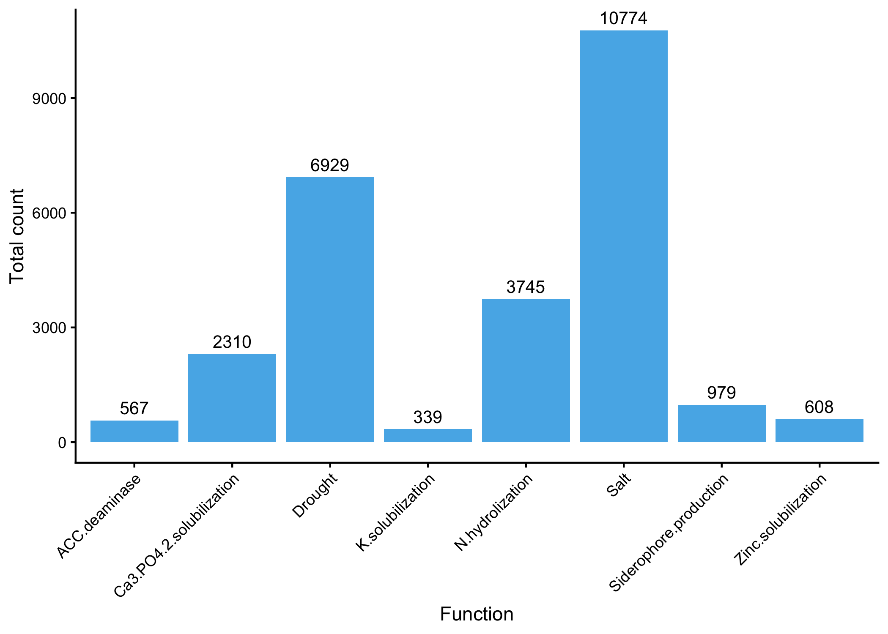
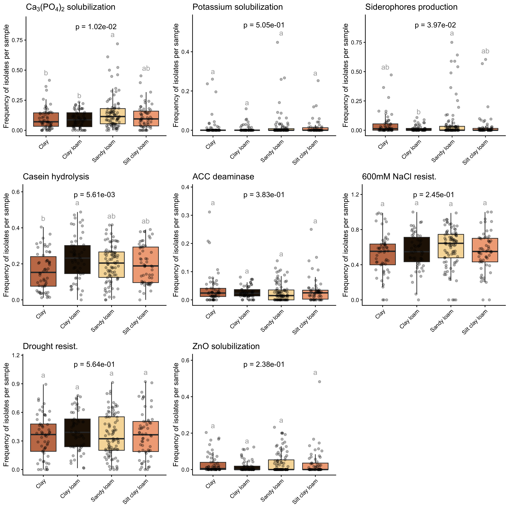
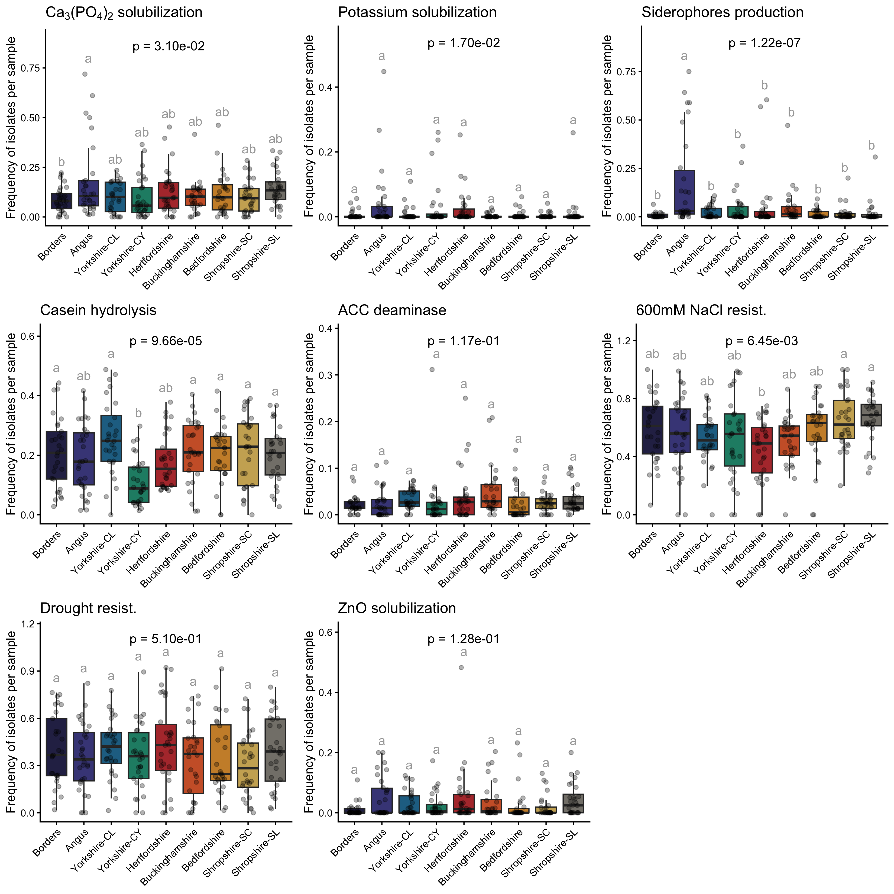
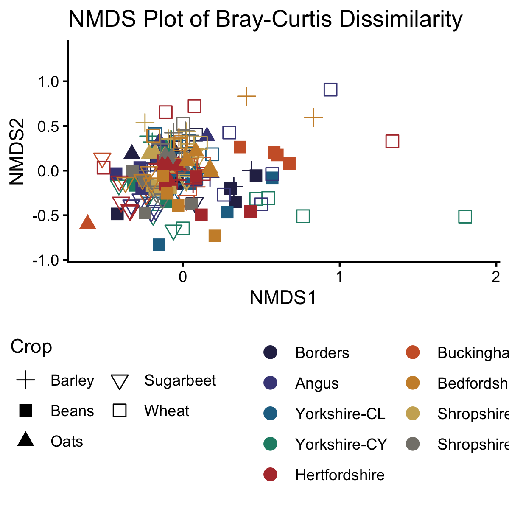
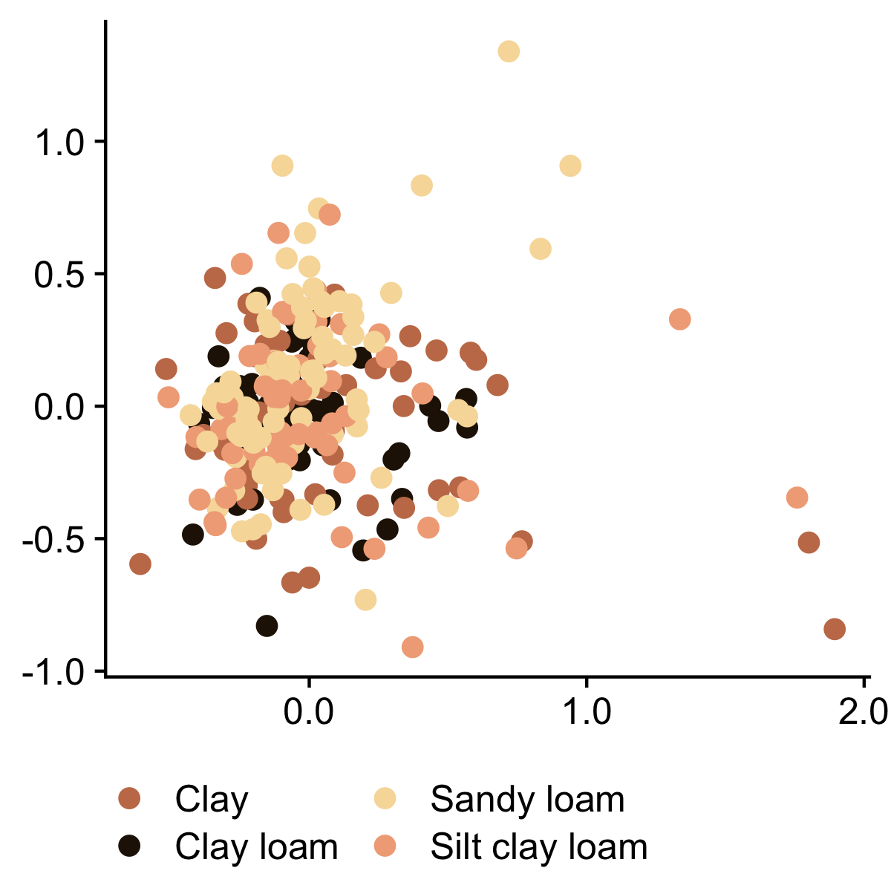
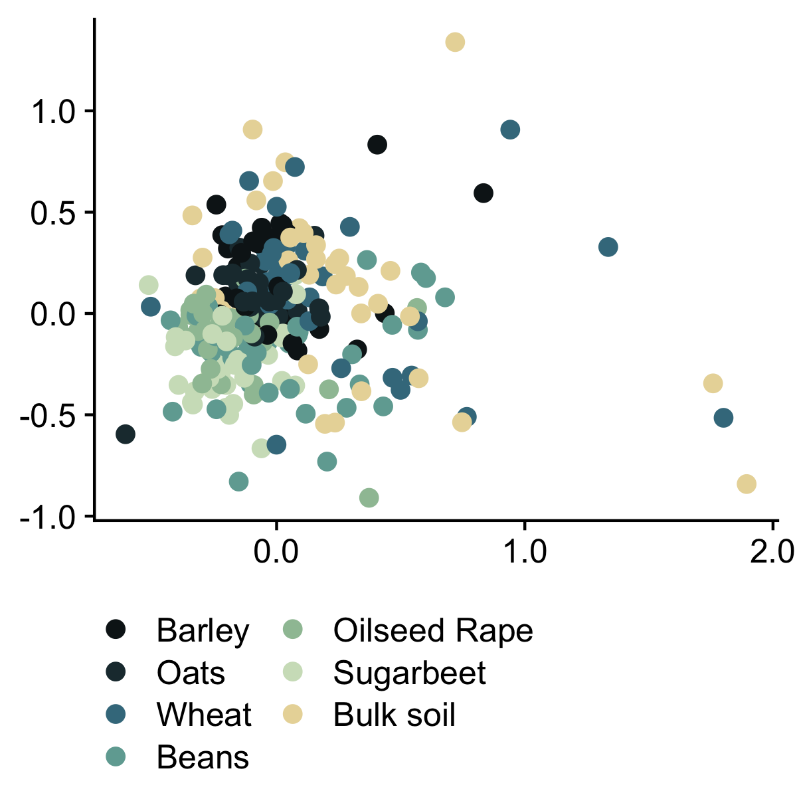
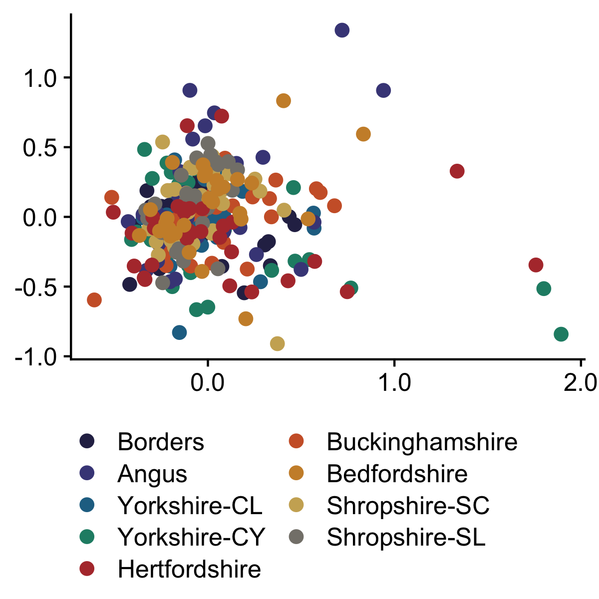
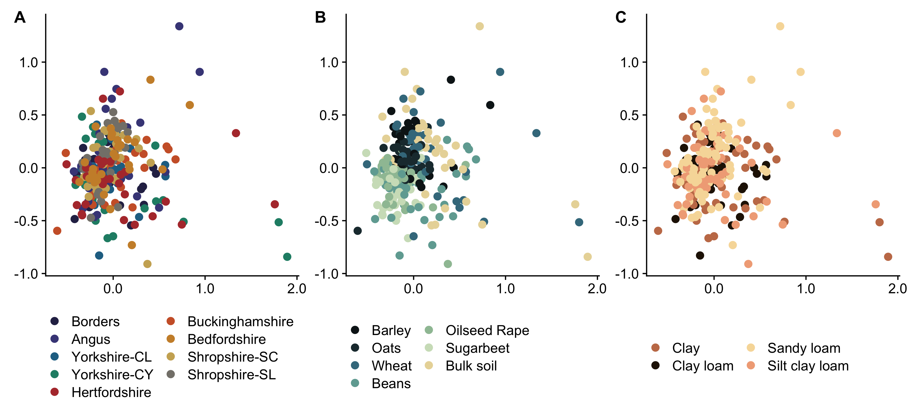

PGPR screening analysis
================
Rodrigo Taketani
2025-09-16

# Analysis of the Functional screening datadata

## Import data

``` r
# Get metadata

sample_data <- readxl::read_excel("./sample.xlsx") # description of the pot experiment metadata

AgMicrobiome_RR <- readxl::read_excel("./AgMicrobiome-RR.xlsx", sheet = "Soils") # Data from the source soils

sample_metadata <- merge(sample_data, AgMicrobiome_RR, by = "Sample name", all.x = TRUE) 

# Make a df with isolate data and metadata

merged_table2 <- read.delim("./isolate_data.tsv") # Import data of the isolates

Huge_table <- merge(merged_table2, sample_metadata, by = "Plate", all.x = TRUE)

# Make a DF with the number of positives per sample

#remove samples that were not tested 

combined_df <- Huge_table[!is.na(Huge_table$TSA),]
combined_df <- Huge_table[Huge_table$TSA %in% c("Yes", "No"), ]


# Check if an isolate is detected in any of the media tested to normalise

columns_to_move <- c("Plate", "Ca3.PO4.2.solubilization",  "K.solubilization", "Siderophore.production", "N.hydrolization", "ACC.deaminase" , "Salt", "Drought", "Zinc.solubilization", "TSA")

# Create a new column 'recovered' with 'Yes' if any of the columns_to_move have 'Yes' in the row
combined_df$recovered <- apply(combined_df[, columns_to_move], 1, function(x) {
  if ("Yes" %in% x) {
    "Yes"
  } else {
    "No"
  }
})

# Create new columns indicating if the isolate has nutrient aquisition characteristics or stress relief.

columns_stress <- c("ACC.deaminase" , "Salt", "Drought")

combined_df$stress <- apply(combined_df[, columns_stress], 1, function(x) {
  if ("Yes" %in% x) {
    "Yes"
  } else {
    "No"
  }
})

columns_nutrient <- c("Ca3.PO4.2.solubilization",  "K.solubilization", "Siderophore.production", "N.hydrolization", "Zinc.solubilization")

combined_df$nutrient <- apply(combined_df[, columns_nutrient], 1, function(x) {
  if ("Yes" %in% x) {
    "Yes"
  } else {
    "No"
  }
})

fun_vec <- columns_to_move[-10]

#Count the number of functions per isolate
combined_df$n_functions <- rowSums(combined_df[fun_vec] == "Yes")
```

Prepare a table with the number of positives per sample

``` r
positive_counts <- data.frame(Plate = unique(combined_df$Plate))


# Loop through each column and count "yes" for each sample

columns_to_move2 <- c("Plate", "Ca3.PO4.2.solubilization",  "K.solubilization", "Siderophore.production", "N.hydrolization", "ACC.deaminase" , "Salt", "Drought", "Zinc.solubilization", "TSA", "recovered", "nutrient", "stress")

for (col in columns_to_move2) {
  positive_counts[col] <- sapply(unique(combined_df$Plate), function(plate) {
    sum(combined_df[combined_df$Plate == plate, col] == "Yes", na.rm = TRUE)
  })
}

positive_counts[1] <- unique(combined_df$Plate)

posit_counts_table <- merge(positive_counts, sample_metadata, by = "Plate", all.x = TRUE)

posit_counts_table_backup <- posit_counts_table

posit_norm_table <- posit_counts_table


# Ensure that the 'recovered' column is numeric
posit_norm_table$recovered <- as.numeric(posit_norm_table$recovered)

# Loop through each column in the vector and normalize the values by the 'recovered' column
posit_norm_table[, columns_to_move[2:10]] <- lapply(posit_norm_table[, columns_to_move[2:10]], function(col) {
  col / posit_norm_table$recovered
})

posit_norm_table$recovered <- NULL
```

## Aesthetic defaults

We will set a labels, colors, and shapes to represent the different
treatments on the plots. This consistency will help with the readability
of the plots.

``` r
# Aestetic parameters

colorvec <- c("AN" = "#005F73",
              "BE"  = "#0A9396",
              "BO" = "#94D2BD",
              "BU" = "#E9D8A6",
              "HE" = "#EE9B00",
              "SH" = "#CA6702",
              "YO" = "#BB3E03",
              "CL" = "#251605",
              "CY" = "#c57b57",
              "SC" = "#f1ab86",
              "SL" = "#f7dba7",
              "Barley" = "#0e181b", 
              "Oats" = "#1f363d", 
              "Wheat" = "#40798c", 
              "Beans" = "#70a9a1", 
              "OilseedRape" = "#9ec1a3", 
              "OSR" = "#9ec1a3", 
              "Sugarbeet" = "#cfe0c3", 
              "Bulksoil" = "#E9D8A6",
              "Bulk" = "#E9D8A6",
              "CL" = "#251605",
              "CY" = "#c57b57",
              "SC" = "#f1ab86",
              "SL" = "#f7dba7",
              "Clay loam" = "#251605",
              "Clay" = "#c57b57",
              "Silty clay loam" = "#f1ab86",
              "Sandy loam" = "#f7dba7",
              "CL.BO" = "#2c2c54",
              "SL.AN" = "#474787",
              "CL.YO" = "#227093",
              "CY.YO" = "#218c74",
              "SC.HE" = "#b33939",
              "CY.BU" = "#cd6133",
              "SL.BE" = "#cc8e35",
              "SC.SH" = "#ccae62",
              "SL.SH" = "#84817a"
              )

shapesvec <- c("Barley" = 3, "Beans" = 15, 
               "Bulksoil" = 16, "Oats" = 17, 
               "OilseedRape" = 18, "Sugarbeet" = 25, 
               "Wheat" = 0,
               "AN" = 3, "BE" = 15, 
               "BO" = 16, "BU" = 17, 
               "HE" = 18, "SH" = 25, 
               "YO" = 0)

labelsvec <- c("AN" = "Angus",
              "BE"  = "Bedfordshire",
              "BO" = "Borders",
              "BU" = "Buckinghamshire",
              "HE" = "Hertfordshire",
              "SH" = "Shropshire",
              "YO" = "Yorkshire",
              "Barley" = "Barley",
              "Beans" = "Beans", 
              "Bulksoil" = "Bulk soil",
              "Bulk" = "Bulk soil",
              "Oats" = "Oats", 
              "OilseedRape" = "Oilseed Rape", 
              "OSR" = "Oilseed Rape",
              "Sugarbeet" = "Sugarbeet", 
              "Wheat" = "Wheat",
              "CL" = "Clay loam",
              "CY" = "Clay",
              "SC" = "Silt clay loam",
              "SL" = "Sandy loam",
              "Clay loam" = "Clay loam",
              "Clay" = "Clay",
              "Silty clay loam" = "Silt clay loam",
              "Sandy loam" = "Sandy loam",
              "CL.BO" = "Borders",
              "CL.YO" = "Yorkshire-CL",
              "CY.BU" = "Buckinghamshire",
              "CY.YO" = "Yorkshire-CY",
              "SC.HE" = "Hertfordshire",
              "SC.SH" = "Shropshire-SC",
              "SL.AN" = "Angus",
              "SL.BE" = "Bedfordshire",
              "SL.SH" = "Shropshire-SL"
              )

crop_order = c("Barley", "Oats", "Wheat", "Beans", "OSR", "Sugarbeet", "Bulk")

local_order = c("CL.BO", "SL.AN", "CL.YO", "CY.YO", "SC.HE", "CY.BU", "SL.BE", "SC.SH", "SL.SH")

funct_labs <- c("Ca3.PO4.2.solubilization" = expression("Ca"[3]*"(PO"[4]*")"[2]*" solubilization"),
                 "K.solubilization" = "Potassium solubilization",
                 "Siderophore.production" = "Siderophores production",
                 "Zinc.solubilization" = "ZnO solubilization",
                 "N.hydrolization" = "Casein hydrolysis",
                  "ACC.deaminase" = "ACC deaminase",
                  "Salt" = "600mM NaCl resist.",
                  "Drought"= "Drought resist.")

# for convinience, let's rename some of the columns

library(dplyr)
```

    ## 
    ## Attaching package: 'dplyr'

    ## The following objects are masked from 'package:stats':
    ## 
    ##     filter, lag

    ## The following objects are masked from 'package:base':
    ## 
    ##     intersect, setdiff, setequal, union

``` r
# Renaming a specific column by specifying the old and new column names
posit_counts_table <- posit_counts_table %>% rename(soil = `Textural class`)
posit_counts_table <- posit_counts_table %>% rename(Location = `Soil Id`)

posit_norm_table <- posit_norm_table %>% rename(soil = `Textural class`)
posit_norm_table <- posit_norm_table %>% rename(Location = `Soil Id`)

posit_counts_table$Location <- gsub("-", ".", posit_counts_table$Location)
posit_norm_table$Location <- gsub("-", ".", posit_norm_table$Location)
```

# Data analysis.

## number of positives

``` r
### Make a plot with total positive isolates

library(ggplot2)
library(dplyr)
library(tidyr)
library(RColorBrewer)

columns_to_plot <- c("Ca3.PO4.2.solubilization",  "K.solubilization", "Siderophore.production", "N.hydrolization", "ACC.deaminase" , "Salt", "Drought", "Zinc.solubilization")

sum_df <- posit_counts_table %>%
  summarise(across(all_of(columns_to_plot), sum))

# Convert the summary data frame to a format suitable for ggplot
sum_df <- pivot_longer(sum_df, everything(), names_to = "Column", values_to = "Sum")

# Create the barplot
ggplot(sum_df, aes(x = Column, y = Sum)) +
  geom_bar(stat = "identity", fill = "#56B4E9") +
  geom_text(aes(label = Sum), vjust = -0.5, size = 3.5) +
  labs(x = "Function", y = "Total count")+
  theme_classic()+
  theme(axis.text.x = element_text(angle = 45, hjust = 1))
```

<!-- -->

``` r
# separate by cluster

sum_df <- posit_counts_table %>%
  group_by(soil) %>%
  summarise(across(all_of(columns_to_plot), sum))

# Convert the summary data frame to a long format for ggplot
sum_df_long <- pivot_longer(sum_df, -soil, names_to = "Column", values_to = "Sum")

# Create the stacked barplot
ggplot(sum_df_long, aes(x = Column, y = Sum, fill = soil)) +
  geom_bar(stat = "identity") +
  labs(x = "Function", y = "Total count") +
  theme_classic()+
  theme(axis.text.x = element_text(angle = 45, hjust = 1)) +  # Rotating x-axis labels for readability
  scale_fill_manual(values = colorvec, name = NULL) +
                        scale_x_discrete(labels = labelsvec)  # Set color palette for segments
```

<!-- -->

``` r
# separate by Crop

sum_df <- posit_counts_table %>%
  group_by(Crop) %>%
  summarise(across(all_of(columns_to_plot), sum))

# Convert the summary data frame to a long format for ggplot
sum_df_long <- pivot_longer(sum_df, -Crop, names_to = "Column", values_to = "Sum")

# Create the stacked barplot
ggplot(sum_df_long, aes(x = Column, y = Sum, fill = Crop)) +
  geom_bar(stat = "identity") +
  labs(x = "Function", y = "Total count") +
  theme_classic()+
  theme(axis.text.x = element_text(angle = 45, hjust = 1)) +  # Rotating x-axis labels for readability
  scale_fill_manual(values = colorvec, name = NULL, labels = labelsvec, limits = crop_order) 
```

<!-- -->

``` r
                         # Set color palette for segments

# separate by Site
sum_df <- posit_counts_table %>%
  group_by(Location) %>%
  summarise(across(all_of(columns_to_plot), sum))

# Convert the summary data frame to a long format for ggplot
sum_df_long <- pivot_longer(sum_df, -Location, names_to = "Column", values_to = "Sum")

# Create the stacked barplot
ggplot(sum_df_long, aes(x = Column, y = Sum, fill = Location)) +
  geom_bar(stat = "identity") +
  labs(x = "Function", y = "Total count") +
  theme_classic()+
  theme(axis.text.x = element_text(angle = 45, hjust = 1)) +  # Rotating x-axis labels for readability
  scale_fill_manual(values = colorvec, name = NULL, labels = labelsvec, limits = local_order) 
```

<!-- -->

``` r
library(tidyverse)
```

    ## ── Attaching core tidyverse packages ──────────────────────── tidyverse 2.0.0 ──
    ## ✔ forcats   1.0.0     ✔ readr     2.1.5
    ## ✔ lubridate 1.9.4     ✔ stringr   1.5.1
    ## ✔ purrr     1.0.4     ✔ tibble    3.2.1
    ## ── Conflicts ────────────────────────────────────────── tidyverse_conflicts() ──
    ## ✖ dplyr::filter() masks stats::filter()
    ## ✖ dplyr::lag()    masks stats::lag()
    ## ℹ Use the conflicted package (<http://conflicted.r-lib.org/>) to force all conflicts to become errors

``` r
library(ggplot2)
library(multcompView)
library(ggpubr)

posit_counts_table <- posit_norm_table

# Quick Shapiro-Wilk test to check for normality

results <- lapply(columns_to_plot, function(col) {
  shapiro.test(posit_counts_table[[col]])$p.value
})

# Assign column names to results
names(results) <- columns_to_plot

# Print results
results
```

    ## $Ca3.PO4.2.solubilization
    ## [1] 5.126932e-16
    ## 
    ## $K.solubilization
    ## [1] 2.383592e-29
    ## 
    ## $Siderophore.production
    ## [1] 6.237854e-28
    ## 
    ## $N.hydrolization
    ## [1] 0.001088459
    ## 
    ## $ACC.deaminase
    ## [1] 2.587101e-21
    ## 
    ## $Salt
    ## [1] 0.0006003297
    ## 
    ## $Drought
    ## [1] 0.0003627702
    ## 
    ## $Zinc.solubilization
    ## [1] 1.15735e-23

``` r
#Compare by Texture Cluster
cluster_list <- list()

for (col in columns_to_plot) {
  # Analysis of variance
  my_formula <- as.formula(paste0("posit_counts_table$\"", col, "\" ~ soil"))
  anova_result <- aov(formula = my_formula, data = posit_counts_table)
  anova_summary <- summary(anova_result)
  p_value <- anova_summary[[1]][["Pr(>F)"]][1]  # Extract p-value
  p_value_text <- paste0("p = ", formatC(p_value, format = "e", digits = 2))
  
  # Tukey's test
  tukey_result <- TukeyHSD(anova_result)
  
  # Compact letter display
  cld_result <- multcompLetters4(anova_result, tukey_result)
  
  # Create a summary table
  dt <- posit_counts_table %>%
    group_by(soil) %>%
    summarise(w = mean(.data[[col]]), sd = sd(.data[[col]]), max = max(.data[[col]])) %>%
    arrange(desc(w))
  
  # Extracting the compact letter display and adding it to the table
  cld <- as.data.frame.list(cld_result$soil)
  dt$cld <- cld$Letters
  
  # Create a bar plot
  p <- ggplot(posit_counts_table, aes(x = soil, y = .data[[col]], fill = soil)) +
    geom_boxplot(show.legend = FALSE, outlier.shape = NA) +
    geom_jitter(show.legend = FALSE, width = 0.2, alpha = 0.3) +  # Add jitter
    labs(title = funct_labs[[col]], x = "Sample", y = "Count of Positives") +
    scale_fill_manual(values = colorvec, name = NULL, labels = labelsvec) +
    scale_x_discrete(labels = labelsvec) +
    labs(x = element_blank(), y = "Frequency of isolates per sample") +
    geom_text(data = dt, aes(label = cld, y = max * 1.05), color = "darkgray", vjust = -0.5, size = 4) +
    theme_classic() +
    theme(axis.text.x = element_text(angle = 45, hjust = 1)) +
    annotate("text", x = 2.5, y = max(dt$max) * 1.2, label = p_value_text, size = 4) +
    coord_cartesian(ylim = c(0, max(dt$max) * 1.25))
  
  cluster_list[[col]] <- p
}

# Arrange the plots
gridExtra::grid.arrange(grobs = cluster_list)
```

    ## Warning: `label` cannot be a <ggplot2::element_blank> object.
    ## `label` cannot be a <ggplot2::element_blank> object.
    ## `label` cannot be a <ggplot2::element_blank> object.
    ## `label` cannot be a <ggplot2::element_blank> object.
    ## `label` cannot be a <ggplot2::element_blank> object.
    ## `label` cannot be a <ggplot2::element_blank> object.
    ## `label` cannot be a <ggplot2::element_blank> object.
    ## `label` cannot be a <ggplot2::element_blank> object.



``` r
cluster_list_box_soils <- cluster_list


cluster_list <- list()

for (col in columns_to_plot) {
  # Analysis of variance
  my_formula <- as.formula(paste0("posit_counts_table$\"", col, "\" ~ Crop"))
  anova_result <- aov(formula = my_formula, data = posit_counts_table)
  anova_summary <- summary(anova_result)
  p_value <- anova_summary[[1]][["Pr(>F)"]][1]  # Extract p-value
  p_value_text <- paste0("p = ", formatC(p_value, format = "e", digits = 2))
  
  # Tukey's test
  tukey_result <- TukeyHSD(anova_result)
  
  # Compact letter display
  cld_result <- multcompLetters4(anova_result, tukey_result)
  
  # Create a summary table
  dt <- posit_counts_table %>%
    group_by(Crop) %>%
    summarise(w = mean(.data[[col]]), sd = sd(.data[[col]]), max = max(.data[[col]])) %>%
    arrange(desc(w))
  
  # Extracting the compact letter display and adding it to the table
  cld <- as.data.frame.list(cld_result$Crop)
  dt$cld <- cld$Letters
  
  # Create a bar plot
  p <- ggplot(posit_counts_table, aes(x = Crop, y = .data[[col]], fill = Crop)) +
    geom_boxplot(show.legend = FALSE, outlier.shape = NA) +
    geom_jitter(show.legend = FALSE, width = 0.2, alpha = 0.3) +  # Add jitter
    labs(title = funct_labs[[col]], x = "Sample", y = "Count of Positives") +
    scale_fill_manual(values = colorvec, name = NULL, labels = labelsvec, limits = crop_order) +
    scale_x_discrete(labels = labelsvec, limits = crop_order) +
    labs(x = element_blank(), y = "Frequency of isolates per sample") +
    geom_text(data = dt, aes(label = cld, y = max * 1.05), color = "darkgray", vjust = -0.5, size = 4) +
    theme_classic() +
    theme(axis.text.x = element_text(angle = 45, hjust = 1)) +
    annotate("text", x = 4, y = max(dt$max) * 1.2, label = p_value_text, size = 4) +
    coord_cartesian(ylim = c(0, max(dt$max) * 1.25))
  
  cluster_list[[col]] <- p
}

# Arrange the plots
gridExtra::grid.arrange(grobs = cluster_list)
```

    ## Warning: `label` cannot be a <ggplot2::element_blank> object.
    ## `label` cannot be a <ggplot2::element_blank> object.
    ## `label` cannot be a <ggplot2::element_blank> object.
    ## `label` cannot be a <ggplot2::element_blank> object.
    ## `label` cannot be a <ggplot2::element_blank> object.
    ## `label` cannot be a <ggplot2::element_blank> object.
    ## `label` cannot be a <ggplot2::element_blank> object.
    ## `label` cannot be a <ggplot2::element_blank> object.


``` r
cluster_list_box_crops <- cluster_list


cluster_list <- list()

for (col in columns_to_plot) {
  # Analysis of variance
  my_formula <- as.formula(paste0("posit_counts_table$\"", col, "\" ~ Location"))
  anova_result <- aov(formula = my_formula, data = posit_counts_table)
  anova_summary <- summary(anova_result)
  p_value <- anova_summary[[1]][["Pr(>F)"]][1]  # Extract p-value
  p_value_text <- paste0("p = ", formatC(p_value, format = "e", digits = 2))
  
  # Tukey's test
  tukey_result <- TukeyHSD(anova_result)
  
  # Compact letter display
  cld_result <- multcompLetters4(anova_result, tukey_result)
  
  # Create a summary table
  dt <- posit_counts_table %>%
    group_by(Location) %>%
    summarise(w = mean(.data[[col]]), sd = sd(.data[[col]]), max = max(.data[[col]])) %>%
    arrange(desc(w))
  
  # Extracting the compact letter display and adding it to the table
  cld <- as.data.frame.list(cld_result$Location)
  dt$cld <- cld$Letters
  
  # Create a bar plot
  p <- ggplot(posit_counts_table, aes(x = Location, y = .data[[col]], fill = Location)) +
    geom_boxplot(show.legend = FALSE, outlier.shape = NA) +
    geom_jitter(show.legend = FALSE, width = 0.2, alpha = 0.3) +  # Add jitter
    labs(title = funct_labs[[col]], x = "Sample", y = "Count of Positives") +
    scale_fill_manual(values = colorvec, name = NULL, labels = labelsvec, limits = local_order) +
    scale_x_discrete(labels = labelsvec, limits = local_order) +
    labs(x = element_blank(), y = "Frequency of isolates per sample") +
    geom_text(data = dt, aes(label = cld, y = max * 1.05), color = "darkgray", vjust = -0.5, size = 4) +
    theme_classic() +
    theme(axis.text.x = element_text(angle = 45, hjust = 1)) +
    annotate("text", x = 5, y = max(dt$max) * 1.2, label = p_value_text, size = 4) +
    coord_cartesian(ylim = c(0, max(dt$max) * 1.25))
  
  cluster_list[[col]] <- p
}

# Arrange the plots
gridExtra::grid.arrange(grobs = cluster_list)
```

    ## Warning: `label` cannot be a <ggplot2::element_blank> object.
    ## `label` cannot be a <ggplot2::element_blank> object.
    ## `label` cannot be a <ggplot2::element_blank> object.
    ## `label` cannot be a <ggplot2::element_blank> object.
    ## `label` cannot be a <ggplot2::element_blank> object.
    ## `label` cannot be a <ggplot2::element_blank> object.
    ## `label` cannot be a <ggplot2::element_blank> object.
    ## `label` cannot be a <ggplot2::element_blank> object.



``` r
cluster_list_box_locations <- cluster_list
```

``` r
## PCoA 

library(vegan)
```

    ## Loading required package: permute

    ## Loading required package: lattice

    ## This is vegan 2.6-8

``` r
your_data <- posit_counts_table[,2:9]
row.names(your_data) <- posit_counts_table$Plate


# Replace 'your_data' with your actual data frame
bray_curtis_matrix <- vegdist(your_data, method = "bray")
bray_curtis_matrix_fun <- bray_curtis_matrix

save(posit_counts_table, posit_norm_table, combined_df, Huge_table, file = "../Comparisons/functional.RData") # save for future comparisons
library(vegan)
library(ggplot2)
library(RColorBrewer)
library(scales)
```

    ## 
    ## Attaching package: 'scales'

    ## The following object is masked from 'package:purrr':
    ## 
    ##     discard

    ## The following object is masked from 'package:readr':
    ## 
    ##     col_factor

``` r
# Run NMDS using Bray-Curtis dissimilarity
nmds_result <- metaMDS(bray_curtis_matrix, k = 2, trymax = 100)
```

    ## Run 0 stress 0.1764414 
    ## Run 1 stress 0.1780764 
    ## Run 2 stress 0.1764404 
    ## ... New best solution
    ## ... Procrustes: rmse 0.0002371512  max resid 0.003085724 
    ## ... Similar to previous best
    ## Run 3 stress 0.1762892 
    ## ... New best solution
    ## ... Procrustes: rmse 0.009432103  max resid 0.1278895 
    ## Run 4 stress 0.1785435 
    ## Run 5 stress 0.1792306 
    ## Run 6 stress 0.1764418 
    ## ... Procrustes: rmse 0.009588752  max resid 0.1286317 
    ## Run 7 stress 0.1835386 
    ## Run 8 stress 0.1821611 
    ## Run 9 stress 0.1764433 
    ## ... Procrustes: rmse 0.009560978  max resid 0.1286402 
    ## Run 10 stress 0.1813301 
    ## Run 11 stress 0.1774453 
    ## Run 12 stress 0.1881173 
    ## Run 13 stress 0.1764409 
    ## ... Procrustes: rmse 0.009465132  max resid 0.1277741 
    ## Run 14 stress 0.1928684 
    ## Run 15 stress 0.1764336 
    ## ... Procrustes: rmse 0.009545955  max resid 0.128426 
    ## Run 16 stress 0.1764008 
    ## ... Procrustes: rmse 0.004378569  max resid 0.0441121 
    ## Run 17 stress 0.1899149 
    ## Run 18 stress 0.17649 
    ## ... Procrustes: rmse 0.01003729  max resid 0.1290934 
    ## Run 19 stress 0.1855325 
    ## Run 20 stress 0.1766897 
    ## ... Procrustes: rmse 0.006148425  max resid 0.0735826 
    ## Run 21 stress 0.186798 
    ## Run 22 stress 0.1763456 
    ## ... Procrustes: rmse 0.002227561  max resid 0.03046127 
    ## Run 23 stress 0.176402 
    ## ... Procrustes: rmse 0.00450099  max resid 0.04417916 
    ## Run 24 stress 0.1764423 
    ## ... Procrustes: rmse 0.009633832  max resid 0.1289088 
    ## Run 25 stress 0.2148677 
    ## Run 26 stress 0.1931186 
    ## Run 27 stress 0.182225 
    ## Run 28 stress 0.1782332 
    ## Run 29 stress 0.1859731 
    ## Run 30 stress 0.1762746 
    ## ... New best solution
    ## ... Procrustes: rmse 0.00800633  max resid 0.1238179 
    ## Run 31 stress 0.1824071 
    ## Run 32 stress 0.1762746 
    ## ... New best solution
    ## ... Procrustes: rmse 0.0001935903  max resid 0.001615151 
    ## ... Similar to previous best
    ## *** Best solution repeated 1 times

``` r
nmds_result$stress
```

    ## [1] 0.1762746

``` r
# Extract NMDS coordinates
nmds_df <- data.frame(
  NMDS1 = nmds_result$points[, 1],
  NMDS2 = nmds_result$points[, 2]
)
nmds_df$Site <- posit_counts_table$Location
nmds_df$Crop <- posit_counts_table$Crop
nmds_df$Cluster <- posit_counts_table$soil

# Plot NMDS results
p <- ggplot(nmds_df, aes(x = NMDS1, y = NMDS2, color = Site, shape = Crop)) +
  geom_point(size = 3) +
  scale_shape_manual(values = shapesvec) +
  labs(x = "NMDS1", y = "NMDS2") +
  ggtitle("NMDS Plot of Bray-Curtis Dissimilarity") +
  theme_classic() +
  scale_color_manual(values = colorvec, name = NULL, labels = labelsvec, limits = local_order) +
  theme(legend.direction = "horizontal") +
  guides(color = guide_legend(ncol = 2),
         shape = guide_legend(ncol = 2))+
  theme(legend.position = 'bottom',
        legend.direction = "vertical")+
  guides(color=guide_legend(ncol=2))

print(p)
```

    ## Warning: Removed 75 rows containing missing values or values outside the scale range
    ## (`geom_point()`).



``` r
q <- ggplot(nmds_df, aes(x = NMDS1, y = NMDS2, color = Cluster)) +
  geom_point(size = 2.5) +
  labs(x = "NMDS1", y = "NMDS2") +
  #ggtitle("NMDS colored by soil type") +
  cowplot::theme_cowplot()+
  scale_x_continuous(labels = label_number(accuracy = 0.1)) +
  scale_y_continuous(labels = label_number(accuracy = 0.1)) +
  scale_color_manual(values = colorvec, name = NULL, labels = labelsvec)+
  theme(legend.position = 'bottom',
        legend.direction = "vertical",
        axis.title = element_blank())+
  guides(color=guide_legend(ncol=2))


print(q)
```



``` r
r <- ggplot(nmds_df, aes(x = NMDS1, y = NMDS2, color = Crop)) +
  geom_point(size = 2.5) +
  labs(x = "NMDS1", y = "NMDS2") +
  #ggtitle("NMDS colored by Crop") +
  cowplot::theme_cowplot()+
  scale_x_continuous(labels = label_number(accuracy = 0.1)) +
  scale_y_continuous(labels = label_number(accuracy = 0.1)) +
  scale_color_manual(values = colorvec, name = NULL, labels = labelsvec, limits = crop_order)+
  theme(legend.position = 'bottom',
        legend.direction = "vertical",
        axis.title = element_blank()) +
  guides(color=guide_legend(ncol=2))


print(r)
```



``` r
s <- ggplot(nmds_df, aes(x = NMDS1, y = NMDS2, color = Site)) +
  geom_point(size = 2.5) +
  labs(x = "NMDS1", y = "NMDS2") +
  #ggtitle("NMDS colored by location") +
  cowplot::theme_cowplot()+
  scale_x_continuous(labels = label_number(accuracy = 0.1)) +
  scale_y_continuous(labels = label_number(accuracy = 0.1)) +
  scale_color_manual(values = colorvec, name = NULL, labels = labelsvec, limits = local_order) +
  theme(legend.position = 'bottom',
        legend.direction = "vertical",
        axis.title = element_blank()) +
  guides(color=guide_legend(ncol=2))


print(s)
```



``` r
# Calculate the size of the first plot to match the combined size of the other two
library(patchwork)

s + r + q + plot_annotation(tag_levels = 'A')
```



``` r
nmds_func <- (r +s +  q)
```

``` r
## repeat the plots q and r adding the centroids of the groups

library(dplyr)
library(ggplot2)

pcoa_result <- cmdscale(bray_curtis_matrix)

pcoa_df <- data.frame(
  PC1 = pcoa_result[, 1],
  PC2 = pcoa_result[, 2]
)
pcoa_df$Site <- posit_counts_table$Location
pcoa_df$Crop <- posit_counts_table$Crop
pcoa_df$Cluster <- posit_counts_table$soil
```

# PERMANOVA

``` r
library(pairwiseAdonis)
```

    ## Loading required package: cluster

``` r
permanova_soil <- vegan::adonis2(bray_curtis_matrix ~ pcoa_df$Cluster)
permanova_crop <- vegan::adonis2(bray_curtis_matrix ~ pcoa_df$Crop)
permanova_local <- vegan::adonis2(bray_curtis_matrix ~ pcoa_df$Site)

knitr::kable(as.data.frame(permanova_soil), digits = 4, caption = "PERMANOVA soil results")
```

|          |  Df | SumOfSqs |     R2 |      F | Pr(\>F) |
|:---------|----:|---------:|-------:|-------:|--------:|
| Model    |   3 |   0.3987 | 0.0202 | 1.7532 |   0.036 |
| Residual | 255 |  19.3281 | 0.9798 |     NA |      NA |
| Total    | 258 |  19.7268 | 1.0000 |     NA |      NA |

PERMANOVA soil results

``` r
knitr::kable(as.data.frame(permanova_crop), digits = 4, caption = "PERMANOVA crop results")
```

|          |  Df | SumOfSqs |     R2 |       F | Pr(\>F) |
|:---------|----:|---------:|-------:|--------:|--------:|
| Model    |   6 |   4.3743 | 0.2217 | 11.9667 |   0.001 |
| Residual | 252 |  15.3525 | 0.7783 |      NA |      NA |
| Total    | 258 |  19.7268 | 1.0000 |      NA |      NA |

PERMANOVA crop results

``` r
knitr::kable(as.data.frame(permanova_local), digits = 4, caption = "PERMANOVA location results")
```

|          |  Df | SumOfSqs |     R2 |      F | Pr(\>F) |
|:---------|----:|---------:|-------:|-------:|--------:|
| Model    |   8 |   1.3170 | 0.0668 | 2.2356 |   0.001 |
| Residual | 250 |  18.4098 | 0.9332 |     NA |      NA |
| Total    | 258 |  19.7268 | 1.0000 |     NA |      NA |

PERMANOVA location results

# Pairwise PERMANOVA

``` r
library(pairwiseAdonis)

pairwise.adonis(bray_curtis_matrix, pcoa_df$Cluster)
```

    ##                           pairs Df  SumsOfSqs   F.Model          R2 p.value
    ## 1             Clay loam vs Clay  1 0.16403167 2.2135582 0.019212654   0.049
    ## 2       Clay loam vs Sandy loam  1 0.18988488 2.9537468 0.020518722   0.019
    ## 3  Clay loam vs Silty clay loam  1 0.05402700 0.7933580 0.006971919   0.591
    ## 4            Clay vs Sandy loam  1 0.22758732 2.7780939 0.019188634   0.017
    ## 5       Clay vs Silty clay loam  1 0.02978465 0.3308179 0.002893515   0.885
    ## 6 Sandy loam vs Silty clay loam  1 0.10274054 1.3317974 0.009291710   0.253
    ##   p.adjusted sig
    ## 1      0.294    
    ## 2      0.114    
    ## 3      1.000    
    ## 4      0.102    
    ## 5      1.000    
    ## 6      1.000

``` r
pairwise.adonis(bray_curtis_matrix, pcoa_df$Crop)
```

    ##                  pairs Df SumsOfSqs   F.Model         R2 p.value p.adjusted sig
    ## 1      Barley vs Beans  1 0.7427921 12.400957 0.14869083   0.001      0.021   .
    ## 2       Barley vs Bulk  1 0.4096443  4.816374 0.06189409   0.001      0.021   .
    ## 3       Barley vs Oats  1 0.2030935  5.349014 0.07098984   0.003      0.063    
    ## 4        Barley vs OSR  1 0.7410985 17.417214 0.19924238   0.001      0.021   .
    ## 5  Barley vs Sugarbeet  1 1.2672775 31.243053 0.30859454   0.001      0.021   .
    ## 6      Barley vs Wheat  1 0.2761753  3.798543 0.04946113   0.003      0.063    
    ## 7        Beans vs Bulk  1 0.8855519  9.490727 0.11367402   0.001      0.021   .
    ## 8        Beans vs Oats  1 0.7225195 15.296282 0.17725308   0.001      0.021   .
    ## 9         Beans vs OSR  1 0.4015103  7.758380 0.09850863   0.001      0.021   .
    ## 10  Beans vs Sugarbeet  1 0.4283318  8.602433 0.10806747   0.001      0.021   .
    ## 11      Beans vs Wheat  1 0.8871340 10.935118 0.12874672   0.001      0.021   .
    ## 12        Bulk vs Oats  1 0.5420221  7.451871 0.09262521   0.001      0.021   .
    ## 13         Bulk vs OSR  1 1.1374762 14.747620 0.16806861   0.001      0.021   .
    ## 14   Bulk vs Sugarbeet  1 1.4250620 18.944425 0.20604213   0.001      0.021   .
    ## 15       Bulk vs Wheat  1 0.1614466  1.541552 0.01988033   0.172      1.000    
    ## 16         Oats vs OSR  1 0.5063738 17.046245 0.19582976   0.001      0.021   .
    ## 17   Oats vs Sugarbeet  1 1.0309253 37.193338 0.34697434   0.001      0.021   .
    ## 18       Oats vs Wheat  1 0.5659850  9.372237 0.11377908   0.001      0.021   .
    ## 19    OSR vs Sugarbeet  1 0.1921824  5.950032 0.07834141   0.001      0.021   .
    ## 20        OSR vs Wheat  1 1.2118015 18.705655 0.20397493   0.001      0.021   .
    ## 21  Sugarbeet vs Wheat  1 1.5561109 24.748709 0.25318707   0.001      0.021   .

``` r
pairwise.adonis(bray_curtis_matrix, pcoa_df$Site)
```

    ##             pairs Df  SumsOfSqs   F.Model         R2 p.value p.adjusted sig
    ## 1  CL.BO vs CY.YO  1 0.19197537 2.2018852 0.03719282   0.053      1.000    
    ## 2  CL.BO vs CL.YO  1 0.08029842 1.5648661 0.02766498   0.186      1.000    
    ## 3  CL.BO vs CY.BU  1 0.09261627 1.5267771 0.02700980   0.210      1.000    
    ## 4  CL.BO vs SL.AN  1 0.28610824 3.7126141 0.06115062   0.008      0.288    
    ## 5  CL.BO vs SC.SH  1 0.04889540 0.8917382 0.01595474   0.465      1.000    
    ## 6  CL.BO vs SL.SH  1 0.08336418 1.6899257 0.02980998   0.158      1.000    
    ## 7  CL.BO vs SC.HE  1 0.18628558 2.3560079 0.03969283   0.041      1.000    
    ## 8  CL.BO vs SL.BE  1 0.04498811 0.7356358 0.01319866   0.591      1.000    
    ## 9  CY.YO vs CL.YO  1 0.30292427 3.5850885 0.06016755   0.003      0.108    
    ## 10 CY.YO vs CY.BU  1 0.22523375 2.4043734 0.04116770   0.028      1.000    
    ## 11 CY.YO vs SL.AN  1 0.29015986 2.6703967 0.04401482   0.027      0.972    
    ## 12 CY.YO vs SC.SH  1 0.28112851 3.1964196 0.05399684   0.007      0.252    
    ## 13 CY.YO vs SL.SH  1 0.30248955 3.6644155 0.06141710   0.004      0.144    
    ## 14 CY.YO vs SC.HE  1 0.15032416 1.3588268 0.02289174   0.239      1.000    
    ## 15 CY.YO vs SL.BE  1 0.26939563 2.8609807 0.04860573   0.006      0.216    
    ## 16 CL.YO vs CY.BU  1 0.03899987 0.6796866 0.01243033   0.576      1.000    
    ## 17 CL.YO vs SL.AN  1 0.21656808 2.9190278 0.04954304   0.034      1.000    
    ## 18 CL.YO vs SC.SH  1 0.13390799 2.6031115 0.04598884   0.033      1.000    
    ## 19 CL.YO vs SL.SH  1 0.15756897 3.4375069 0.05984777   0.010      0.360    
    ## 20 CL.YO vs SC.HE  1 0.14505730 1.9028364 0.03286258   0.076      1.000    
    ## 21 CL.YO vs SL.BE  1 0.08195529 1.4158914 0.02555028   0.229      1.000    
    ## 22 CY.BU vs SL.AN  1 0.13138230 1.5758389 0.02736979   0.167      1.000    
    ## 23 CY.BU vs SC.SH  1 0.07971616 1.3076235 0.02364274   0.279      1.000    
    ## 24 CY.BU vs SL.SH  1 0.12920718 2.3339756 0.04143105   0.079      1.000    
    ## 25 CY.BU vs SC.HE  1 0.10136866 1.1868030 0.02075309   0.329      1.000    
    ## 26 CY.BU vs SL.BE  1 0.05539642 0.8218616 0.01499149   0.533      1.000    
    ## 27 SL.AN vs SC.SH  1 0.23019788 2.9646605 0.05027860   0.028      1.000    
    ## 28 SL.AN vs SL.SH  1 0.17853636 2.4712945 0.04226509   0.057      1.000    
    ## 29 SL.AN vs SC.HE  1 0.22283156 2.2132779 0.03675731   0.073      1.000    
    ## 30 SL.AN vs SL.BE  1 0.20339043 2.4254083 0.04151290   0.059      1.000    
    ## 31 SC.SH vs SL.SH  1 0.06970236 1.4103629 0.02545305   0.197      1.000    
    ## 32 SC.SH vs SC.HE  1 0.33016919 4.1432950 0.06889039   0.002      0.072    
    ## 33 SC.SH vs SL.BE  1 0.03556159 0.5785582 0.01060047   0.701      1.000    
    ## 34 SL.SH vs SC.HE  1 0.27941272 3.7613940 0.06294020   0.003      0.108    
    ## 35 SL.SH vs SL.BE  1 0.03851665 0.6894897 0.01260735   0.611      1.000    
    ## 36 SC.HE vs SL.BE  1 0.18554013 2.1599923 0.03713880   0.064      1.000

# PERMDIST

``` r
# Perform PERMDIST
#soil 
soil_type_permdist <- vegan::betadisper(bray_curtis_matrix, pcoa_df$Cluster, type = "centroid")
anova(soil_type_permdist)
```

    ## Analysis of Variance Table
    ## 
    ## Response: Distances
    ##            Df Sum Sq  Mean Sq F value  Pr(>F)  
    ## Groups      3 0.1397 0.046583  3.3807 0.01887 *
    ## Residuals 255 3.5137 0.013779                  
    ## ---
    ## Signif. codes:  0 '***' 0.001 '**' 0.01 '*' 0.05 '.' 0.1 ' ' 1

``` r
#location
loc_type_permdist <- vegan::betadisper(bray_curtis_matrix, pcoa_df$Site, type = "centroid")
anova(loc_type_permdist)
```

    ## Analysis of Variance Table
    ## 
    ## Response: Distances
    ##            Df  Sum Sq  Mean Sq F value    Pr(>F)    
    ## Groups      8 0.39462 0.049327  4.0374 0.0001565 ***
    ## Residuals 250 3.05439 0.012218                      
    ## ---
    ## Signif. codes:  0 '***' 0.001 '**' 0.01 '*' 0.05 '.' 0.1 ' ' 1

``` r
#crop
crop_type_permdist <- vegan::betadisper(bray_curtis_matrix, pcoa_df$Crop, type = "centroid")
anova(crop_type_permdist)
```

    ## Analysis of Variance Table
    ## 
    ## Response: Distances
    ##            Df Sum Sq  Mean Sq F value    Pr(>F)    
    ## Groups      6 0.8678 0.144639  11.295 3.584e-11 ***
    ## Residuals 252 3.2269 0.012805                      
    ## ---
    ## Signif. codes:  0 '***' 0.001 '**' 0.01 '*' 0.05 '.' 0.1 ' ' 1

``` r
pairwise.adonis(bray_curtis_matrix, pcoa_df$Cluster)
```

    ##                           pairs Df  SumsOfSqs   F.Model          R2 p.value
    ## 1             Clay loam vs Clay  1 0.16403167 2.2135582 0.019212654   0.042
    ## 2       Clay loam vs Sandy loam  1 0.18988488 2.9537468 0.020518722   0.017
    ## 3  Clay loam vs Silty clay loam  1 0.05402700 0.7933580 0.006971919   0.557
    ## 4            Clay vs Sandy loam  1 0.22758732 2.7780939 0.019188634   0.023
    ## 5       Clay vs Silty clay loam  1 0.02978465 0.3308179 0.002893515   0.889
    ## 6 Sandy loam vs Silty clay loam  1 0.10274054 1.3317974 0.009291710   0.251
    ##   p.adjusted sig
    ## 1      0.252    
    ## 2      0.102    
    ## 3      1.000    
    ## 4      0.138    
    ## 5      1.000    
    ## 6      1.000

``` r
pairwise.adonis(bray_curtis_matrix, pcoa_df$Crop)
```

    ##                  pairs Df SumsOfSqs   F.Model         R2 p.value p.adjusted sig
    ## 1      Barley vs Beans  1 0.7427921 12.400957 0.14869083   0.001      0.021   .
    ## 2       Barley vs Bulk  1 0.4096443  4.816374 0.06189409   0.001      0.021   .
    ## 3       Barley vs Oats  1 0.2030935  5.349014 0.07098984   0.001      0.021   .
    ## 4        Barley vs OSR  1 0.7410985 17.417214 0.19924238   0.001      0.021   .
    ## 5  Barley vs Sugarbeet  1 1.2672775 31.243053 0.30859454   0.001      0.021   .
    ## 6      Barley vs Wheat  1 0.2761753  3.798543 0.04946113   0.004      0.084    
    ## 7        Beans vs Bulk  1 0.8855519  9.490727 0.11367402   0.001      0.021   .
    ## 8        Beans vs Oats  1 0.7225195 15.296282 0.17725308   0.001      0.021   .
    ## 9         Beans vs OSR  1 0.4015103  7.758380 0.09850863   0.001      0.021   .
    ## 10  Beans vs Sugarbeet  1 0.4283318  8.602433 0.10806747   0.001      0.021   .
    ## 11      Beans vs Wheat  1 0.8871340 10.935118 0.12874672   0.001      0.021   .
    ## 12        Bulk vs Oats  1 0.5420221  7.451871 0.09262521   0.001      0.021   .
    ## 13         Bulk vs OSR  1 1.1374762 14.747620 0.16806861   0.001      0.021   .
    ## 14   Bulk vs Sugarbeet  1 1.4250620 18.944425 0.20604213   0.001      0.021   .
    ## 15       Bulk vs Wheat  1 0.1614466  1.541552 0.01988033   0.168      1.000    
    ## 16         Oats vs OSR  1 0.5063738 17.046245 0.19582976   0.001      0.021   .
    ## 17   Oats vs Sugarbeet  1 1.0309253 37.193338 0.34697434   0.001      0.021   .
    ## 18       Oats vs Wheat  1 0.5659850  9.372237 0.11377908   0.001      0.021   .
    ## 19    OSR vs Sugarbeet  1 0.1921824  5.950032 0.07834141   0.003      0.063    
    ## 20        OSR vs Wheat  1 1.2118015 18.705655 0.20397493   0.001      0.021   .
    ## 21  Sugarbeet vs Wheat  1 1.5561109 24.748709 0.25318707   0.001      0.021   .

``` r
pairwise.adonis(bray_curtis_matrix, pcoa_df$Site)
```

    ##             pairs Df  SumsOfSqs   F.Model         R2 p.value p.adjusted sig
    ## 1  CL.BO vs CY.YO  1 0.19197537 2.2018852 0.03719282   0.056      1.000    
    ## 2  CL.BO vs CL.YO  1 0.08029842 1.5648661 0.02766498   0.177      1.000    
    ## 3  CL.BO vs CY.BU  1 0.09261627 1.5267771 0.02700980   0.210      1.000    
    ## 4  CL.BO vs SL.AN  1 0.28610824 3.7126141 0.06115062   0.010      0.360    
    ## 5  CL.BO vs SC.SH  1 0.04889540 0.8917382 0.01595474   0.483      1.000    
    ## 6  CL.BO vs SL.SH  1 0.08336418 1.6899257 0.02980998   0.162      1.000    
    ## 7  CL.BO vs SC.HE  1 0.18628558 2.3560079 0.03969283   0.052      1.000    
    ## 8  CL.BO vs SL.BE  1 0.04498811 0.7356358 0.01319866   0.574      1.000    
    ## 9  CY.YO vs CL.YO  1 0.30292427 3.5850885 0.06016755   0.002      0.072    
    ## 10 CY.YO vs CY.BU  1 0.22523375 2.4043734 0.04116770   0.028      1.000    
    ## 11 CY.YO vs SL.AN  1 0.29015986 2.6703967 0.04401482   0.031      1.000    
    ## 12 CY.YO vs SC.SH  1 0.28112851 3.1964196 0.05399684   0.006      0.216    
    ## 13 CY.YO vs SL.SH  1 0.30248955 3.6644155 0.06141710   0.001      0.036   .
    ## 14 CY.YO vs SC.HE  1 0.15032416 1.3588268 0.02289174   0.219      1.000    
    ## 15 CY.YO vs SL.BE  1 0.26939563 2.8609807 0.04860573   0.009      0.324    
    ## 16 CL.YO vs CY.BU  1 0.03899987 0.6796866 0.01243033   0.575      1.000    
    ## 17 CL.YO vs SL.AN  1 0.21656808 2.9190278 0.04954304   0.023      0.828    
    ## 18 CL.YO vs SC.SH  1 0.13390799 2.6031115 0.04598884   0.028      1.000    
    ## 19 CL.YO vs SL.SH  1 0.15756897 3.4375069 0.05984777   0.010      0.360    
    ## 20 CL.YO vs SC.HE  1 0.14505730 1.9028364 0.03286258   0.081      1.000    
    ## 21 CL.YO vs SL.BE  1 0.08195529 1.4158914 0.02555028   0.233      1.000    
    ## 22 CY.BU vs SL.AN  1 0.13138230 1.5758389 0.02736979   0.195      1.000    
    ## 23 CY.BU vs SC.SH  1 0.07971616 1.3076235 0.02364274   0.248      1.000    
    ## 24 CY.BU vs SL.SH  1 0.12920718 2.3339756 0.04143105   0.091      1.000    
    ## 25 CY.BU vs SC.HE  1 0.10136866 1.1868030 0.02075309   0.327      1.000    
    ## 26 CY.BU vs SL.BE  1 0.05539642 0.8218616 0.01499149   0.512      1.000    
    ## 27 SL.AN vs SC.SH  1 0.23019788 2.9646605 0.05027860   0.028      1.000    
    ## 28 SL.AN vs SL.SH  1 0.17853636 2.4712945 0.04226509   0.076      1.000    
    ## 29 SL.AN vs SC.HE  1 0.22283156 2.2132779 0.03675731   0.070      1.000    
    ## 30 SL.AN vs SL.BE  1 0.20339043 2.4254083 0.04151290   0.061      1.000    
    ## 31 SC.SH vs SL.SH  1 0.06970236 1.4103629 0.02545305   0.217      1.000    
    ## 32 SC.SH vs SC.HE  1 0.33016919 4.1432950 0.06889039   0.003      0.108    
    ## 33 SC.SH vs SL.BE  1 0.03556159 0.5785582 0.01060047   0.714      1.000    
    ## 34 SL.SH vs SC.HE  1 0.27941272 3.7613940 0.06294020   0.004      0.144    
    ## 35 SL.SH vs SL.BE  1 0.03851665 0.6894897 0.01260735   0.608      1.000    
    ## 36 SC.HE vs SL.BE  1 0.18554013 2.1599923 0.03713880   0.064      1.000

Because the PERMDIST test indicated that the dispersal of the samples is
significant as were the PERMANOVA tests we cannot affirm that the are
due to Soil type, location or crop because PERMANOVA assumes that
distances are homogeneous.

# ANOSIM

Because the PERMANOVA results are not reliable we will use the
non-parametric ANOSIM test.

``` r
# Soil type
vegan::anosim(bray_curtis_matrix, pcoa_df$Cluster, distance = "bray", permutations = 999)
```

    ## 
    ## Call:
    ## vegan::anosim(x = bray_curtis_matrix, grouping = pcoa_df$Cluster,      permutations = 999, distance = "bray") 
    ## Dissimilarity: bray 
    ## 
    ## ANOSIM statistic R: 0.008761 
    ##       Significance: 0.209 
    ## 
    ## Permutation: free
    ## Number of permutations: 999

``` r
# Location
vegan::anosim(bray_curtis_matrix, pcoa_df$Site, distance = "bray", permutations = 999)
```

    ## 
    ## Call:
    ## vegan::anosim(x = bray_curtis_matrix, grouping = pcoa_df$Site,      permutations = 999, distance = "bray") 
    ## Dissimilarity: bray 
    ## 
    ## ANOSIM statistic R: 0.03378 
    ##       Significance: 0.001 
    ## 
    ## Permutation: free
    ## Number of permutations: 999

``` r
# Crop
vegan::anosim(bray_curtis_matrix, pcoa_df$Crop, distance = "bray", permutations = 999)
```

    ## 
    ## Call:
    ## vegan::anosim(x = bray_curtis_matrix, grouping = pcoa_df$Crop,      permutations = 999, distance = "bray") 
    ## Dissimilarity: bray 
    ## 
    ## ANOSIM statistic R: 0.2437 
    ##       Significance: 0.001 
    ## 
    ## Permutation: free
    ## Number of permutations: 999

``` r
save(nmds_func, cluster_list_box_locations, cluster_list_box_soils, cluster_list_box_crops, file = "../Comparisons/funct_figs.RData")
```

``` r
installed.packages()[names(sessionInfo()$otherPkgs), "Version"]
```

    ## pairwiseAdonis        cluster      patchwork         scales          vegan 
    ##        "0.4.1"        "2.1.7"        "1.3.2"        "1.4.0"        "2.6-8" 
    ##        lattice        permute         ggpubr   multcompView      lubridate 
    ##       "0.22-6"        "0.9-7"        "0.6.0"       "0.1-10"        "1.9.4" 
    ##        forcats        stringr          purrr          readr         tibble 
    ##        "1.0.0"        "1.5.1"        "1.0.4"        "2.1.5"        "3.2.1" 
    ##      tidyverse   RColorBrewer          tidyr        ggplot2          dplyr 
    ##        "2.0.0"        "1.1-3"        "1.3.1"        "4.0.0"        "1.1.4"
